

### 701

|Name|RAJ2000[deg]|DEJ2000[deg] |Ext[arcmin]| Ext,ml | z | z_src| C|GC(XSZ,Delta_z<0.01)| GC(OPT,Delta_z<0.01)|GC| R_sig[arcmin] | R500[arcmin] | R500[Mpc]| CRsig[c/s] | CR500[c/s] |L500[1E44 erg/s]|F500[1E-12 erg/s/cm^2]| M500[1E14 Msun]|Tx[keV]|Cnt_sig|Beta|Rc[arcmin]|Comment|Alias|
|---|---|---|---|---|---|------|---|--------|---------|----------|---|---|---|---|---|---|---|---|---|---|---|---|---|---|
|701| 258.620| 65.304| 1.20| 31.87| 0.0798(0.005)| z1, z_opt| S| -| N| C, N, W| 12.700| 6.173| 0.558| 0.036(0.009)| 0.033(0.009)| 0.083(0.024)| 0.528(0.150)| 0.53(0.08)| 1.49(0.14)| 213.8| 0.532(-0.023+0.048)| 2.551(-0.293+0.399)| -| t015|

|[RASS image](../image/701/701_img.pdf)|[filtered image](../image/701/701_fil.pdf)|[Segment image](../image/701/701_seg.pdf)|
|-------------------|--------------------|-------------------|
| 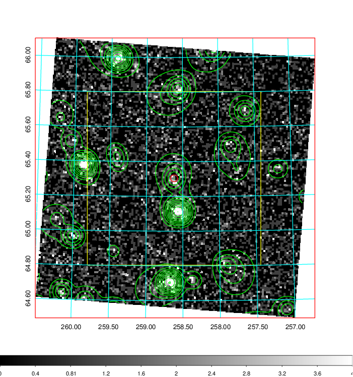  | 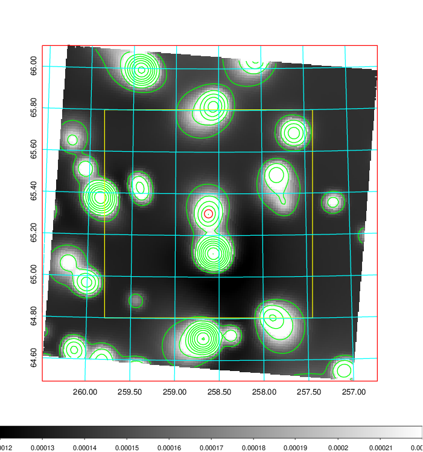   | 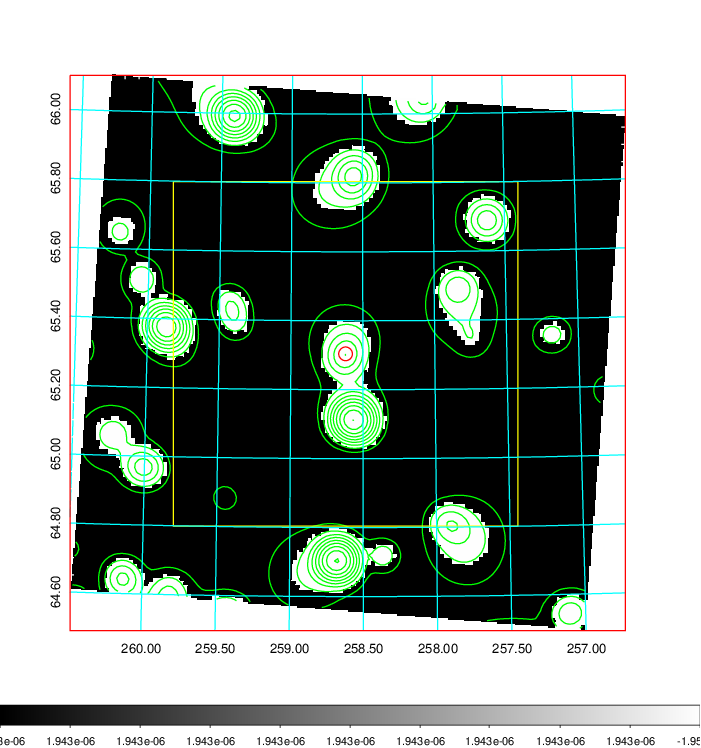  |

|[Exposure image](../image/701/701_mex.pdf)| [nH image](../image/701/701_nh.pdf)| [Planck image](../image/701/701_p.pdf)|
|-------------------|--------------------|-------------------|
|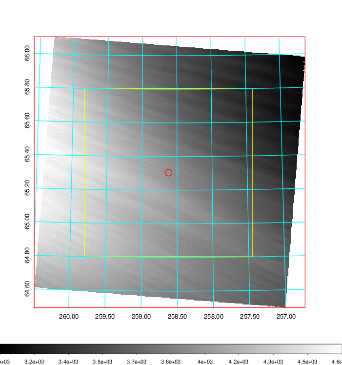   | 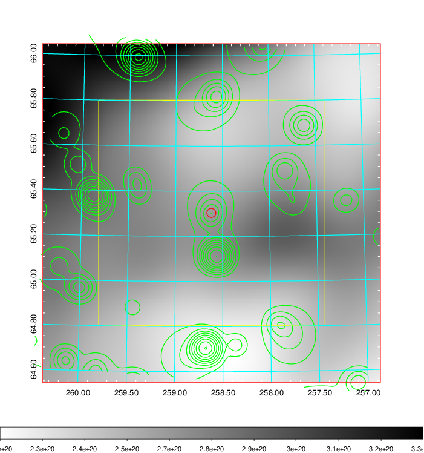    | 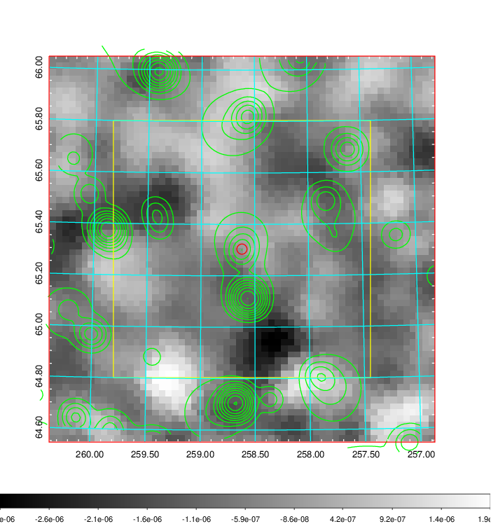 |

|[Redshift Histogram](../image/701/701_zg.pdf) | [DSS image(z1)](../image/701/701_dss_z1.pdf)      |  [DSS image(z2)](../image/701/701_dss_z2.pdf)    |
|-------------------|--------------------|-------------------|
|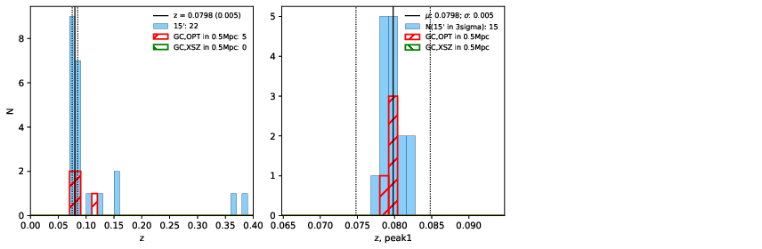 |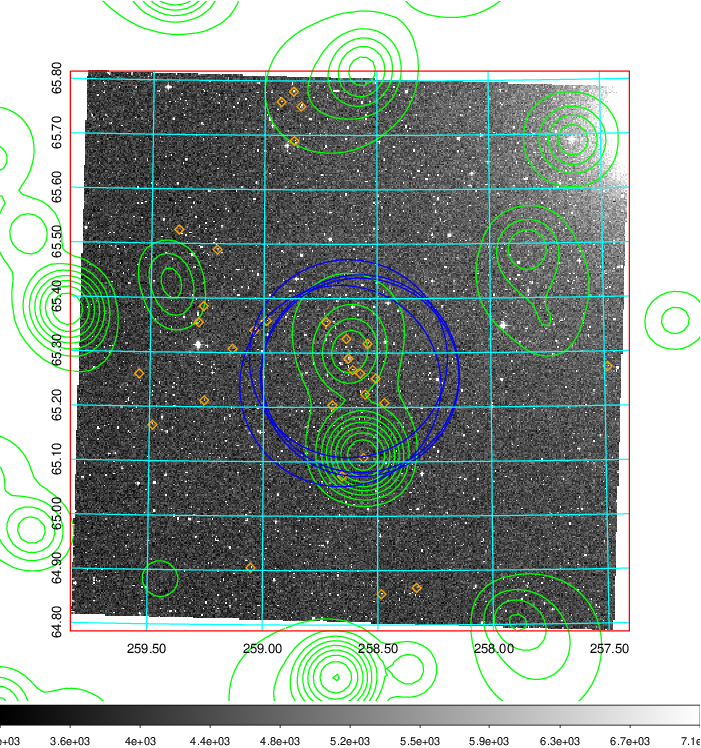  Blue circle for optical clusters;  Magenta circle for XSZ clusters;  all with r=1Mpc;  Only GC with Delta_z<0.01 are shown. | 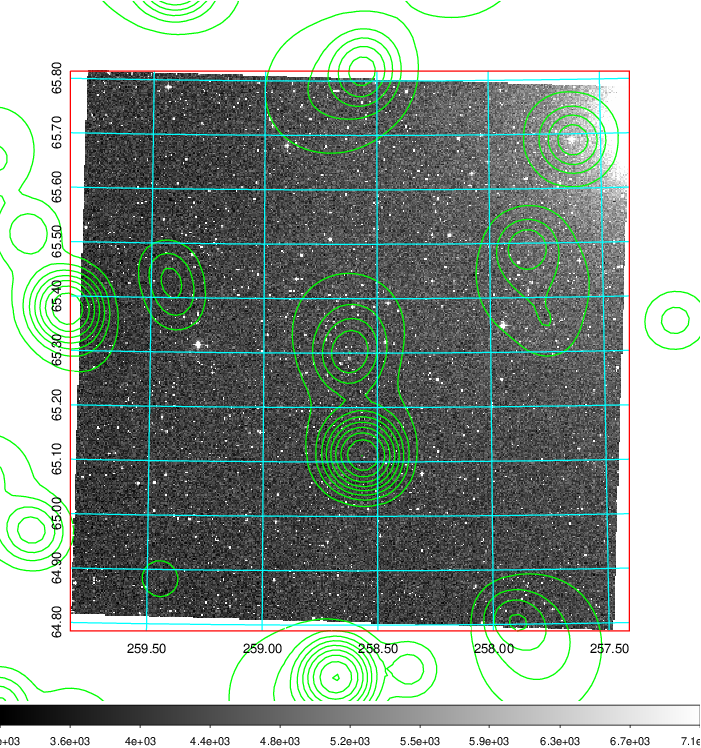 Blue circle for optical clusters;  Magenta circle for XSZ clusters;  all with r=1Mpc;  Only GC with Delta_z<0.01 are shown.  |

|[known Abell/XSZ clusters](../image/701/701_gc.pdf) | [2MASS image](../image/701/701_2mass.pdf)      |[SDSS image](../image/701/701_sdss.pdf)   |
|-------------------|-------------------|-------------------|
|  Magenta, blue and green circles  for optical, X-ray and SZ clusters  respectively, with redshift of clusters  labelled. The radius of circles  are 1Mpc.|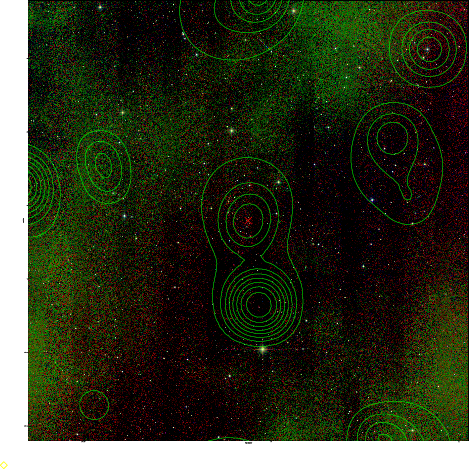  | 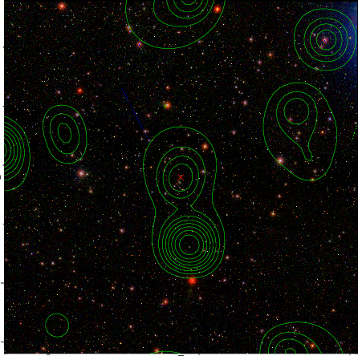  |

