

### 702

|Name|RAJ2000[deg]|DEJ2000[deg] |Ext[arcmin]| Ext,ml | z | z_src| C|GC(XSZ,Delta_z<0.01)| GC(OPT,Delta_z<0.01)|GC| R_sig[arcmin] | R500[arcmin] | R500[Mpc]| CRsig[c/s] | CR500[c/s] |L500[1E44 erg/s]|F500[1E-12 erg/s/cm^2]| M500[1E14 Msun]|Tx[keV]|Cnt_sig|Beta|Rc[arcmin]|Comment|Alias|
|---|---|---|---|---|---|------|---|--------|---------|----------|---|---|---|---|---|---|---|---|---|---|---|---|---|---|
|702| 258.834| 57.410| 1.97| 670.76| 0.0293(0.005)| z1, z_xsz| B| MCXC, PSZ2, Tar| N| MCXC, N, PSZ2, Tak, Tar, W| 28.650| 20.197| 0.711| 0.754(0.038)| 0.718(0.037)| 0.260(0.008)| 13.215(0.404)| 1.05(0.02)| 2.23(0.02)| 1282.0| 0.648(-0.016+0.017)| 2.704(-0.169+0.180)| -| k212|

|[RASS image](../image/702/702_img.pdf)|[filtered image](../image/702/702_fil.pdf)|[Segment image](../image/702/702_seg.pdf)|
|-------------------|--------------------|-------------------|
| 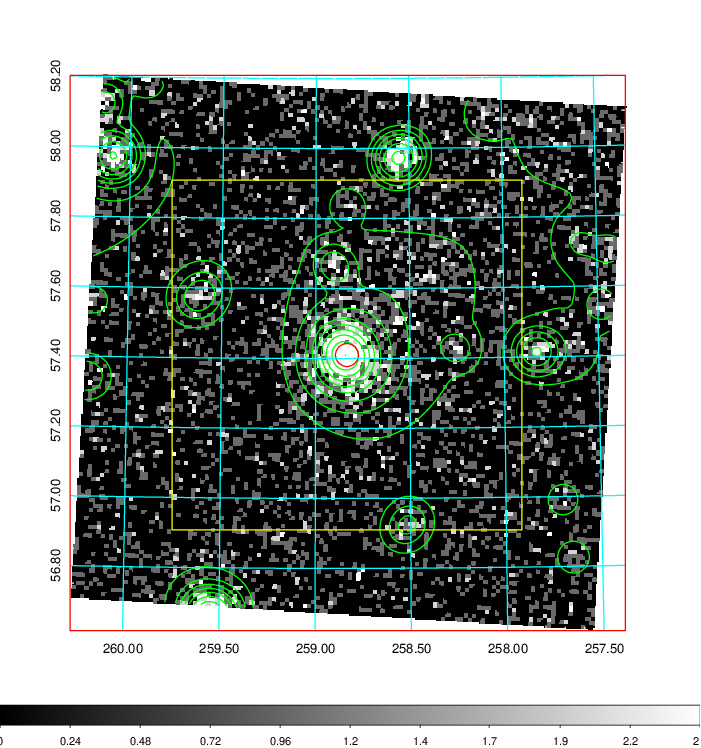  | 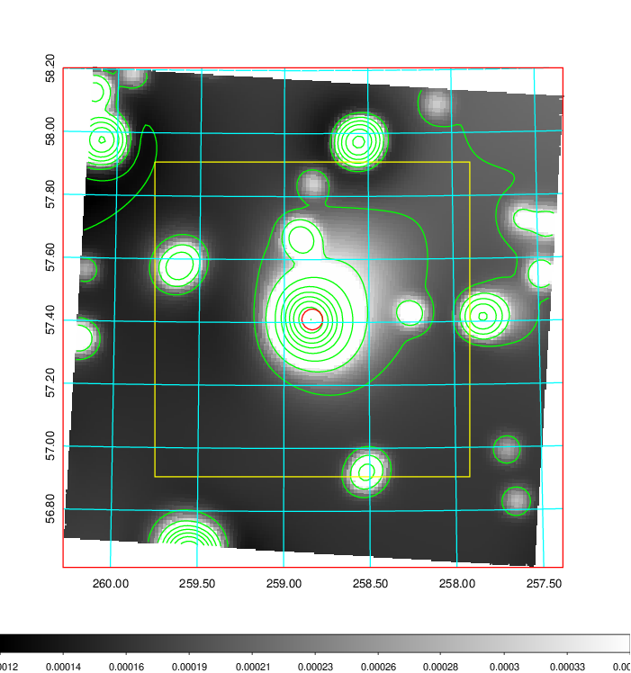   | 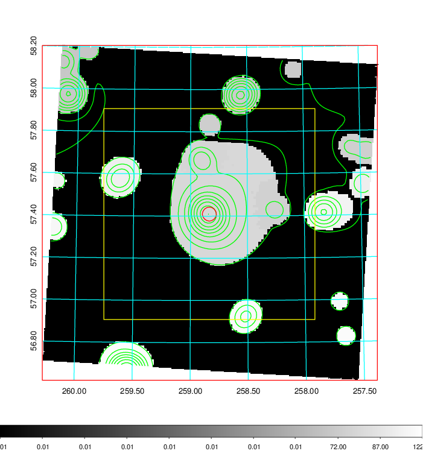  |

|[Exposure image](../image/702/702_mex.pdf)| [nH image](../image/702/702_nh.pdf)| [Planck image](../image/702/702_p.pdf)|
|-------------------|--------------------|-------------------|
|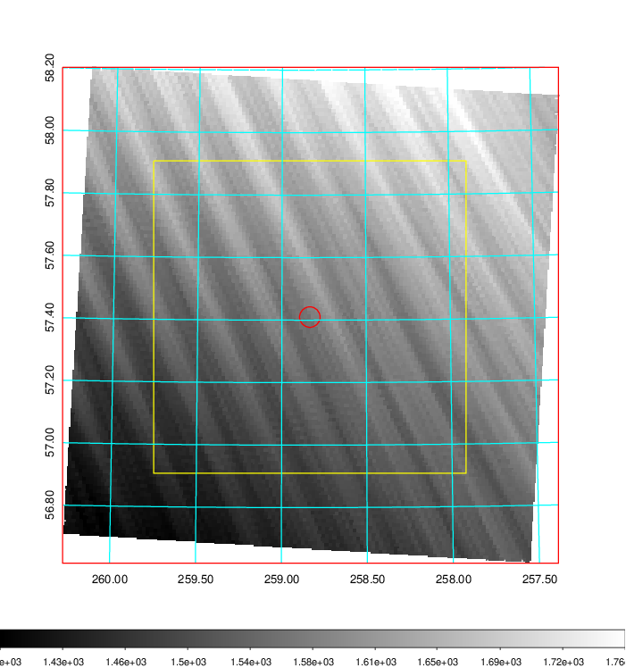   | 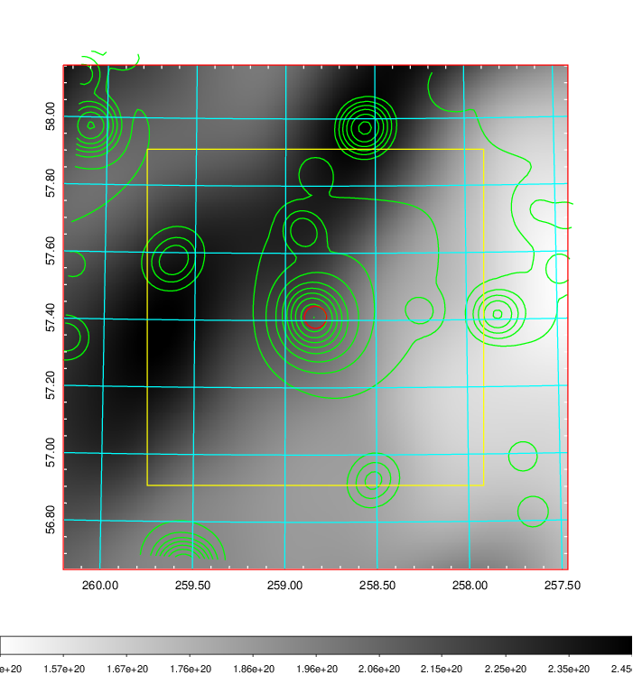    | 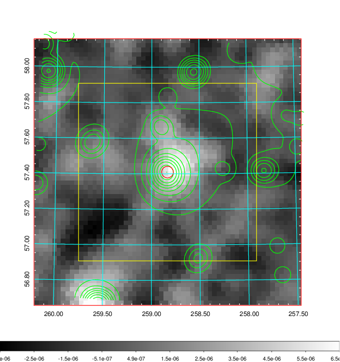 |

|[Redshift Histogram](../image/702/702_zg.pdf) | [DSS image(z1)](../image/702/702_dss_z1.pdf)      |  [DSS image(z2)](../image/702/702_dss_z2.pdf)    |
|-------------------|--------------------|-------------------|
|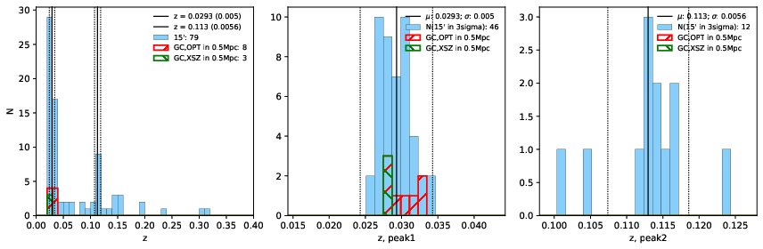 |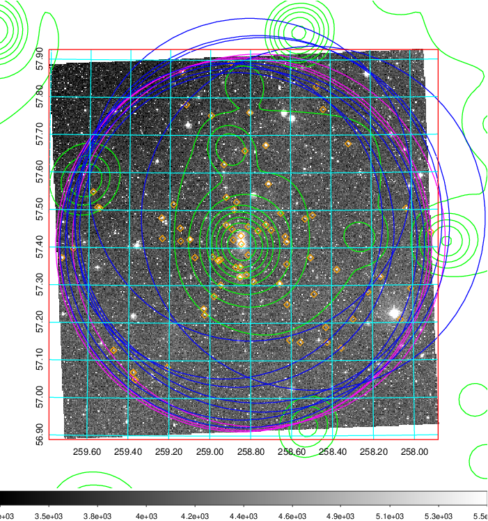  Blue circle for optical clusters;  Magenta circle for XSZ clusters;  all with r=1Mpc;  Only GC with Delta_z<0.01 are shown. | 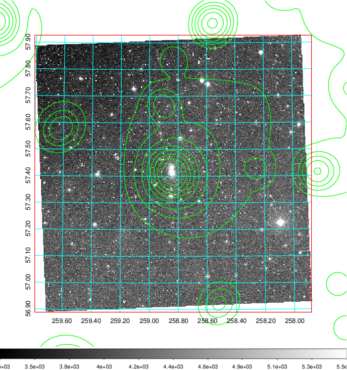 Blue circle for optical clusters;  Magenta circle for XSZ clusters;  all with r=1Mpc;  Only GC with Delta_z<0.01 are shown.  |

|[Previous-identified clusters](../image/702/702_gc.pdf) | [2MASS image](../image/702/702_2mass.pdf)      |[SDSS image](../image/702/702_sdss.pdf)   |
|-------------------|-------------------|-------------------|
|  Green, magenta, and blue circles  for optical, X-ray and SZ clusters  respectively, with redshift of clusters  labelled. The radius of circles  are 1Mpc.|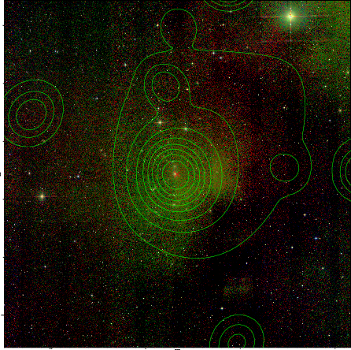  | 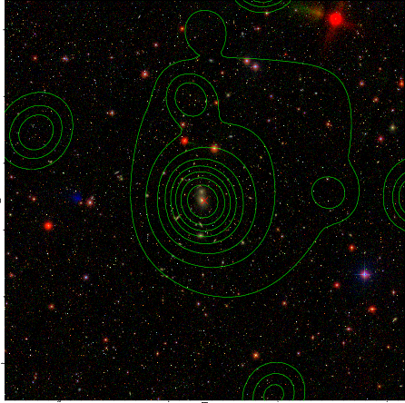  |

