

### 703

|Name|RAJ2000[deg]|DEJ2000[deg] |Ext[arcmin]| Ext,ml | z | z_src| C|GC(XSZ,Delta_z<0.01)| GC(OPT,Delta_z<0.01)|GC| R_sig[arcmin] | R500[arcmin] | R500[Mpc]| CRsig[c/s] | CR500[c/s] |L500[1E44 erg/s]|F500[1E-12 erg/s/cm^2]| M500[1E14 Msun]|Tx[keV]|Cnt_sig|Beta|Rc[arcmin]|Comment|Alias|
|---|---|---|---|---|---|------|---|--------|---------|----------|---|---|---|---|---|---|---|---|---|---|---|---|---|---|
|703| 259.057| 20.337| 3.73| 81.71| 0.1306(0.000)| z_xsz| B| MCXC, Tar| Zw| MCXC, N, Tar, W| 10.262| 6.915| 0.965| 0.176(0.032)| 0.167(0.030)| 1.393(0.126)| 3.094(0.280)| 2.90(0.13)| 4.31(0.12)| 120.6| 0.894(-0.114+0.076)| 5.391(-0.836+0.607)| -| k457|

|[RASS image](../image/703/703_img.pdf)|[filtered image](../image/703/703_fil.pdf)|[Segment image](../image/703/703_seg.pdf)|
|-------------------|--------------------|-------------------|
| 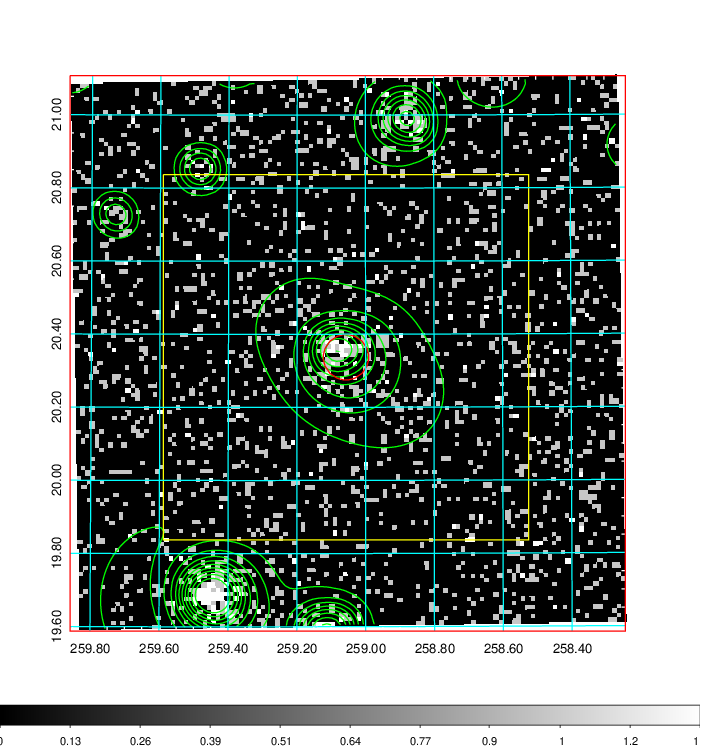  | 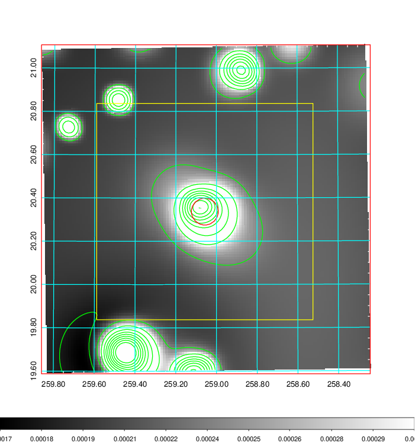   | 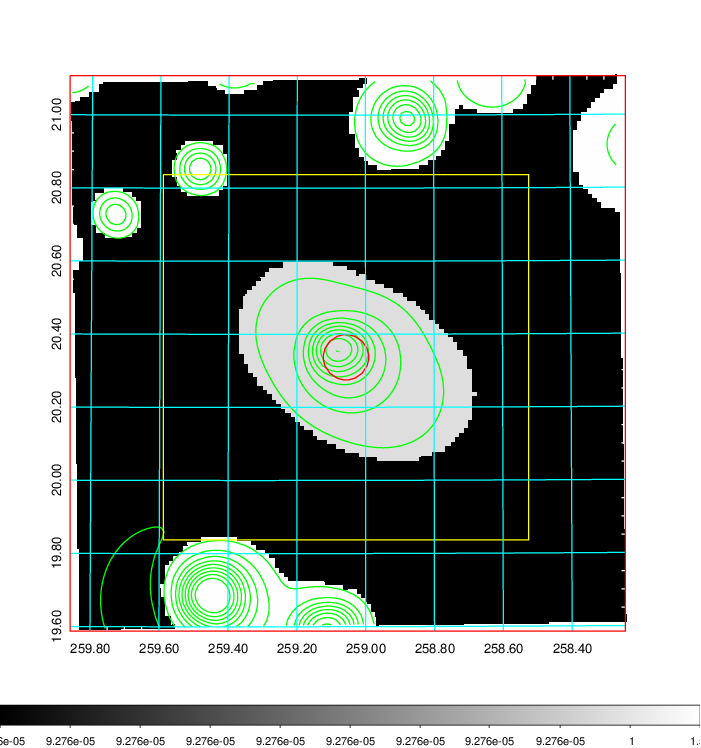  |

|[Exposure image](../image/703/703_mex.pdf)| [nH image](../image/703/703_nh.pdf)| [Planck image](../image/703/703_p.pdf)|
|-------------------|--------------------|-------------------|
|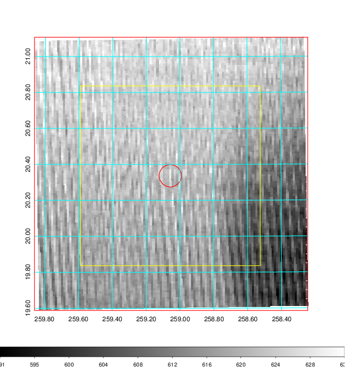   | 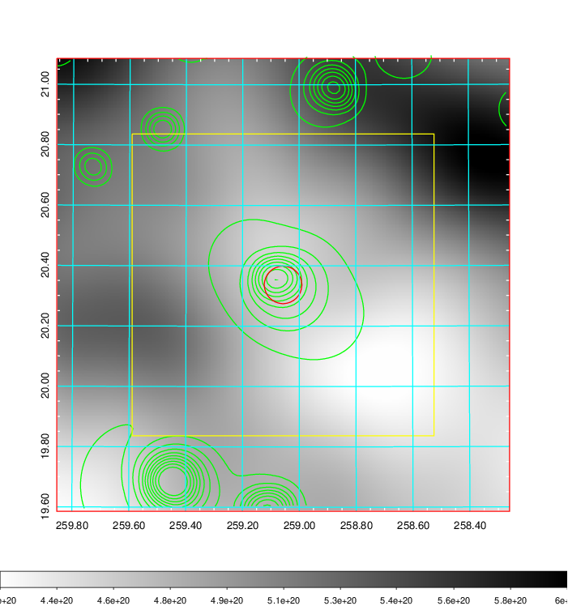    | 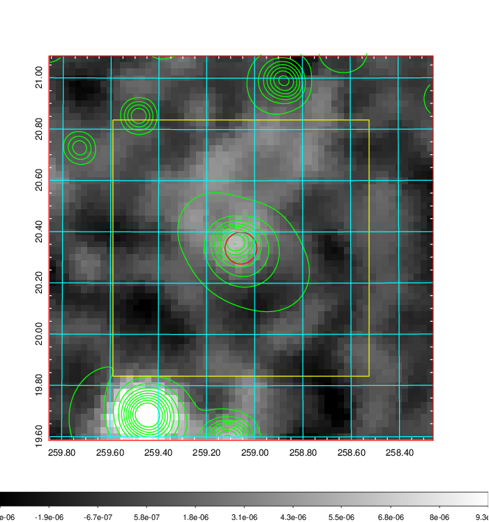 |

|[Redshift Histogram](../image/703/703_zg.pdf) | [DSS image(z1)](../image/703/703_dss_z1.pdf)      |  [DSS image(z2)](../image/703/703_dss_z2.pdf)    |
|-------------------|--------------------|-------------------|
|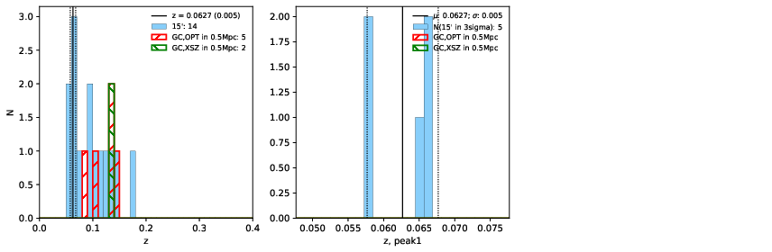 |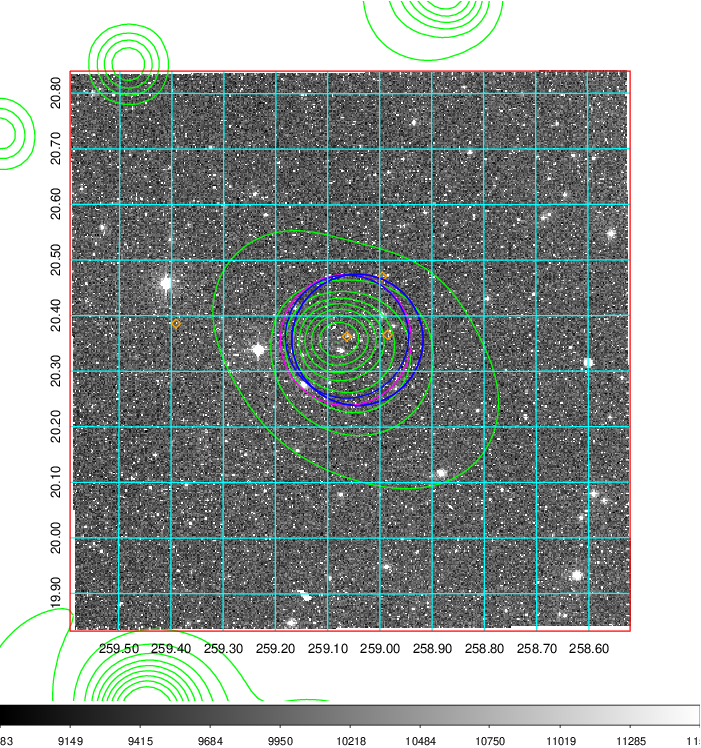  Blue circle for optical clusters;  Magenta circle for XSZ clusters;  all with r=1Mpc;  Only GC with Delta_z<0.01 are shown. | 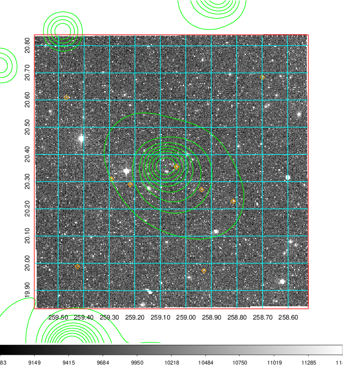 Blue circle for optical clusters;  Magenta circle for XSZ clusters;  all with r=1Mpc;  Only GC with Delta_z<0.01 are shown.  |

|[Previous-identified clusters](../image/703/703_gc.pdf) | [2MASS image](../image/703/703_2mass.pdf)      |
|-------------------|-------------------|
|  Green, magenta, and blue circles  for optical, X-ray and SZ clusters  respectively, with redshift of clusters  labelled. The radius of circles  are 1Mpc.|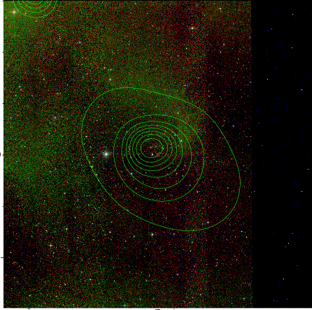  |

|[PS1 image](../image/703/703_ps1.pdf)            |
|-------------------|
| 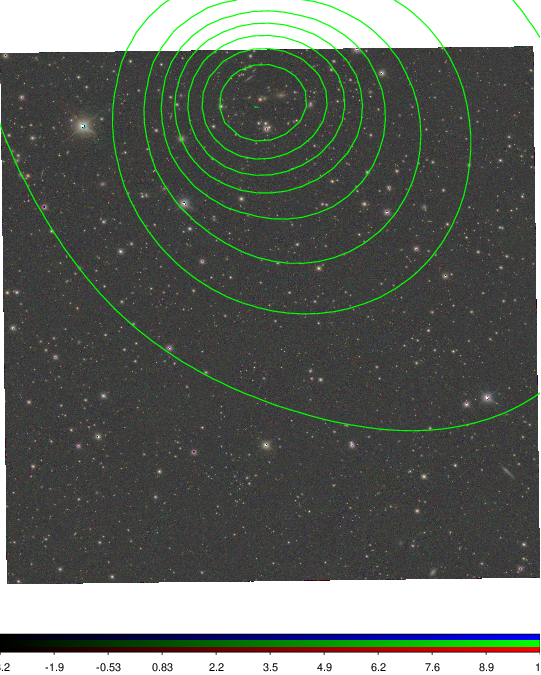  |
