

### 704

|Name|RAJ2000[deg]|DEJ2000[deg] |Ext[arcmin]| Ext,ml | z | z_src| C|GC(XSZ,Delta_z<0.01)| GC(OPT,Delta_z<0.01)|GC| R_sig[arcmin] | R500[arcmin] | R500[Mpc]| CRsig[c/s] | CR500[c/s] |L500[1E44 erg/s]|F500[1E-12 erg/s/cm^2]| M500[1E14 Msun]|Tx[keV]|Cnt_sig|Beta|Rc[arcmin]|Comment|Alias|
|---|---|---|---|---|---|------|---|--------|---------|----------|---|---|---|---|---|---|---|---|---|---|---|---|---|---|
|704| 259.275| 23.058| 5.05| 46.20| 0.1603(0.000)| z_xsz| B| PSZ2, Tar| N| C, N, PSZ2, Tar, W| 10.750| 5.539| 0.918| 0.100(0.029)| 0.093(0.026)| 1.214(0.243)| 1.724(0.345)| 2.57(0.25)| 4.04(0.25)| 70.8| 0.794(-0.164+0.141)| 5.647(-1.587+1.275)| -| k521|

|[RASS image](../image/704/704_img.pdf)|[filtered image](../image/704/704_fil.pdf)|[Segment image](../image/704/704_seg.pdf)|
|-------------------|--------------------|-------------------|
| 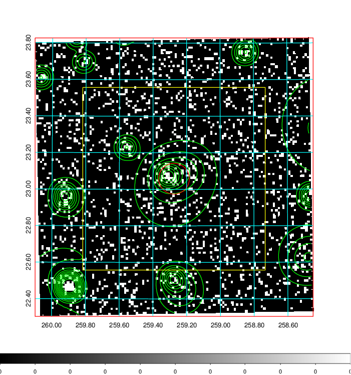  | 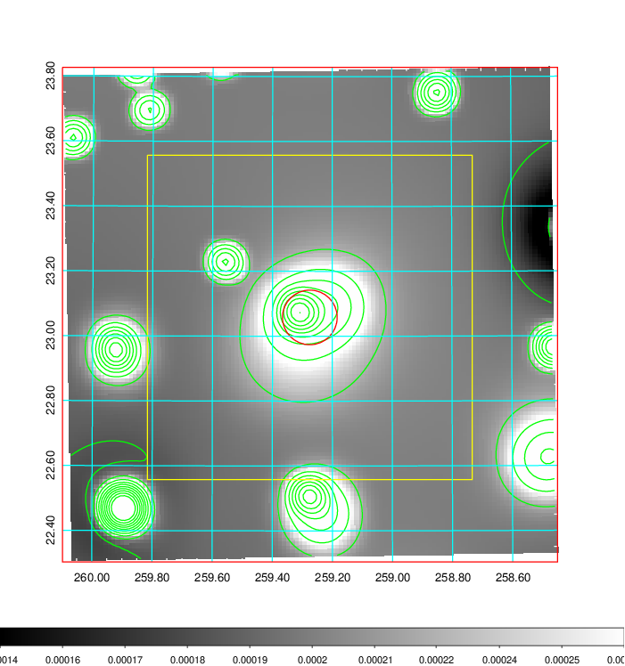   | 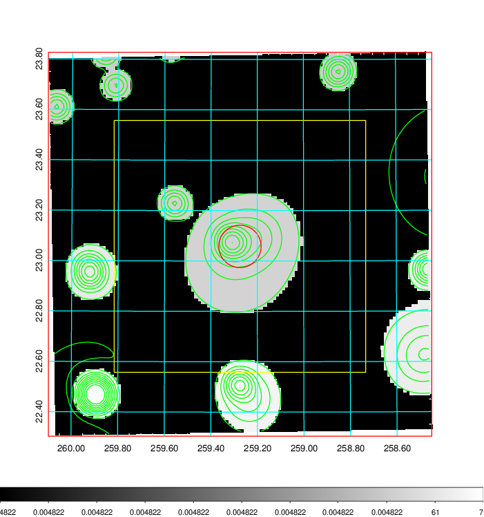  |

|[Exposure image](../image/704/704_mex.pdf)| [nH image](../image/704/704_nh.pdf)| [Planck image](../image/704/704_p.pdf)|
|-------------------|--------------------|-------------------|
|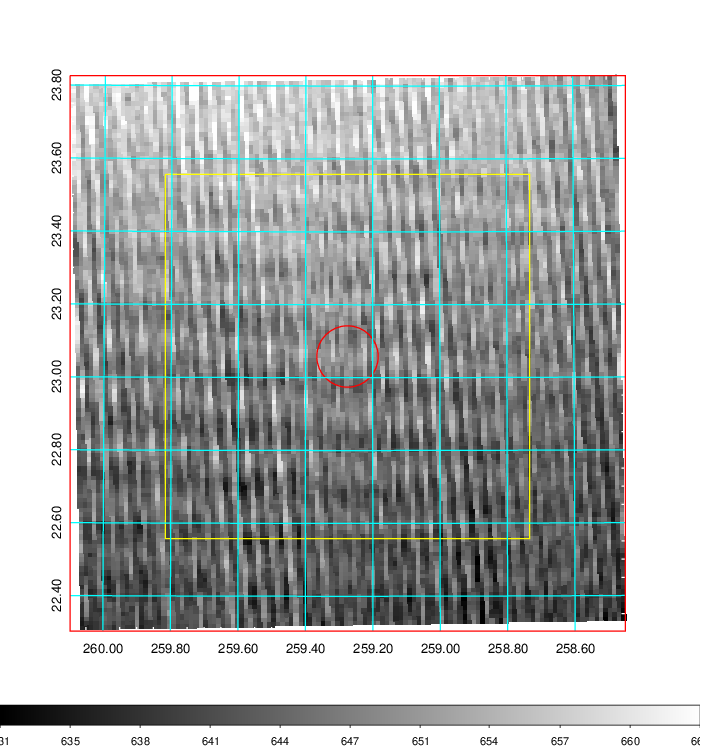   | 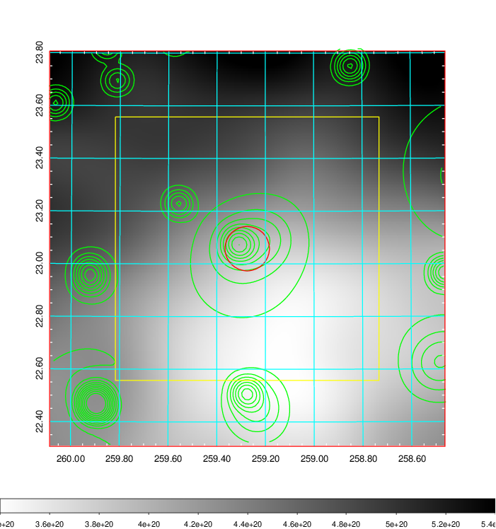    | 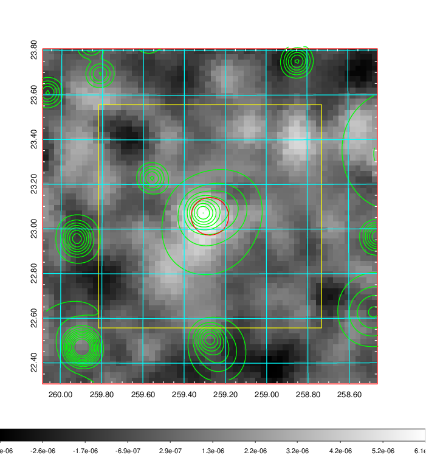 |

|[Redshift Histogram](../image/704/704_zg.pdf) | [DSS image(z1)](../image/704/704_dss_z1.pdf)      |  [DSS image(z2)](../image/704/704_dss_z2.pdf)    |
|-------------------|--------------------|-------------------|
|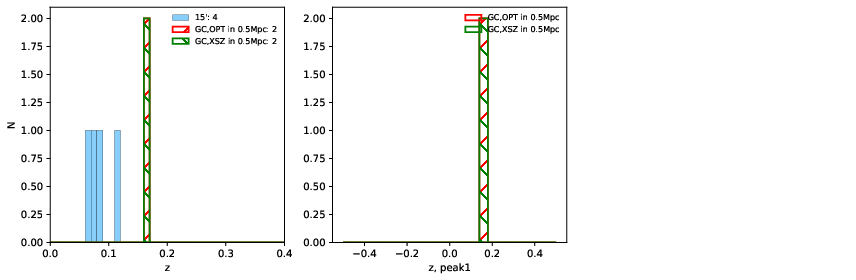 |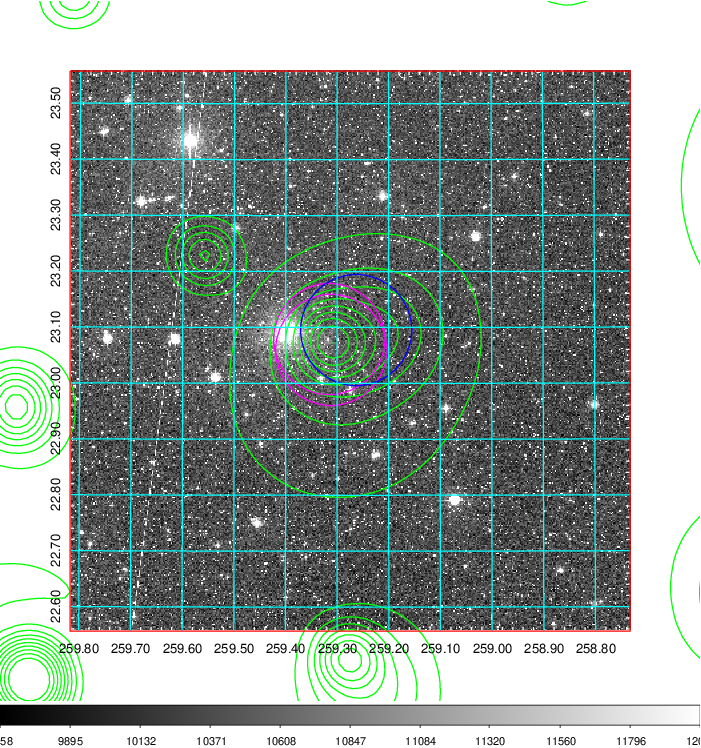  Blue circle for optical clusters;  Magenta circle for XSZ clusters;  all with r=1Mpc;  Only GC with Delta_z<0.01 are shown. | 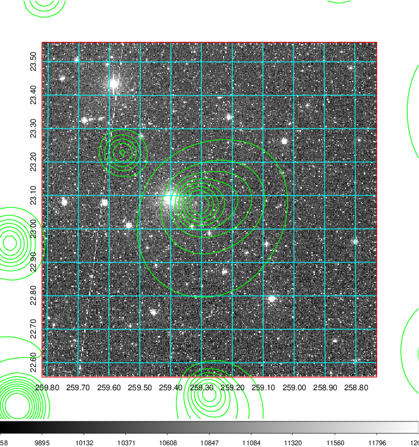 Blue circle for optical clusters;  Magenta circle for XSZ clusters;  all with r=1Mpc;  Only GC with Delta_z<0.01 are shown.  |

|[Previous-identified clusters](../image/704/704_gc.pdf) | [2MASS image](../image/704/704_2mass.pdf)      |[SDSS image](../image/704/704_sdss.pdf)   |
|-------------------|-------------------|-------------------|
|  Green, magenta, and blue circles  for optical, X-ray and SZ clusters  respectively, with redshift of clusters  labelled. The radius of circles  are 1Mpc.|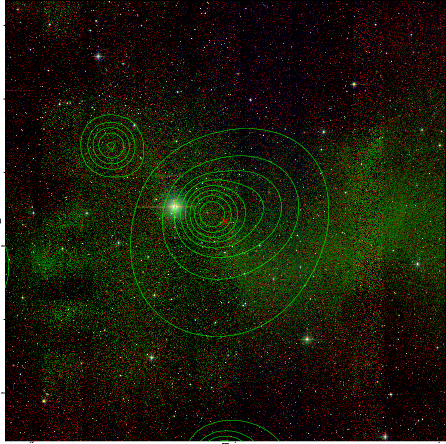  | 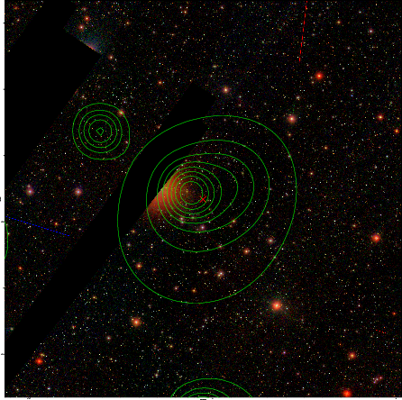  |

