

### 705

|Name|RAJ2000[deg]|DEJ2000[deg] |Ext[arcmin]| Ext,ml | z | z_src| C|GC(XSZ,Delta_z<0.01)| GC(OPT,Delta_z<0.01)|GC| R_sig[arcmin] | R500[arcmin] | R500[Mpc]| CRsig[c/s] | CR500[c/s] |L500[1E44 erg/s]|F500[1E-12 erg/s/cm^2]| M500[1E14 Msun]|Tx[keV]|Cnt_sig|Beta|Rc[arcmin]|Comment|Alias|
|---|---|---|---|---|---|------|---|--------|---------|----------|---|---|---|---|---|---|---|---|---|---|---|---|---|---|
|705| 259.328| 42.419| 1.31| 50.22| 0.1821(0.005)| z1, z_xsz| B| F20, MCXC, PSZ2, SPI, Tar| C, N, RM, W, Zw| C, F20, MCXC, N, PSZ2, SPI, Tar, W| 15.138| 6.442| 1.184| 0.288(0.027)| 0.263(0.025)| 4.984(0.281)| 5.343(0.301)| 5.65(0.15)| 6.61(0.11)| 235.6| 0.751(-0.091+0.120)| 3.989(-0.759+0.866)| -| k077|

|[RASS image](../image/705/705_img.pdf)|[filtered image](../image/705/705_fil.pdf)|[Segment image](../image/705/705_seg.pdf)|
|-------------------|--------------------|-------------------|
| 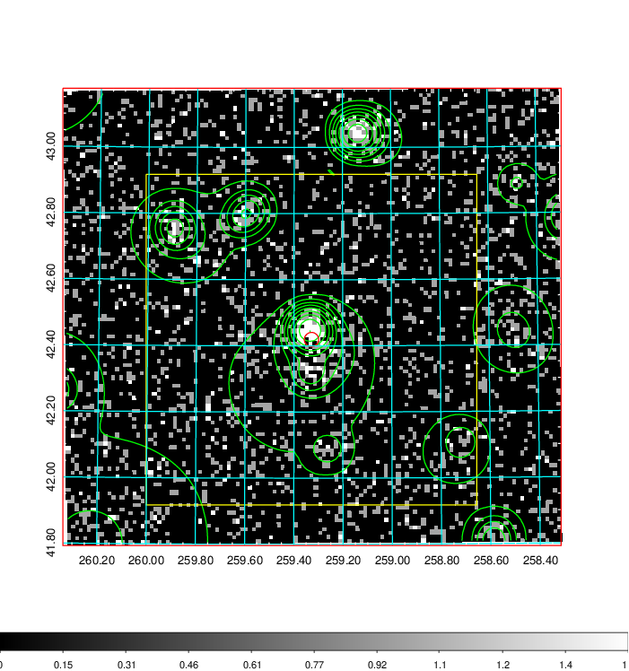  | 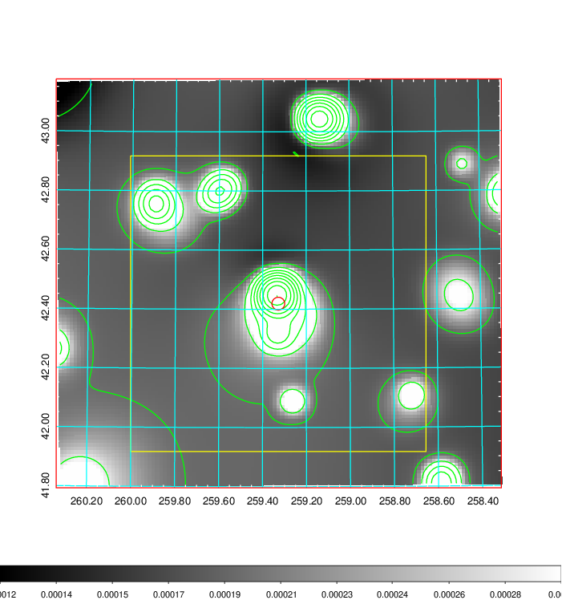   | 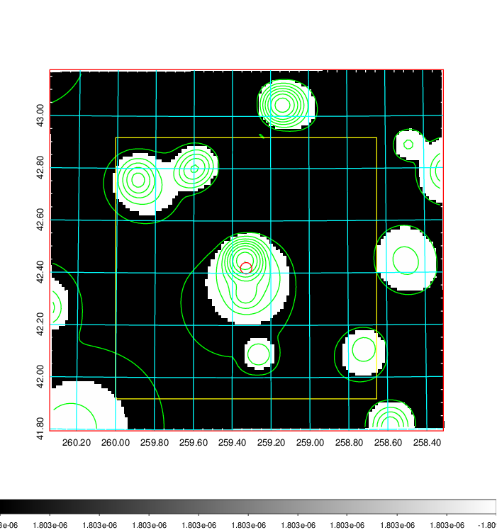  |

|[Exposure image](../image/705/705_mex.pdf)| [nH image](../image/705/705_nh.pdf)| [Planck image](../image/705/705_p.pdf)|
|-------------------|--------------------|-------------------|
|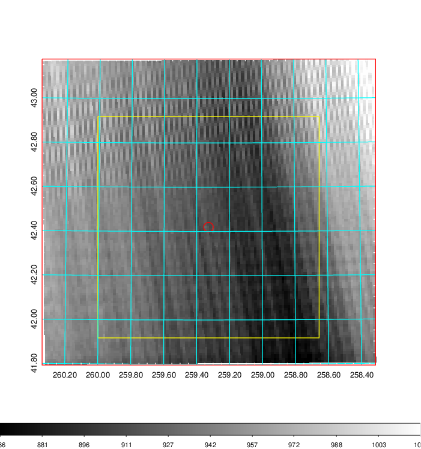   | 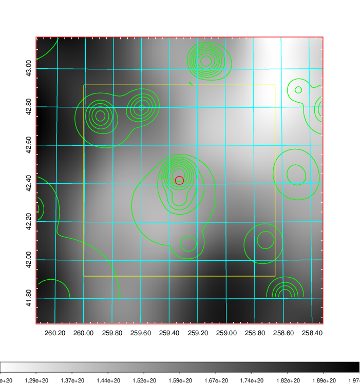    | 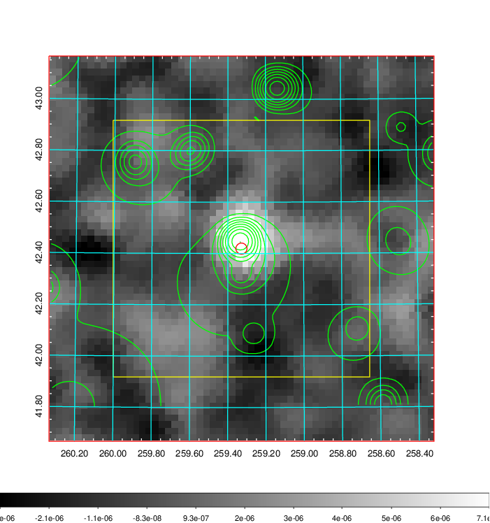 |

|[Redshift Histogram](../image/705/705_zg.pdf) | [DSS image(z1)](../image/705/705_dss_z1.pdf)      |  [DSS image(z2)](../image/705/705_dss_z2.pdf)    |
|-------------------|--------------------|-------------------|
|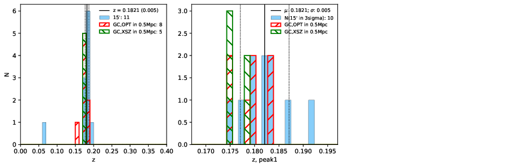 |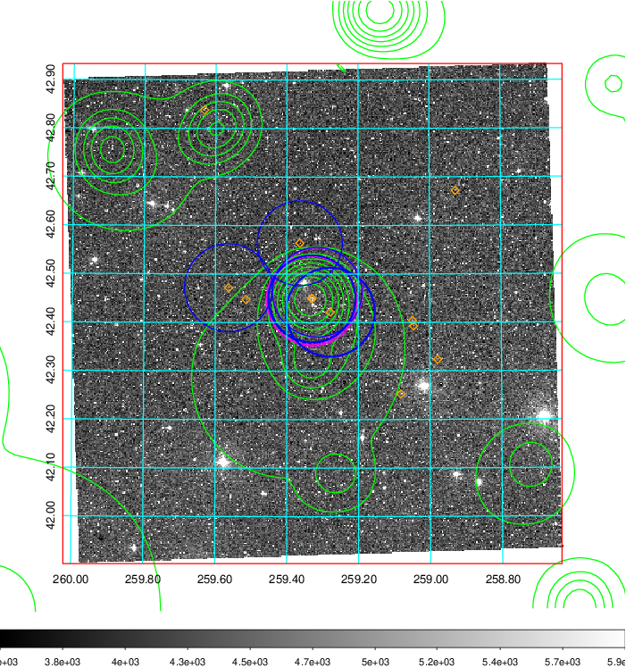  Blue circle for optical clusters;  Magenta circle for XSZ clusters;  all with r=1Mpc;  Only GC with Delta_z<0.01 are shown. | 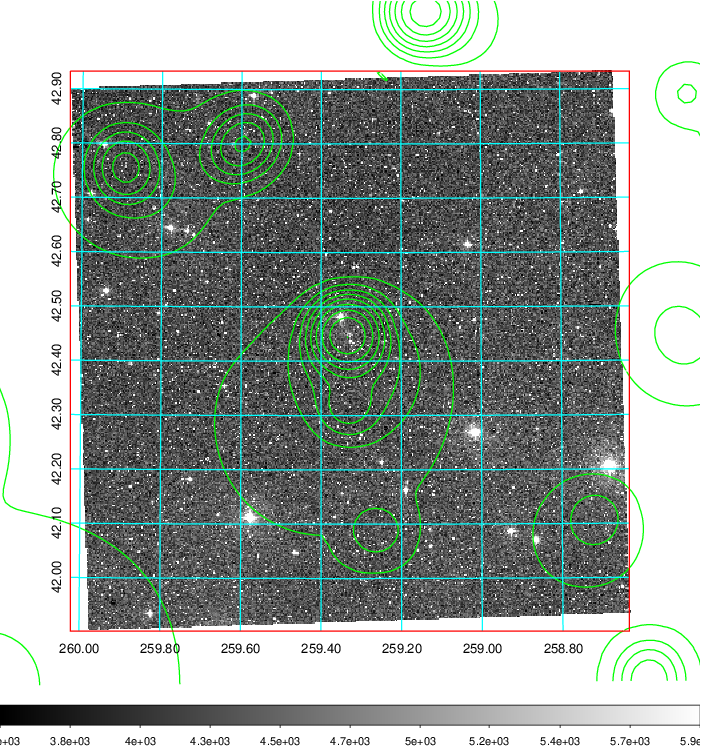 Blue circle for optical clusters;  Magenta circle for XSZ clusters;  all with r=1Mpc;  Only GC with Delta_z<0.01 are shown.  |

|[known Abell/XSZ clusters](../image/705/705_gc.pdf) | [2MASS image](../image/705/705_2mass.pdf)      |[SDSS image](../image/705/705_sdss.pdf)   |
|-------------------|-------------------|-------------------|
|  Magenta, blue and green circles  for optical, X-ray and SZ clusters  respectively, with redshift of clusters  labelled. The radius of circles  are 1Mpc.|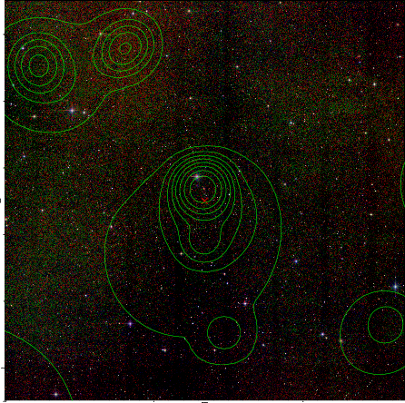  | 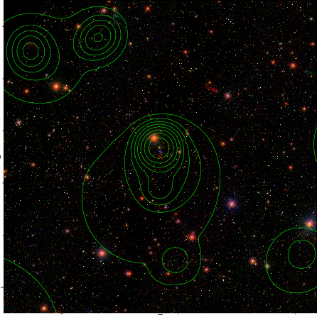  |

