

### 706

|Name|RAJ2000[deg]|DEJ2000[deg] |Ext[arcmin]| Ext,ml | z | z_src| C|GC(XSZ,Delta_z<0.01)| GC(OPT,Delta_z<0.01)|GC| R_sig[arcmin] | R500[arcmin] | R500[Mpc]| CRsig[c/s] | CR500[c/s] |L500[1E44 erg/s]|F500[1E-12 erg/s/cm^2]| M500[1E14 Msun]|Tx[keV]|Cnt_sig|Beta|Rc[arcmin]|Comment|Alias|
|---|---|---|---|---|---|------|---|--------|---------|----------|---|---|---|---|---|---|---|---|---|---|---|---|---|---|
|706| 259.394| 25.838| 1.77| 27.63| 0.1377(0.000)| z_opt| S| -| W| C, F20, N, W| 11.238| 6.407| 0.935| 0.144(0.028)| 0.134(0.027)| 1.298(0.164)| 2.571(0.324)| 2.66(0.17)| 4.09(0.16)| 119.2| 0.712(-0.120+0.161)| 3.061(-0.963+1.048)| $z$ of optical clusters.| t046|

|[RASS image](../image/706/706_img.pdf)|[filtered image](../image/706/706_fil.pdf)|[Segment image](../image/706/706_seg.pdf)|
|-------------------|--------------------|-------------------|
| 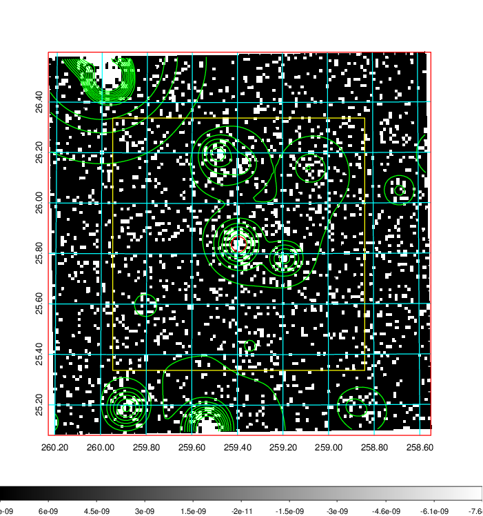  | 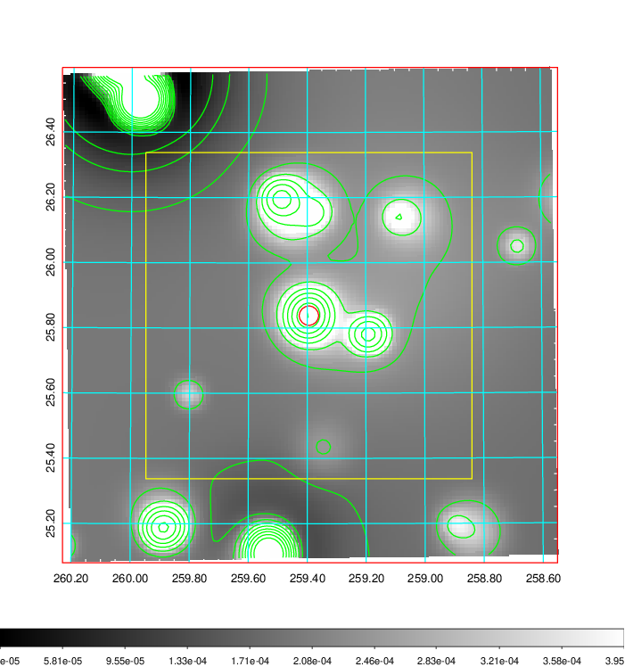   | 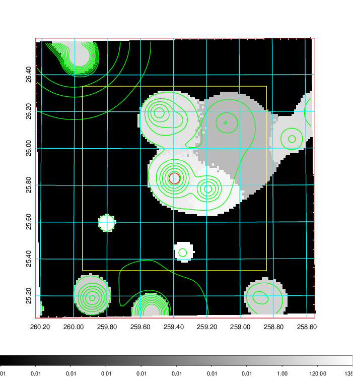  |

|[Exposure image](../image/706/706_mex.pdf)| [nH image](../image/706/706_nh.pdf)| [Planck image](../image/706/706_p.pdf)|
|-------------------|--------------------|-------------------|
|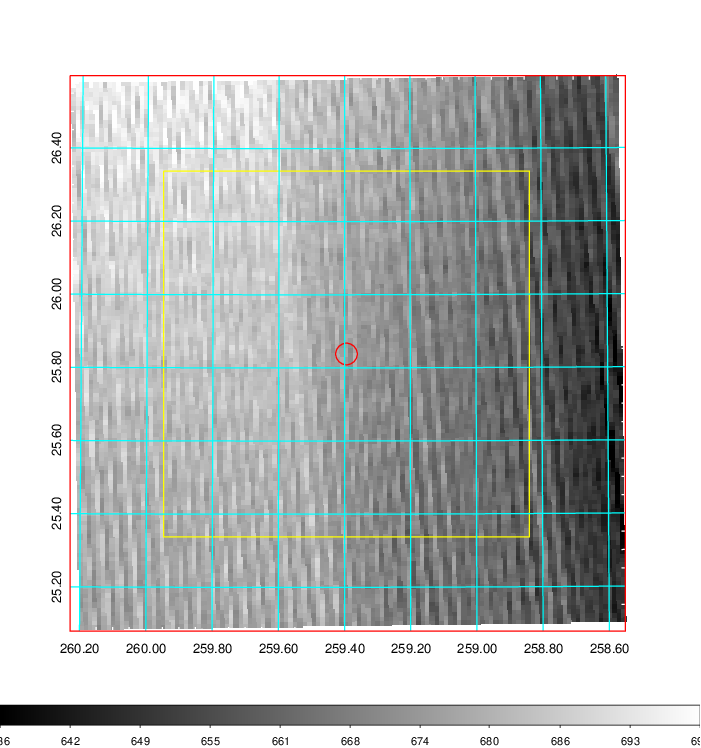   | 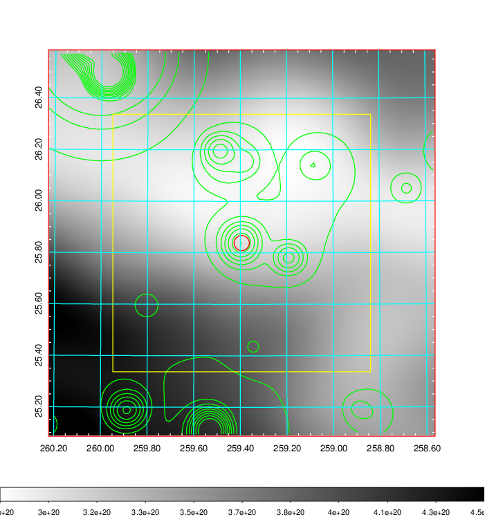    | 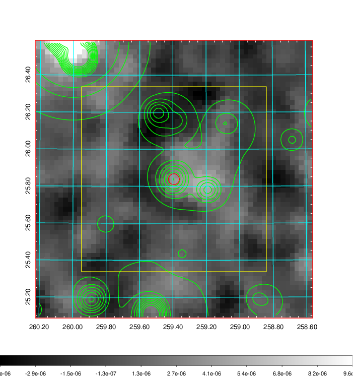 |

|[Redshift Histogram](../image/706/706_zg.pdf) | [DSS image(z1)](../image/706/706_dss_z1.pdf)      |  [DSS image(z2)](../image/706/706_dss_z2.pdf)    |
|-------------------|--------------------|-------------------|
|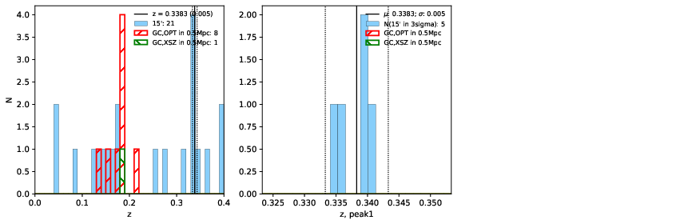 |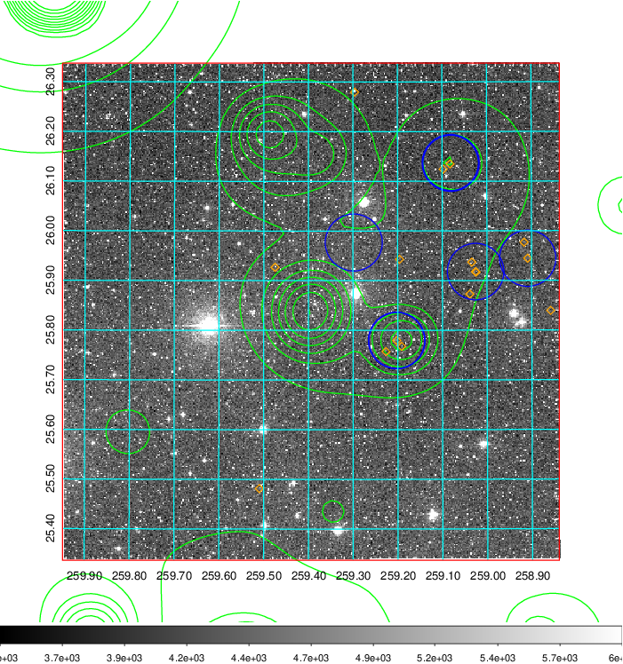  Blue circle for optical clusters;  Magenta circle for XSZ clusters;  all with r=1Mpc;  Only GC with Delta_z<0.01 are shown. | 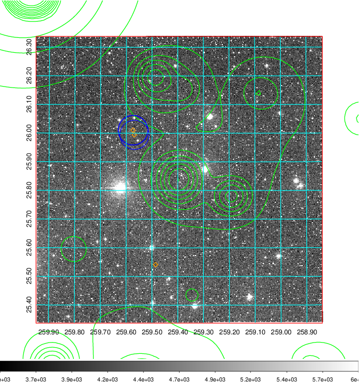 Blue circle for optical clusters;  Magenta circle for XSZ clusters;  all with r=1Mpc;  Only GC with Delta_z<0.01 are shown.  |

|[Previous-identified clusters](../image/706/706_gc.pdf) | [2MASS image](../image/706/706_2mass.pdf)      |[SDSS image](../image/706/706_sdss.pdf)   |
|-------------------|-------------------|-------------------|
|  Green, magenta, and blue circles  for optical, X-ray and SZ clusters  respectively, with redshift of clusters  labelled. The radius of circles  are 1Mpc.|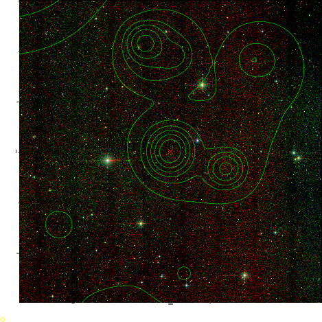  | 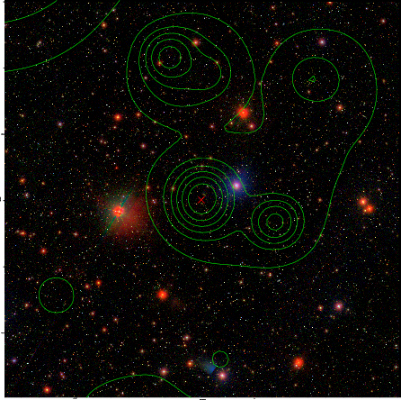  |

