

### 707

|Name|RAJ2000[deg]|DEJ2000[deg] |Ext[arcmin]| Ext,ml | z | z_src| C|GC(XSZ,Delta_z<0.01)| GC(OPT,Delta_z<0.01)|GC| R_sig[arcmin] | R500[arcmin] | R500[Mpc]| CRsig[c/s] | CR500[c/s] |L500[1E44 erg/s]|F500[1E-12 erg/s/cm^2]| M500[1E14 Msun]|Tx[keV]|Cnt_sig|Beta|Rc[arcmin]|Comment|Alias|
|---|---|---|---|---|---|------|---|--------|---------|----------|---|---|---|---|---|---|---|---|---|---|---|---|---|---|
|707| 259.449| 19.683| 1.89| 91.55| 0.1764(0.005)| z1, z_xsz| B| MCXC, PSZ2, Tar, XB| A, N, W| A, MCXC, N, PSZ2, Tar, W, XB| 7.338| 6.558| 1.175| 0.253(0.030)| 0.249(0.029)| 4.084(0.191)| 4.698(0.220)| 5.49(0.12)| 6.48(0.09)| 149.1| 0.938(-0.078+0.045)| 3.889(-0.417+0.303)| -| k191|

|[RASS image](../image/707/707_img.pdf)|[filtered image](../image/707/707_fil.pdf)|[Segment image](../image/707/707_seg.pdf)|
|-------------------|--------------------|-------------------|
| 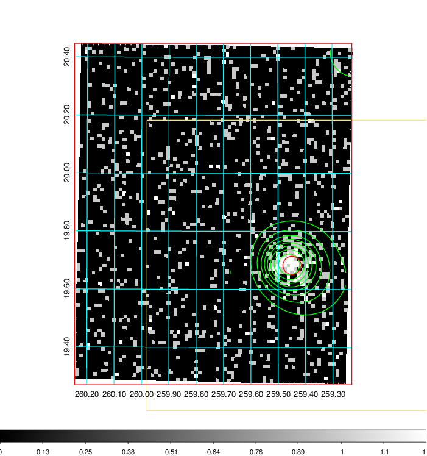  | 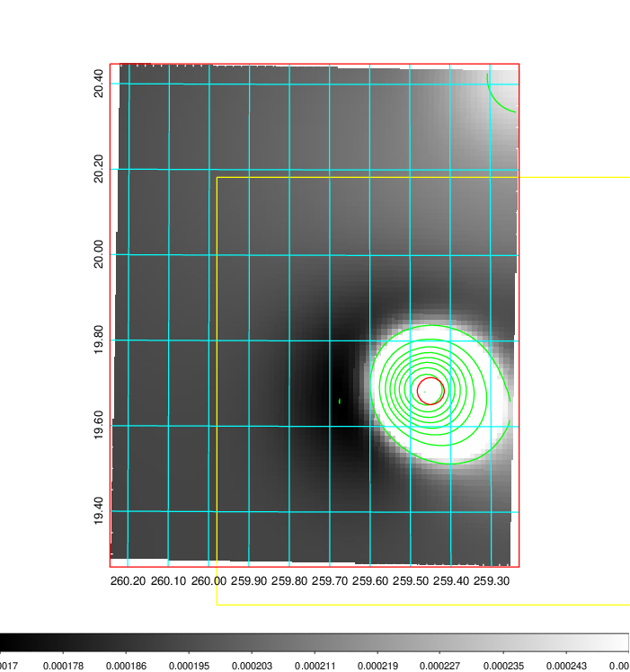   | 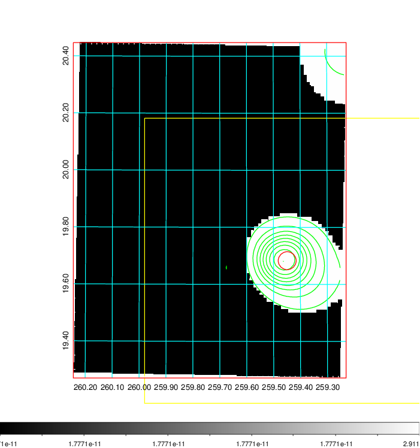  |

|[Exposure image](../image/707/707_mex.pdf)| [nH image](../image/707/707_nh.pdf)| [Planck image](../image/707/707_p.pdf)|
|-------------------|--------------------|-------------------|
|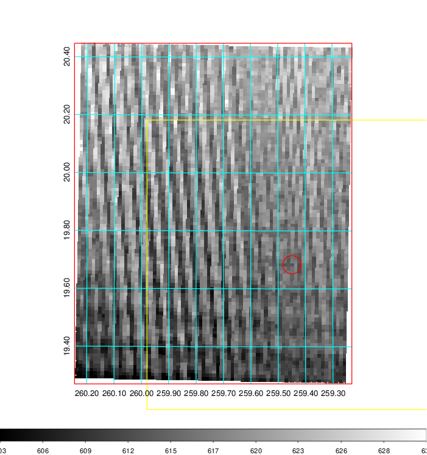   | 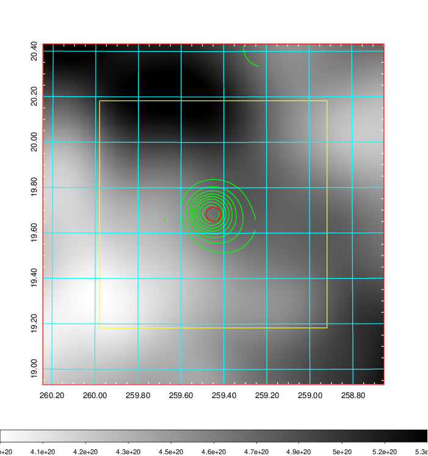    | 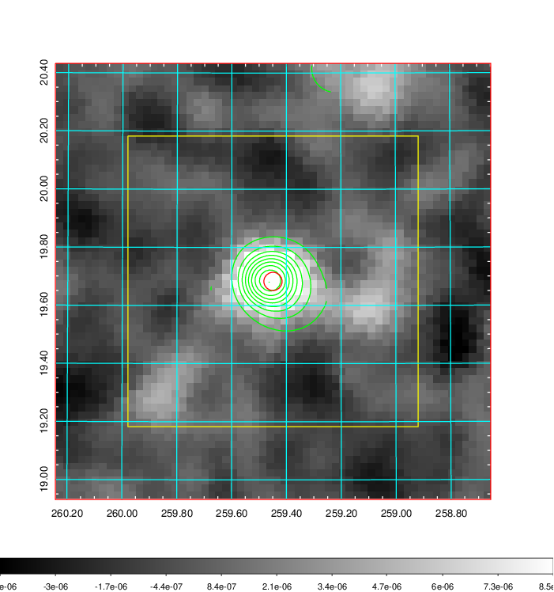 |

|[Redshift Histogram](../image/707/707_zg.pdf) | [DSS image(z1)](../image/707/707_dss_z1.pdf)      |  [DSS image(z2)](../image/707/707_dss_z2.pdf)    |
|-------------------|--------------------|-------------------|
|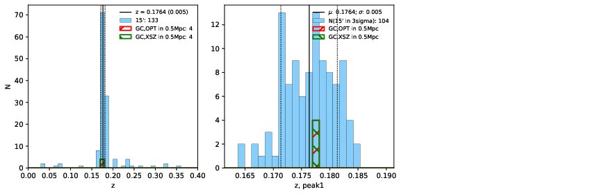 |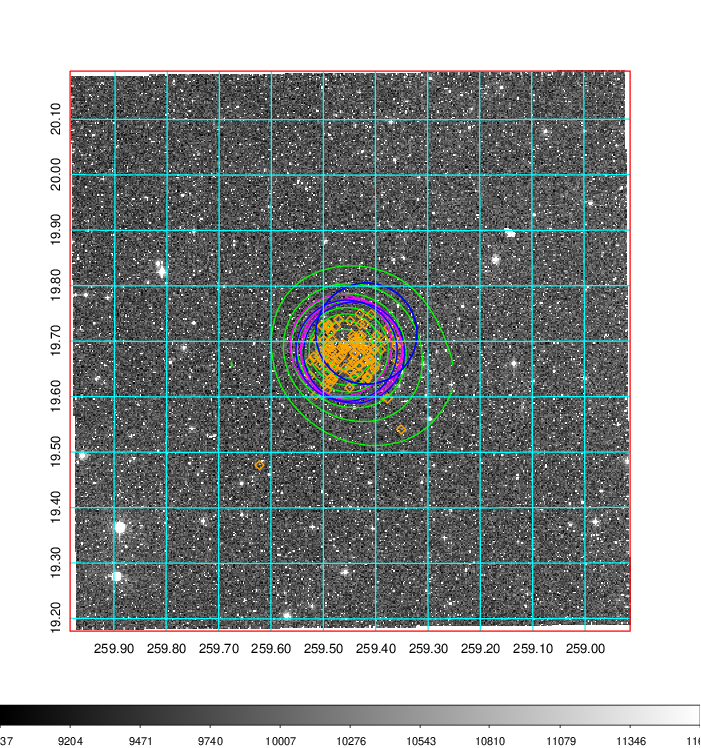  Blue circle for optical clusters;  Magenta circle for XSZ clusters;  all with r=1Mpc;  Only GC with Delta_z<0.01 are shown. | 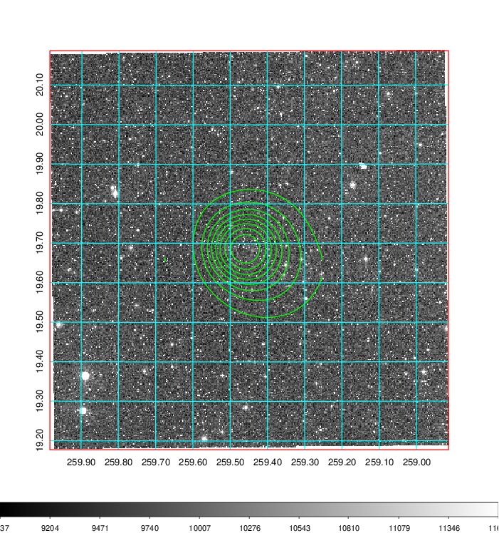 Blue circle for optical clusters;  Magenta circle for XSZ clusters;  all with r=1Mpc;  Only GC with Delta_z<0.01 are shown.  |

|[Previous-identified clusters](../image/707/707_gc.pdf) | [2MASS image](../image/707/707_2mass.pdf)      |
|-------------------|-------------------|
|  Green, magenta, and blue circles  for optical, X-ray and SZ clusters  respectively, with redshift of clusters  labelled. The radius of circles  are 1Mpc.|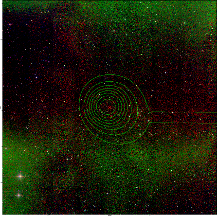  |

|[PS1 image](../image/707/707_ps1.pdf)            |
|-------------------|
| 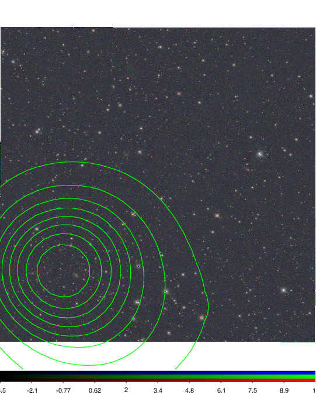  |
