

### 708

|Name|RAJ2000[deg]|DEJ2000[deg] |Ext[arcmin]| Ext,ml | z | z_src| C|GC(XSZ,Delta_z<0.01)| GC(OPT,Delta_z<0.01)|GC| R_sig[arcmin] | R500[arcmin] | R500[Mpc]| CRsig[c/s] | CR500[c/s] |L500[1E44 erg/s]|F500[1E-12 erg/s/cm^2]| M500[1E14 Msun]|Tx[keV]|Cnt_sig|Beta|Rc[arcmin]|Comment|Alias|
|---|---|---|---|---|---|------|---|--------|---------|----------|---|---|---|---|---|---|---|---|---|---|---|---|---|---|
|708| 259.488| 32.601| 1.56| 54.26| 0.1068(0.005)| z1, z_xsz| B| F20, MCXC, PSZ2, SPI, Tar| A, C, N, RM, W| A, C, F20, MCXC, N, PSZ2, SPI, Tar, W| 10.750| 7.656| 0.898| 0.187(0.028)| 0.178(0.027)| 0.970(0.075)| 3.324(0.256)| 2.28(0.09)| 3.68(0.09)| 162.4| 0.871(-0.116+0.089)| 3.664(-0.669+0.497)| -| k124|

|[RASS image](../image/708/708_img.pdf)|[filtered image](../image/708/708_fil.pdf)|[Segment image](../image/708/708_seg.pdf)|
|-------------------|--------------------|-------------------|
| 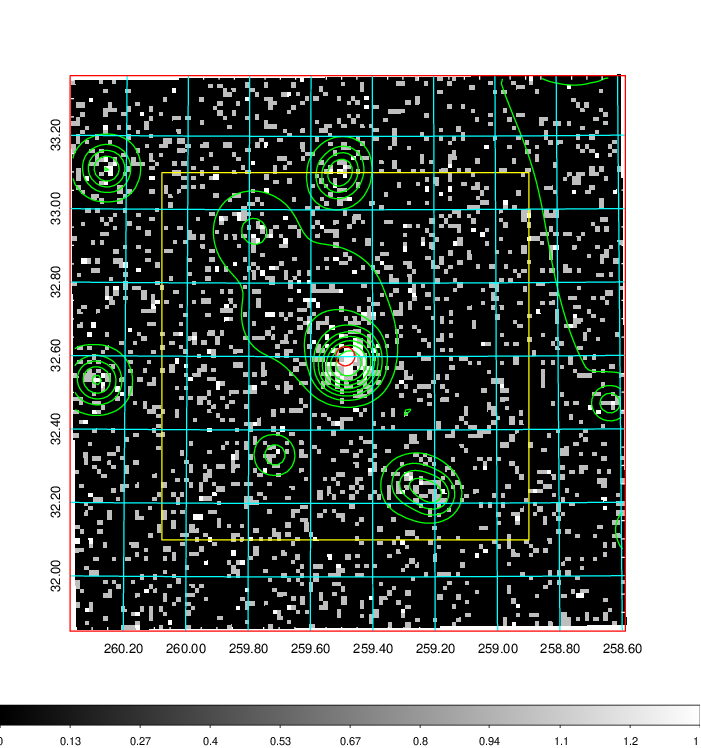  | 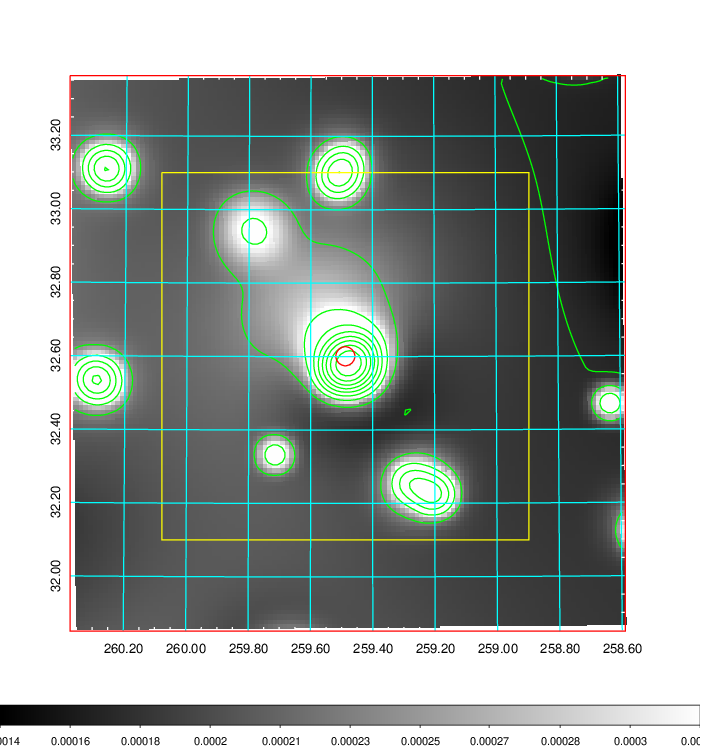   | 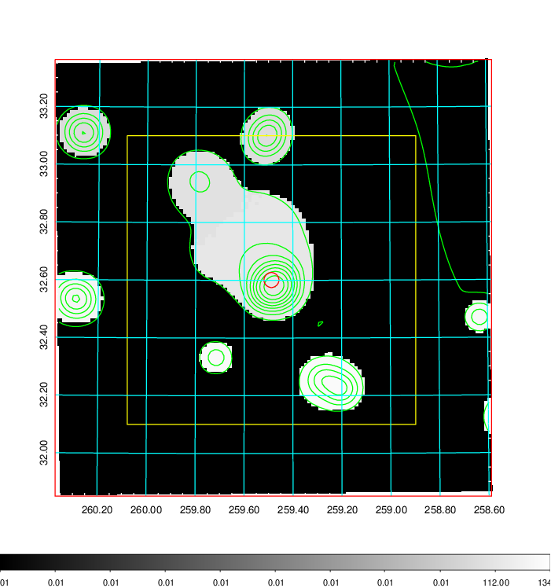  |

|[Exposure image](../image/708/708_mex.pdf)| [nH image](../image/708/708_nh.pdf)| [Planck image](../image/708/708_p.pdf)|
|-------------------|--------------------|-------------------|
|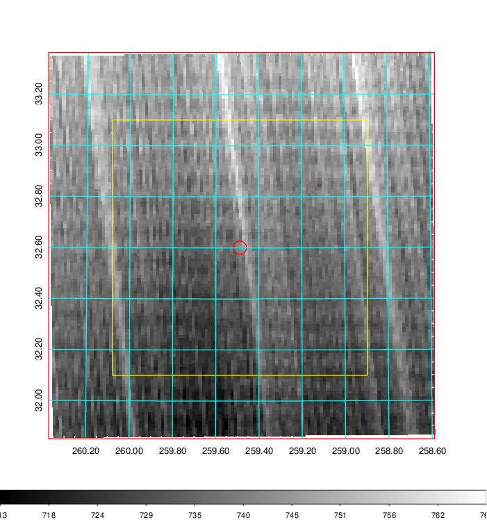   | 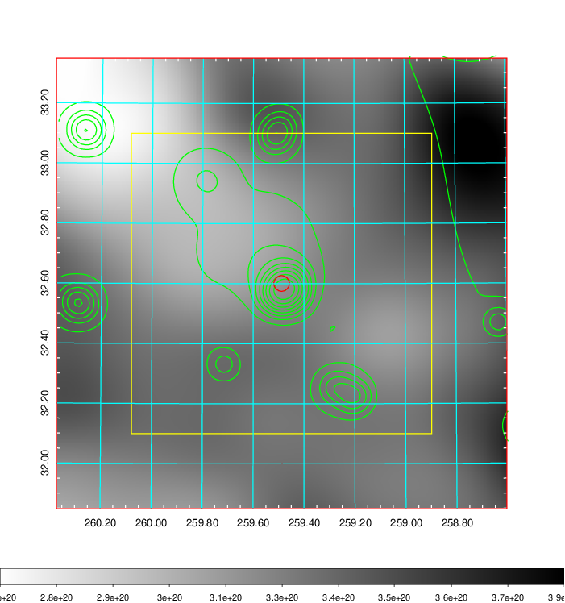    | 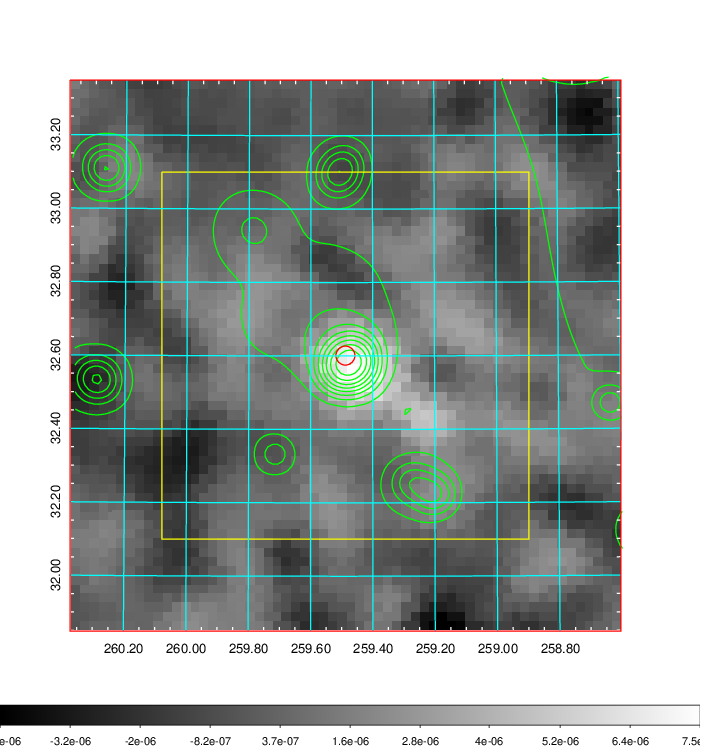 |

|[Redshift Histogram](../image/708/708_zg.pdf) | [DSS image(z1)](../image/708/708_dss_z1.pdf)      |  [DSS image(z2)](../image/708/708_dss_z2.pdf)    |
|-------------------|--------------------|-------------------|
|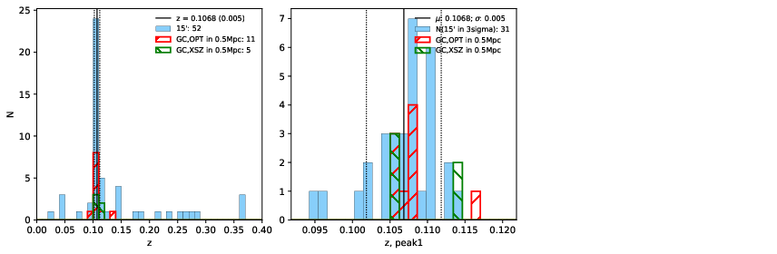 |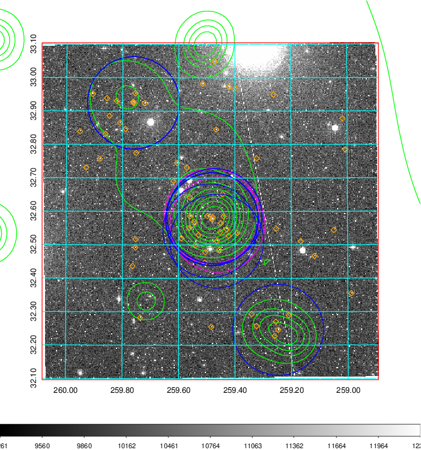  Blue circle for optical clusters;  Magenta circle for XSZ clusters;  all with r=1Mpc;  Only GC with Delta_z<0.01 are shown. | 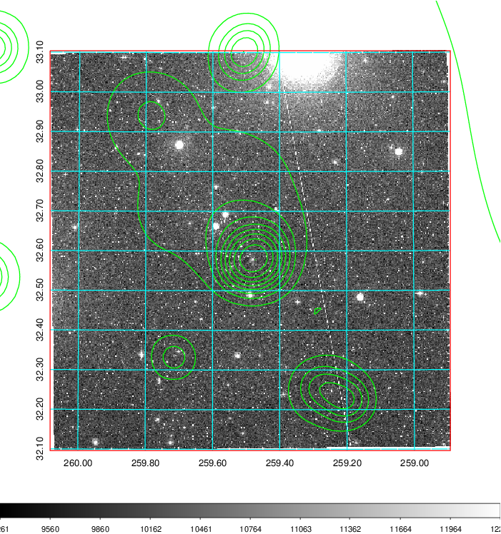 Blue circle for optical clusters;  Magenta circle for XSZ clusters;  all with r=1Mpc;  Only GC with Delta_z<0.01 are shown.  |

|[known Abell/XSZ clusters](../image/708/708_gc.pdf) | [2MASS image](../image/708/708_2mass.pdf)      |[SDSS image](../image/708/708_sdss.pdf)   |
|-------------------|-------------------|-------------------|
|  Magenta, blue and green circles  for optical, X-ray and SZ clusters  respectively, with redshift of clusters  labelled. The radius of circles  are 1Mpc.|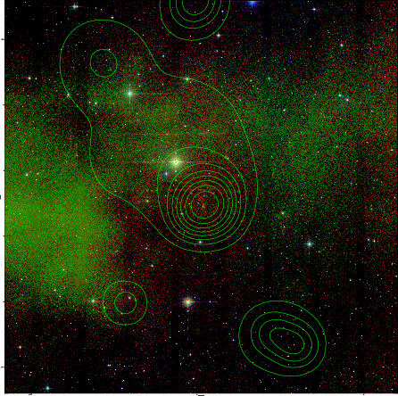  | 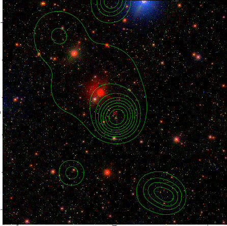  |

