

### 709

|Name|RAJ2000[deg]|DEJ2000[deg] |Ext[arcmin]| Ext,ml | z | z_src| C|GC(XSZ,Delta_z<0.01)| GC(OPT,Delta_z<0.01)|GC| R_sig[arcmin] | R500[arcmin] | R500[Mpc]| CRsig[c/s] | CR500[c/s] |L500[1E44 erg/s]|F500[1E-12 erg/s/cm^2]| M500[1E14 Msun]|Tx[keV]|Cnt_sig|Beta|Rc[arcmin]|Comment|Alias|
|---|---|---|---|---|---|------|---|--------|---------|----------|---|---|---|---|---|---|---|---|---|---|---|---|---|---|
|709| 259.548| 56.668| 0.75| 59.40| 0.1130(0.005)| z1, z_xsz| B| MCXC, PSZ2, Tar| N, W| C, MCXC, N, PSZ2, Tar, W| 9.288| 8.141| 1.003| 0.285(0.021)| 0.279(0.021)| 1.802(0.067)| 5.471(0.203)| 3.20(0.06)| 4.55(0.05)| 380.1| 0.729(-0.067+0.089)| 1.854(-0.401+0.453)| -| k008|

|[RASS image](../image/709/709_img.pdf)|[filtered image](../image/709/709_fil.pdf)|[Segment image](../image/709/709_seg.pdf)|
|-------------------|--------------------|-------------------|
| 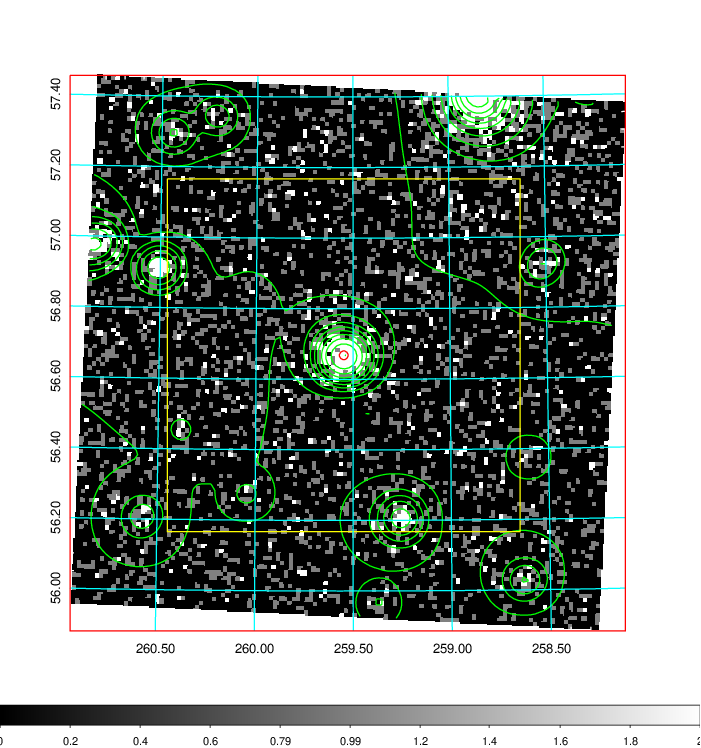  | 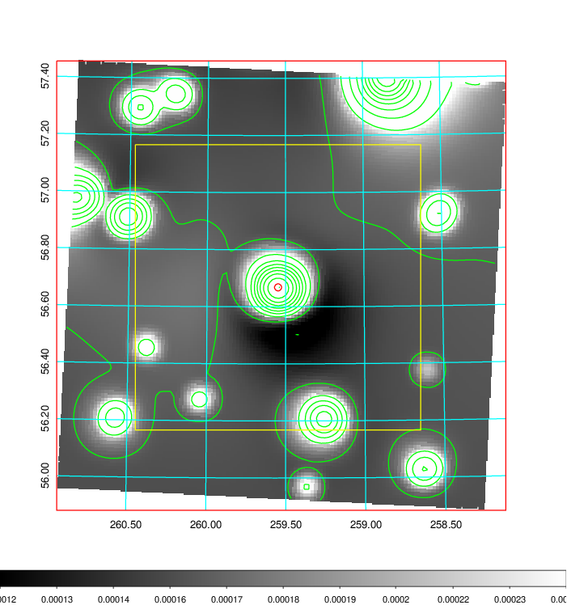   | 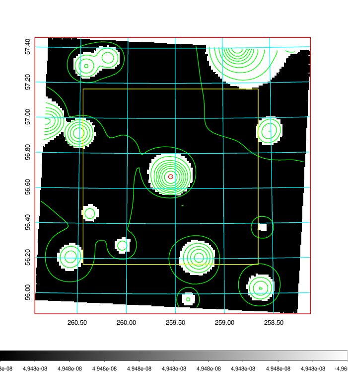  |

|[Exposure image](../image/709/709_mex.pdf)| [nH image](../image/709/709_nh.pdf)| [Planck image](../image/709/709_p.pdf)|
|-------------------|--------------------|-------------------|
|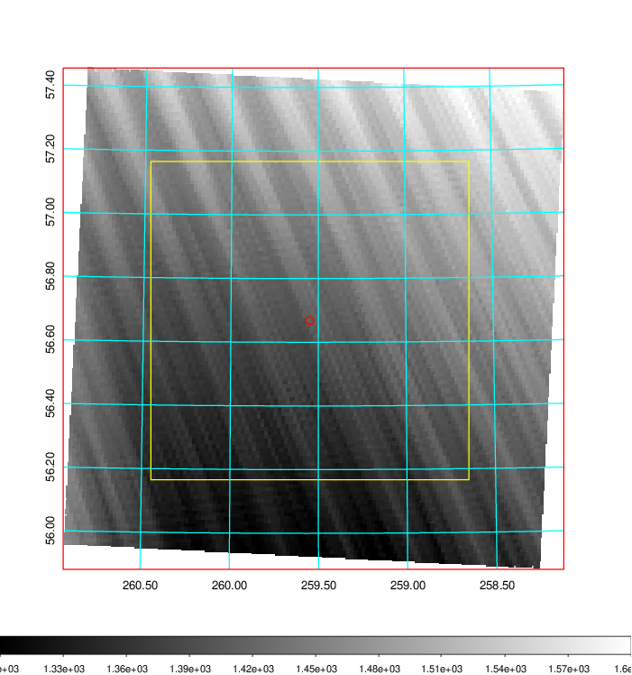   | 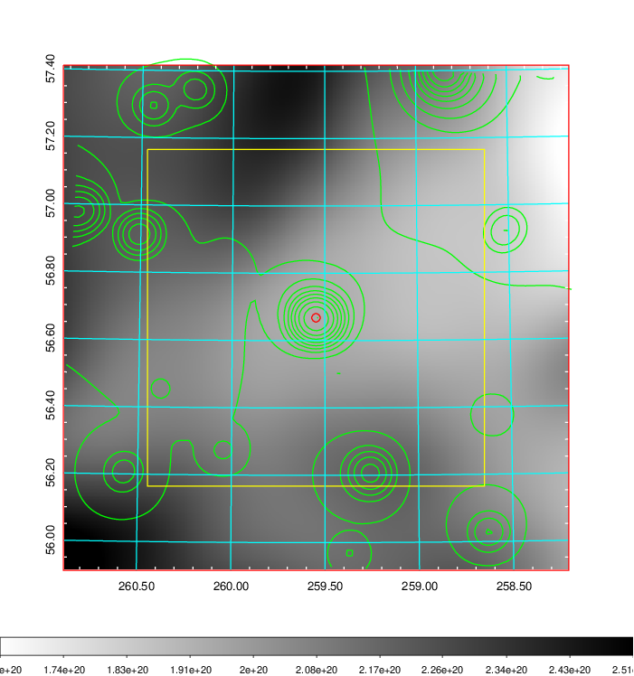    | 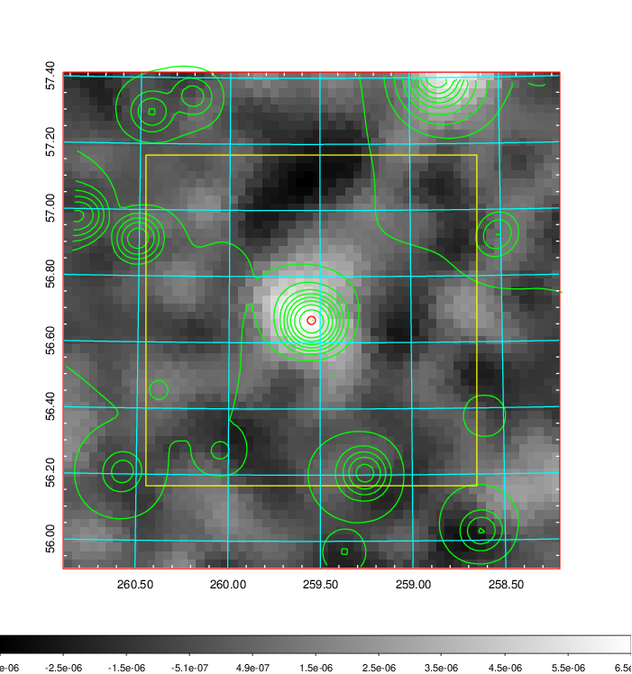 |

|[Redshift Histogram](../image/709/709_zg.pdf) | [DSS image(z1)](../image/709/709_dss_z1.pdf)      |  [DSS image(z2)](../image/709/709_dss_z2.pdf)    |
|-------------------|--------------------|-------------------|
|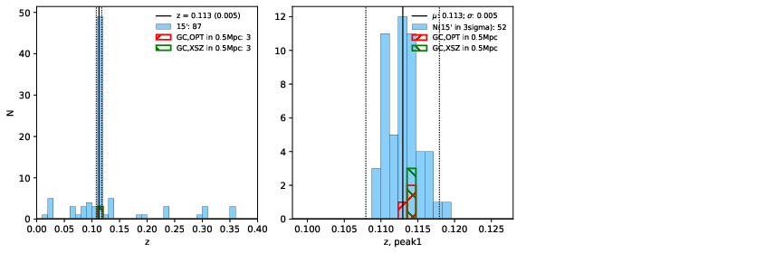 |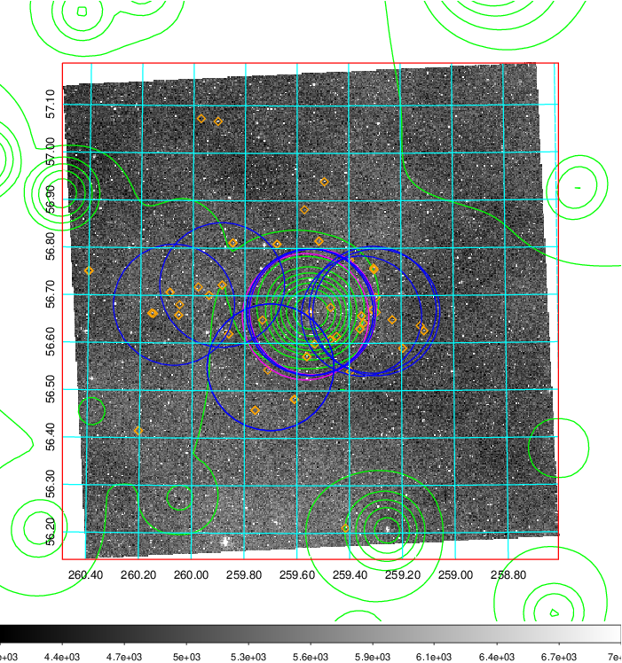  Blue circle for optical clusters;  Magenta circle for XSZ clusters;  all with r=1Mpc;  Only GC with Delta_z<0.01 are shown. | 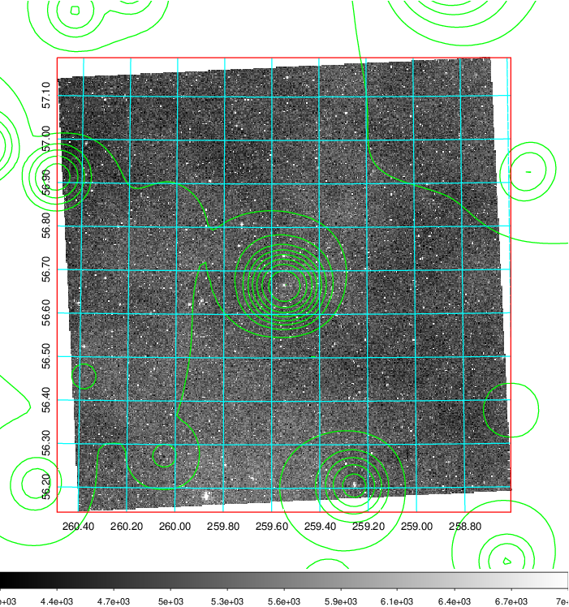 Blue circle for optical clusters;  Magenta circle for XSZ clusters;  all with r=1Mpc;  Only GC with Delta_z<0.01 are shown.  |

|[known Abell/XSZ clusters](../image/709/709_gc.pdf) | [2MASS image](../image/709/709_2mass.pdf)      |[SDSS image](../image/709/709_sdss.pdf)   |
|-------------------|-------------------|-------------------|
|  Magenta, blue and green circles  for optical, X-ray and SZ clusters  respectively, with redshift of clusters  labelled. The radius of circles  are 1Mpc.|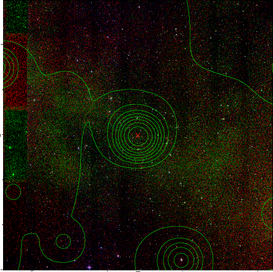  | 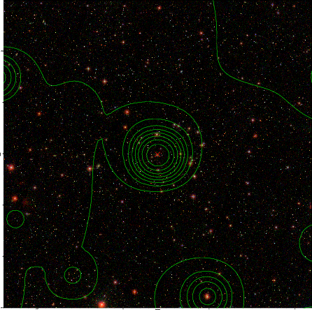  |

