

### 710

|Name|RAJ2000[deg]|DEJ2000[deg] |Ext[arcmin]| Ext,ml | z | z_src| C|GC(XSZ,Delta_z<0.01)| GC(OPT,Delta_z<0.01)|GC| R_sig[arcmin] | R500[arcmin] | R500[Mpc]| CRsig[c/s] | CR500[c/s] |L500[1E44 erg/s]|F500[1E-12 erg/s/cm^2]| M500[1E14 Msun]|Tx[keV]|Cnt_sig|Beta|Rc[arcmin]|Comment|Alias|
|---|---|---|---|---|---|------|---|--------|---------|----------|---|---|---|---|---|---|---|---|---|---|---|---|---|---|
|710| 259.553| 78.022| 2.54| 193.87| 0.0565(0.005)| z1, z_xsz| B| L03, MCXC| A, N, W| A, L03, MCXC, N, W| 14.650| 10.878| 0.715| 0.206(0.018)| 0.198(0.017)| 0.266(0.014)| 3.487(0.180)| 1.10(0.03)| 2.31(0.04)| 442.3| 0.731(-0.082+0.109)| 4.131(-0.720+0.871)| -| k306|

|[RASS image](../image/710/710_img.pdf)|[filtered image](../image/710/710_fil.pdf)|[Segment image](../image/710/710_seg.pdf)|
|-------------------|--------------------|-------------------|
| 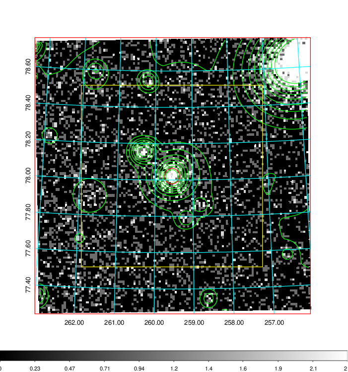  | 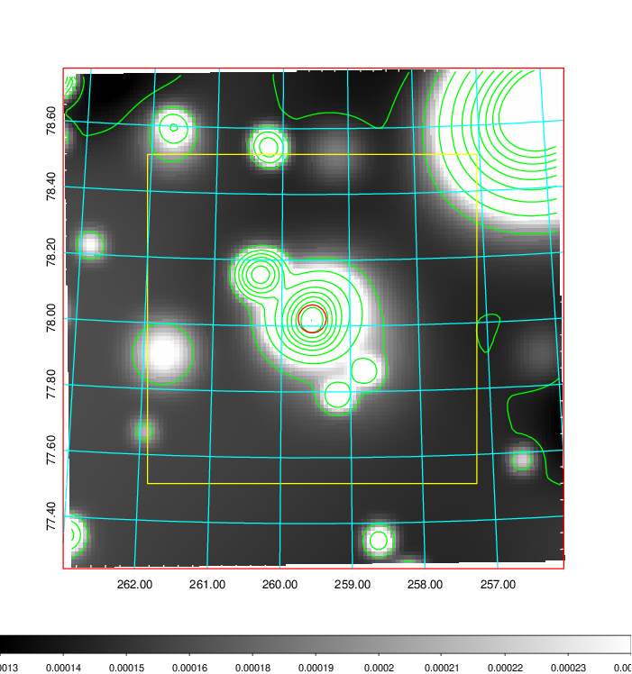   | 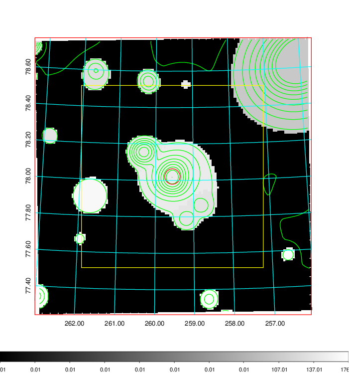  |

|[Exposure image](../image/710/710_mex.pdf)| [nH image](../image/710/710_nh.pdf)| [Planck image](../image/710/710_p.pdf)|
|-------------------|--------------------|-------------------|
|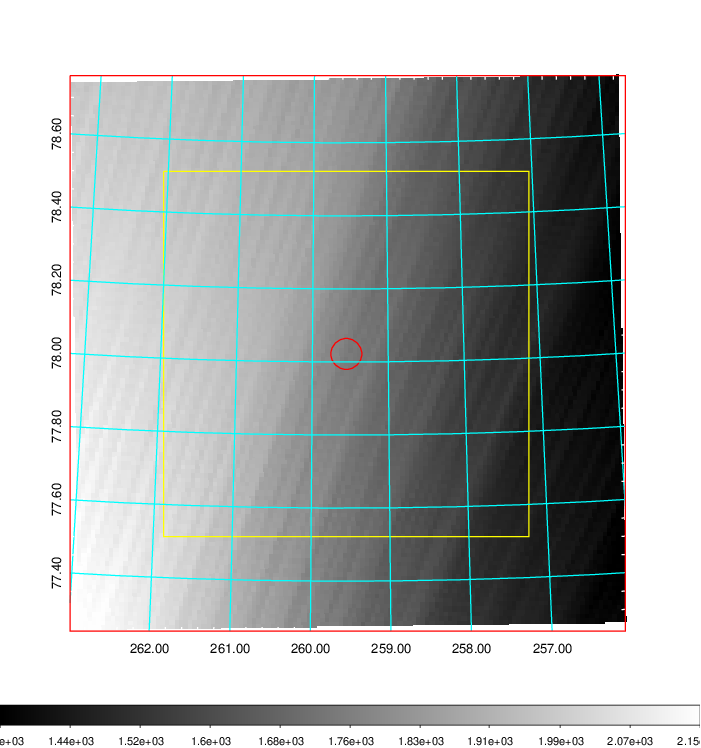   | 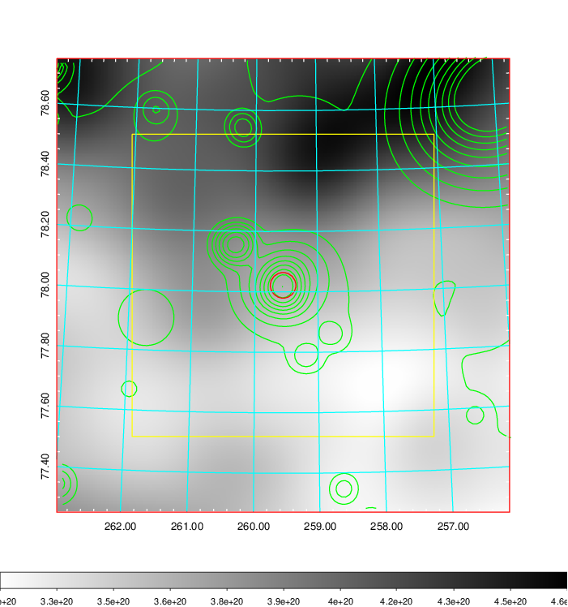    | 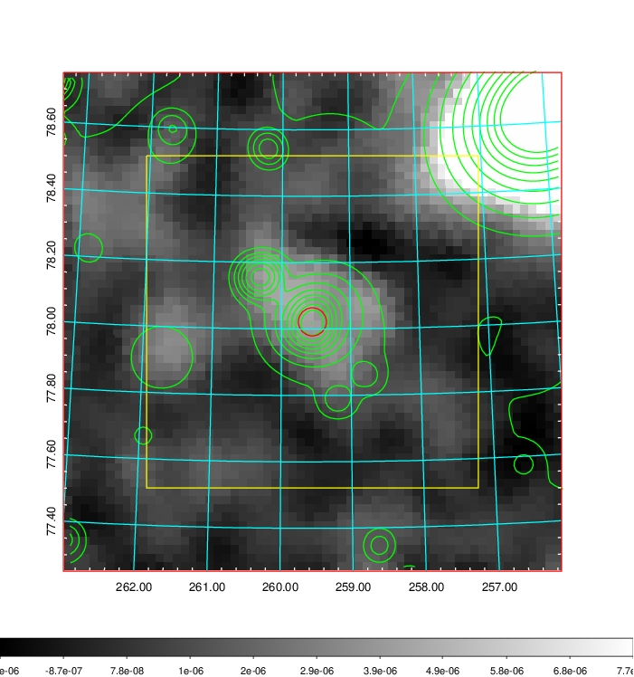 |

|[Redshift Histogram](../image/710/710_zg.pdf) | [DSS image(z1)](../image/710/710_dss_z1.pdf)      |  [DSS image(z2)](../image/710/710_dss_z2.pdf)    |
|-------------------|--------------------|-------------------|
|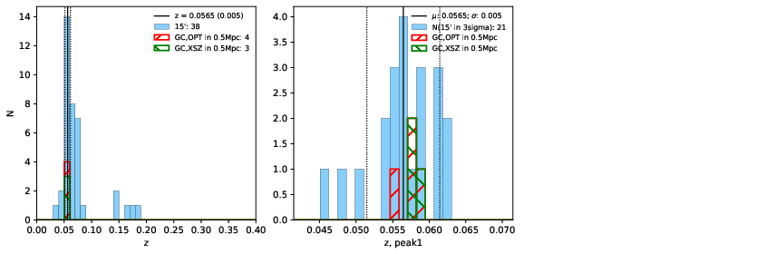 |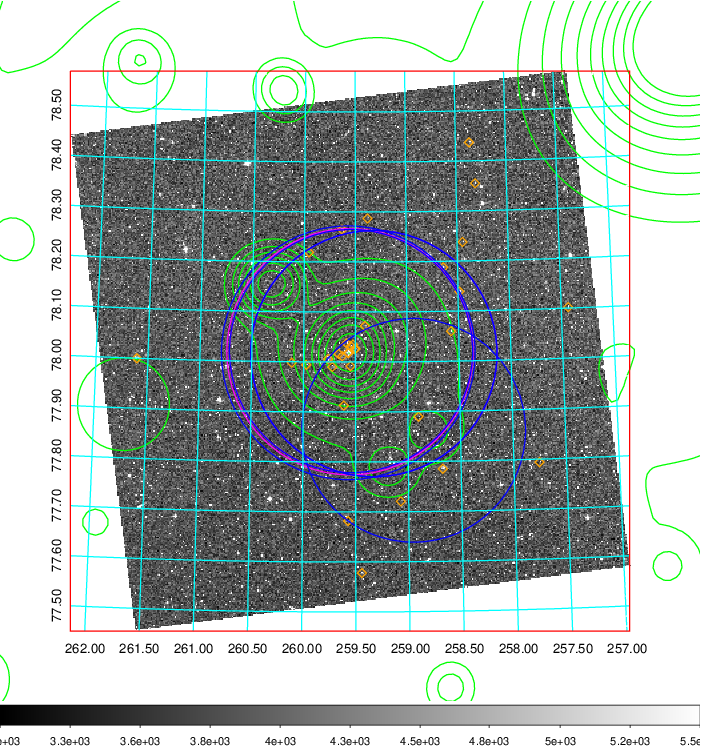  Blue circle for optical clusters;  Magenta circle for XSZ clusters;  all with r=1Mpc;  Only GC with Delta_z<0.01 are shown. | 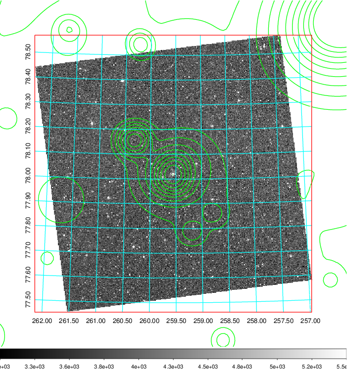 Blue circle for optical clusters;  Magenta circle for XSZ clusters;  all with r=1Mpc;  Only GC with Delta_z<0.01 are shown.  |

|[Previous-identified clusters](../image/710/710_gc.pdf) | [2MASS image](../image/710/710_2mass.pdf)      |[SDSS image](../image/710/710_sdss.pdf)   |
|-------------------|-------------------|-------------------|
|  Green, magenta, and blue circles  for optical, X-ray and SZ clusters  respectively, with redshift of clusters  labelled. The radius of circles  are 1Mpc.|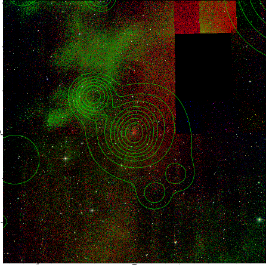  | 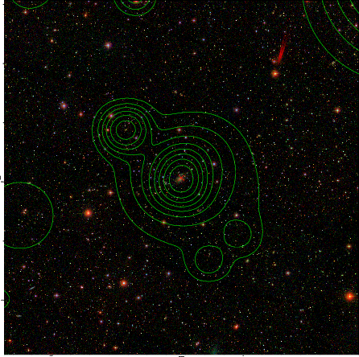  |

