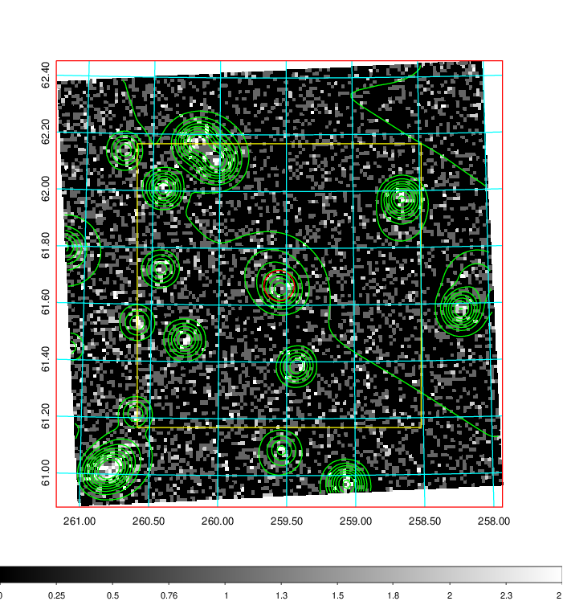
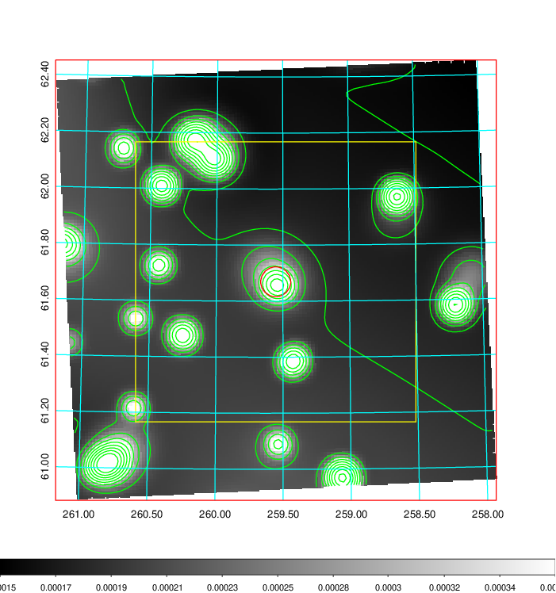
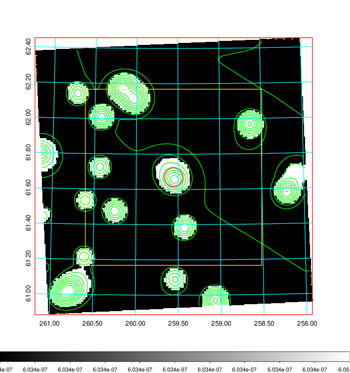
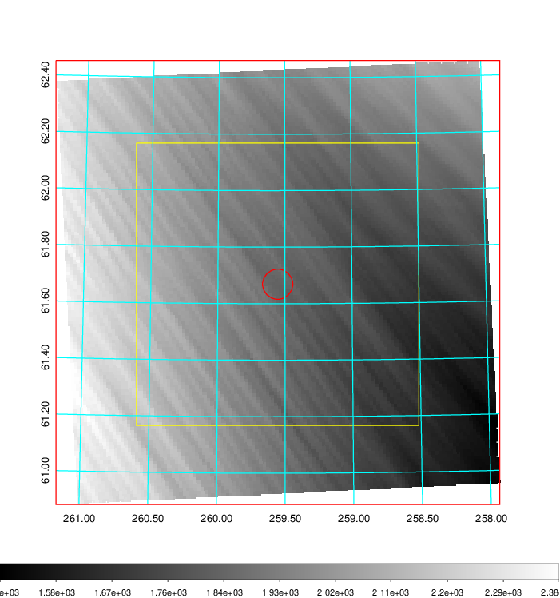
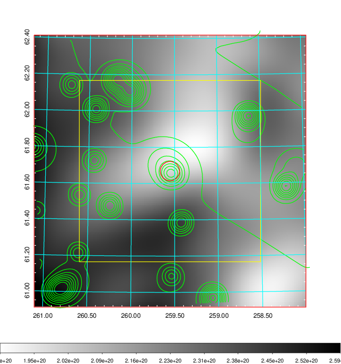
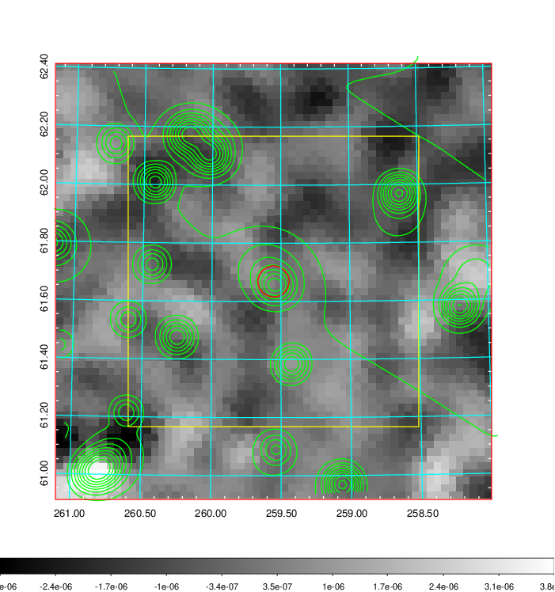
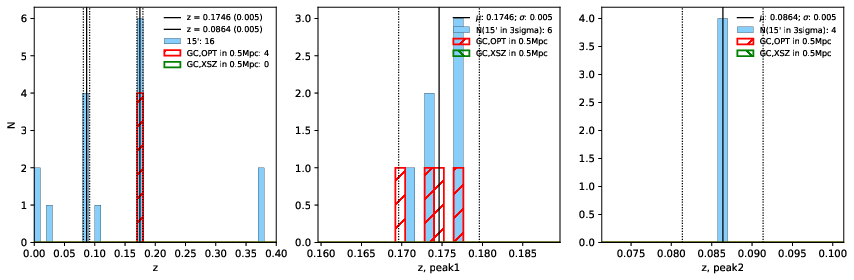
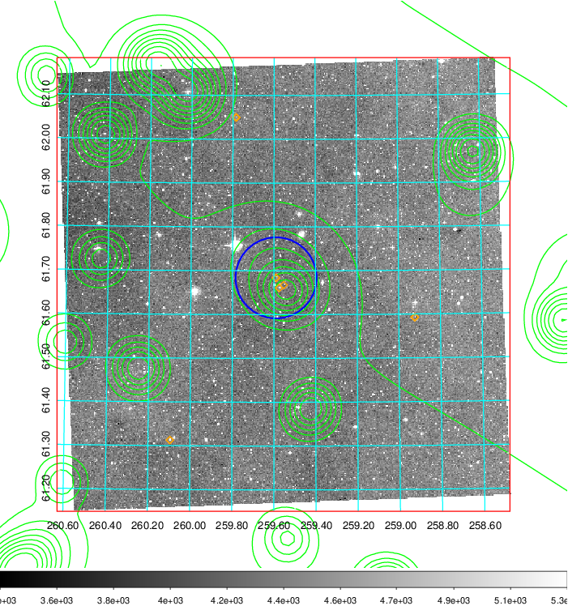
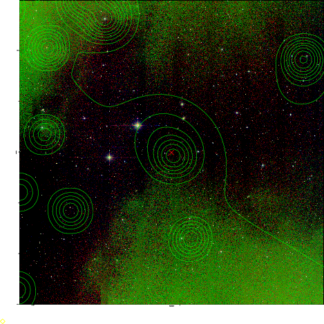
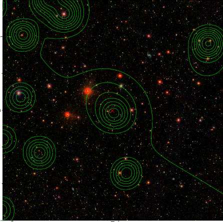

### 711

|Name|RAJ2000[deg]|DEJ2000[deg] |Ext[arcmin]| Ext,ml | z | z_src| C|GC(XSZ,Delta_z<0.01)| GC(OPT,Delta_z<0.01)|GC| R_sig[arcmin] | R500[arcmin] | R500[Mpc]| CRsig[c/s] | CR500[c/s] |L500[1E44 erg/s]|F500[1E-12 erg/s/cm^2]| M500[1E14 Msun]|Tx[keV]|Cnt_sig|Beta|Rc[arcmin]|Comment|Alias|
|---|---|---|---|---|---|------|---|--------|---------|----------|---|---|---|---|---|---|---|---|---|---|---|---|---|---|
|711| 259.554| 61.669| 3.21| 25.78| 0.1746(0.005)| z1, z_opt| S| -| C, N, W| C, N, W| 7.338| 4.255| 0.756| 0.034(0.014)| 0.032(0.013)| 0.529(0.193)| 0.622(0.227)| 1.46(0.27)| 2.86(0.33)| 80.7| 0.863(-0.146+0.098)| 3.548(-0.858+0.712)| -| t142|

|[RASS image](../image/711/711_img.pdf)|[filtered image](../image/711/711_fil.pdf)|[Segment image](../image/711/711_seg.pdf)|
|-------------------|--------------------|-------------------|
|   |    |   |

|[Exposure image](../image/711/711_mex.pdf)| [nH image](../image/711/711_nh.pdf)| [Planck image](../image/711/711_p.pdf)|
|-------------------|--------------------|-------------------|
|   |     |  |

|[Redshift Histogram](../image/711/711_zg.pdf) | [DSS image(z1)](../image/711/711_dss_z1.pdf)      |  [DSS image(z2)](../image/711/711_dss_z2.pdf)    |
|-------------------|--------------------|-------------------|
| |  Blue circle for optical clusters;  Magenta circle for XSZ clusters;  all with r=1Mpc;  Only GC with Delta_z<0.01 are shown. |  Blue circle for optical clusters;  Magenta circle for XSZ clusters;  all with r=1Mpc;  Only GC with Delta_z<0.01 are shown.  |

|[known Abell/XSZ clusters](../image/711/711_gc.pdf) | [2MASS image](../image/711/711_2mass.pdf)      |[SDSS image](../image/711/711_sdss.pdf)   |
|-------------------|-------------------|-------------------|
|  Magenta, blue and green circles  for optical, X-ray and SZ clusters  respectively, with redshift of clusters  labelled. The radius of circles  are 1Mpc.|  |   |

