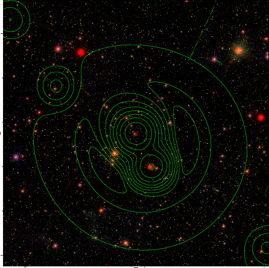

### 712

|Name|RAJ2000[deg]|DEJ2000[deg] |Ext[arcmin]| Ext,ml | z | z_src| C|GC(XSZ,Delta_z<0.01)| GC(OPT,Delta_z<0.01)|GC| R_sig[arcmin] | R500[arcmin] | R500[Mpc]| CRsig[c/s] | CR500[c/s] |L500[1E44 erg/s]|F500[1E-12 erg/s/cm^2]| M500[1E14 Msun]|Tx[keV]|Cnt_sig|Beta|Rc[arcmin]|Comment|Alias|
|---|---|---|---|---|---|------|---|--------|---------|----------|---|---|---|---|---|---|---|---|---|---|---|---|---|---|
|712| 260.036| 26.626| 0.81| 97.60| 0.1612(0.005)| z1, z_xsz| B| F20, MCXC, PSZ2, Tar| N, RM, W| C, F20, MCXC, N, PSZ2, Tar, W| 8.800| 8.178| 1.362| 0.610(0.038)| 0.603(0.037)| 8.345(0.187)| 11.710(0.263)| 8.41(0.09)| 8.39(0.06)| 478.7| 0.695(-0.053+0.068)| 1.763(-0.350+0.392)| -| k014|

|[RASS image](../image/712/712_img.pdf)|[filtered image](../image/712/712_fil.pdf)|[Segment image](../image/712/712_seg.pdf)|
|-------------------|--------------------|-------------------|
|   |    |   |

|[Exposure image](../image/712/712_mex.pdf)| [nH image](../image/712/712_nh.pdf)| [Planck image](../image/712/712_p.pdf)|
|-------------------|--------------------|-------------------|
|   |     |  |

|[Redshift Histogram](../image/712/712_zg.pdf) | [DSS image(z1)](../image/712/712_dss_z1.pdf)      |  [DSS image(z2)](../image/712/712_dss_z2.pdf)    |
|-------------------|--------------------|-------------------|
| |  Blue circle for optical clusters;  Magenta circle for XSZ clusters;  all with r=1Mpc;  Only GC with Delta_z<0.01 are shown. |  Blue circle for optical clusters;  Magenta circle for XSZ clusters;  all with r=1Mpc;  Only GC with Delta_z<0.01 are shown.  |

|[Previous-identified clusters](../image/712/712_gc.pdf) | [2MASS image](../image/712/712_2mass.pdf)      |[SDSS image](../image/712/712_sdss.pdf)   |
|-------------------|-------------------|-------------------|
|  Green, magenta, and blue circles  for optical, X-ray and SZ clusters  respectively, with redshift of clusters  labelled. The radius of circles  are 1Mpc.|  |   |

