

### 713

|Name|RAJ2000[deg]|DEJ2000[deg] |Ext[arcmin]| Ext,ml | z | z_src| C|GC(XSZ,Delta_z<0.01)| GC(OPT,Delta_z<0.01)|GC| R_sig[arcmin] | R500[arcmin] | R500[Mpc]| CRsig[c/s] | CR500[c/s] |L500[1E44 erg/s]|F500[1E-12 erg/s/cm^2]| M500[1E14 Msun]|Tx[keV]|Cnt_sig|Beta|Rc[arcmin]|Comment|Alias|
|---|---|---|---|---|---|------|---|--------|---------|----------|---|---|---|---|---|---|---|---|---|---|---|---|---|---|
|713| 260.039| 27.669| 0.94| 43.61| 0.1608(0.005)| z1, z_xsz| B| F20, MCXC, PSZ2, Tar, XB| A, C, N, RM, W| A, C, F20, MCXC, N, PSZ2, Tar, W, XB| 7.825| 6.811| 1.132| 0.260(0.030)| 0.255(0.030)| 3.511(0.173)| 4.954(0.245)| 4.83(0.11)| 5.95(0.09)| 179.9| 0.859(-0.109+0.094)| 2.554(-0.533+0.417)| -| k028|

|[RASS image](../image/713/713_img.pdf)|[filtered image](../image/713/713_fil.pdf)|[Segment image](../image/713/713_seg.pdf)|
|-------------------|--------------------|-------------------|
| 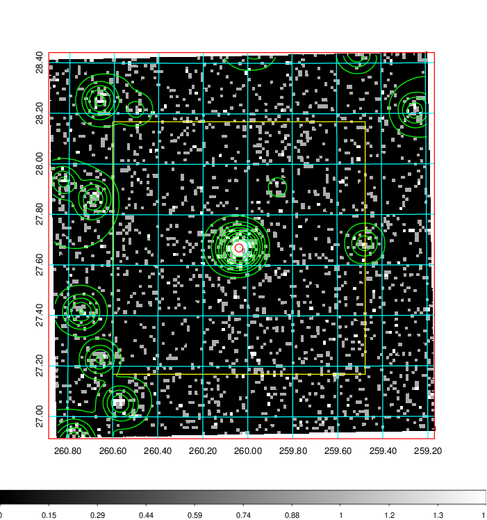  | 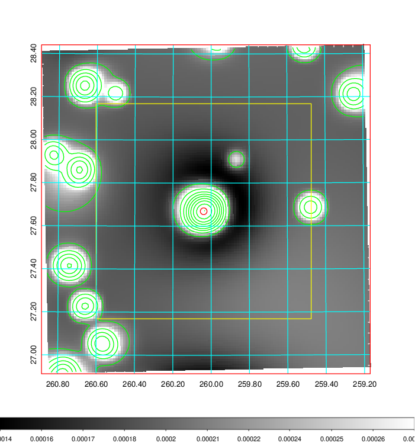   | 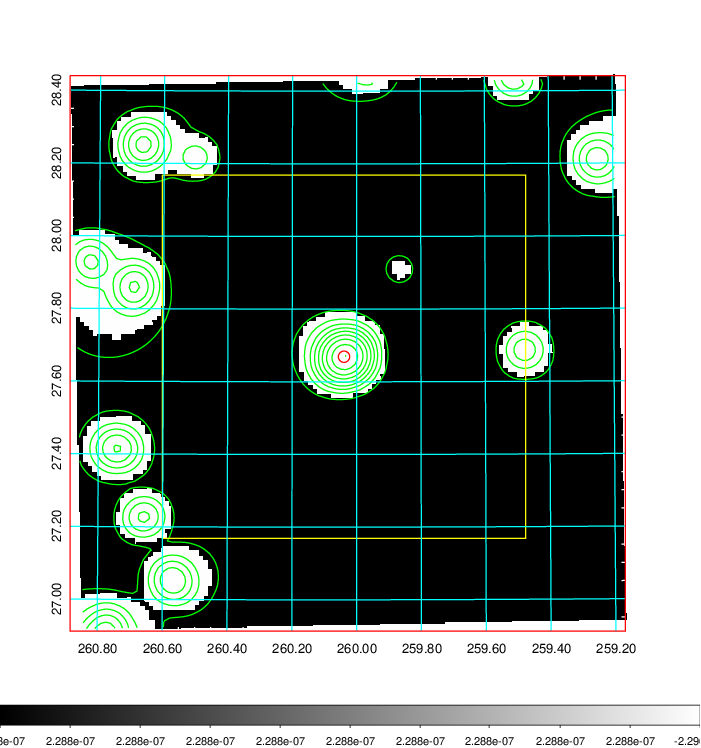  |

|[Exposure image](../image/713/713_mex.pdf)| [nH image](../image/713/713_nh.pdf)| [Planck image](../image/713/713_p.pdf)|
|-------------------|--------------------|-------------------|
|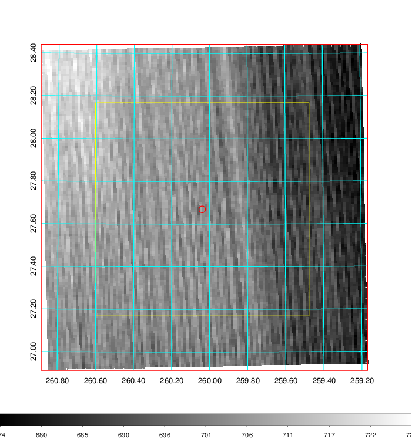   | 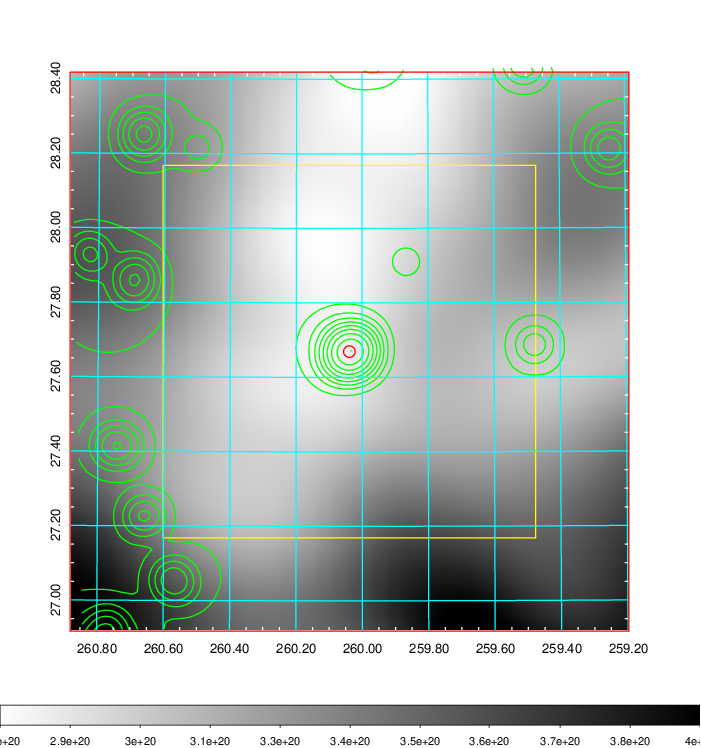    | 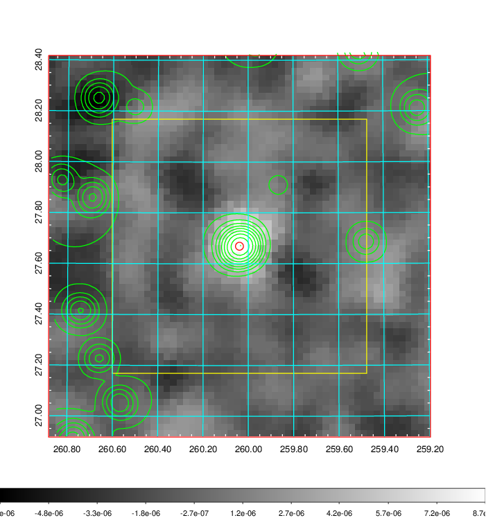 |

|[Redshift Histogram](../image/713/713_zg.pdf) | [DSS image(z1)](../image/713/713_dss_z1.pdf)      |  [DSS image(z2)](../image/713/713_dss_z2.pdf)    |
|-------------------|--------------------|-------------------|
|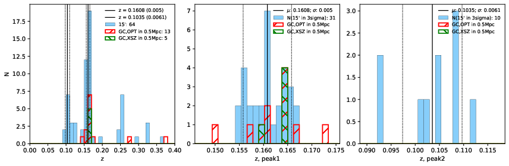 |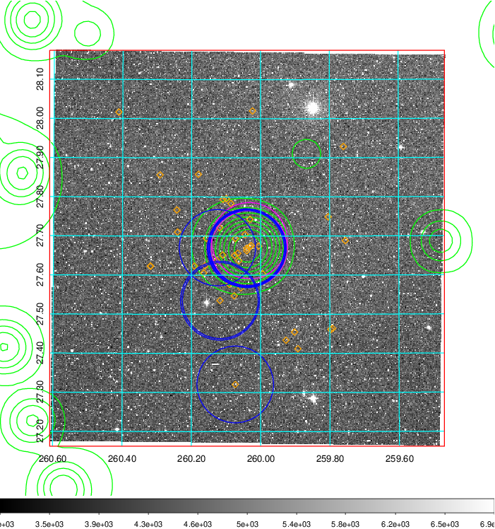  Blue circle for optical clusters;  Magenta circle for XSZ clusters;  all with r=1Mpc;  Only GC with Delta_z<0.01 are shown. | 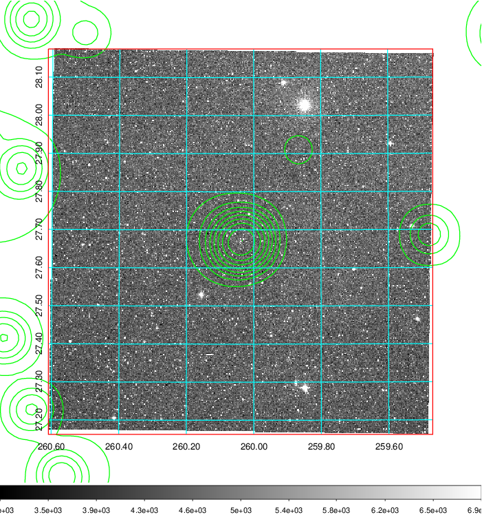 Blue circle for optical clusters;  Magenta circle for XSZ clusters;  all with r=1Mpc;  Only GC with Delta_z<0.01 are shown.  |

|[Previous-identified clusters](../image/713/713_gc.pdf) | [2MASS image](../image/713/713_2mass.pdf)      |[SDSS image](../image/713/713_sdss.pdf)   |
|-------------------|-------------------|-------------------|
|  Green, magenta, and blue circles  for optical, X-ray and SZ clusters  respectively, with redshift of clusters  labelled. The radius of circles  are 1Mpc.|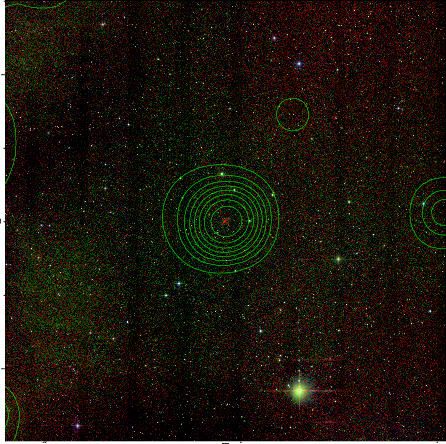  | 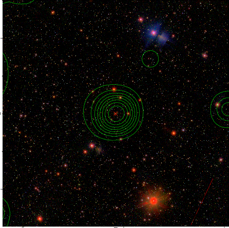  |

