

### 715

|Name|RAJ2000[deg]|DEJ2000[deg] |Ext[arcmin]| Ext,ml | z | z_src| C|GC(XSZ,Delta_z<0.01)| GC(OPT,Delta_z<0.01)|GC| R_sig[arcmin] | R500[arcmin] | R500[Mpc]| CRsig[c/s] | CR500[c/s] |L500[1E44 erg/s]|F500[1E-12 erg/s/cm^2]| M500[1E14 Msun]|Tx[keV]|Cnt_sig|Beta|Rc[arcmin]|Comment|Alias|
|---|---|---|---|---|---|------|---|--------|---------|----------|---|---|---|---|---|---|---|---|---|---|---|---|---|---|
|715| 260.614| 32.131| 1.12| 87.25| 0.2252(0.005)| z1, z_xsz| B| F20, MCXC, PSZ2, SPI, Tar, XB| A, C, N, RM, W| A, C, F20, MCXC, N, PSZ2, SPI, Tar, W, XB| 14.162| 6.640| 1.441| 0.485(0.035)| 0.446(0.033)| 13.089(0.390)| 8.726(0.260)| 10.65(0.15)| 9.92(0.09)| 366.2| 0.529(-0.021+0.029)| 1.095(-0.251+0.298)| -| k047|

|[RASS image](../image/715/715_img.pdf)|[filtered image](../image/715/715_fil.pdf)|[Segment image](../image/715/715_seg.pdf)|
|-------------------|--------------------|-------------------|
| 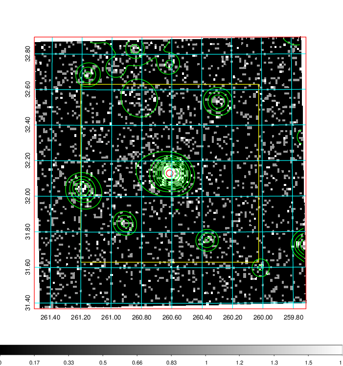  | 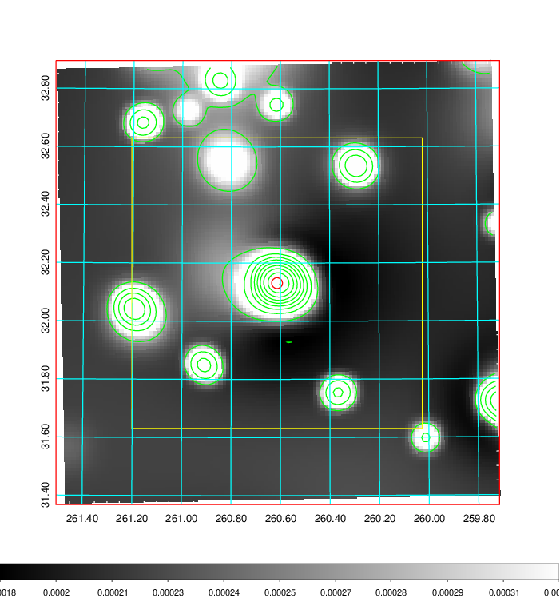   | 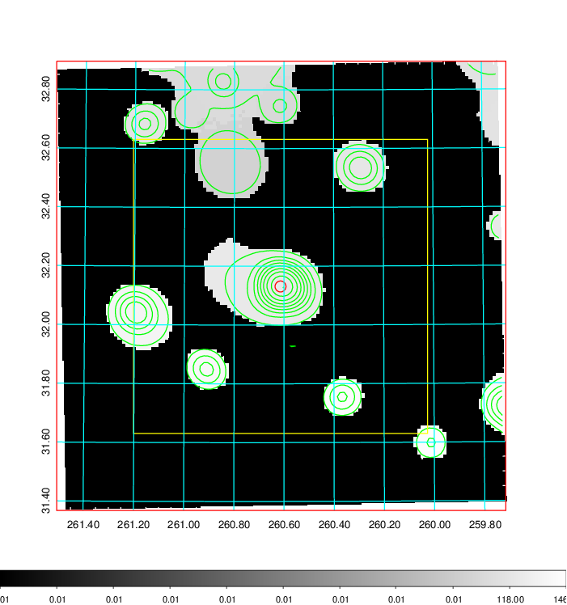  |

|[Exposure image](../image/715/715_mex.pdf)| [nH image](../image/715/715_nh.pdf)| [Planck image](../image/715/715_p.pdf)|
|-------------------|--------------------|-------------------|
|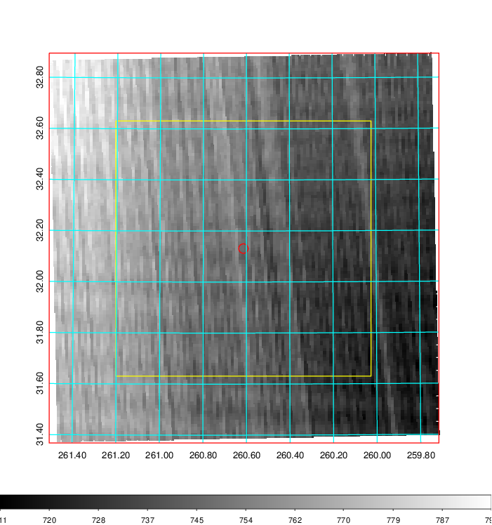   | 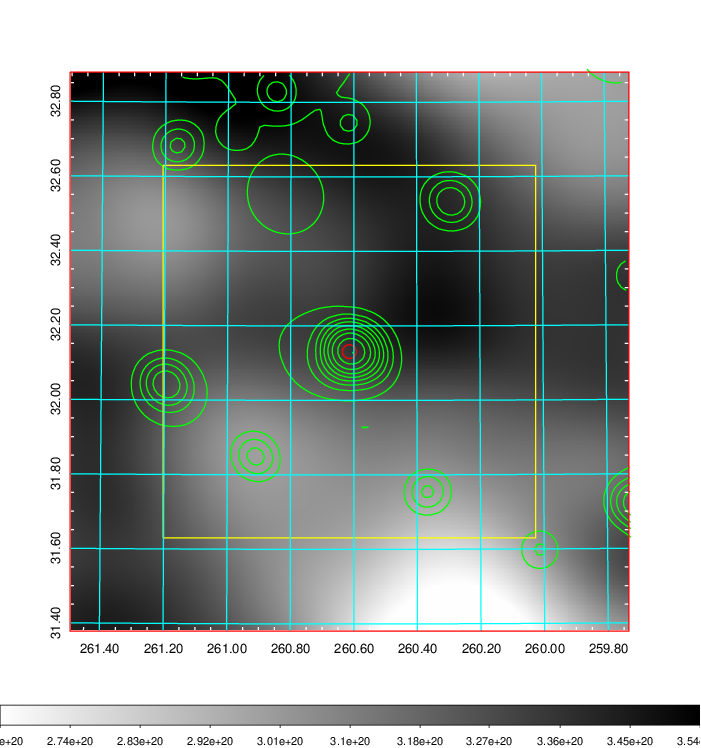    | 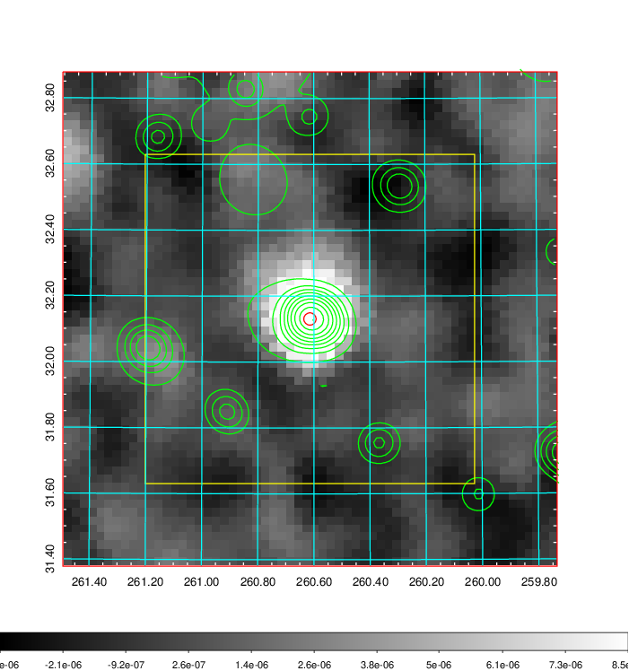 |

|[Redshift Histogram](../image/715/715_zg.pdf) | [DSS image(z1)](../image/715/715_dss_z1.pdf)      |  [DSS image(z2)](../image/715/715_dss_z2.pdf)    |
|-------------------|--------------------|-------------------|
|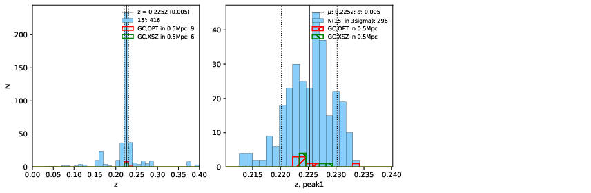 |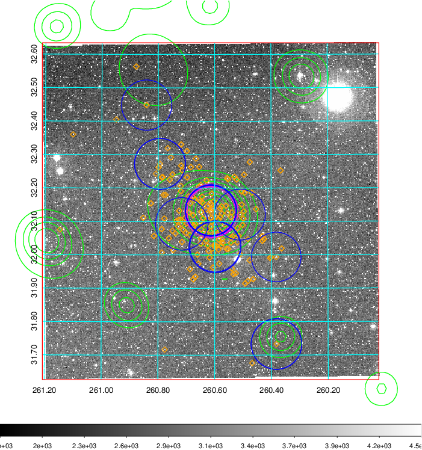  Blue circle for optical clusters;  Magenta circle for XSZ clusters;  all with r=1Mpc;  Only GC with Delta_z<0.01 are shown. | 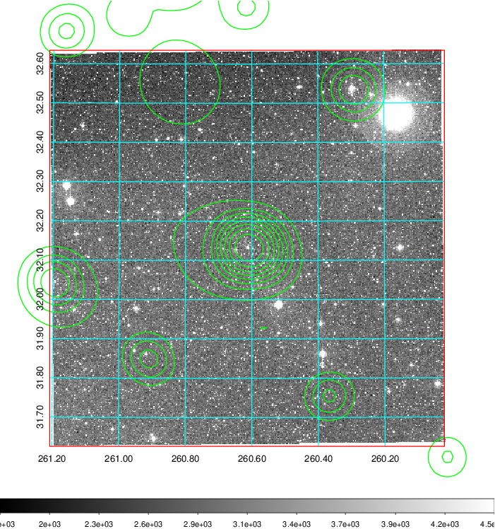 Blue circle for optical clusters;  Magenta circle for XSZ clusters;  all with r=1Mpc;  Only GC with Delta_z<0.01 are shown.  |

|[known Abell/XSZ clusters](../image/715/715_gc.pdf) | [2MASS image](../image/715/715_2mass.pdf)      |[SDSS image](../image/715/715_sdss.pdf)   |
|-------------------|-------------------|-------------------|
|  Magenta, blue and green circles  for optical, X-ray and SZ clusters  respectively, with redshift of clusters  labelled. The radius of circles  are 1Mpc.|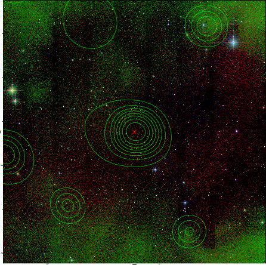  | 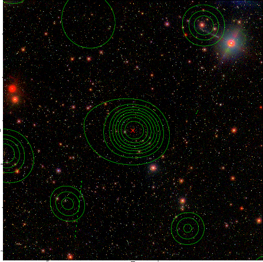  |

