

### 716

|Name|RAJ2000[deg]|DEJ2000[deg] |Ext[arcmin]| Ext,ml | z | z_src| C|GC(XSZ,Delta_z<0.01)| GC(OPT,Delta_z<0.01)|GC| R_sig[arcmin] | R500[arcmin] | R500[Mpc]| CRsig[c/s] | CR500[c/s] |L500[1E44 erg/s]|F500[1E-12 erg/s/cm^2]| M500[1E14 Msun]|Tx[keV]|Cnt_sig|Beta|Rc[arcmin]|Comment|Alias|
|---|---|---|---|---|---|------|---|--------|---------|----------|---|---|---|---|---|---|---|---|---|---|---|---|---|---|
|716| 260.779| 61.022| 1.97| 50.42| 0.2410(0.000)| z_opt| S| -| N, W| A, C, N, PSZ2, Tar, W| 11.238| 3.764| 0.859| 0.038(0.012)| 0.034(0.010)| 1.174(0.172)| 0.671(0.098)| 2.30(0.16)| 3.87(0.18)| 195.8| 0.905(-0.112+0.069)| 2.574(-0.476+0.381)| $z$ of optical clusters; An SZ cluster with $z$ = 0.2670 and offset = 0.09 Mpc| k214|

|[RASS image](../image/716/716_img.pdf)|[filtered image](../image/716/716_fil.pdf)|[Segment image](../image/716/716_seg.pdf)|
|-------------------|--------------------|-------------------|
| 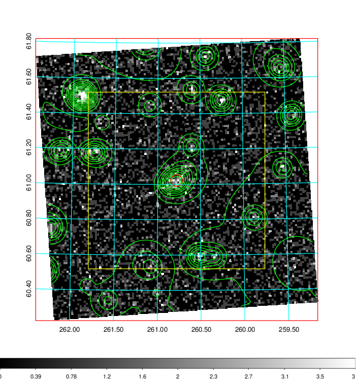  | 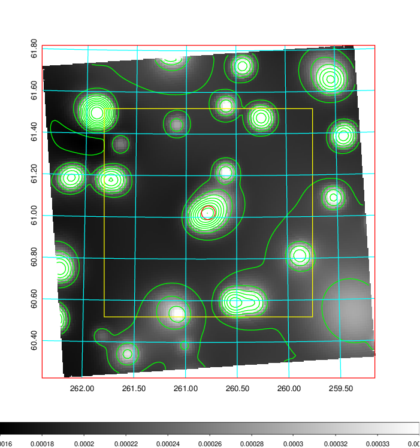   | 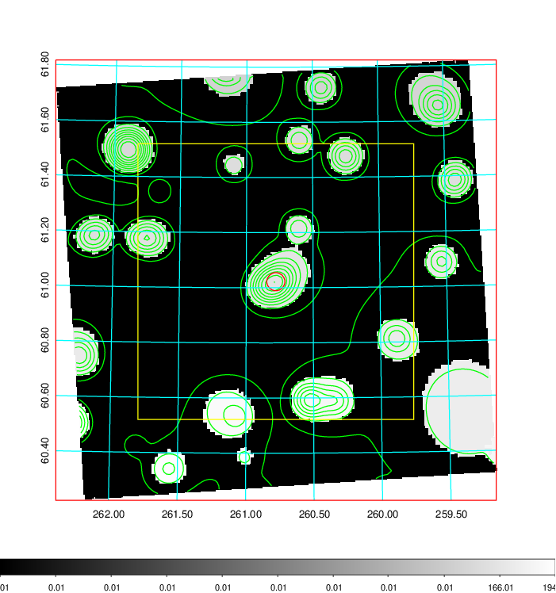  |

|[Exposure image](../image/716/716_mex.pdf)| [nH image](../image/716/716_nh.pdf)| [Planck image](../image/716/716_p.pdf)|
|-------------------|--------------------|-------------------|
|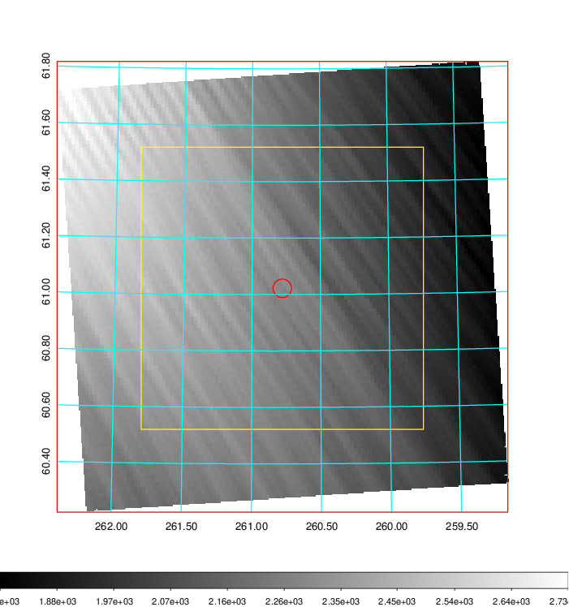   | 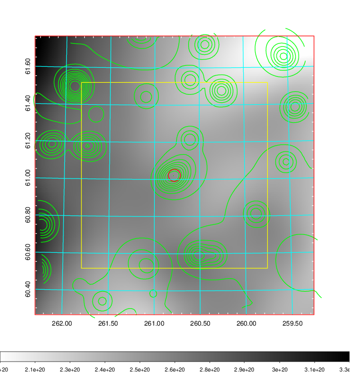    | 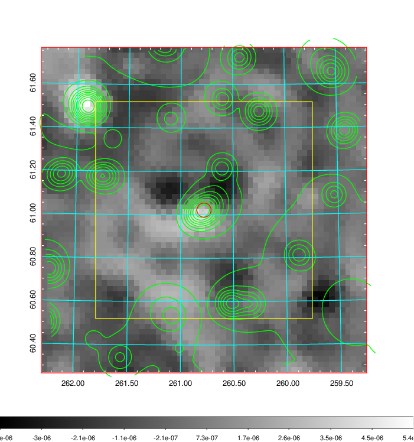 |

|[Redshift Histogram](../image/716/716_zg.pdf) | [DSS image(z1)](../image/716/716_dss_z1.pdf)      |  [DSS image(z2)](../image/716/716_dss_z2.pdf)    |
|-------------------|--------------------|-------------------|
|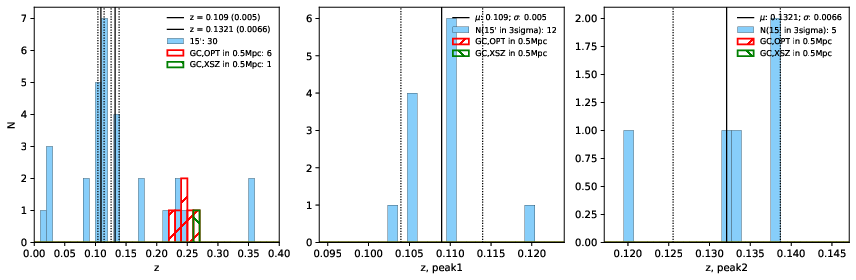 |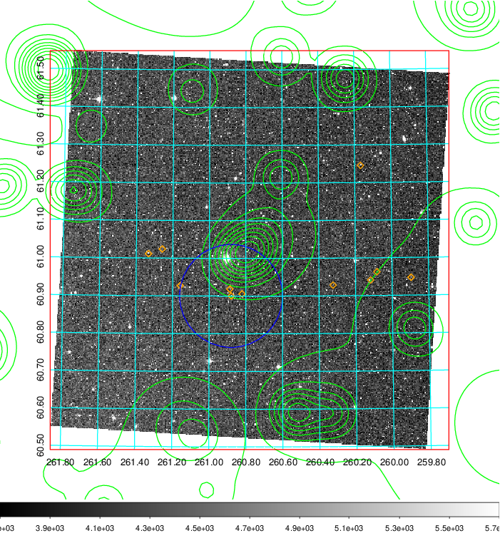  Blue circle for optical clusters;  Magenta circle for XSZ clusters;  all with r=1Mpc;  Only GC with Delta_z<0.01 are shown. | 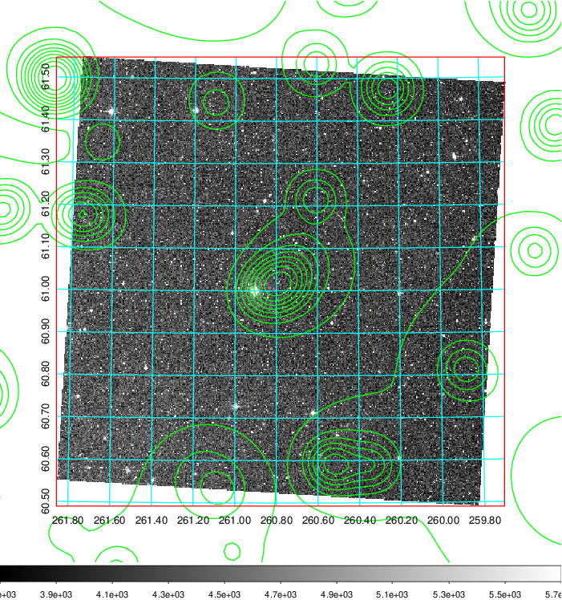 Blue circle for optical clusters;  Magenta circle for XSZ clusters;  all with r=1Mpc;  Only GC with Delta_z<0.01 are shown.  |

|[known Abell/XSZ clusters](../image/716/716_gc.pdf) | [2MASS image](../image/716/716_2mass.pdf)      |[SDSS image](../image/716/716_sdss.pdf)   |
|-------------------|-------------------|-------------------|
|  Magenta, blue and green circles  for optical, X-ray and SZ clusters  respectively, with redshift of clusters  labelled. The radius of circles  are 1Mpc.|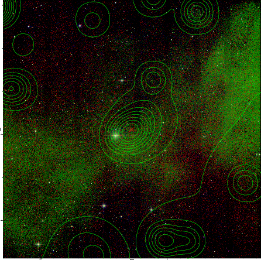  | 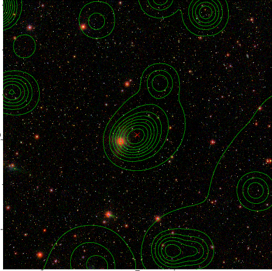  |

