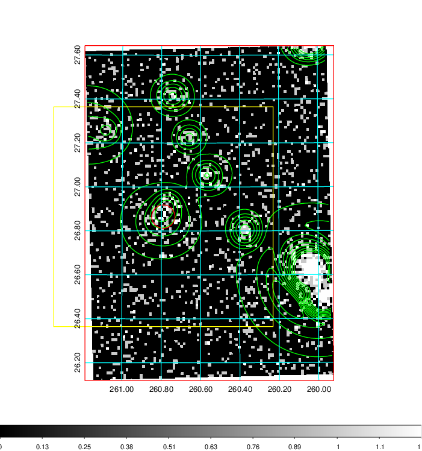
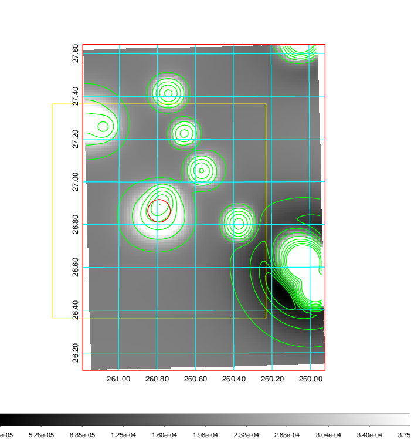
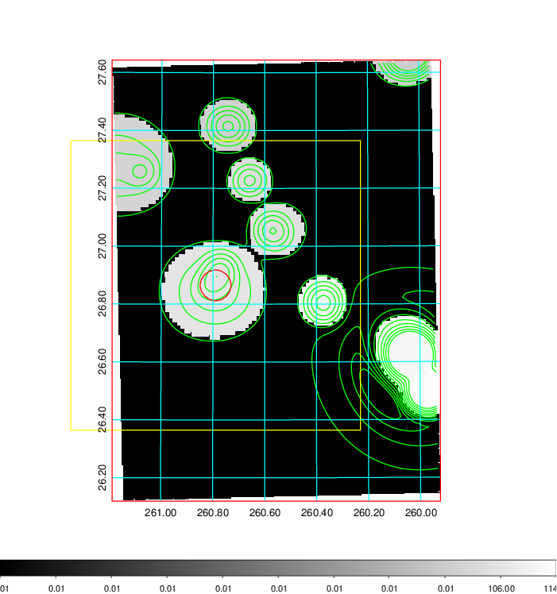
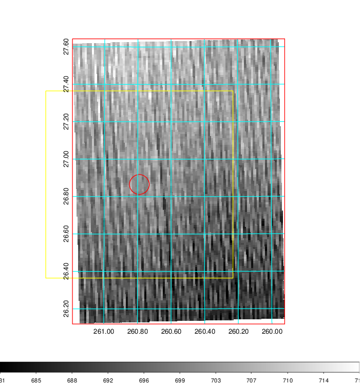
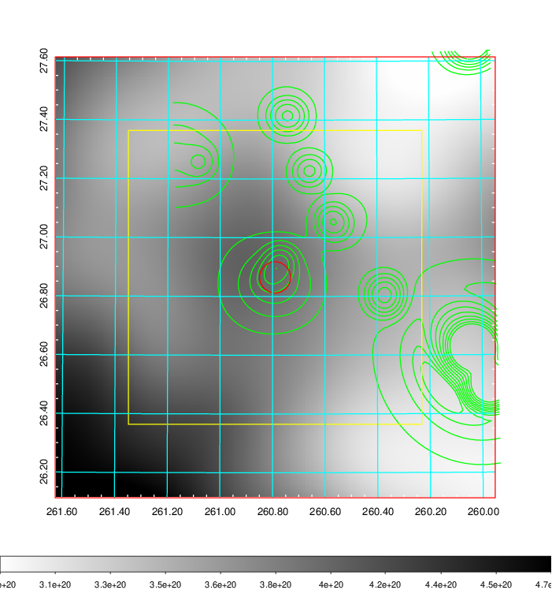
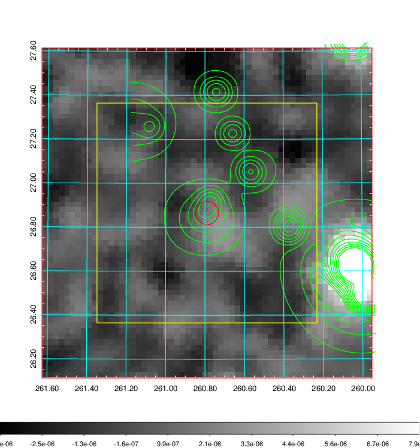
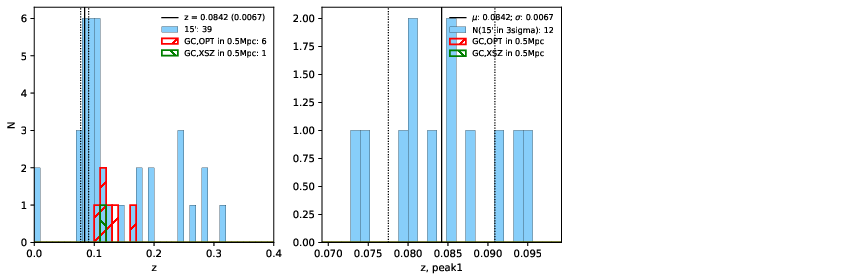
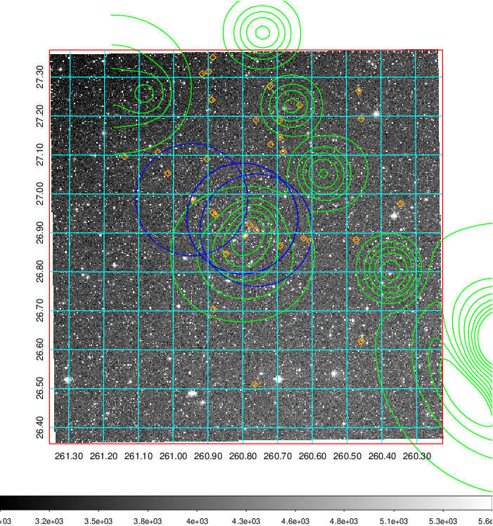
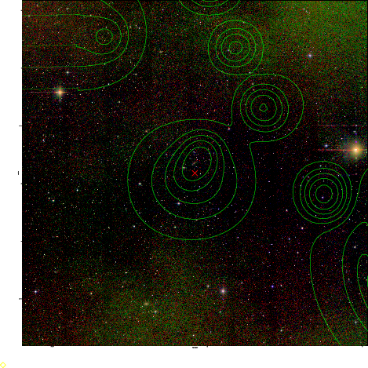
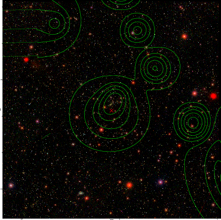

### 717

|Name|RAJ2000[deg]|DEJ2000[deg] |Ext[arcmin]| Ext,ml | z | z_src| C|GC(XSZ,Delta_z<0.01)| GC(OPT,Delta_z<0.01)|GC| R_sig[arcmin] | R500[arcmin] | R500[Mpc]| CRsig[c/s] | CR500[c/s] |L500[1E44 erg/s]|F500[1E-12 erg/s/cm^2]| M500[1E14 Msun]|Tx[keV]|Cnt_sig|Beta|Rc[arcmin]|Comment|Alias|
|---|---|---|---|---|---|------|---|--------|---------|----------|---|---|---|---|---|---|---|---|---|---|---|---|---|---|
|717| 260.790| 26.865| 3.19| 42.54| 0.1035(0.000)| z_opt| S| -| W| A, C, F20, N, W| 11.238| 7.204| 0.822| 0.129(0.026)| 0.122(0.025)| 0.599(0.067)| 2.195(0.247)| 1.74(0.10)| 3.12(0.11)| 90.6| 0.912(-0.105+0.063)| 5.188(-0.720+0.561)| -| t141|

|[RASS image](../image/717/717_img.pdf)|[filtered image](../image/717/717_fil.pdf)|[Segment image](../image/717/717_seg.pdf)|
|-------------------|--------------------|-------------------|
|   |    |   |

|[Exposure image](../image/717/717_mex.pdf)| [nH image](../image/717/717_nh.pdf)| [Planck image](../image/717/717_p.pdf)|
|-------------------|--------------------|-------------------|
|   |     |  |

|[Redshift Histogram](../image/717/717_zg.pdf) | [DSS image(z1)](../image/717/717_dss_z1.pdf)      |  [DSS image(z2)](../image/717/717_dss_z2.pdf)    |
|-------------------|--------------------|-------------------|
| |  Blue circle for optical clusters;  Magenta circle for XSZ clusters;  all with r=1Mpc;  Only GC with Delta_z<0.01 are shown. |  Blue circle for optical clusters;  Magenta circle for XSZ clusters;  all with r=1Mpc;  Only GC with Delta_z<0.01 are shown.  |

|[Previous-identified clusters](../image/717/717_gc.pdf) | [2MASS image](../image/717/717_2mass.pdf)      |[SDSS image](../image/717/717_sdss.pdf)   |
|-------------------|-------------------|-------------------|
|  Green, magenta, and blue circles  for optical, X-ray and SZ clusters  respectively, with redshift of clusters  labelled. The radius of circles  are 1Mpc.|  |   |

