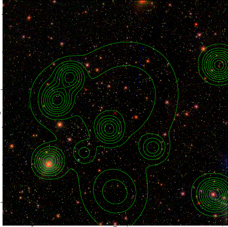

### 718

|Name|RAJ2000[deg]|DEJ2000[deg] |Ext[arcmin]| Ext,ml | z | z_src| C|GC(XSZ,Delta_z<0.01)| GC(OPT,Delta_z<0.01)|GC| R_sig[arcmin] | R500[arcmin] | R500[Mpc]| CRsig[c/s] | CR500[c/s] |L500[1E44 erg/s]|F500[1E-12 erg/s/cm^2]| M500[1E14 Msun]|Tx[keV]|Cnt_sig|Beta|Rc[arcmin]|Comment|Alias|
|---|---|---|---|---|---|------|---|--------|---------|----------|---|---|---|---|---|---|---|---|---|---|---|---|---|---|
|718| 260.814| 32.898| 2.36| 34.66| 0.2265(0.005)| z2,| G| -| -| C, F20, N, W| 24.700| 5.273| 1.149| 0.171(0.051)| 0.151(0.045)| 4.441(4.751)| 2.922(3.127)| 5.42(2.73)| 6.54(2.11)| 222.1| 0.947(-0.073+0.040)| 15.596(-1.361+1.168)| -| t084|

|[RASS image](../image/718/718_img.pdf)|[filtered image](../image/718/718_fil.pdf)|[Segment image](../image/718/718_seg.pdf)|
|-------------------|--------------------|-------------------|
|   |    |   |

|[Exposure image](../image/718/718_mex.pdf)| [nH image](../image/718/718_nh.pdf)| [Planck image](../image/718/718_p.pdf)|
|-------------------|--------------------|-------------------|
|   |     |  |

|[Redshift Histogram](../image/718/718_zg.pdf) | [DSS image(z1)](../image/718/718_dss_z1.pdf)      |  [DSS image(z2)](../image/718/718_dss_z2.pdf)    |
|-------------------|--------------------|-------------------|
| |  Blue circle for optical clusters;  Magenta circle for XSZ clusters;  all with r=1Mpc;  Only GC with Delta_z<0.01 are shown. |  Blue circle for optical clusters;  Magenta circle for XSZ clusters;  all with r=1Mpc;  Only GC with Delta_z<0.01 are shown.  |

|[known Abell/XSZ clusters](../image/718/718_gc.pdf) | [2MASS image](../image/718/718_2mass.pdf)      |[SDSS image](../image/718/718_sdss.pdf)   |
|-------------------|-------------------|-------------------|
|  Magenta, blue and green circles  for optical, X-ray and SZ clusters  respectively, with redshift of clusters  labelled. The radius of circles  are 1Mpc.|  |   |

