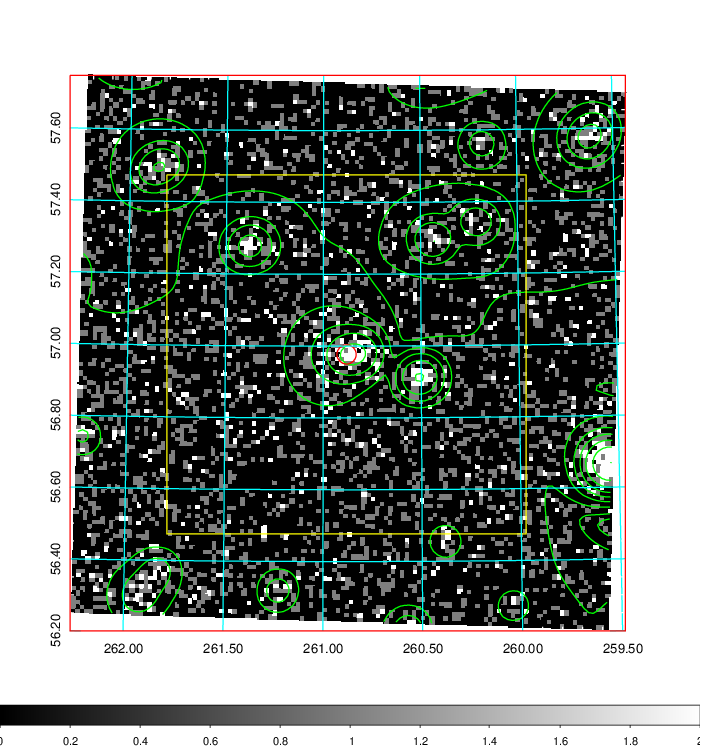
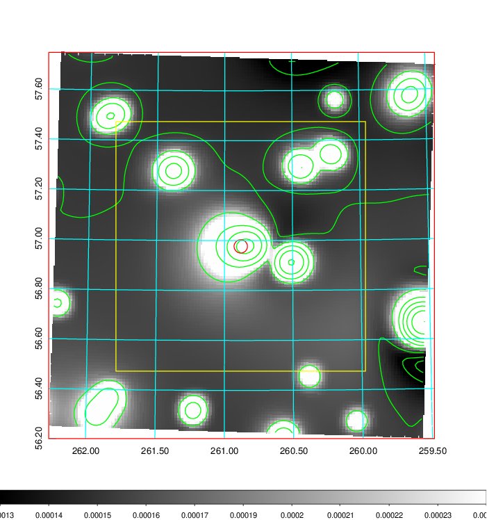
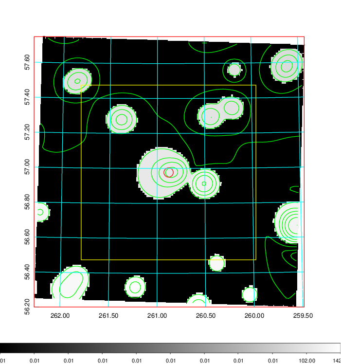
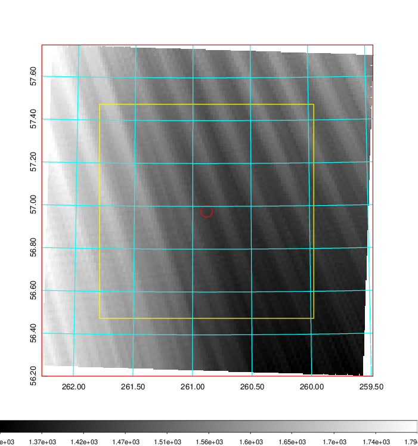
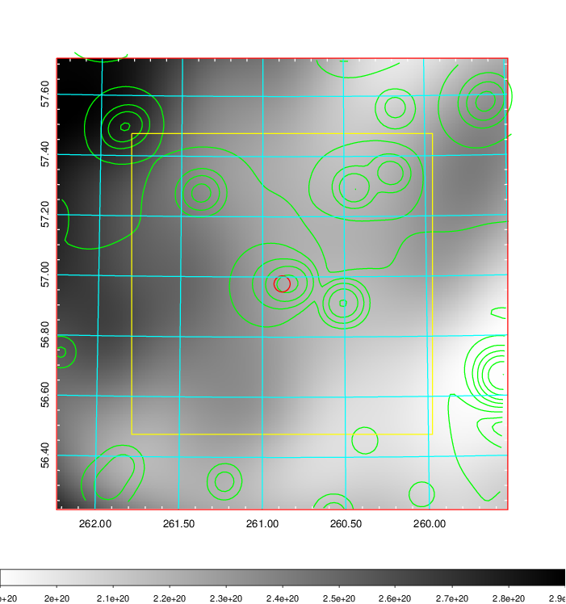
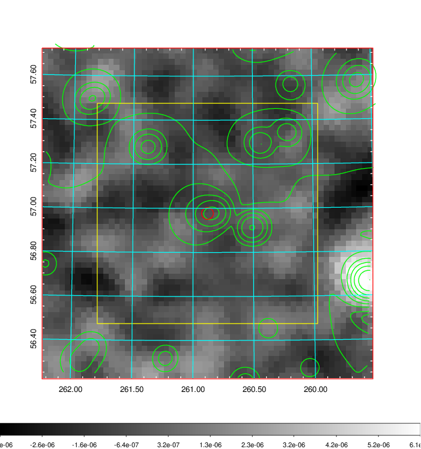
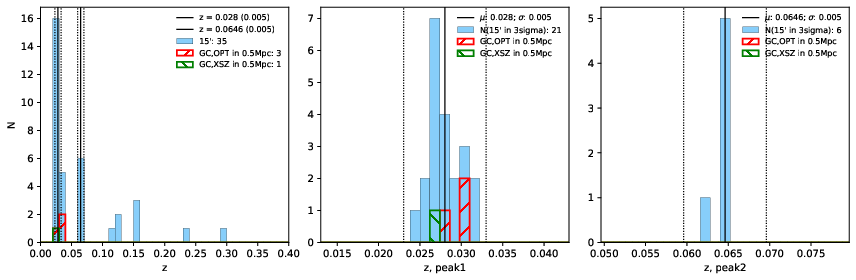
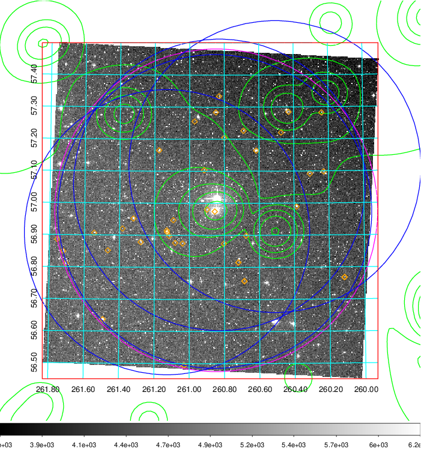
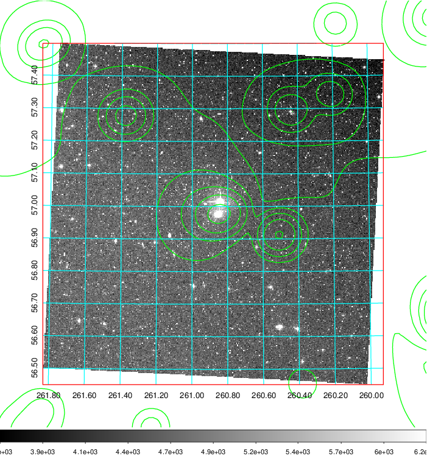
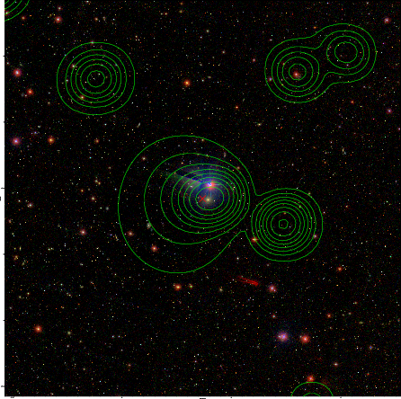

### 719

|Name|RAJ2000[deg]|DEJ2000[deg] |Ext[arcmin]| Ext,ml | z | z_src| C|GC(XSZ,Delta_z<0.01)| GC(OPT,Delta_z<0.01)|GC| R_sig[arcmin] | R500[arcmin] | R500[Mpc]| CRsig[c/s] | CR500[c/s] |L500[1E44 erg/s]|F500[1E-12 erg/s/cm^2]| M500[1E14 Msun]|Tx[keV]|Cnt_sig|Beta|Rc[arcmin]|Comment|Alias|
|---|---|---|---|---|---|------|---|--------|---------|----------|---|---|---|---|---|---|---|---|---|---|---|---|---|---|
|719| 260.881| 56.977| 1.61| 40.75| 0.0280(0.005)| z1, z_xsz| B| MCXC| N| C, MCXC, N, W| 19.269| 14.157| 0.477| 0.135(0.031)| 0.129(0.029)| 0.032(0.005)| 1.768(0.295)| 0.32(0.03)| 1.06(0.06)| 225.1| 0.657(-0.053+0.070)| 2.982(-0.575+0.684)| -| k140|

|[RASS image](../image/719/719_img.pdf)|[filtered image](../image/719/719_fil.pdf)|[Segment image](../image/719/719_seg.pdf)|
|-------------------|--------------------|-------------------|
|   |    |   |

|[Exposure image](../image/719/719_mex.pdf)| [nH image](../image/719/719_nh.pdf)| [Planck image](../image/719/719_p.pdf)|
|-------------------|--------------------|-------------------|
|   |     |  |

|[Redshift Histogram](../image/719/719_zg.pdf) | [DSS image(z1)](../image/719/719_dss_z1.pdf)      |  [DSS image(z2)](../image/719/719_dss_z2.pdf)    |
|-------------------|--------------------|-------------------|
| |  Blue circle for optical clusters;  Magenta circle for XSZ clusters;  all with r=1Mpc;  Only GC with Delta_z<0.01 are shown. |  Blue circle for optical clusters;  Magenta circle for XSZ clusters;  all with r=1Mpc;  Only GC with Delta_z<0.01 are shown.  |

|[Previous-identified clusters](../image/719/719_gc.pdf) | [2MASS image](../image/719/719_2mass.pdf)      |[SDSS image](../image/719/719_sdss.pdf)   |
|-------------------|-------------------|-------------------|
|  Green, magenta, and blue circles  for optical, X-ray and SZ clusters  respectively, with redshift of clusters  labelled. The radius of circles  are 1Mpc.|  |   |

