

### 72

|Name|RAJ2000[deg]|DEJ2000[deg] |Ext[arcmin]| Ext,ml | z | z_src| C|GC(XSZ,Delta_z<0.01)| GC(OPT,Delta_z<0.01)|GC| R_sig[arcmin] | R500[arcmin] | R500[Mpc]| CRsig[c/s] | CR500[c/s] |L500[1E44 erg/s]|F500[1E-12 erg/s/cm^2]| M500[1E14 Msun]|Tx[keV]|Cnt_sig|Beta|Rc[arcmin]|Comment|Alias|
|---|---|---|---|---|---|------|---|--------|---------|----------|---|---|---|---|---|---|---|---|---|---|---|---|---|---|
|72| 21.396| 1.768| 2.99| 92.22| 0.0181(0.005)| z1, z_xsz| B| MCXC, XB| N| A, F20, MCXC, N, W, XB| 31.119| 23.344| 0.515| 0.449(0.061)| 0.429(0.059)| 0.044(0.004)| 5.996(0.564)| 0.40(0.02)| 1.21(0.04)| 259.0| 0.534(-0.020+0.027)| 2.663(-0.366+0.456)| -| k376|

|[RASS image](../image/72/72_img.pdf)|[filtered image](../image/72/72_fil.pdf)|[Segment image](../image/72/72_seg.pdf)|
|-------------------|--------------------|-------------------|
| 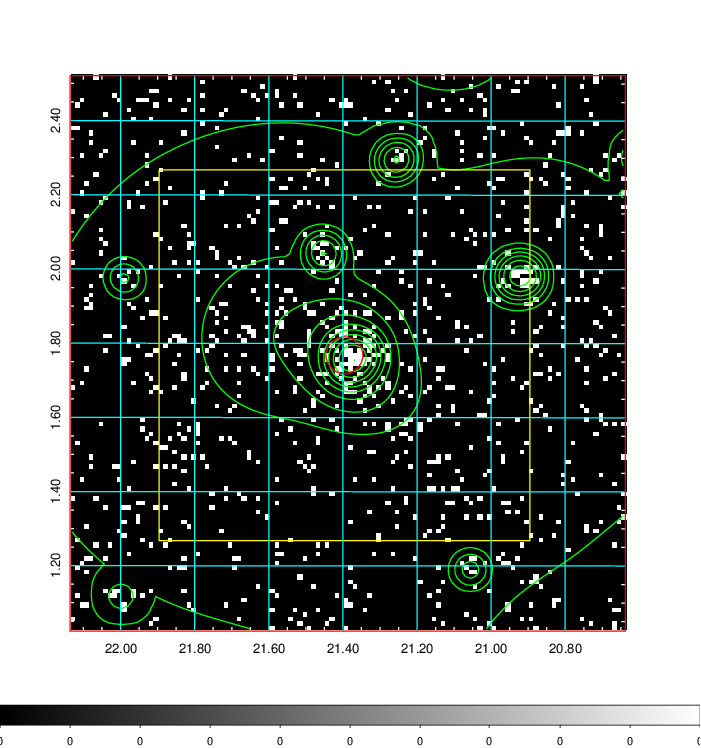  | 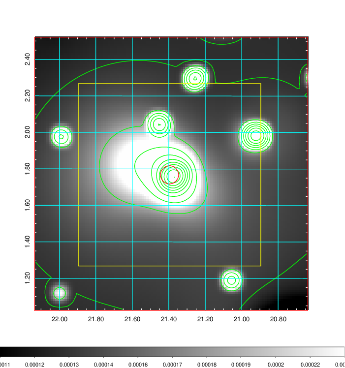   | 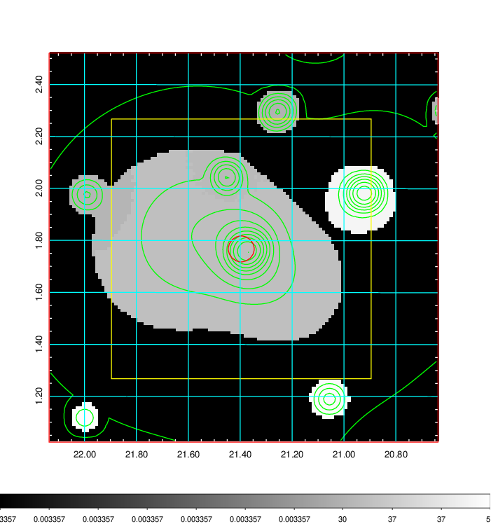  |

|[Exposure image](../image/72/72_mex.pdf)| [nH image](../image/72/72_nh.pdf)| [Planck image](../image/72/72_p.pdf)|
|-------------------|--------------------|-------------------|
|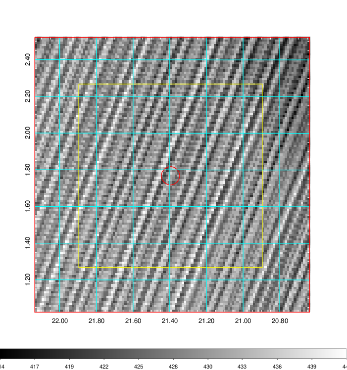   | 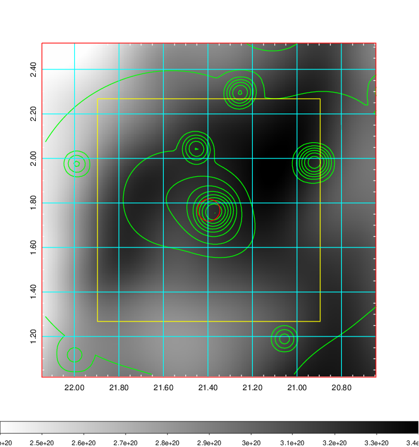    | 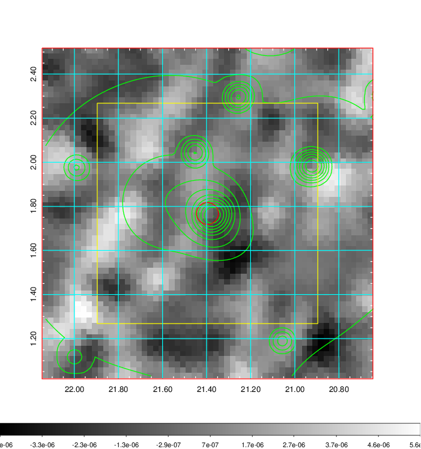 |

|[Redshift Histogram](../image/72/72_zg.pdf) | [DSS image(z1)](../image/72/72_dss_z1.pdf)      |  [DSS image(z2)](../image/72/72_dss_z2.pdf)    |
|-------------------|--------------------|-------------------|
|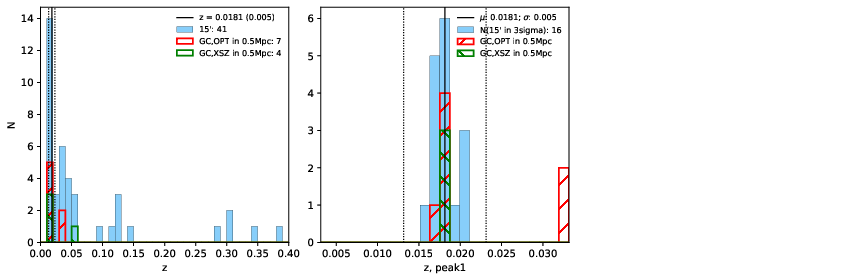 |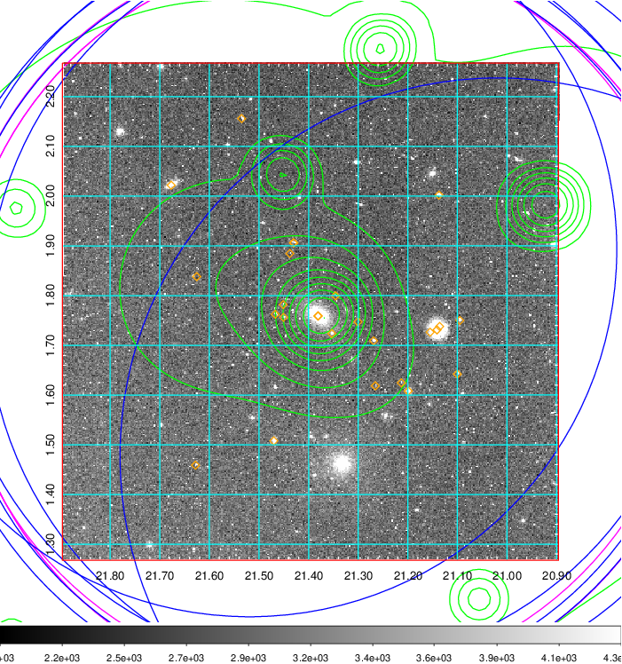  Blue circle for optical clusters;  Magenta circle for XSZ clusters;  all with r=1Mpc;  Only GC with Delta_z<0.01 are shown. | 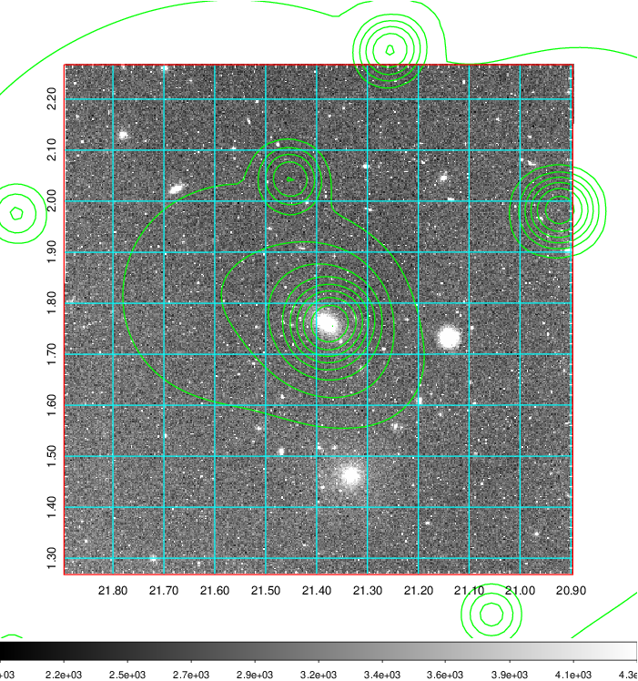 Blue circle for optical clusters;  Magenta circle for XSZ clusters;  all with r=1Mpc;  Only GC with Delta_z<0.01 are shown.  |

|[known Abell/XSZ clusters](../image/72/72_gc.pdf) | [2MASS image](../image/72/72_2mass.pdf)      |[SDSS image](../image/72/72_sdss.pdf)   |
|-------------------|-------------------|-------------------|
|  Magenta, blue and green circles  for optical, X-ray and SZ clusters  respectively, with redshift of clusters  labelled. The radius of circles  are 1Mpc.|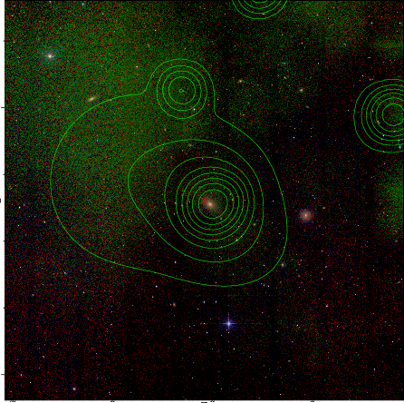  | 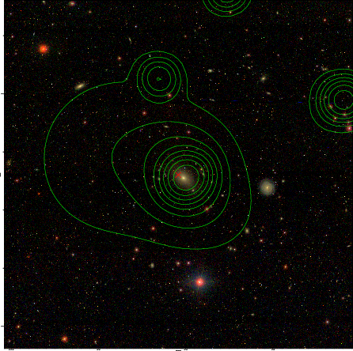  |

|[DES image](../image/72/72_des.pdf)   |
|-------------------|
|   |
