

### 720

|Name|RAJ2000[deg]|DEJ2000[deg] |Ext[arcmin]| Ext,ml | z | z_src| C|GC(XSZ,Delta_z<0.01)| GC(OPT,Delta_z<0.01)|GC| R_sig[arcmin] | R500[arcmin] | R500[Mpc]| CRsig[c/s] | CR500[c/s] |L500[1E44 erg/s]|F500[1E-12 erg/s/cm^2]| M500[1E14 Msun]|Tx[keV]|Cnt_sig|Beta|Rc[arcmin]|Comment|Alias|
|---|---|---|---|---|---|------|---|--------|---------|----------|---|---|---|---|---|---|---|---|---|---|---|---|---|---|
|720| 260.977| 85.882| 1.38| 105.25| 0.1681(0.005)| z1, z_xsz| B| MCXC, PSZ2, Tar| A| A, MCXC, PSZ2, Tar, W| 6.850| 6.570| 1.132| 0.219(0.022)| 0.217(0.022)| 3.084(0.113)| 3.946(0.145)| 4.87(0.09)| 6.00(0.07)| 235.4| 0.935(-0.077+0.047)| 3.209(-0.361+0.259)| -| k092|

|[RASS image](../image/720/720_img.pdf)|[filtered image](../image/720/720_fil.pdf)|[Segment image](../image/720/720_seg.pdf)|
|-------------------|--------------------|-------------------|
| 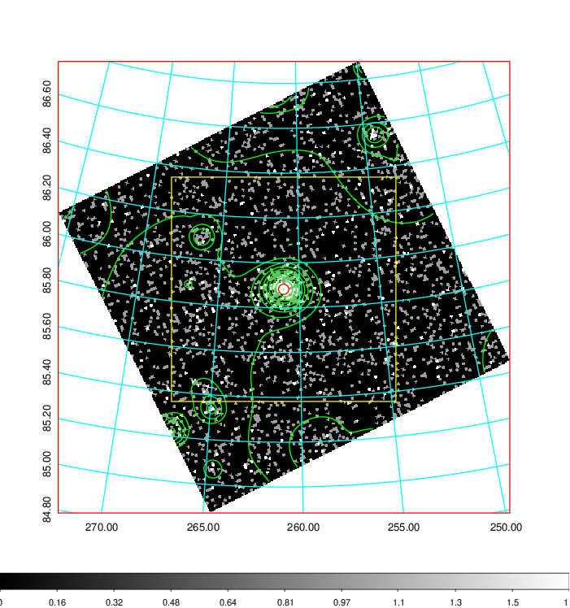  | 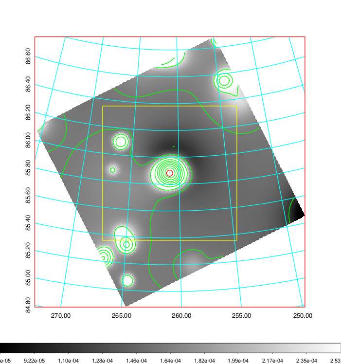   | 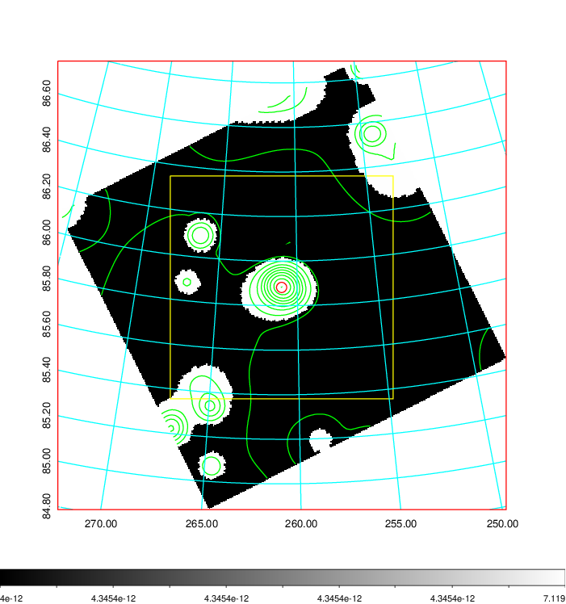  |

|[Exposure image](../image/720/720_mex.pdf)| [nH image](../image/720/720_nh.pdf)| [Planck image](../image/720/720_p.pdf)|
|-------------------|--------------------|-------------------|
|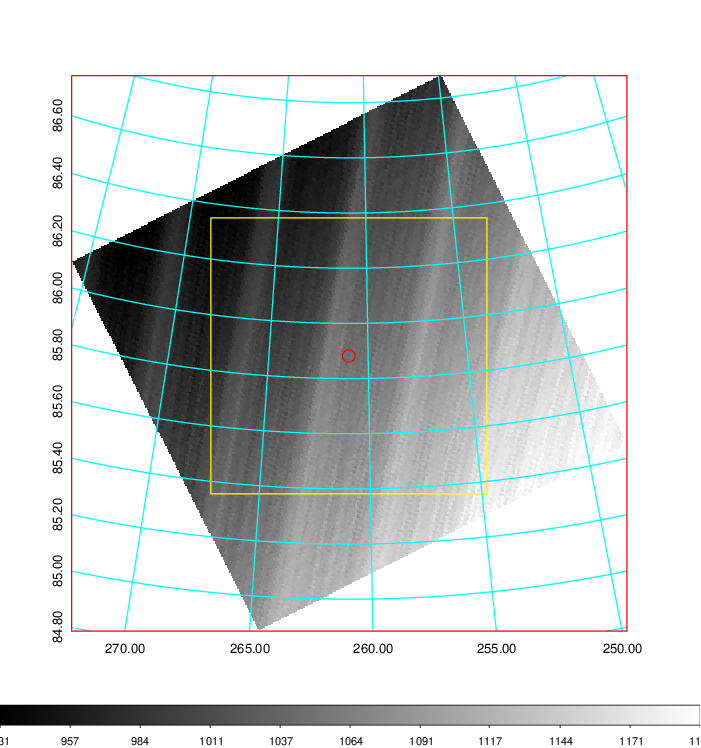   | 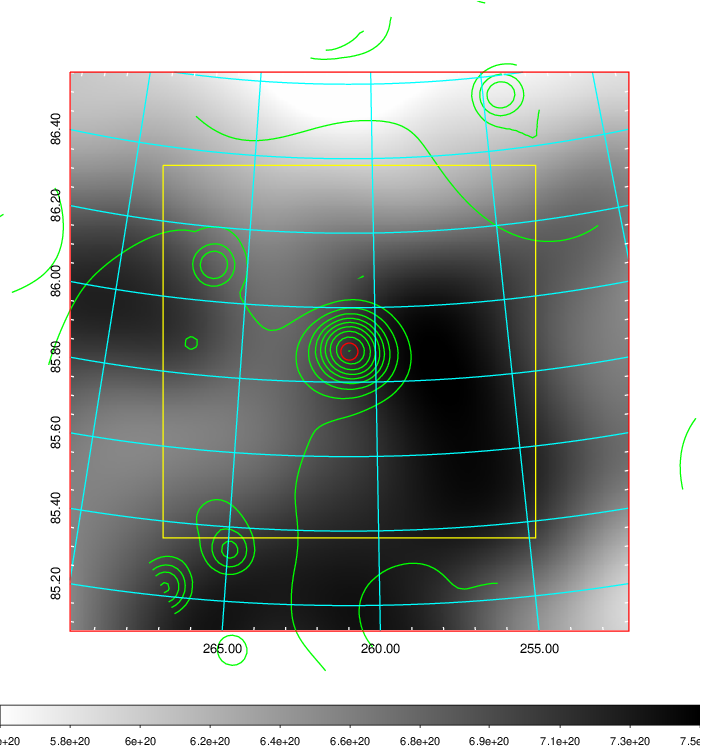    | 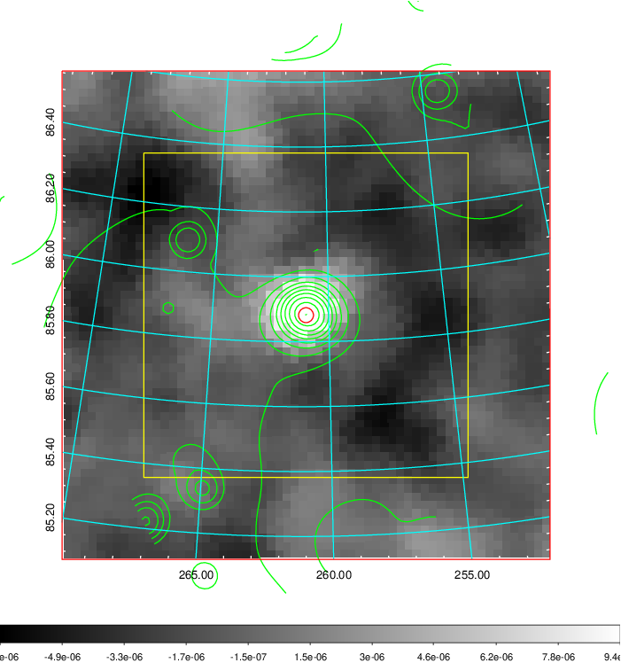 |

|[Redshift Histogram](../image/720/720_zg.pdf) | [DSS image(z1)](../image/720/720_dss_z1.pdf)      |  [DSS image(z2)](../image/720/720_dss_z2.pdf)    |
|-------------------|--------------------|-------------------|
|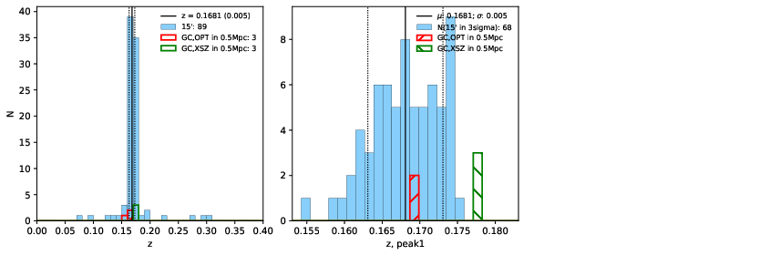 |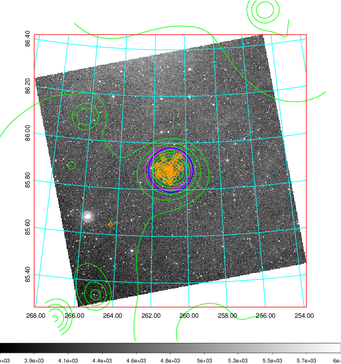  Blue circle for optical clusters;  Magenta circle for XSZ clusters;  all with r=1Mpc;  Only GC with Delta_z<0.01 are shown. | 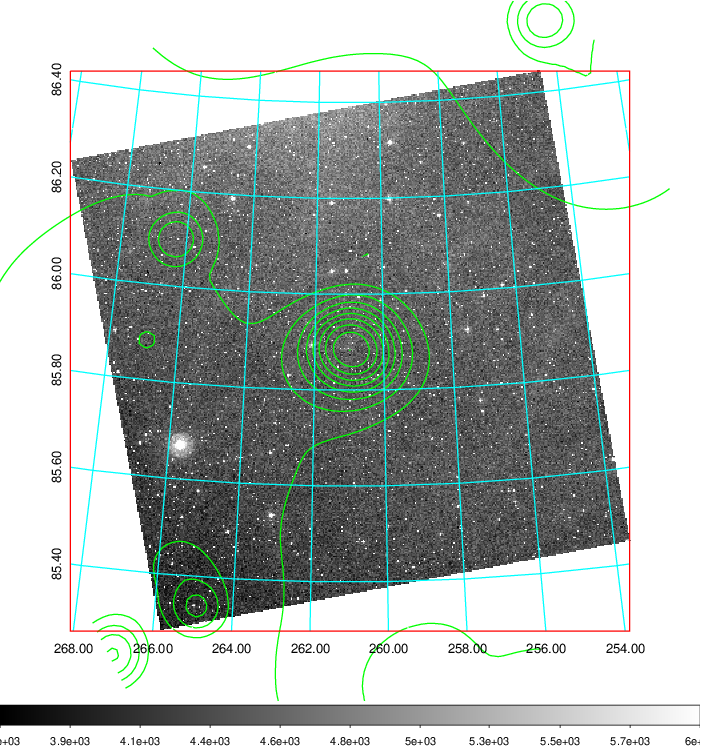 Blue circle for optical clusters;  Magenta circle for XSZ clusters;  all with r=1Mpc;  Only GC with Delta_z<0.01 are shown.  |

|[Previous-identified clusters](../image/720/720_gc.pdf) | [2MASS image](../image/720/720_2mass.pdf)      |
|-------------------|-------------------|
|  Green, magenta, and blue circles  for optical, X-ray and SZ clusters  respectively, with redshift of clusters  labelled. The radius of circles  are 1Mpc.|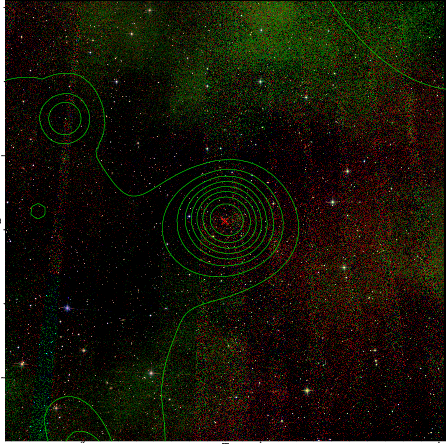  |

|[PS1 image](../image/720/720_ps1.pdf)            |
|-------------------|
| 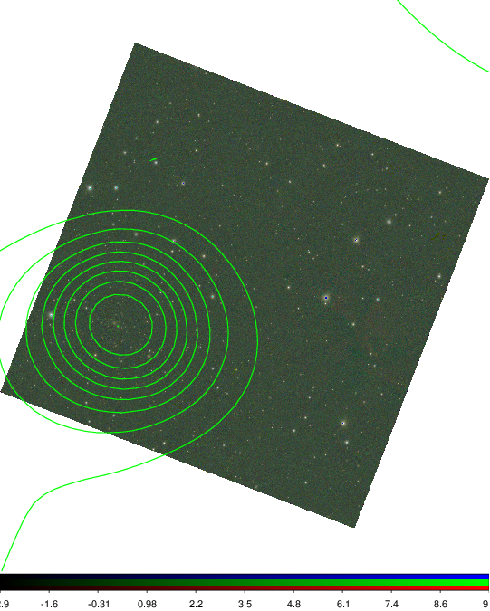  |
