

### 721

|Name|RAJ2000[deg]|DEJ2000[deg] |Ext[arcmin]| Ext,ml | z | z_src| C|GC(XSZ,Delta_z<0.01)| GC(OPT,Delta_z<0.01)|GC| R_sig[arcmin] | R500[arcmin] | R500[Mpc]| CRsig[c/s] | CR500[c/s] |L500[1E44 erg/s]|F500[1E-12 erg/s/cm^2]| M500[1E14 Msun]|Tx[keV]|Cnt_sig|Beta|Rc[arcmin]|Comment|Alias|
|---|---|---|---|---|---|------|---|--------|---------|----------|---|---|---|---|---|---|---|---|---|---|---|---|---|---|
|721| 261.020| 69.984| 1.92| 28.94| 0.0388(0.005)| z1, z_xsz| B| MCXC| N| MCXC, N, W| 13.188| 8.268| 0.381| 0.019(0.009)| 0.018(0.008)| 0.009(0.002)| 0.244(0.059)| 0.16(0.02)| 0.71(0.06)| 108.7| 0.929(-0.091+0.051)| 3.241(-0.464+0.393)| -| k200|

|[RASS image](../image/721/721_img.pdf)|[filtered image](../image/721/721_fil.pdf)|[Segment image](../image/721/721_seg.pdf)|
|-------------------|--------------------|-------------------|
| 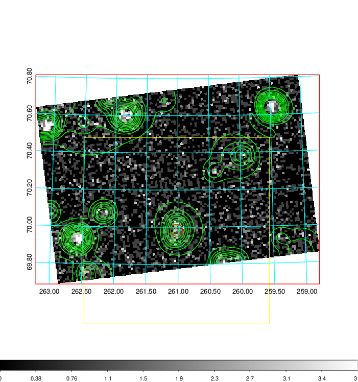  | 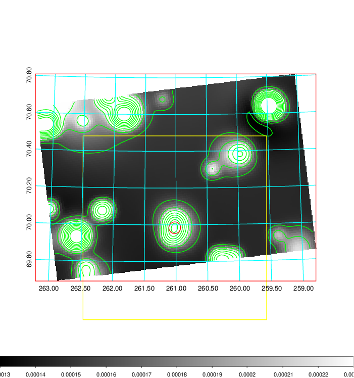   | 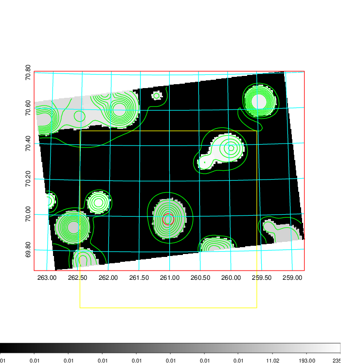  |

|[Exposure image](../image/721/721_mex.pdf)| [nH image](../image/721/721_nh.pdf)| [Planck image](../image/721/721_p.pdf)|
|-------------------|--------------------|-------------------|
|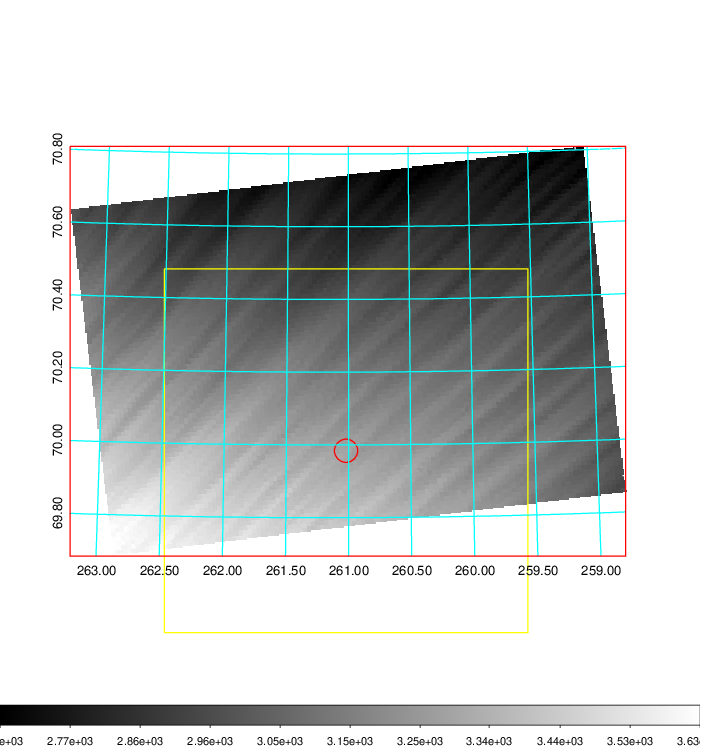   | 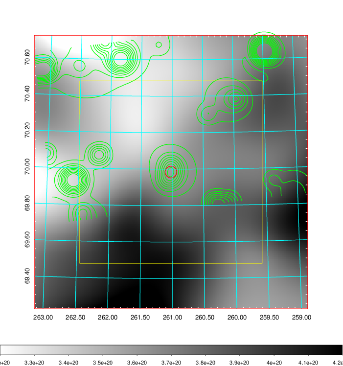    | 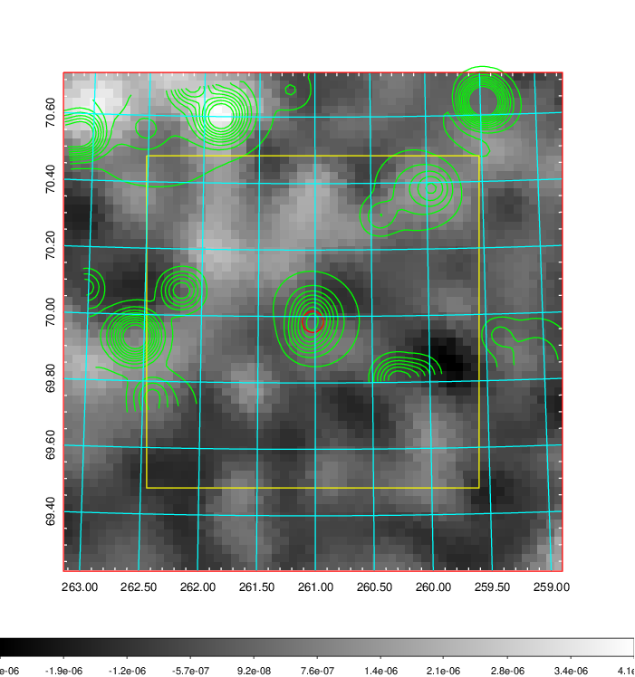 |

|[Redshift Histogram](../image/721/721_zg.pdf) | [DSS image(z1)](../image/721/721_dss_z1.pdf)      |  [DSS image(z2)](../image/721/721_dss_z2.pdf)    |
|-------------------|--------------------|-------------------|
|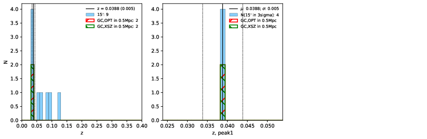 |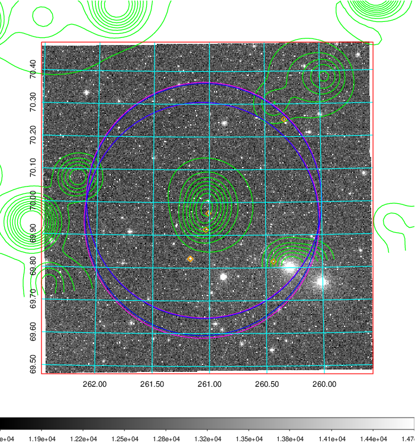  Blue circle for optical clusters;  Magenta circle for XSZ clusters;  all with r=1Mpc;  Only GC with Delta_z<0.01 are shown. | 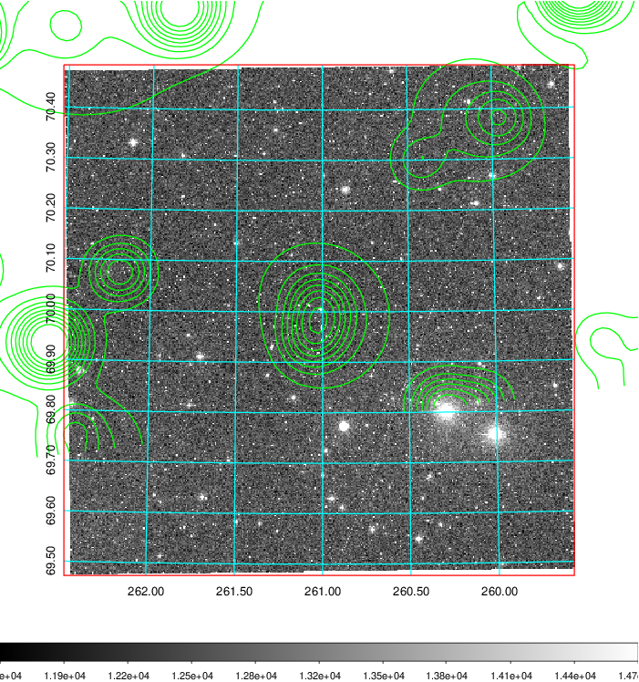 Blue circle for optical clusters;  Magenta circle for XSZ clusters;  all with r=1Mpc;  Only GC with Delta_z<0.01 are shown.  |

|[known Abell/XSZ clusters](../image/721/721_gc.pdf) | [2MASS image](../image/721/721_2mass.pdf)      |[SDSS image](../image/721/721_sdss.pdf)   |
|-------------------|-------------------|-------------------|
|  Magenta, blue and green circles  for optical, X-ray and SZ clusters  respectively, with redshift of clusters  labelled. The radius of circles  are 1Mpc.|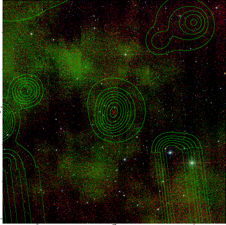  | 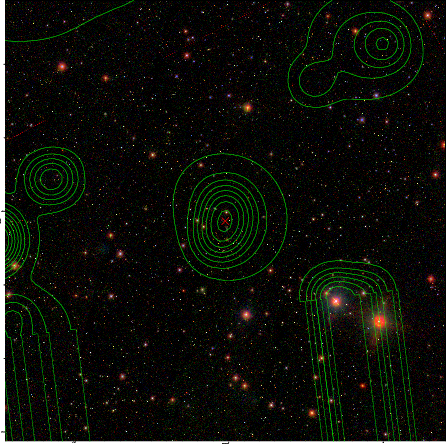  |

