

### 722

|Name|RAJ2000[deg]|DEJ2000[deg] |Ext[arcmin]| Ext,ml | z | z_src| C|GC(XSZ,Delta_z<0.01)| GC(OPT,Delta_z<0.01)|GC| R_sig[arcmin] | R500[arcmin] | R500[Mpc]| CRsig[c/s] | CR500[c/s] |L500[1E44 erg/s]|F500[1E-12 erg/s/cm^2]| M500[1E14 Msun]|Tx[keV]|Cnt_sig|Beta|Rc[arcmin]|Comment|Alias|
|---|---|---|---|---|---|------|---|--------|---------|----------|---|---|---|---|---|---|---|---|---|---|---|---|---|---|
|722| 261.854| 70.603| 1.54| 37.80| 0.3059(0.000)| z_xsz| B| MCXC, PSZ2, Tar| N| MCXC, N, PSZ2, Tar, W| 12.700| 3.683| 0.998| 0.054(0.012)| 0.048(0.011)| 2.861(0.391)| 0.948(0.130)| 3.87(0.25)| 5.46(0.22)| 249.1| 0.850(-0.131+0.103)| 3.240(-0.711+0.529)| -| k123|

|[RASS image](../image/722/722_img.pdf)|[filtered image](../image/722/722_fil.pdf)|[Segment image](../image/722/722_seg.pdf)|
|-------------------|--------------------|-------------------|
| 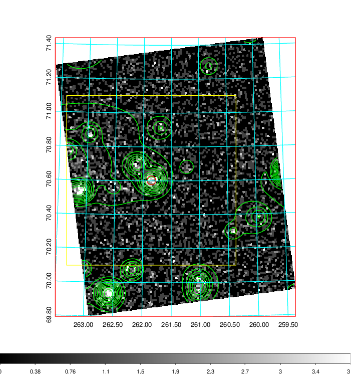  | 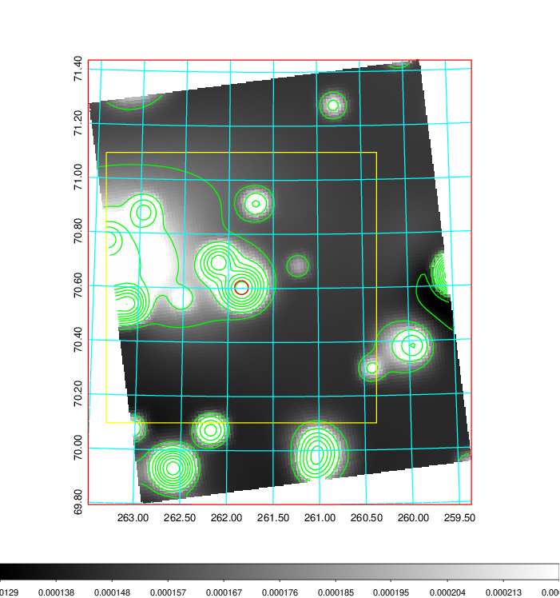   | 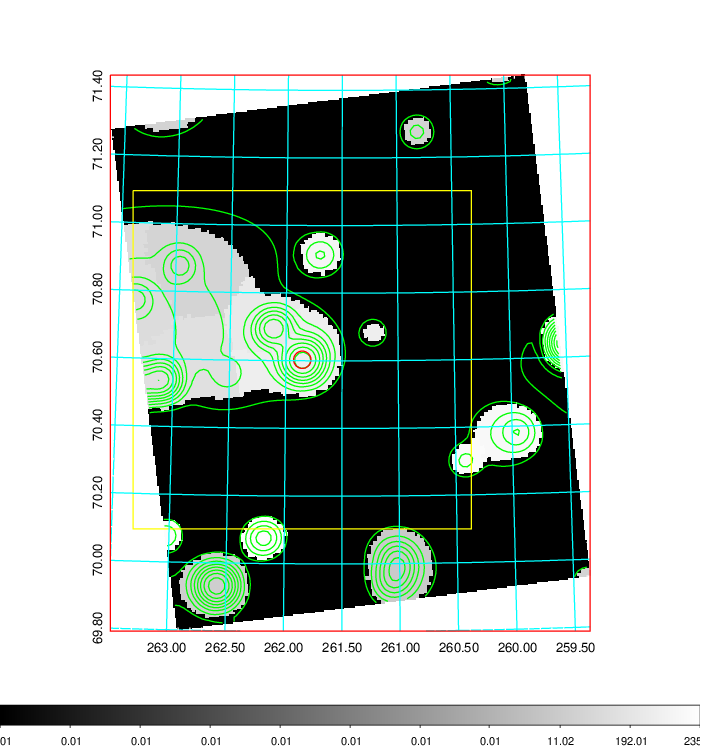  |

|[Exposure image](../image/722/722_mex.pdf)| [nH image](../image/722/722_nh.pdf)| [Planck image](../image/722/722_p.pdf)|
|-------------------|--------------------|-------------------|
|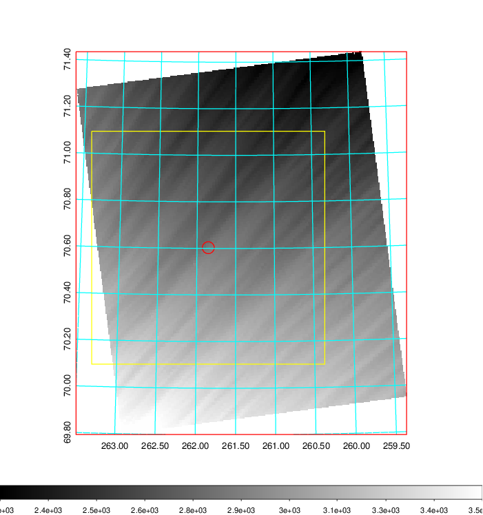   | 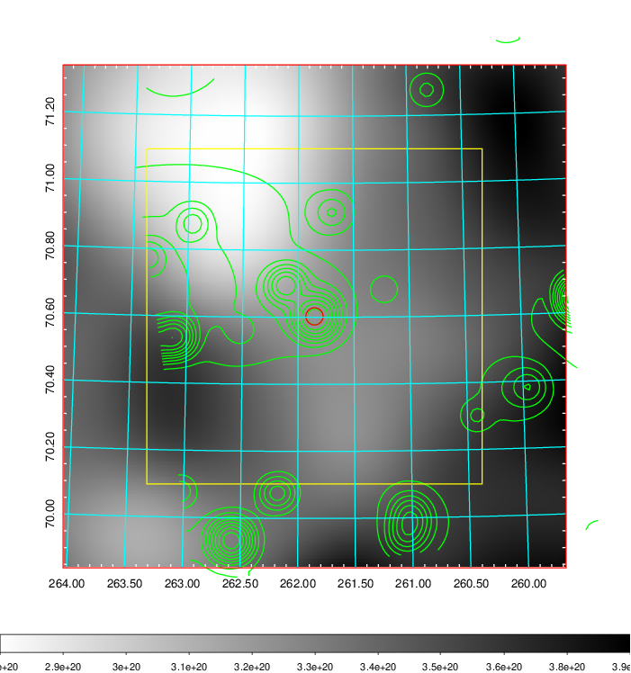    | 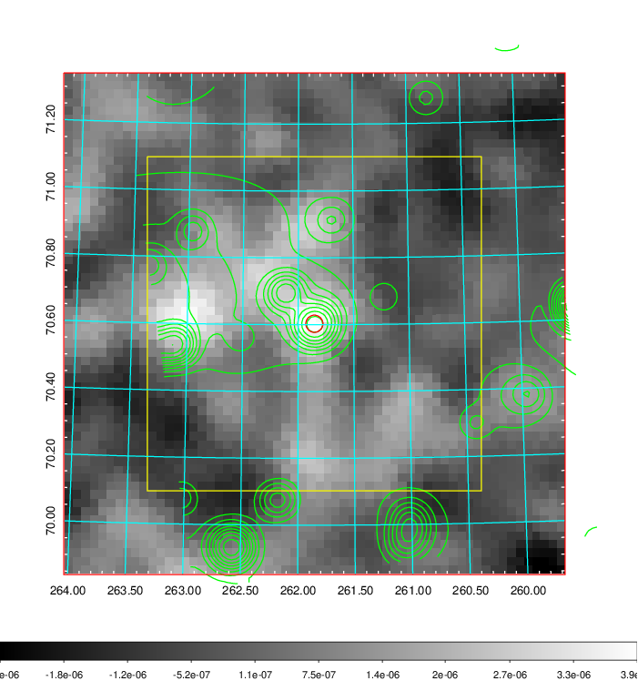 |

|[Redshift Histogram](../image/722/722_zg.pdf) | [DSS image(z1)](../image/722/722_dss_z1.pdf)      |  [DSS image(z2)](../image/722/722_dss_z2.pdf)    |
|-------------------|--------------------|-------------------|
|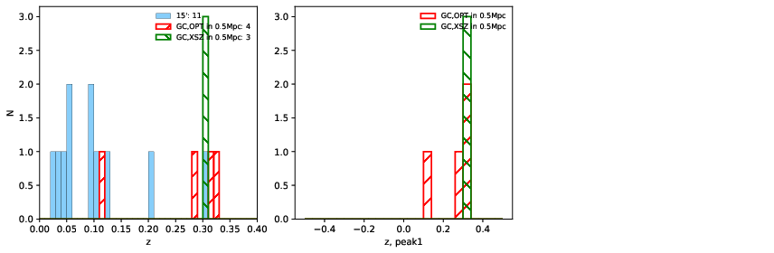 |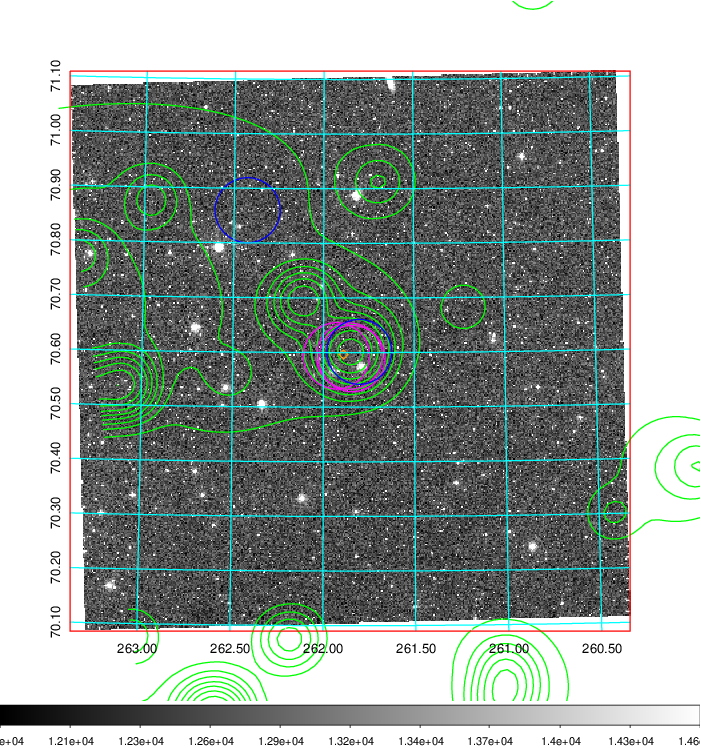  Blue circle for optical clusters;  Magenta circle for XSZ clusters;  all with r=1Mpc;  Only GC with Delta_z<0.01 are shown. | 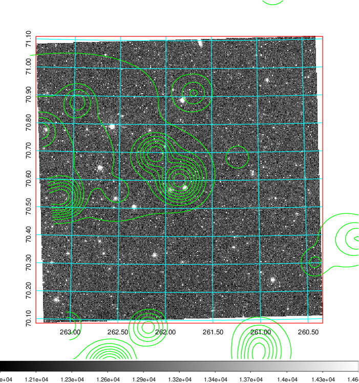 Blue circle for optical clusters;  Magenta circle for XSZ clusters;  all with r=1Mpc;  Only GC with Delta_z<0.01 are shown.  |

|[known Abell/XSZ clusters](../image/722/722_gc.pdf) | [2MASS image](../image/722/722_2mass.pdf)      |[SDSS image](../image/722/722_sdss.pdf)   |
|-------------------|-------------------|-------------------|
|  Magenta, blue and green circles  for optical, X-ray and SZ clusters  respectively, with redshift of clusters  labelled. The radius of circles  are 1Mpc.|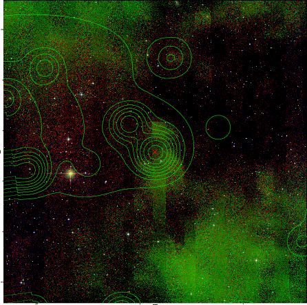  | 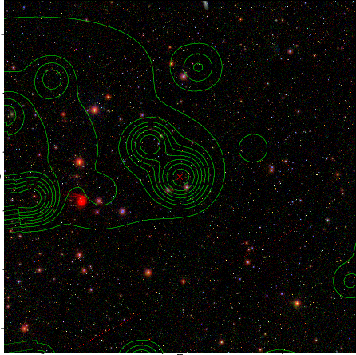  |

