

### 723

|Name|RAJ2000[deg]|DEJ2000[deg] |Ext[arcmin]| Ext,ml | z | z_src| C|GC(XSZ,Delta_z<0.01)| GC(OPT,Delta_z<0.01)|GC| R_sig[arcmin] | R500[arcmin] | R500[Mpc]| CRsig[c/s] | CR500[c/s] |L500[1E44 erg/s]|F500[1E-12 erg/s/cm^2]| M500[1E14 Msun]|Tx[keV]|Cnt_sig|Beta|Rc[arcmin]|Comment|Alias|
|---|---|---|---|---|---|------|---|--------|---------|----------|---|---|---|---|---|---|---|---|---|---|---|---|---|---|
|723| 262.124| 86.783| 2.48| 67.32| 0.0918(0.007)| z1, z_opt| S| -| W| N, Tar, W| 15.138| 8.375| 0.859| 0.195(0.023)| 0.182(0.022)| 0.688(0.055)| 3.254(0.260)| 1.97(0.08)| 3.34(0.08)| 187.2| 0.527(-0.020+0.041)| 2.151(-0.308+0.485)| An SZ cluster with no $z$ and offset = 0.11 Mpc| t091|

|[RASS image](../image/723/723_img.pdf)|[filtered image](../image/723/723_fil.pdf)|[Segment image](../image/723/723_seg.pdf)|
|-------------------|--------------------|-------------------|
| 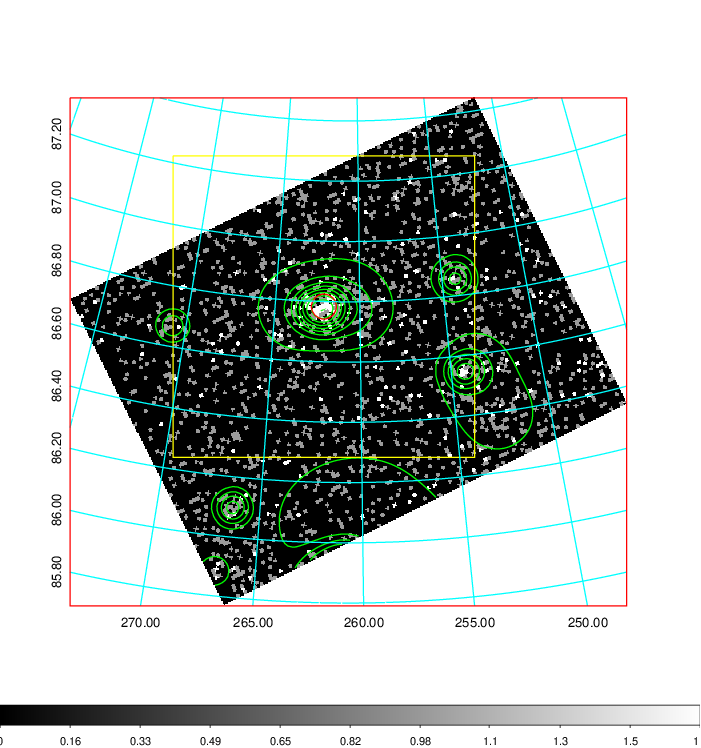  | 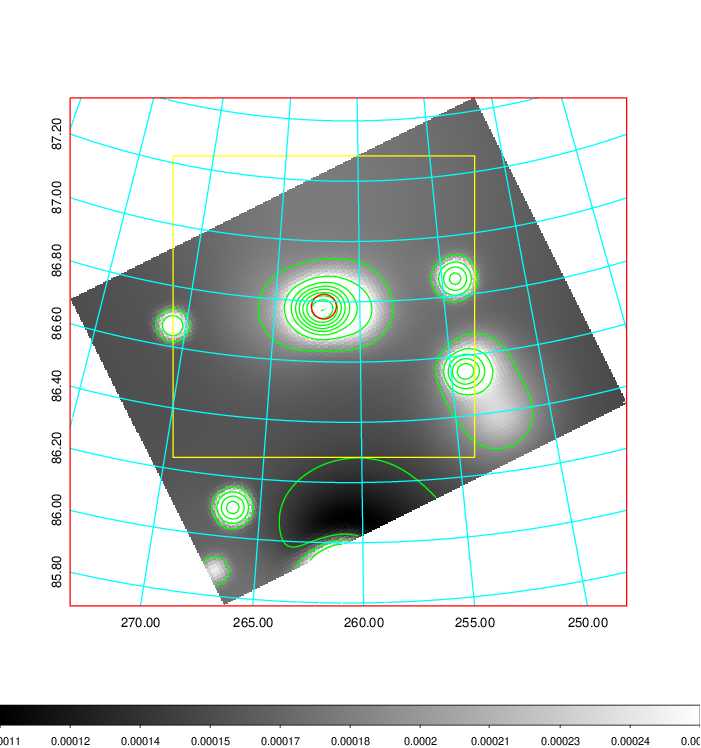   | 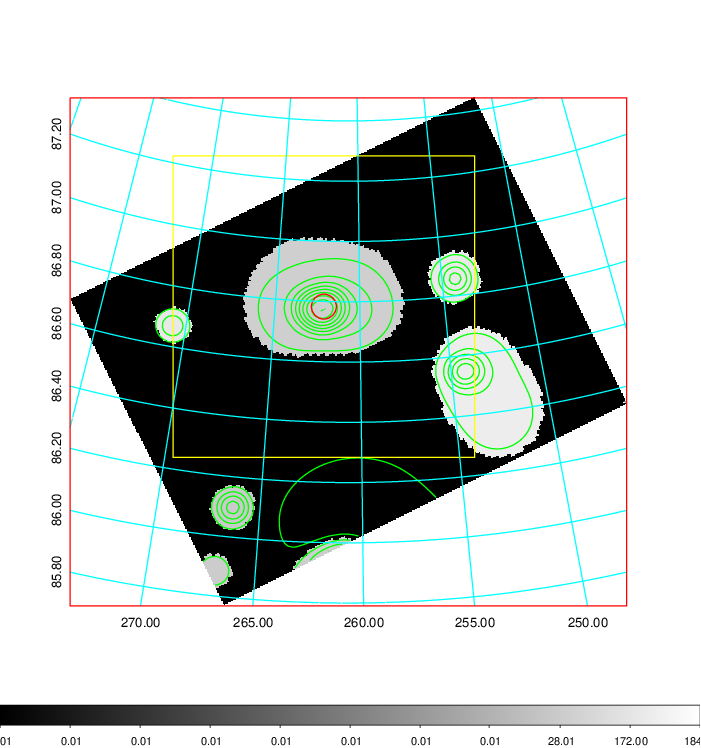  |

|[Exposure image](../image/723/723_mex.pdf)| [nH image](../image/723/723_nh.pdf)| [Planck image](../image/723/723_p.pdf)|
|-------------------|--------------------|-------------------|
|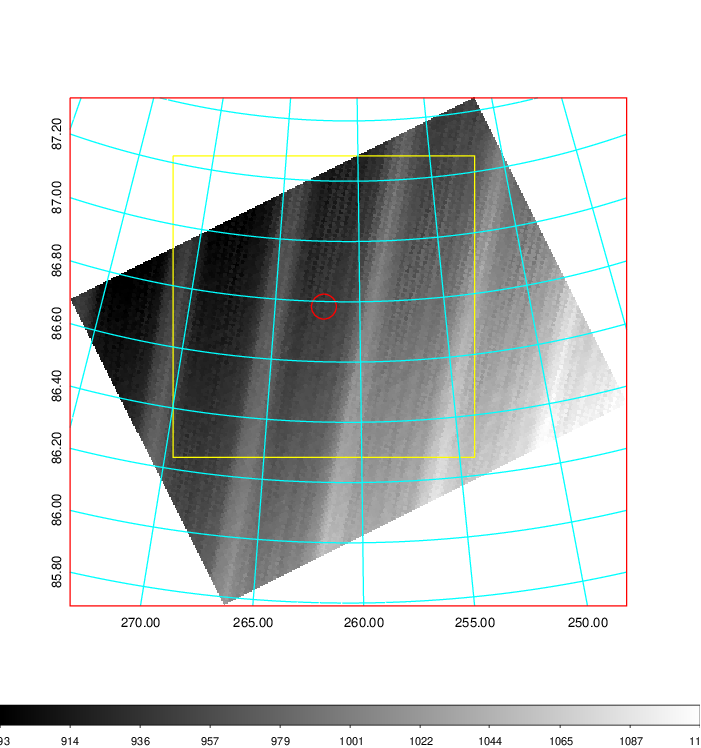   | 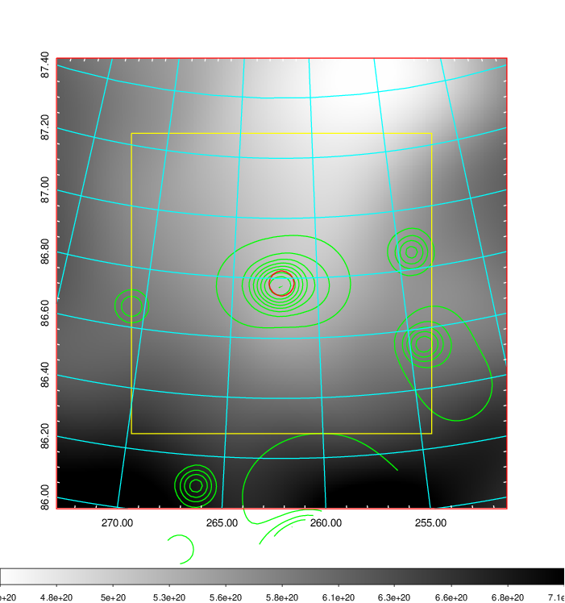    | 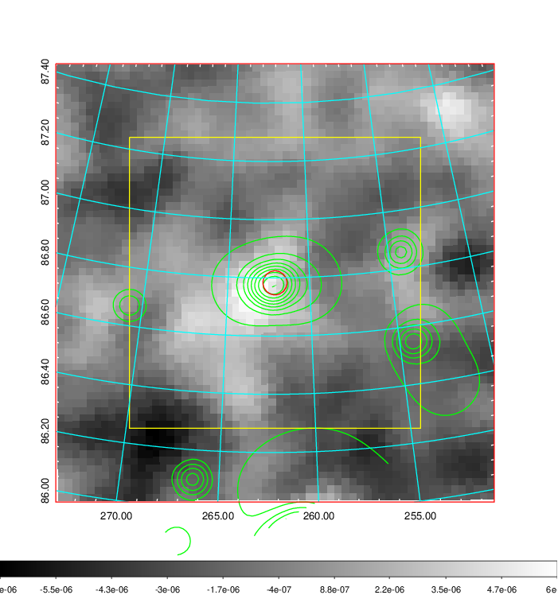 |

|[Redshift Histogram](../image/723/723_zg.pdf) | [DSS image(z1)](../image/723/723_dss_z1.pdf)      |  [DSS image(z2)](../image/723/723_dss_z2.pdf)    |
|-------------------|--------------------|-------------------|
|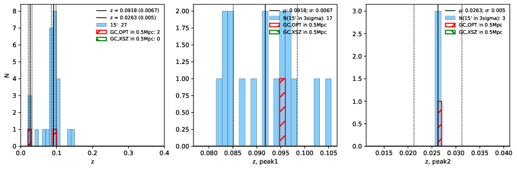 |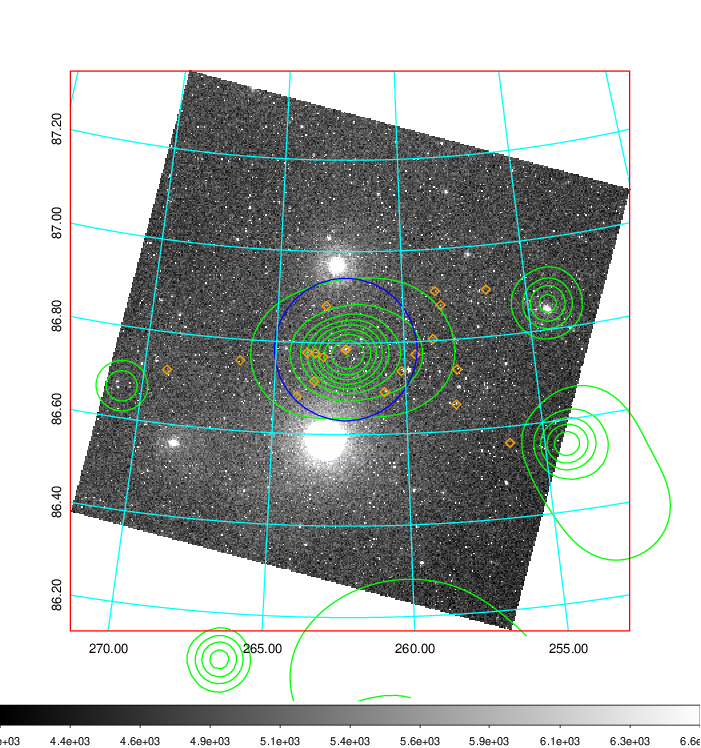  Blue circle for optical clusters;  Magenta circle for XSZ clusters;  all with r=1Mpc;  Only GC with Delta_z<0.01 are shown. | 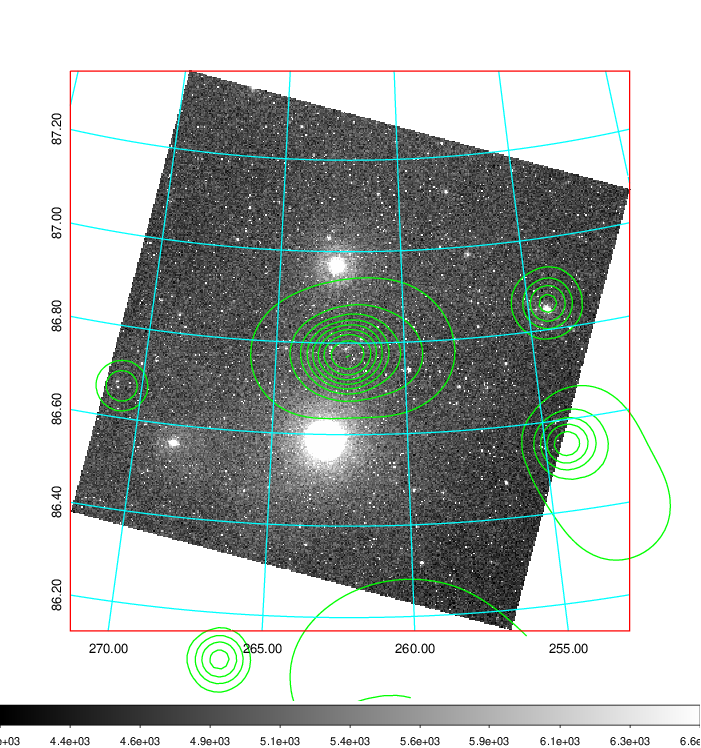 Blue circle for optical clusters;  Magenta circle for XSZ clusters;  all with r=1Mpc;  Only GC with Delta_z<0.01 are shown.  |

|[Previous-identified clusters](../image/723/723_gc.pdf) | [2MASS image](../image/723/723_2mass.pdf)      |
|-------------------|-------------------|
|  Green, magenta, and blue circles  for optical, X-ray and SZ clusters  respectively, with redshift of clusters  labelled. The radius of circles  are 1Mpc.|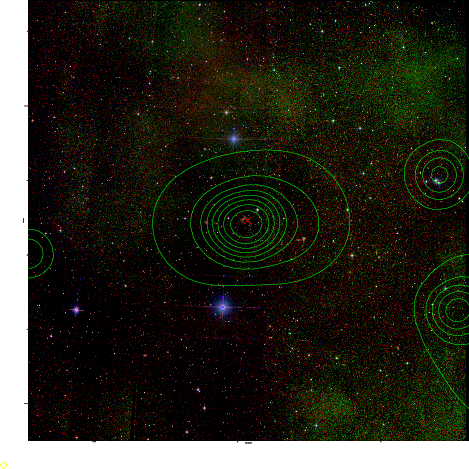  |

|[PS1 image](../image/723/723_ps1.pdf)            |
|-------------------|
| 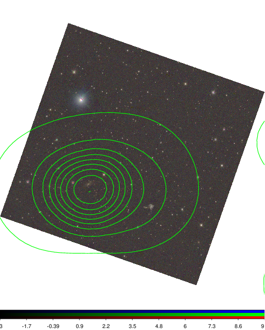  |
