

### 724

|Name|RAJ2000[deg]|DEJ2000[deg] |Ext[arcmin]| Ext,ml | z | z_src| C|GC(XSZ,Delta_z<0.01)| GC(OPT,Delta_z<0.01)|GC| R_sig[arcmin] | R500[arcmin] | R500[Mpc]| CRsig[c/s] | CR500[c/s] |L500[1E44 erg/s]|F500[1E-12 erg/s/cm^2]| M500[1E14 Msun]|Tx[keV]|Cnt_sig|Beta|Rc[arcmin]|Comment|Alias|
|---|---|---|---|---|---|------|---|--------|---------|----------|---|---|---|---|---|---|---|---|---|---|---|---|---|---|
|724| 262.580| 74.390| 2.80| 145.88| 0.0470(0.005)| z1, z_opt| S| -| N| MCXC, N| 28.156| 11.966| 0.662| 0.223(0.026)| 0.204(0.024)| 0.181(0.023)| 3.484(0.438)| 0.86(0.06)| 1.98(0.08)| 2638.5| 0.503(-0.002+0.005)| 3.377(-0.172+0.188)| An X-ray cluster with $z$ = 0.11 and offset = 0.06 Mpc| k357|

|[RASS image](../image/724/724_img.pdf)|[filtered image](../image/724/724_fil.pdf)|[Segment image](../image/724/724_seg.pdf)|
|-------------------|--------------------|-------------------|
| 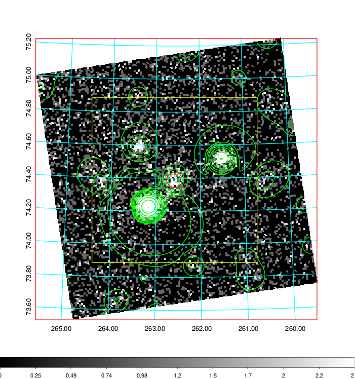  | 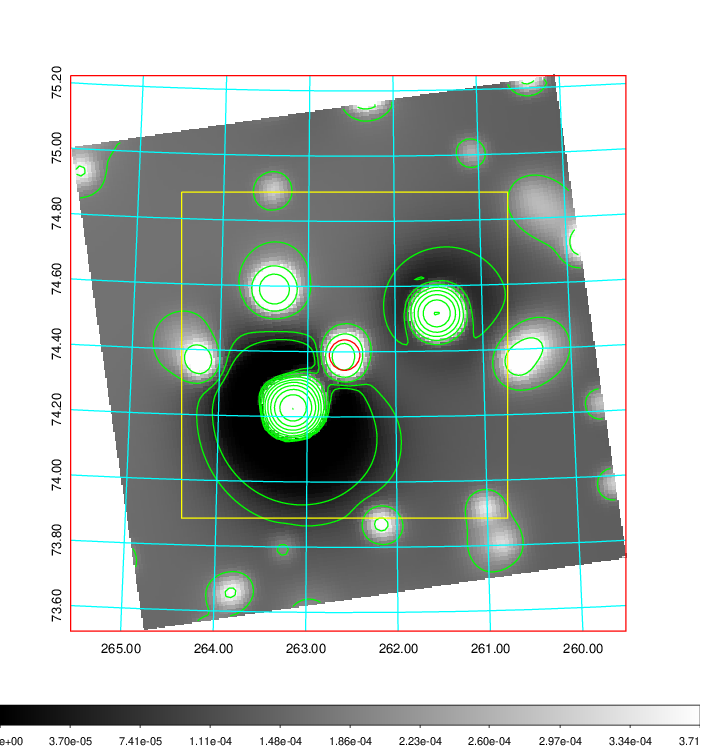   | 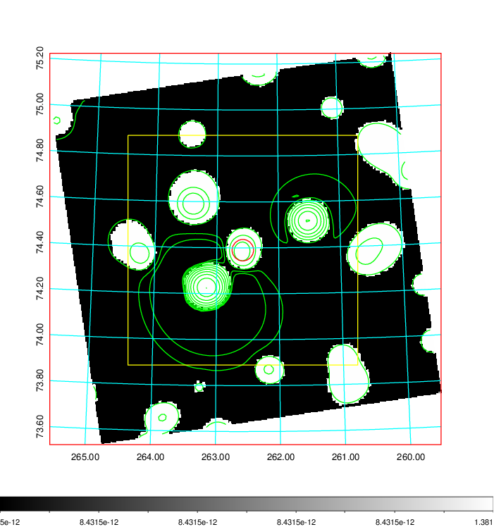  |

|[Exposure image](../image/724/724_mex.pdf)| [nH image](../image/724/724_nh.pdf)| [Planck image](../image/724/724_p.pdf)|
|-------------------|--------------------|-------------------|
|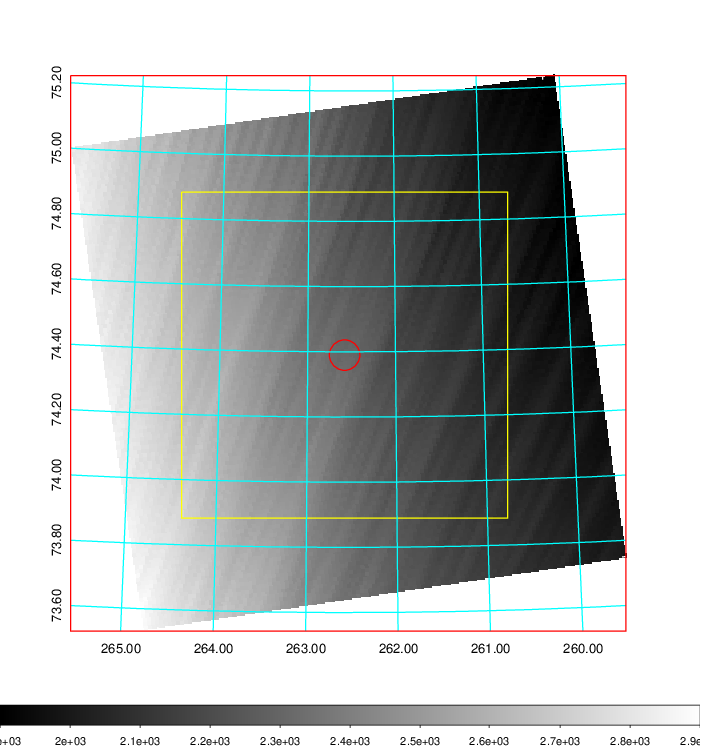   | 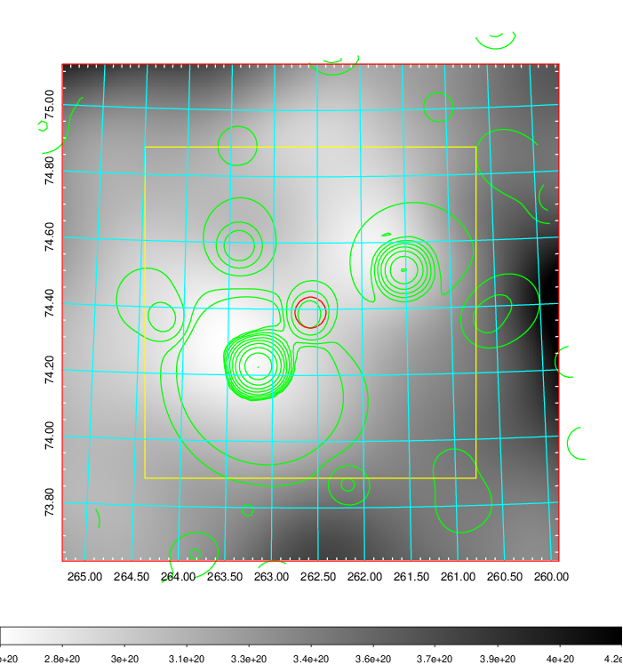    | 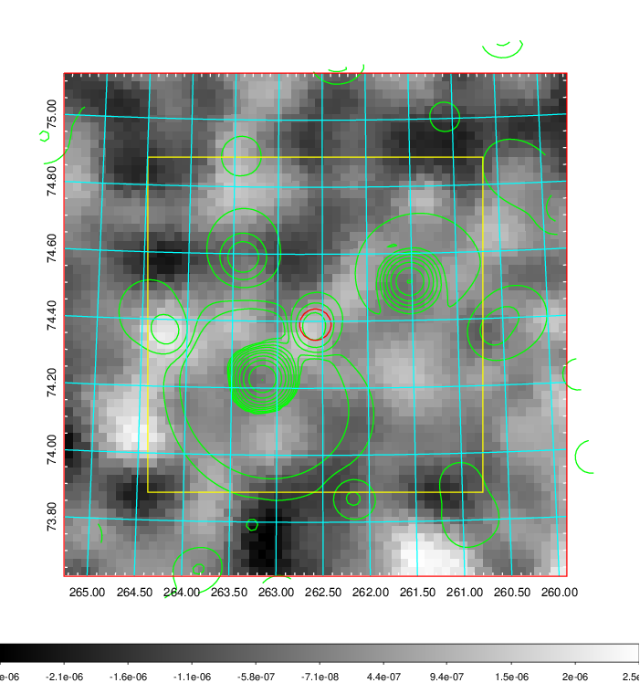 |

|[Redshift Histogram](../image/724/724_zg.pdf) | [DSS image(z1)](../image/724/724_dss_z1.pdf)      |  [DSS image(z2)](../image/724/724_dss_z2.pdf)    |
|-------------------|--------------------|-------------------|
|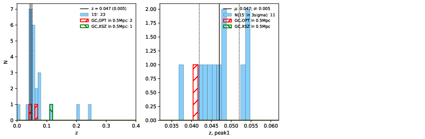 |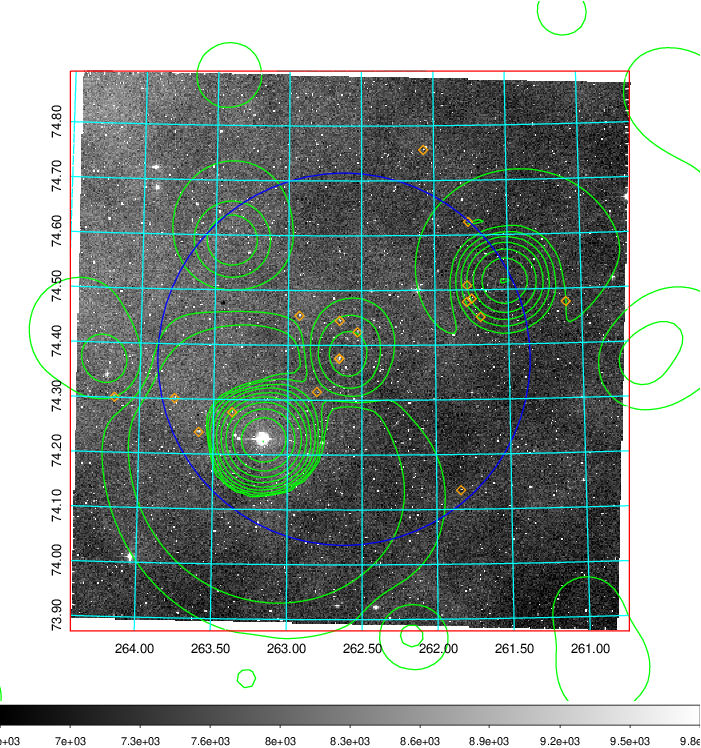  Blue circle for optical clusters;  Magenta circle for XSZ clusters;  all with r=1Mpc;  Only GC with Delta_z<0.01 are shown. | 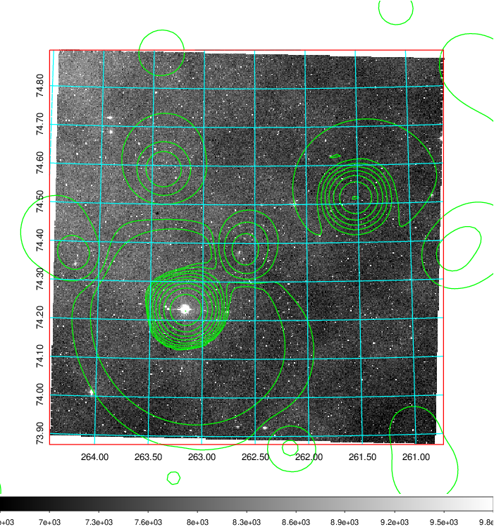 Blue circle for optical clusters;  Magenta circle for XSZ clusters;  all with r=1Mpc;  Only GC with Delta_z<0.01 are shown.  |

|[Previous-identified clusters](../image/724/724_gc.pdf) | [2MASS image](../image/724/724_2mass.pdf)      |
|-------------------|-------------------|
|  Green, magenta, and blue circles  for optical, X-ray and SZ clusters  respectively, with redshift of clusters  labelled. The radius of circles  are 1Mpc.|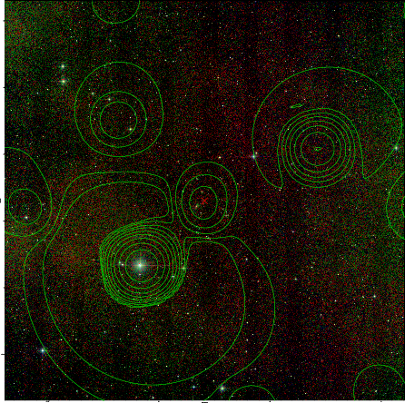  |

|[PS1 image](../image/724/724_ps1.pdf)            |
|-------------------|
| 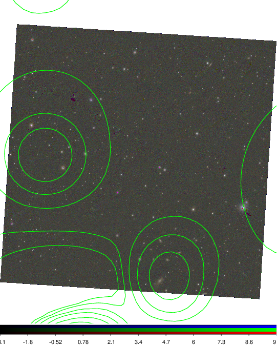  |
