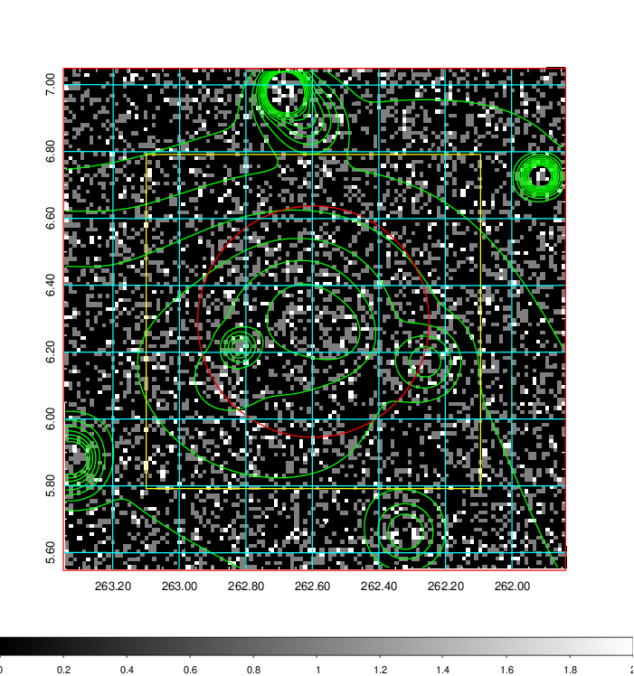
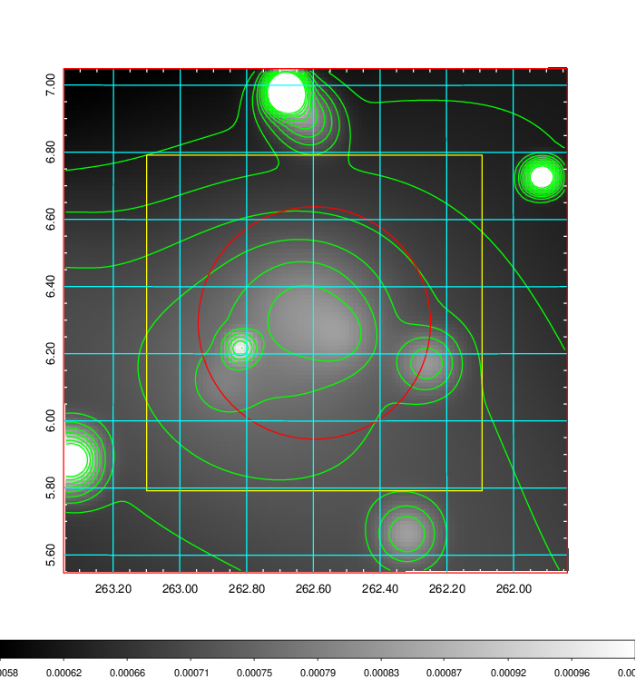
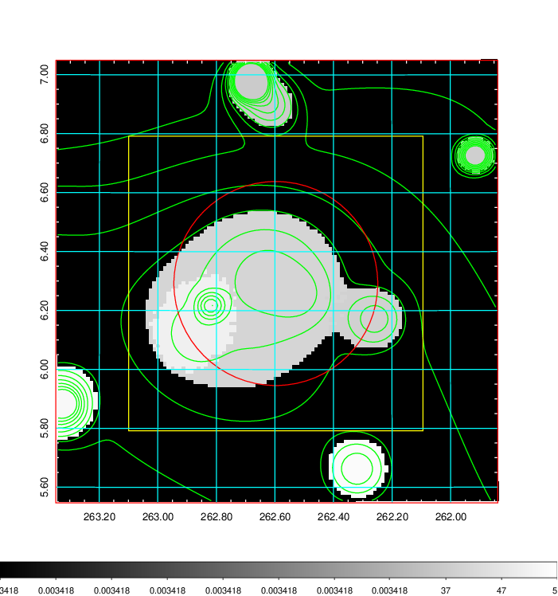
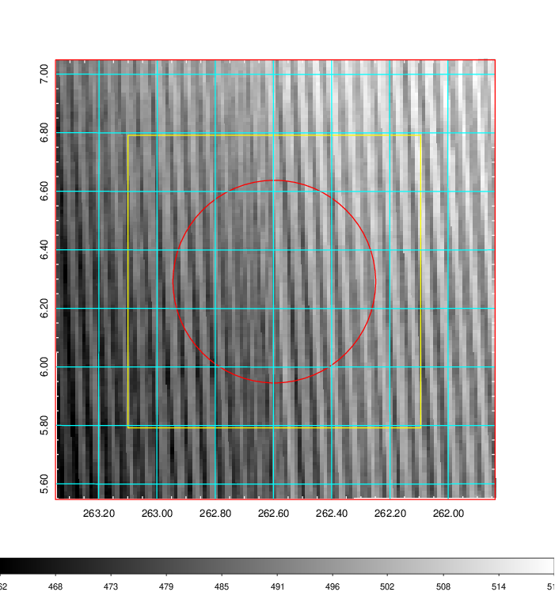
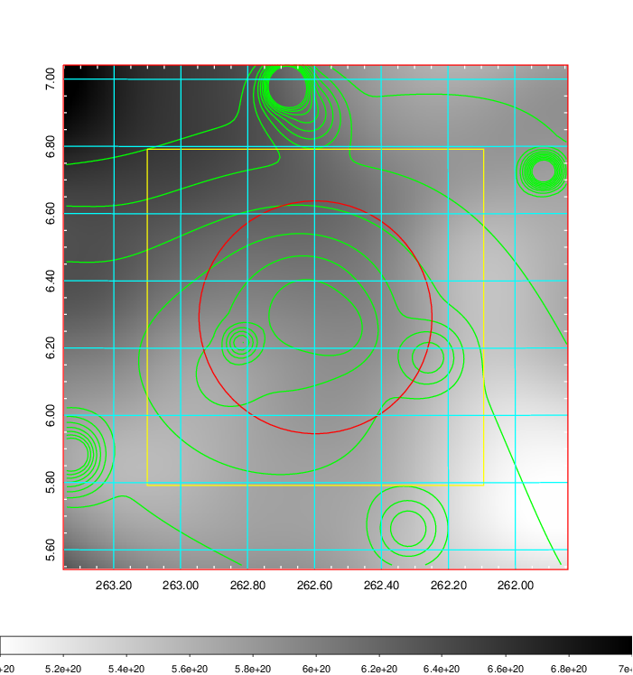
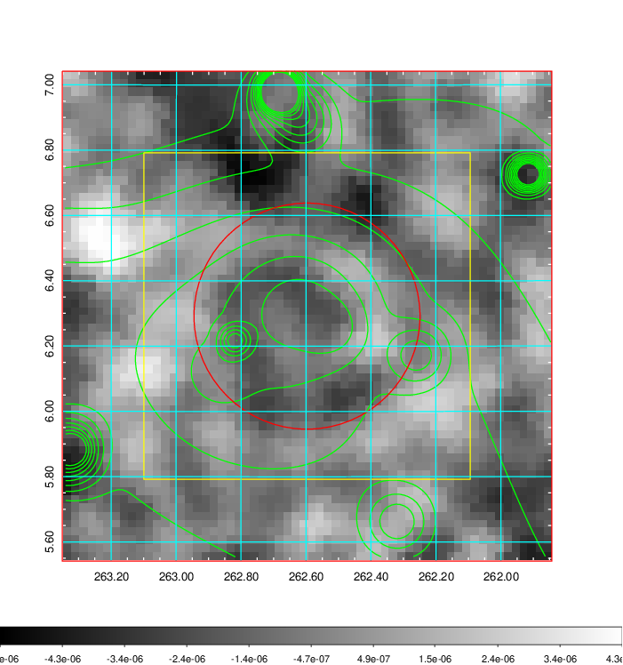
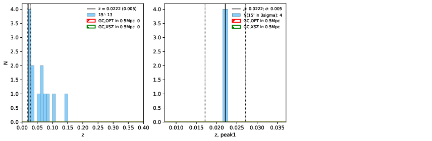
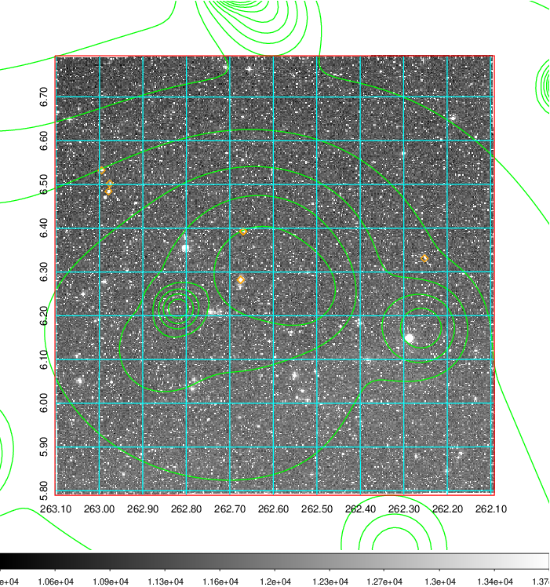
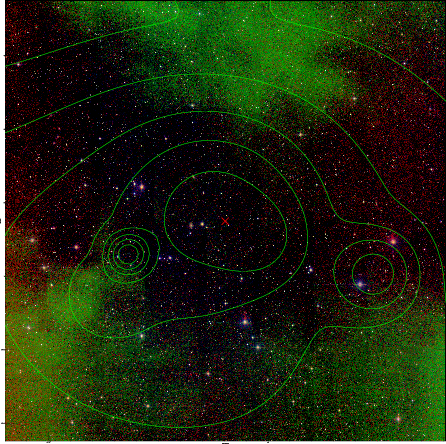

### 725

|Name|RAJ2000[deg]|DEJ2000[deg] |Ext[arcmin]| Ext,ml | z | z_src| C|GC(XSZ,Delta_z<0.01)| GC(OPT,Delta_z<0.01)|GC| R_sig[arcmin] | R500[arcmin] | R500[Mpc]| CRsig[c/s] | CR500[c/s] |L500[1E44 erg/s]|F500[1E-12 erg/s/cm^2]| M500[1E14 Msun]|Tx[keV]|Cnt_sig|Beta|Rc[arcmin]|Comment|Alias|
|---|---|---|---|---|---|------|---|--------|---------|----------|---|---|---|---|---|---|---|---|---|---|---|---|---|---|
|725| 262.597| 6.292| 20.78| 45.58| 0.0222(0.005)| z1,| G| -| -| W| 10.750| 16.643| 0.448| 0.122(0.056)| 0.134(0.061)| 0.019(0.006)| 1.662(0.545)| 0.26(0.04)| 0.94(0.10)| 84.5| 0.806(-0.176+0.137)| 9.153(-2.042+1.632)| -| t586|

|[RASS image](../image/725/725_img.pdf)|[filtered image](../image/725/725_fil.pdf)|[Segment image](../image/725/725_seg.pdf)|
|-------------------|--------------------|-------------------|
|   |    |   |

|[Exposure image](../image/725/725_mex.pdf)| [nH image](../image/725/725_nh.pdf)| [Planck image](../image/725/725_p.pdf)|
|-------------------|--------------------|-------------------|
|   |     |  |

|[Redshift Histogram](../image/725/725_zg.pdf) | [DSS image(z1)](../image/725/725_dss_z1.pdf)      |  [DSS image(z2)](../image/725/725_dss_z2.pdf)    |
|-------------------|--------------------|-------------------|
| |  Blue circle for optical clusters;  Magenta circle for XSZ clusters;  all with r=1Mpc;  Only GC with Delta_z<0.01 are shown. |  Blue circle for optical clusters;  Magenta circle for XSZ clusters;  all with r=1Mpc;  Only GC with Delta_z<0.01 are shown.  |

|[known Abell/XSZ clusters](../image/725/725_gc.pdf) | [2MASS image](../image/725/725_2mass.pdf)      |
|-------------------|-------------------|
|  Magenta, blue and green circles  for optical, X-ray and SZ clusters  respectively, with redshift of clusters  labelled. The radius of circles  are 1Mpc.|  |

|[PS1 image](../image/725/725_ps1.pdf)            |
|-------------------|
|   |
