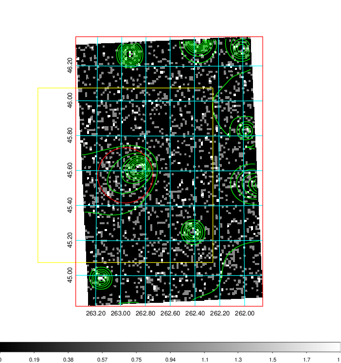
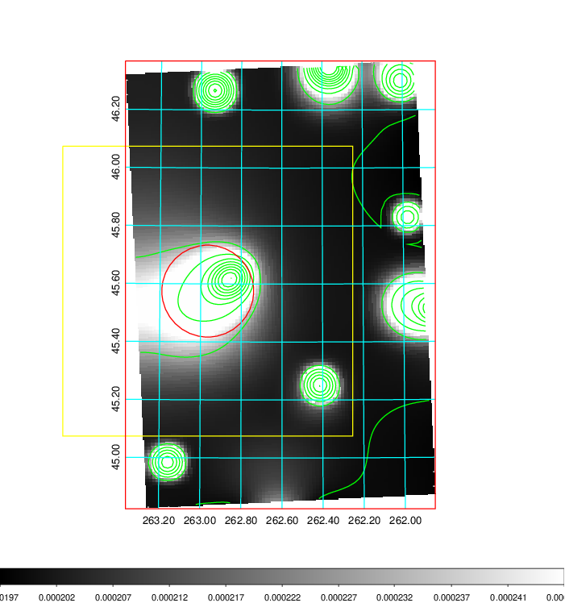
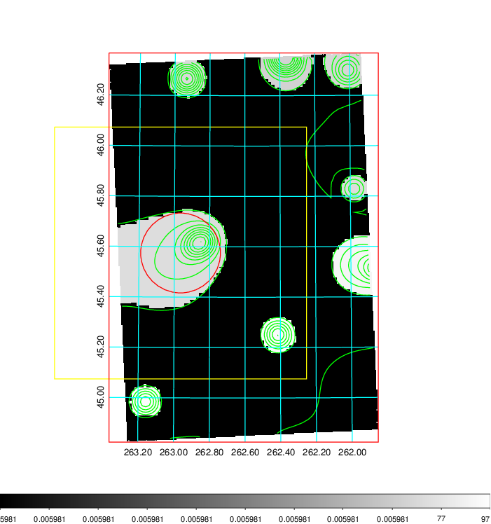
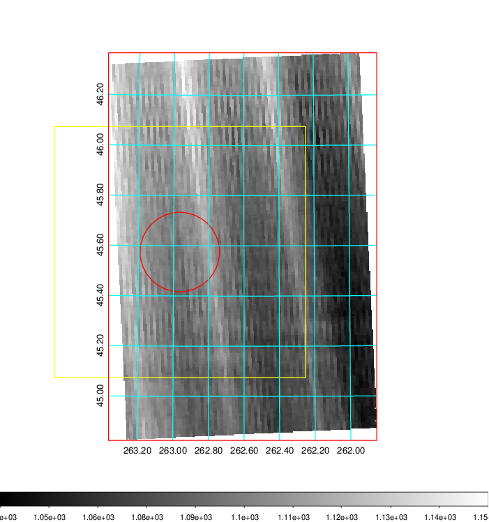
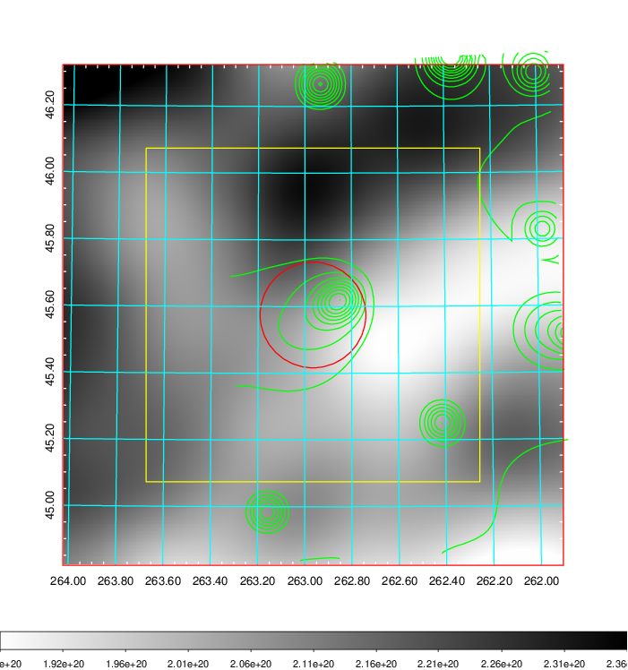
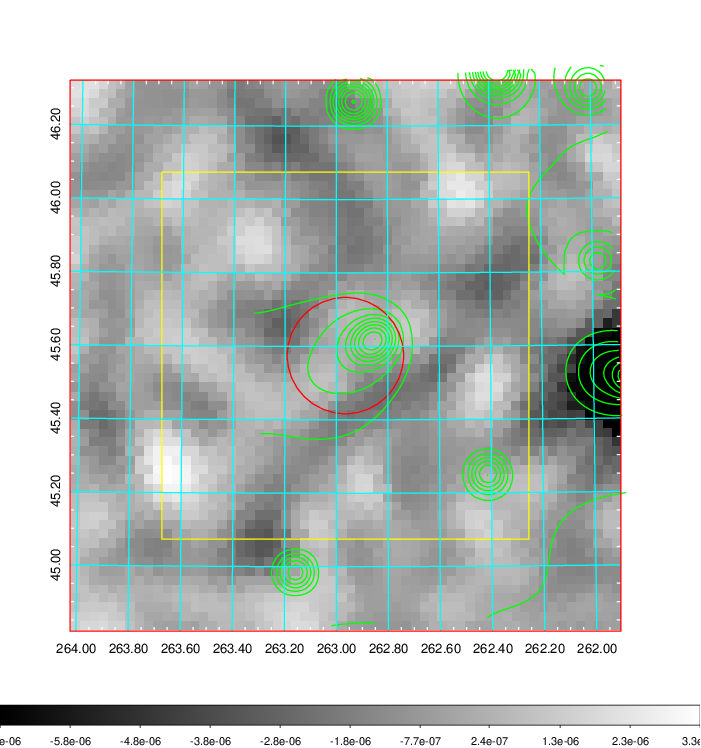
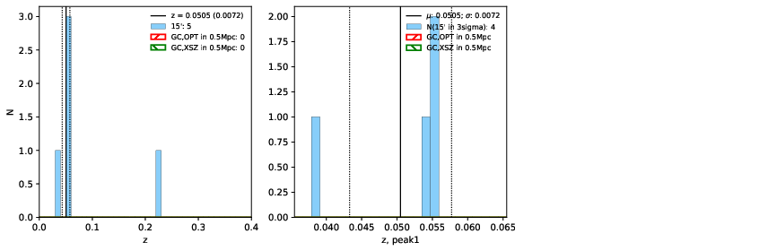
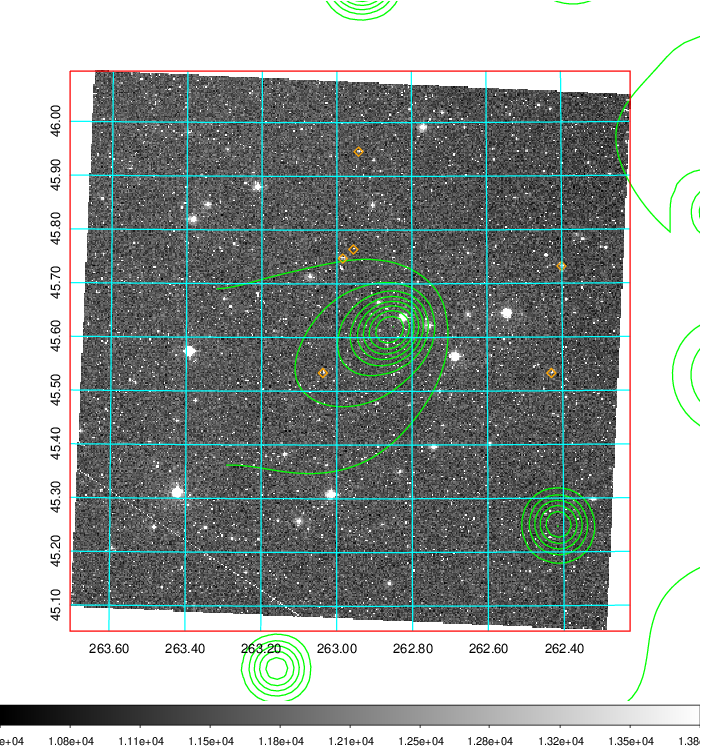
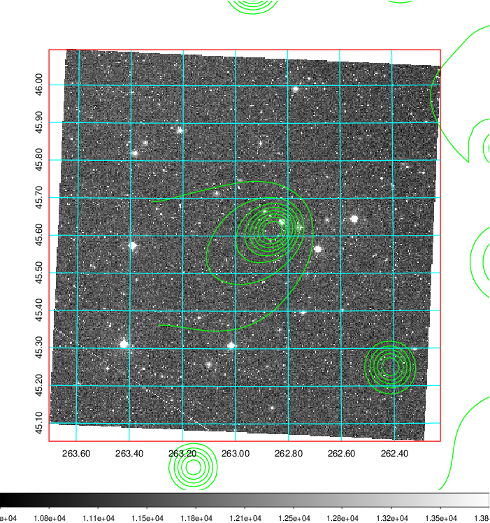
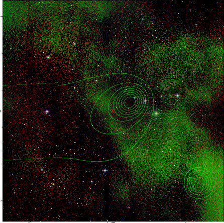

### 726

|Name|RAJ2000[deg]|DEJ2000[deg] |Ext[arcmin]| Ext,ml | z | z_src| C|GC(XSZ,Delta_z<0.01)| GC(OPT,Delta_z<0.01)|GC| R_sig[arcmin] | R500[arcmin] | R500[Mpc]| CRsig[c/s] | CR500[c/s] |L500[1E44 erg/s]|F500[1E-12 erg/s/cm^2]| M500[1E14 Msun]|Tx[keV]|Cnt_sig|Beta|Rc[arcmin]|Comment|Alias|
|---|---|---|---|---|---|------|---|--------|---------|----------|---|---|---|---|---|---|---|---|---|---|---|---|---|---|
|726| 262.965| 45.575| 9.51| 26.52| 0.0505(0.007)| z1,| G| -| -| -| 8.312| 8.081| 0.478| 0.041(0.018)| 0.041(0.018)| 0.035(0.011)| 0.573(0.178)| 0.33(0.05)| 1.09(0.11)| 56.7| 0.751(-0.161+0.171)| 4.910(-1.271+1.120)| -| t429|

|[RASS image](../image/726/726_img.pdf)|[filtered image](../image/726/726_fil.pdf)|[Segment image](../image/726/726_seg.pdf)|
|-------------------|--------------------|-------------------|
|   |    |   |

|[Exposure image](../image/726/726_mex.pdf)| [nH image](../image/726/726_nh.pdf)| [Planck image](../image/726/726_p.pdf)|
|-------------------|--------------------|-------------------|
|   |     |  |

|[Redshift Histogram](../image/726/726_zg.pdf) | [DSS image(z1)](../image/726/726_dss_z1.pdf)      |  [DSS image(z2)](../image/726/726_dss_z2.pdf)    |
|-------------------|--------------------|-------------------|
| |  Blue circle for optical clusters;  Magenta circle for XSZ clusters;  all with r=1Mpc;  Only GC with Delta_z<0.01 are shown. |  Blue circle for optical clusters;  Magenta circle for XSZ clusters;  all with r=1Mpc;  Only GC with Delta_z<0.01 are shown.  |

|[known Abell/XSZ clusters](../image/726/726_gc.pdf) | [2MASS image](../image/726/726_2mass.pdf)      |
|-------------------|-------------------|
|  Magenta, blue and green circles  for optical, X-ray and SZ clusters  respectively, with redshift of clusters  labelled. The radius of circles  are 1Mpc.|  |

|[PS1 image](../image/726/726_ps1.pdf)            |
|-------------------|
|   |
