

### 728

|Name|RAJ2000[deg]|DEJ2000[deg] |Ext[arcmin]| Ext,ml | z | z_src| C|GC(XSZ,Delta_z<0.01)| GC(OPT,Delta_z<0.01)|GC| R_sig[arcmin] | R500[arcmin] | R500[Mpc]| CRsig[c/s] | CR500[c/s] |L500[1E44 erg/s]|F500[1E-12 erg/s/cm^2]| M500[1E14 Msun]|Tx[keV]|Cnt_sig|Beta|Rc[arcmin]|Comment|Alias|
|---|---|---|---|---|---|------|---|--------|---------|----------|---|---|---|---|---|---|---|---|---|---|---|---|---|---|
|728| 263.185| 40.612| 2.00| 87.33| 0.1319(0.007)| z1, z_xsz| B| PSZ2, Tar| A, W| A, N, PSZ2, Tar, W| 11.725| 7.036| 0.990| 0.204(0.025)| 0.191(0.023)| 1.661(0.106)| 3.611(0.231)| 3.14(0.10)| 4.52(0.09)| 245.3| 0.904(-0.096+0.067)| 5.023(-0.649+0.465)| -| k219|

|[RASS image](../image/728/728_img.pdf)|[filtered image](../image/728/728_fil.pdf)|[Segment image](../image/728/728_seg.pdf)|
|-------------------|--------------------|-------------------|
| 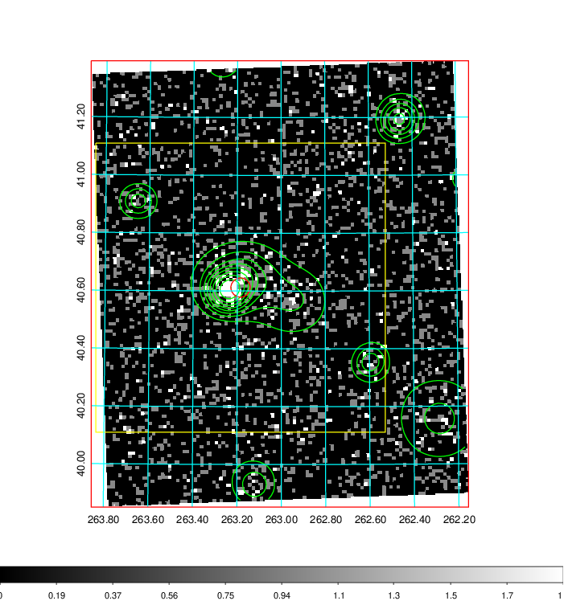  | 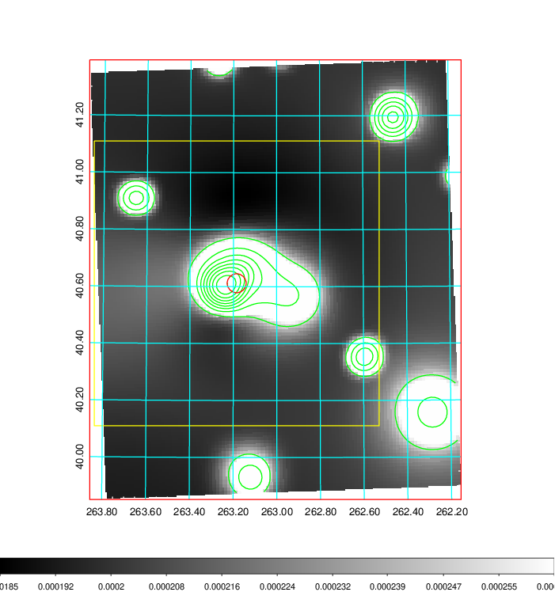   | 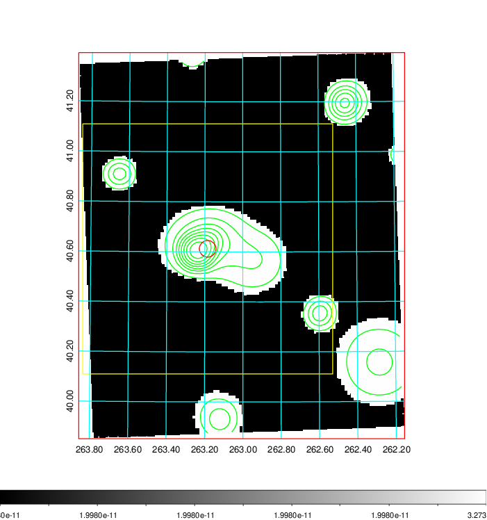  |

|[Exposure image](../image/728/728_mex.pdf)| [nH image](../image/728/728_nh.pdf)| [Planck image](../image/728/728_p.pdf)|
|-------------------|--------------------|-------------------|
|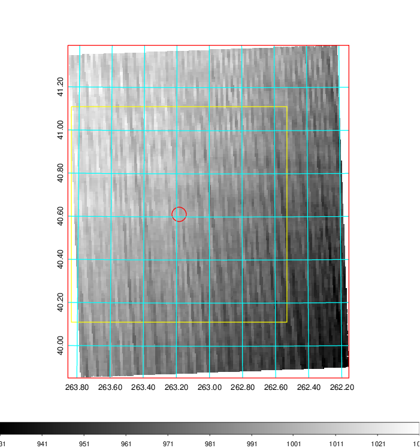   | 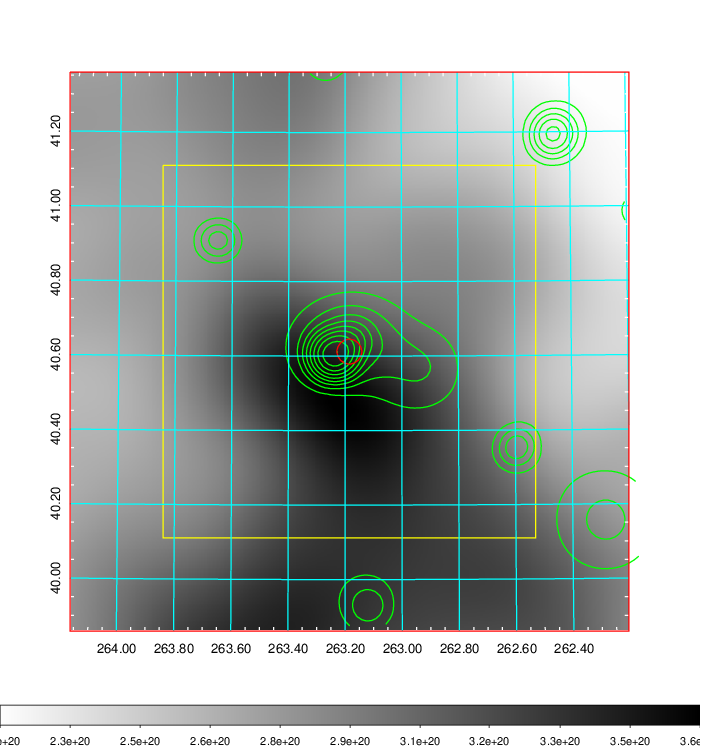    | 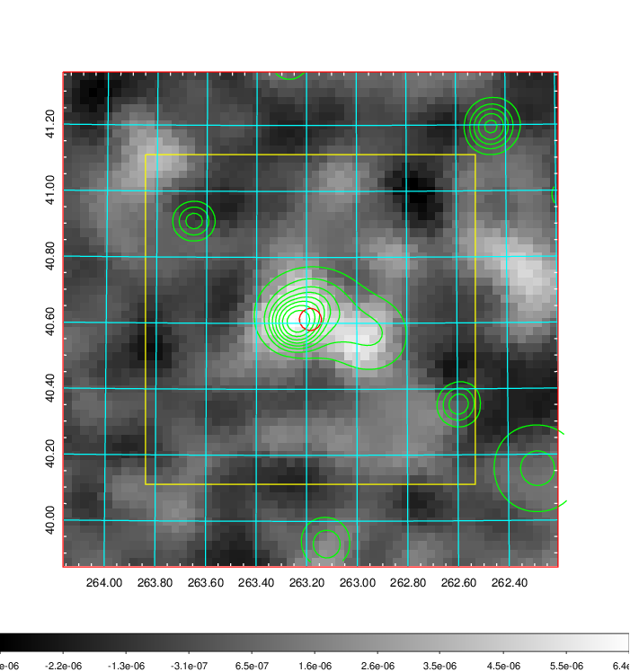 |

|[Redshift Histogram](../image/728/728_zg.pdf) | [DSS image(z1)](../image/728/728_dss_z1.pdf)      |  [DSS image(z2)](../image/728/728_dss_z2.pdf)    |
|-------------------|--------------------|-------------------|
|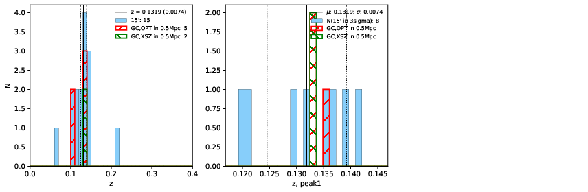 |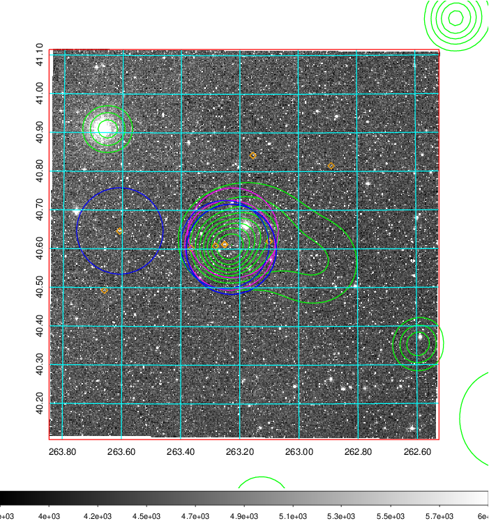  Blue circle for optical clusters;  Magenta circle for XSZ clusters;  all with r=1Mpc;  Only GC with Delta_z<0.01 are shown. | 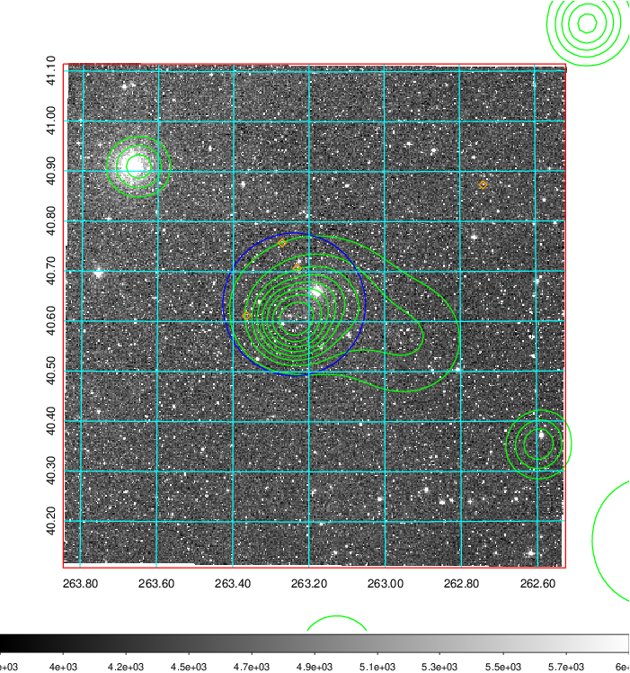 Blue circle for optical clusters;  Magenta circle for XSZ clusters;  all with r=1Mpc;  Only GC with Delta_z<0.01 are shown.  |

|[Previous-identified clusters](../image/728/728_gc.pdf) | [2MASS image](../image/728/728_2mass.pdf)      |
|-------------------|-------------------|
|  Green, magenta, and blue circles  for optical, X-ray and SZ clusters  respectively, with redshift of clusters  labelled. The radius of circles  are 1Mpc.|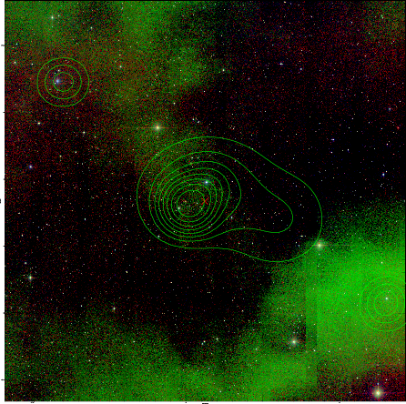  |

|[PS1 image](../image/728/728_ps1.pdf)            |
|-------------------|
| 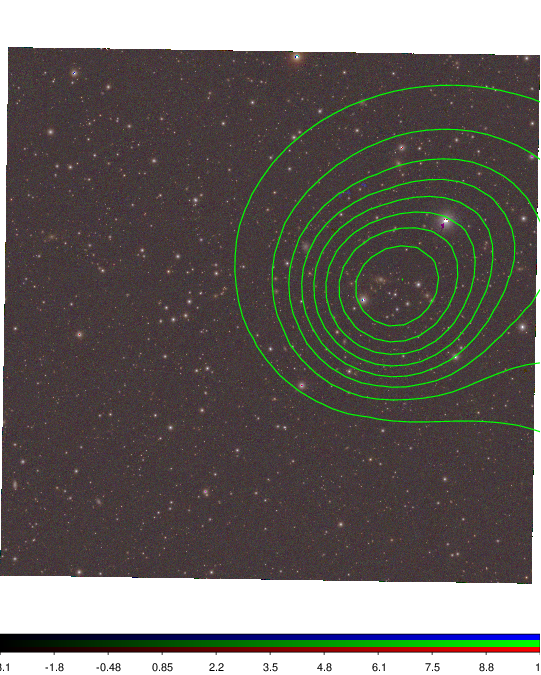  |
