

### 729

|Name|RAJ2000[deg]|DEJ2000[deg] |Ext[arcmin]| Ext,ml | z | z_src| C|GC(XSZ,Delta_z<0.01)| GC(OPT,Delta_z<0.01)|GC| R_sig[arcmin] | R500[arcmin] | R500[Mpc]| CRsig[c/s] | CR500[c/s] |L500[1E44 erg/s]|F500[1E-12 erg/s/cm^2]| M500[1E14 Msun]|Tx[keV]|Cnt_sig|Beta|Rc[arcmin]|Comment|Alias|
|---|---|---|---|---|---|------|---|--------|---------|----------|---|---|---|---|---|---|---|---|---|---|---|---|---|---|
|729| 263.255| 43.752| 1.79| 326.60| 0.0323(0.005)| z1, z_xsz| B| MCXC| N| C, MCXC, N, W| 31.119| 19.156| 0.741| 0.788(0.049)| 0.741(0.046)| 0.334(0.015)| 13.873(0.616)| 1.19(0.03)| 2.41(0.03)| 877.3| 0.546(-0.012+0.013)| 1.740(-0.161+0.171)| -| k171|

|[RASS image](../image/729/729_img.pdf)|[filtered image](../image/729/729_fil.pdf)|[Segment image](../image/729/729_seg.pdf)|
|-------------------|--------------------|-------------------|
| 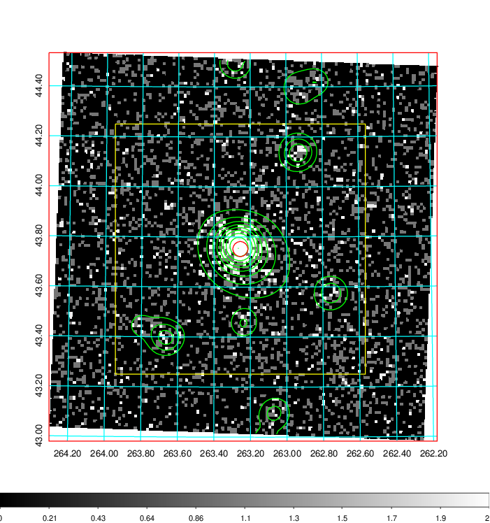  | 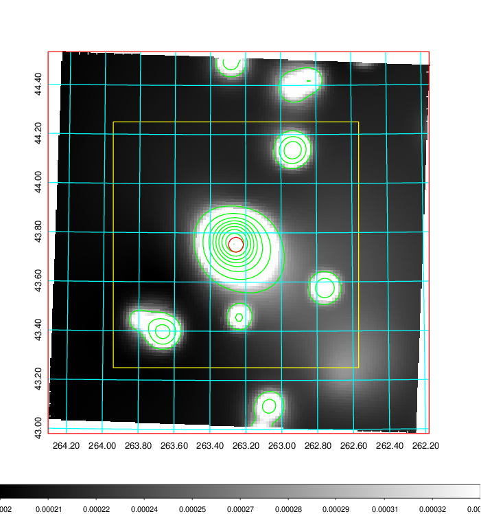   | 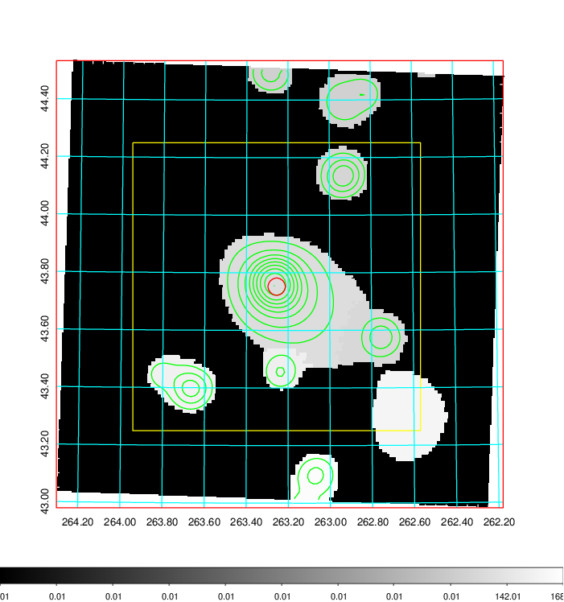  |

|[Exposure image](../image/729/729_mex.pdf)| [nH image](../image/729/729_nh.pdf)| [Planck image](../image/729/729_p.pdf)|
|-------------------|--------------------|-------------------|
|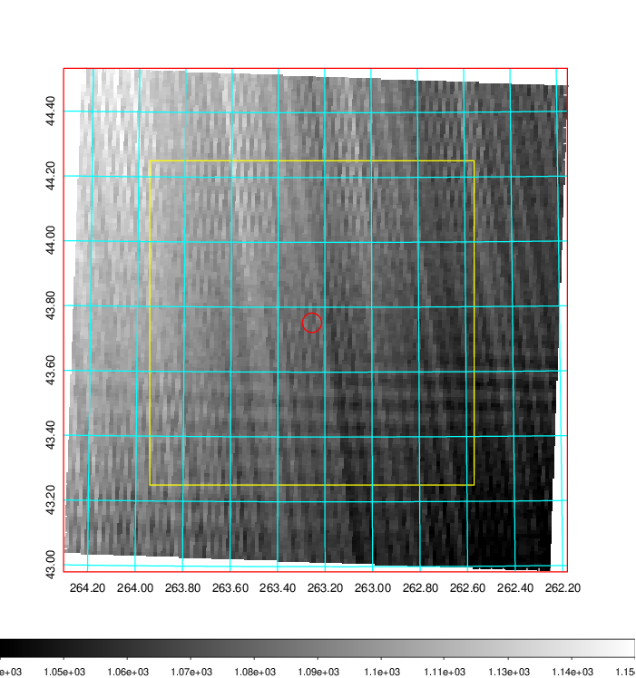   | 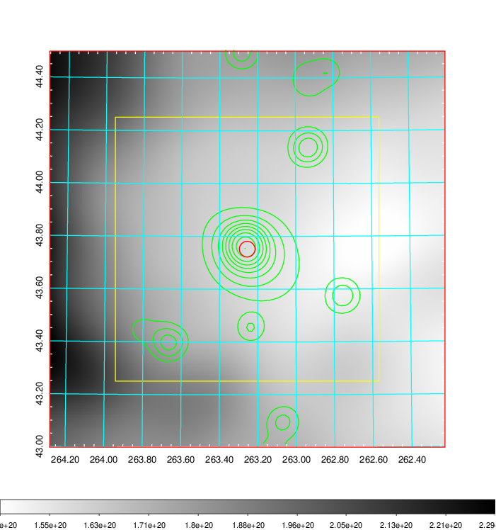    | 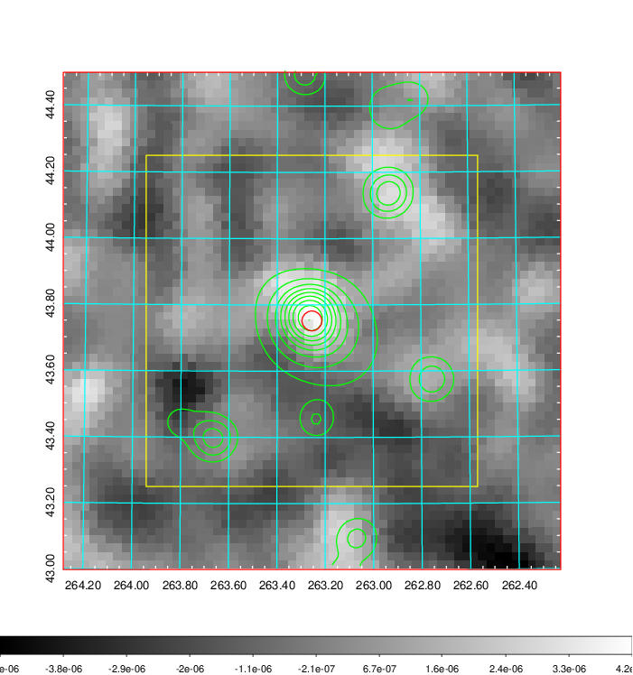 |

|[Redshift Histogram](../image/729/729_zg.pdf) | [DSS image(z1)](../image/729/729_dss_z1.pdf)      |  [DSS image(z2)](../image/729/729_dss_z2.pdf)    |
|-------------------|--------------------|-------------------|
|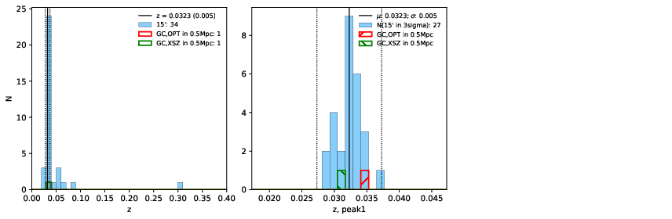 |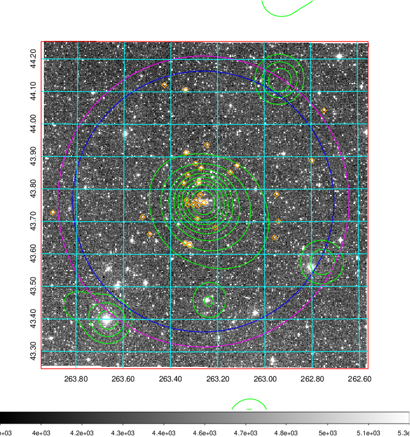  Blue circle for optical clusters;  Magenta circle for XSZ clusters;  all with r=1Mpc;  Only GC with Delta_z<0.01 are shown. | 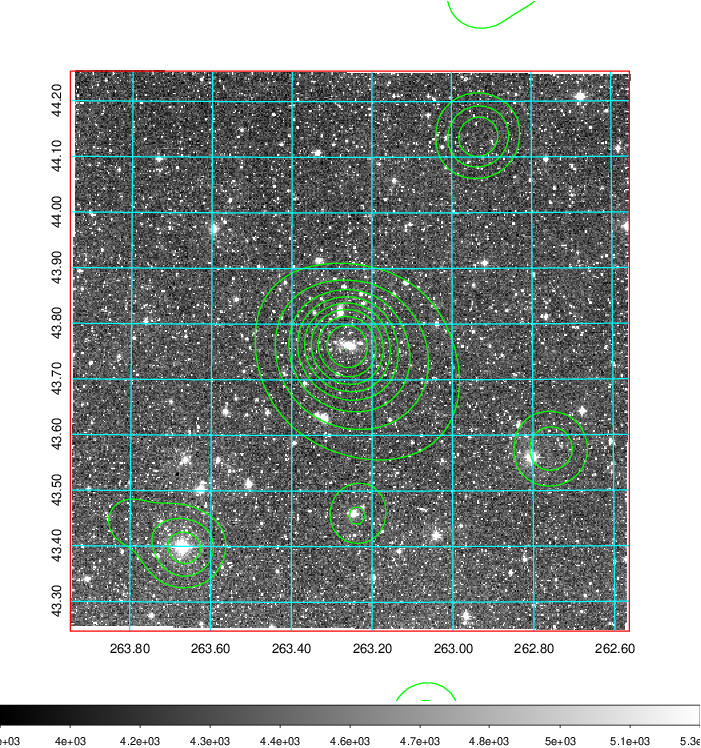 Blue circle for optical clusters;  Magenta circle for XSZ clusters;  all with r=1Mpc;  Only GC with Delta_z<0.01 are shown.  |

|[known Abell/XSZ clusters](../image/729/729_gc.pdf) | [2MASS image](../image/729/729_2mass.pdf)      |[SDSS image](../image/729/729_sdss.pdf)   |
|-------------------|-------------------|-------------------|
|  Magenta, blue and green circles  for optical, X-ray and SZ clusters  respectively, with redshift of clusters  labelled. The radius of circles  are 1Mpc.|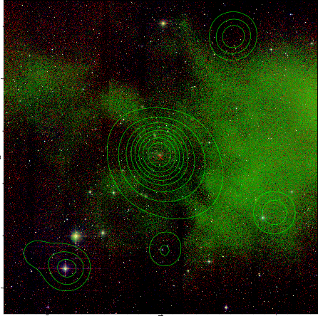  | 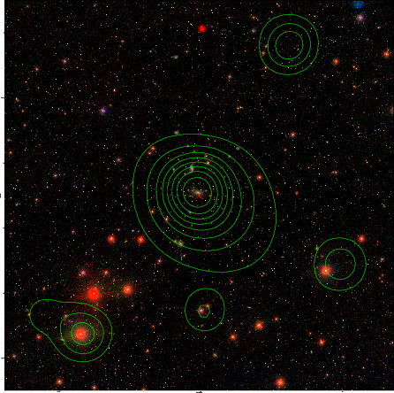  |

