

### 730

|Name|RAJ2000[deg]|DEJ2000[deg] |Ext[arcmin]| Ext,ml | z | z_src| C|GC(XSZ,Delta_z<0.01)| GC(OPT,Delta_z<0.01)|GC| R_sig[arcmin] | R500[arcmin] | R500[Mpc]| CRsig[c/s] | CR500[c/s] |L500[1E44 erg/s]|F500[1E-12 erg/s/cm^2]| M500[1E14 Msun]|Tx[keV]|Cnt_sig|Beta|Rc[arcmin]|Comment|Alias|
|---|---|---|---|---|---|------|---|--------|---------|----------|---|---|---|---|---|---|---|---|---|---|---|---|---|---|
|730| 263.753| 68.129| 4.28| 85.06| 0.0262(0.005)| z1, z_xsz| B| MCXC, SPI| N| MCXC, N, SPI| 29.638| 16.147| 0.511| 0.200(0.016)| 0.186(0.015)| 0.040(0.003)| 2.545(0.160)| 0.39(0.01)| 1.20(0.02)| 1367.7| 0.677(-0.042+0.048)| 8.992(-0.851+0.885)| -| k497|

|[RASS image](../image/730/730_img.pdf)|[filtered image](../image/730/730_fil.pdf)|[Segment image](../image/730/730_seg.pdf)|
|-------------------|--------------------|-------------------|
| 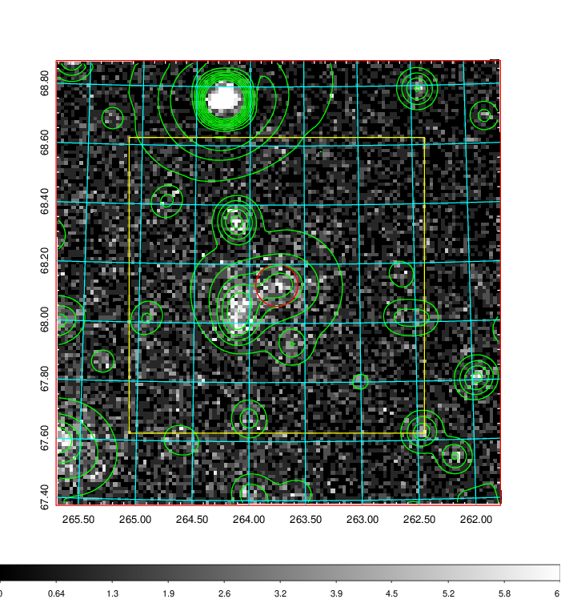  | 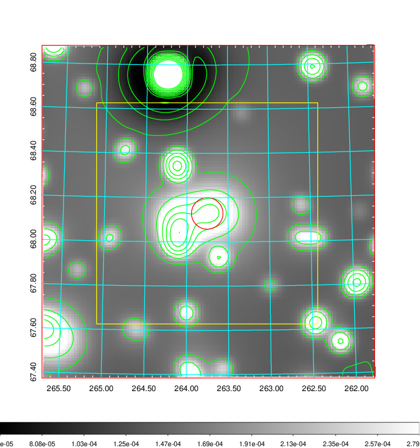   | 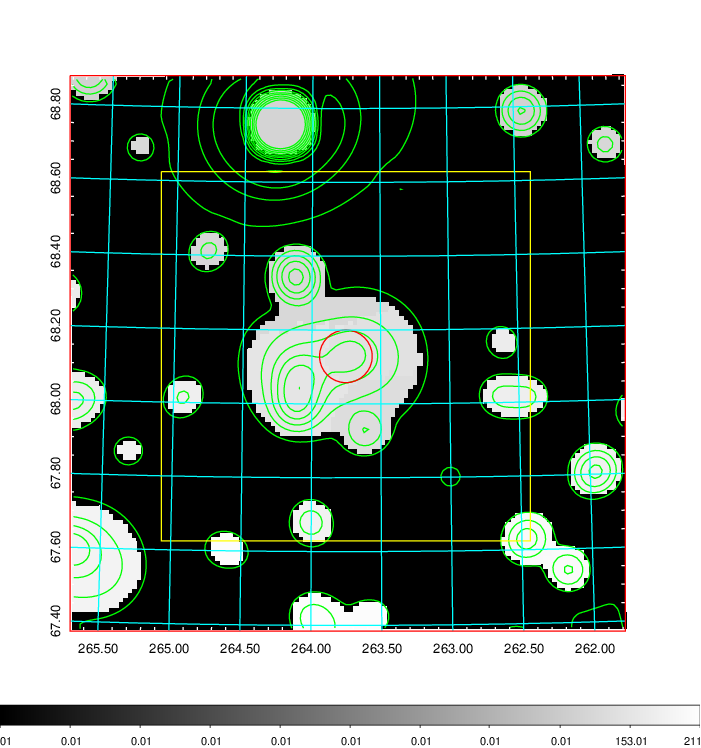  |

|[Exposure image](../image/730/730_mex.pdf)| [nH image](../image/730/730_nh.pdf)| [Planck image](../image/730/730_p.pdf)|
|-------------------|--------------------|-------------------|
|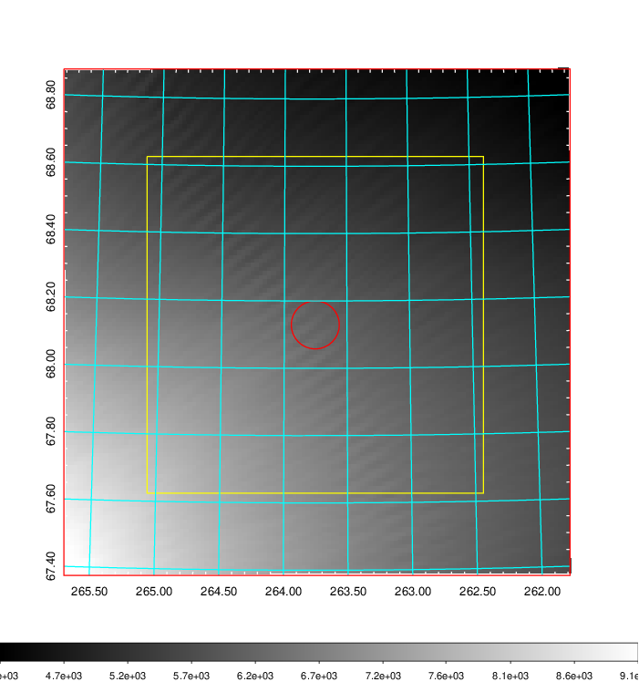   | 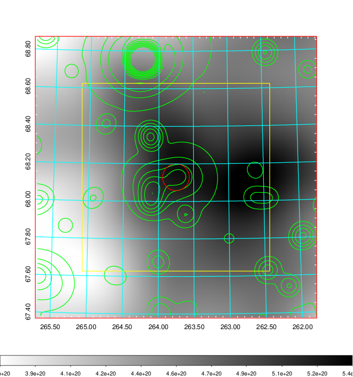    | 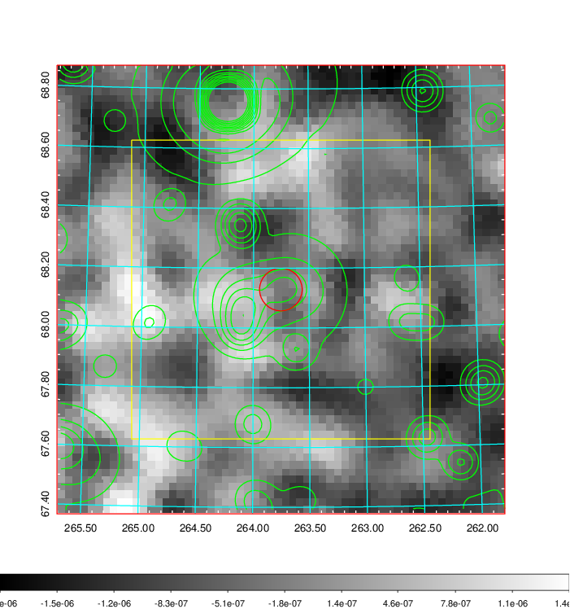 |

|[Redshift Histogram](../image/730/730_zg.pdf) | [DSS image(z1)](../image/730/730_dss_z1.pdf)      |  [DSS image(z2)](../image/730/730_dss_z2.pdf)    |
|-------------------|--------------------|-------------------|
|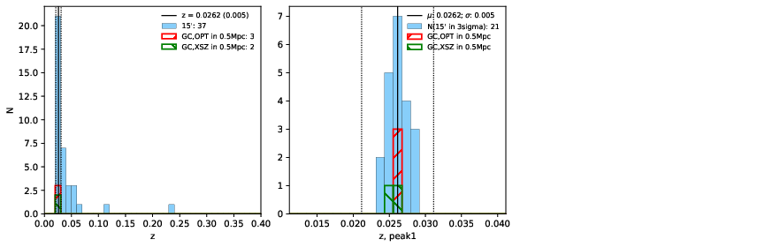 |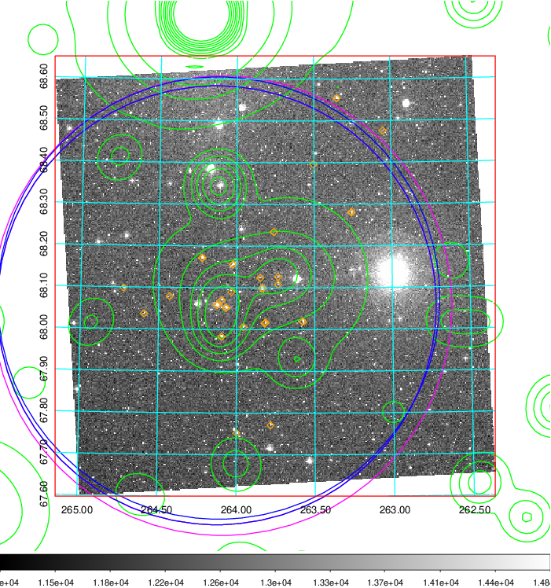  Blue circle for optical clusters;  Magenta circle for XSZ clusters;  all with r=1Mpc;  Only GC with Delta_z<0.01 are shown. | 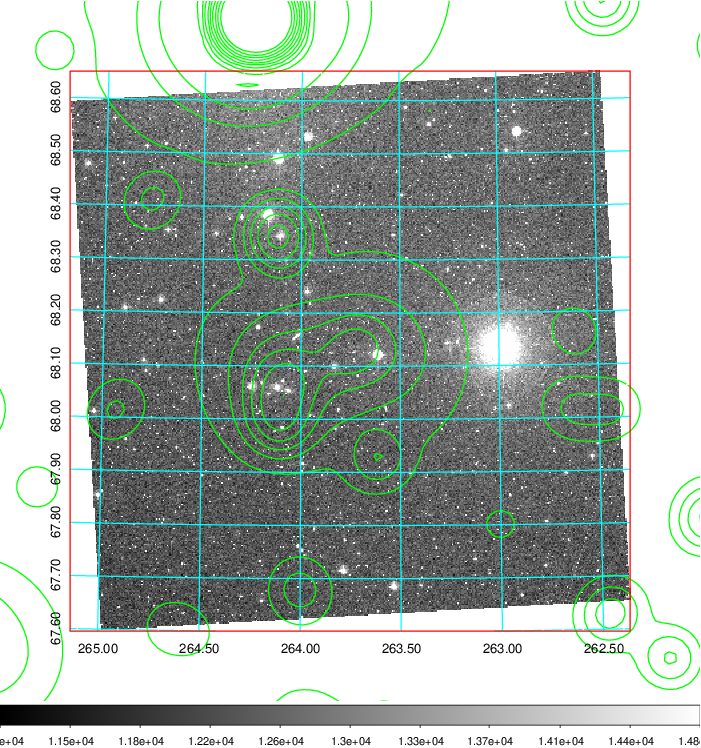 Blue circle for optical clusters;  Magenta circle for XSZ clusters;  all with r=1Mpc;  Only GC with Delta_z<0.01 are shown.  |

|[Previous-identified clusters](../image/730/730_gc.pdf) | [2MASS image](../image/730/730_2mass.pdf)      |[SDSS image](../image/730/730_sdss.pdf)   |
|-------------------|-------------------|-------------------|
|  Green, magenta, and blue circles  for optical, X-ray and SZ clusters  respectively, with redshift of clusters  labelled. The radius of circles  are 1Mpc.|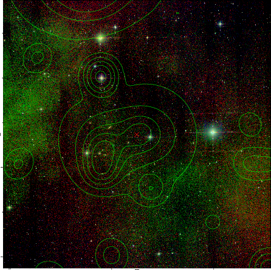  | 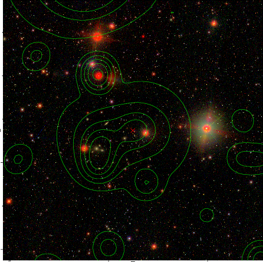  |

