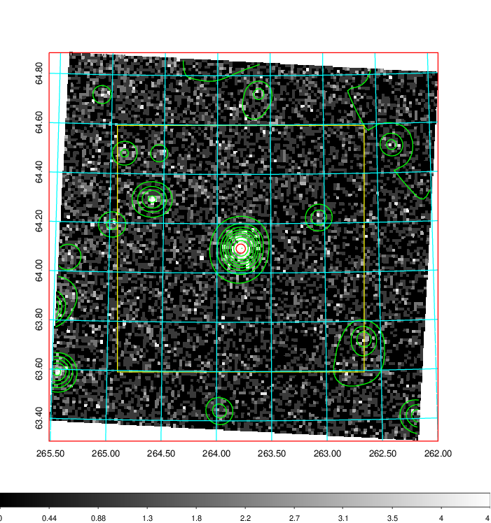
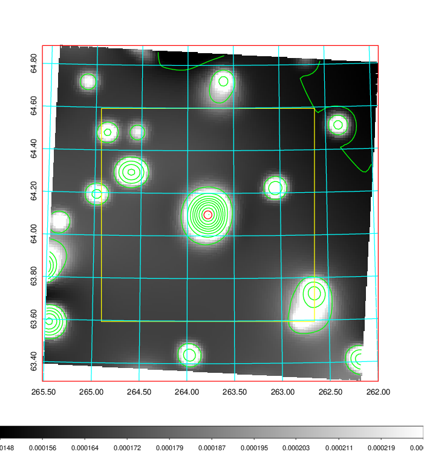
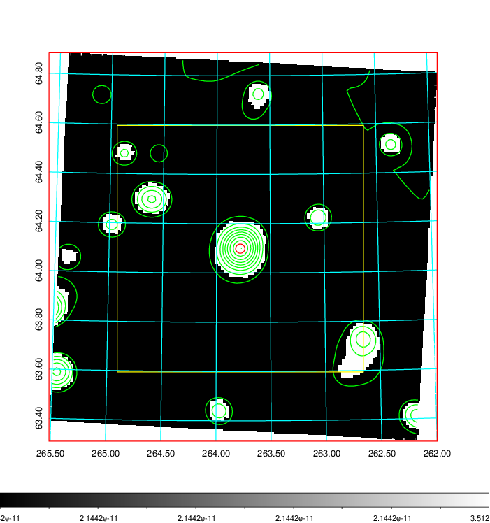
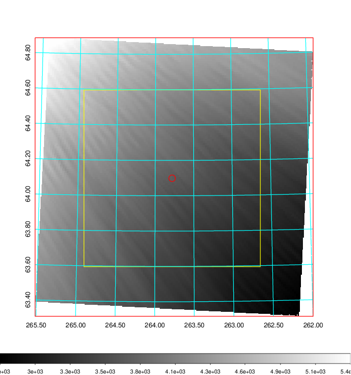
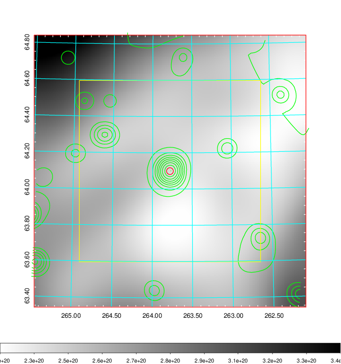
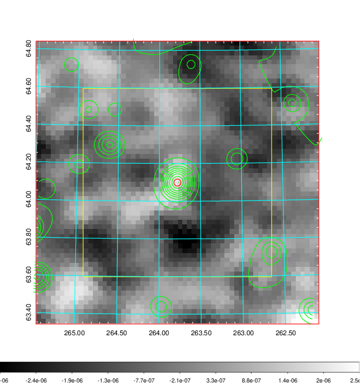
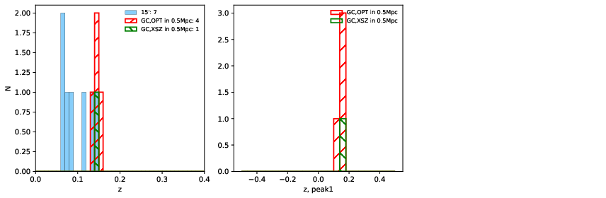
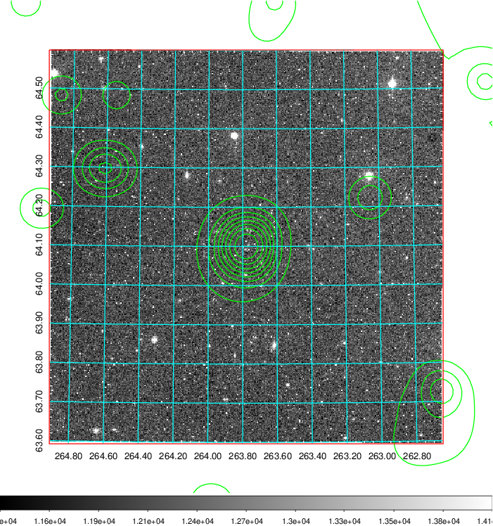
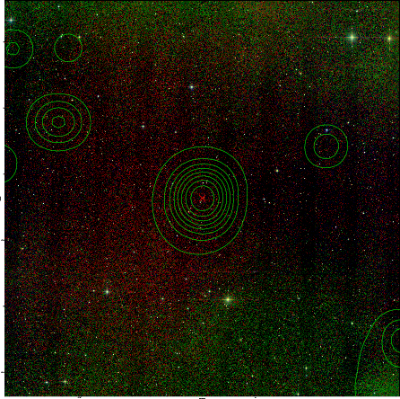
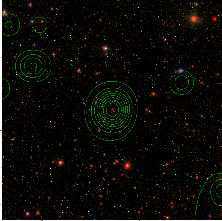

### 732

|Name|RAJ2000[deg]|DEJ2000[deg] |Ext[arcmin]| Ext,ml | z | z_src| C|GC(XSZ,Delta_z<0.01)| GC(OPT,Delta_z<0.01)|GC| R_sig[arcmin] | R500[arcmin] | R500[Mpc]| CRsig[c/s] | CR500[c/s] |L500[1E44 erg/s]|F500[1E-12 erg/s/cm^2]| M500[1E14 Msun]|Tx[keV]|Cnt_sig|Beta|Rc[arcmin]|Comment|Alias|
|---|---|---|---|---|---|------|---|--------|---------|----------|---|---|---|---|---|---|---|---|---|---|---|---|---|---|
|732| 263.780| 64.099| 1.12| 79.46| 0.1406(0.000)| z_xsz| B| MCXC| N, W| A, C, MCXC, N, W| 12.700| 6.001| 0.892| 0.114(0.011)| 0.105(0.010)| 1.069(0.062)| 2.023(0.118)| 2.31(0.07)| 3.75(0.07)| 393.5| 0.646(-0.055+0.074)| 1.912(-0.416+0.495)| -| k048|

|[RASS image](../image/732/732_img.pdf)|[filtered image](../image/732/732_fil.pdf)|[Segment image](../image/732/732_seg.pdf)|
|-------------------|--------------------|-------------------|
|   |    |   |

|[Exposure image](../image/732/732_mex.pdf)| [nH image](../image/732/732_nh.pdf)| [Planck image](../image/732/732_p.pdf)|
|-------------------|--------------------|-------------------|
|   |     |  |

|[Redshift Histogram](../image/732/732_zg.pdf) | [DSS image(z1)](../image/732/732_dss_z1.pdf)      |  [DSS image(z2)](../image/732/732_dss_z2.pdf)    |
|-------------------|--------------------|-------------------|
| |  Blue circle for optical clusters;  Magenta circle for XSZ clusters;  all with r=1Mpc;  Only GC with Delta_z<0.01 are shown. |  Blue circle for optical clusters;  Magenta circle for XSZ clusters;  all with r=1Mpc;  Only GC with Delta_z<0.01 are shown.  |

|[known Abell/XSZ clusters](../image/732/732_gc.pdf) | [2MASS image](../image/732/732_2mass.pdf)      |[SDSS image](../image/732/732_sdss.pdf)   |
|-------------------|-------------------|-------------------|
|  Magenta, blue and green circles  for optical, X-ray and SZ clusters  respectively, with redshift of clusters  labelled. The radius of circles  are 1Mpc.|  |   |

