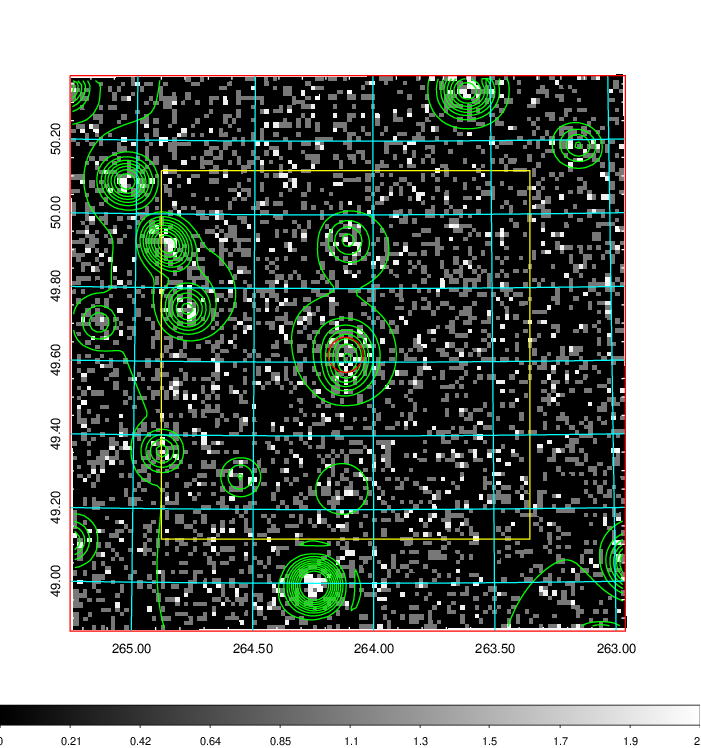
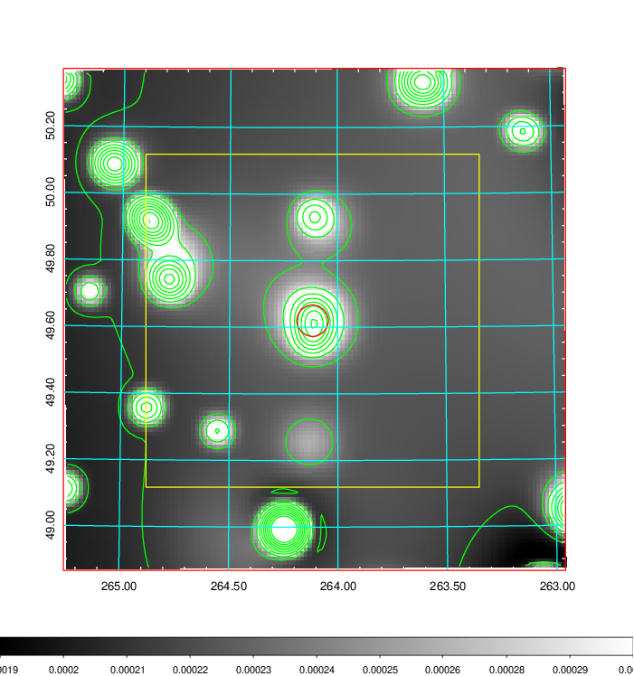
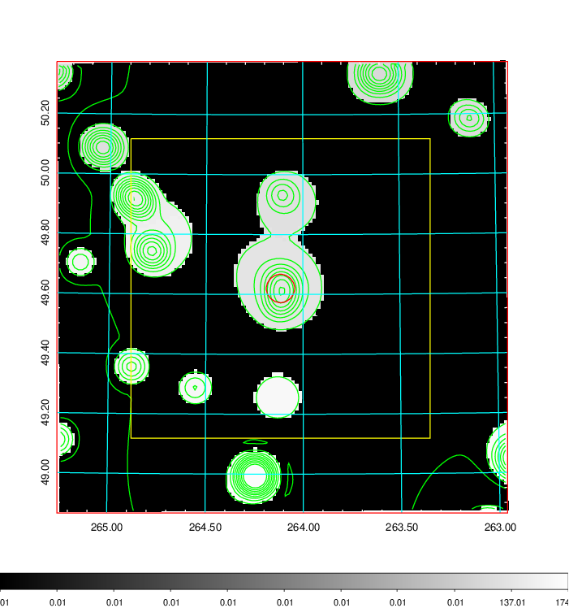
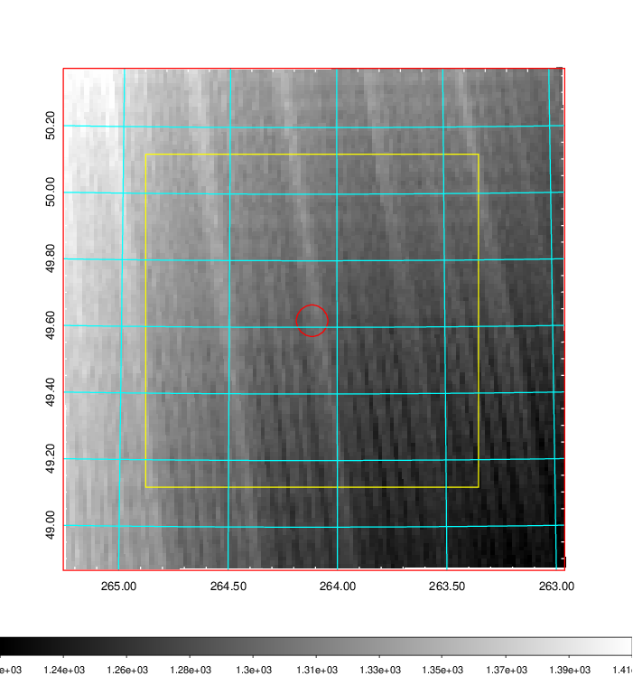
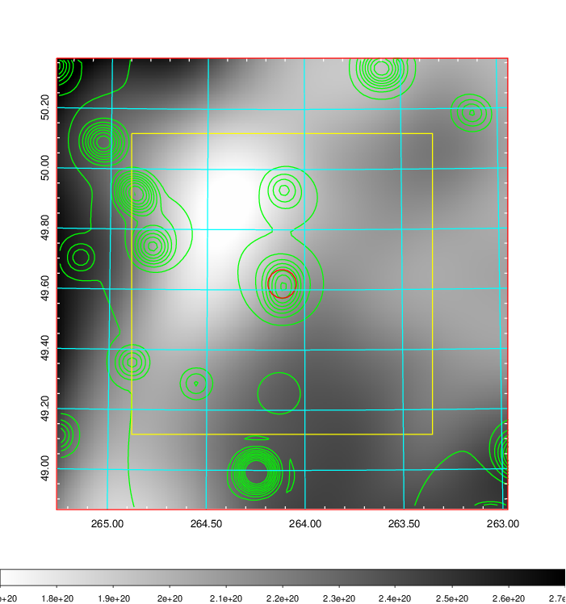
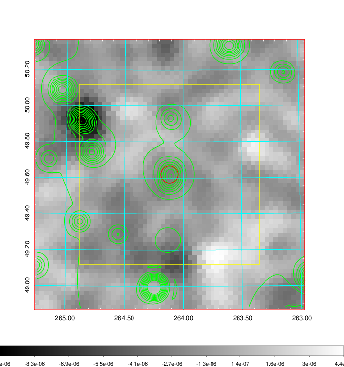
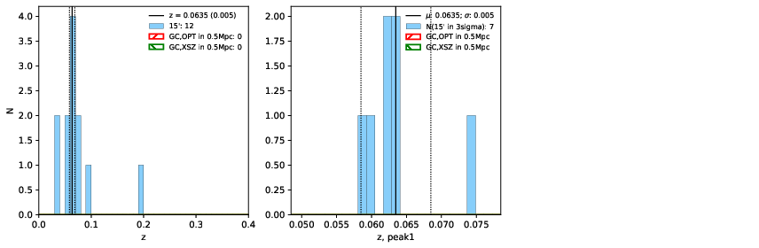
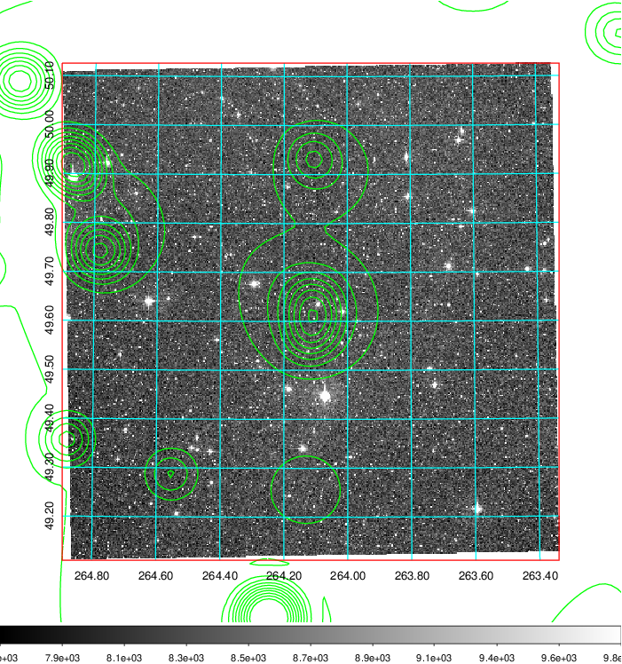
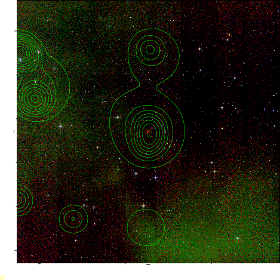
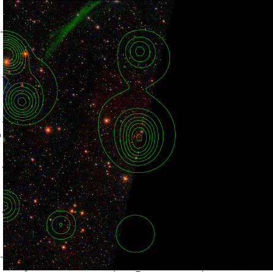

### 733

|Name|RAJ2000[deg]|DEJ2000[deg] |Ext[arcmin]| Ext,ml | z | z_src| C|GC(XSZ,Delta_z<0.01)| GC(OPT,Delta_z<0.01)|GC| R_sig[arcmin] | R500[arcmin] | R500[Mpc]| CRsig[c/s] | CR500[c/s] |L500[1E44 erg/s]|F500[1E-12 erg/s/cm^2]| M500[1E14 Msun]|Tx[keV]|Cnt_sig|Beta|Rc[arcmin]|Comment|Alias|
|---|---|---|---|---|---|------|---|--------|---------|----------|---|---|---|---|---|---|---|---|---|---|---|---|---|---|
|733| 264.116| 49.620| 2.84| 26.61| 0.0635(0.005)| z1,| G| -| -| C, W| 31.119| 9.994| 0.733| 0.204(0.039)| 0.184(0.035)| 0.331(0.217)| 3.404(2.234)| 1.19(0.40)| 2.43(0.51)| 383.5| 0.502(-0.002+0.004)| 4.463(-0.142+0.161)| -| t125|

|[RASS image](../image/733/733_img.pdf)|[filtered image](../image/733/733_fil.pdf)|[Segment image](../image/733/733_seg.pdf)|
|-------------------|--------------------|-------------------|
|   |    |   |

|[Exposure image](../image/733/733_mex.pdf)| [nH image](../image/733/733_nh.pdf)| [Planck image](../image/733/733_p.pdf)|
|-------------------|--------------------|-------------------|
|   |     |  |

|[Redshift Histogram](../image/733/733_zg.pdf) | [DSS image(z1)](../image/733/733_dss_z1.pdf)      |  [DSS image(z2)](../image/733/733_dss_z2.pdf)    |
|-------------------|--------------------|-------------------|
| |  Blue circle for optical clusters;  Magenta circle for XSZ clusters;  all with r=1Mpc;  Only GC with Delta_z<0.01 are shown. |  Blue circle for optical clusters;  Magenta circle for XSZ clusters;  all with r=1Mpc;  Only GC with Delta_z<0.01 are shown.  |

|[known Abell/XSZ clusters](../image/733/733_gc.pdf) | [2MASS image](../image/733/733_2mass.pdf)      |[SDSS image](../image/733/733_sdss.pdf)   |
|-------------------|-------------------|-------------------|
|  Magenta, blue and green circles  for optical, X-ray and SZ clusters  respectively, with redshift of clusters  labelled. The radius of circles  are 1Mpc.|  |   |

