

### 734

|Name|RAJ2000[deg]|DEJ2000[deg] |Ext[arcmin]| Ext,ml | z | z_src| C|GC(XSZ,Delta_z<0.01)| GC(OPT,Delta_z<0.01)|GC| R_sig[arcmin] | R500[arcmin] | R500[Mpc]| CRsig[c/s] | CR500[c/s] |L500[1E44 erg/s]|F500[1E-12 erg/s/cm^2]| M500[1E14 Msun]|Tx[keV]|Cnt_sig|Beta|Rc[arcmin]|Comment|Alias|
|---|---|---|---|---|---|------|---|--------|---------|----------|---|---|---|---|---|---|---|---|---|---|---|---|---|---|
|734| 264.638| 35.077| 1.38| 27.35| 0.1000(0.000)| -| G| -| -| N| 10.262| 7.188| 0.795| 0.119(0.024)| 0.114(0.023)| 0.541(0.067)| 2.132(0.265)| 1.58(0.10)| 2.92(0.12)| 97.1| 0.866(-0.131+0.095)| 3.121(-0.698+0.506)| $z$ of BCG| t022|

|[RASS image](../image/734/734_img.pdf)|[filtered image](../image/734/734_fil.pdf)|[Segment image](../image/734/734_seg.pdf)|
|-------------------|--------------------|-------------------|
| 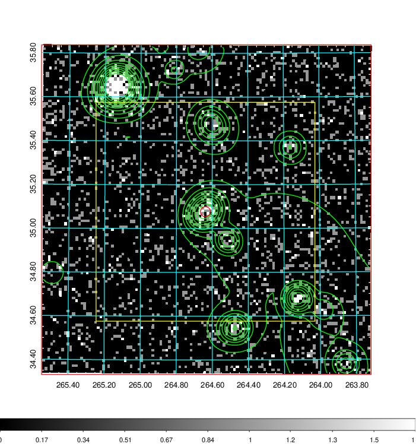  | 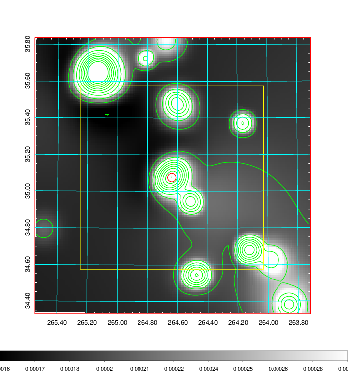   | 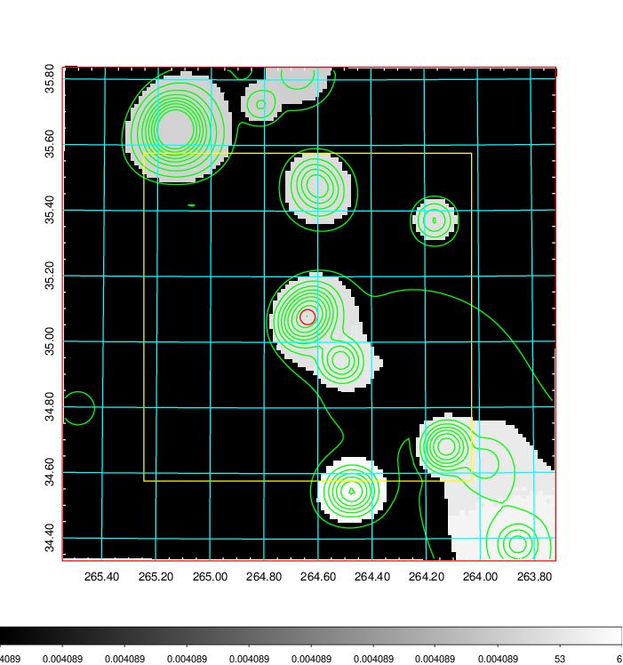  |

|[Exposure image](../image/734/734_mex.pdf)| [nH image](../image/734/734_nh.pdf)| [Planck image](../image/734/734_p.pdf)|
|-------------------|--------------------|-------------------|
|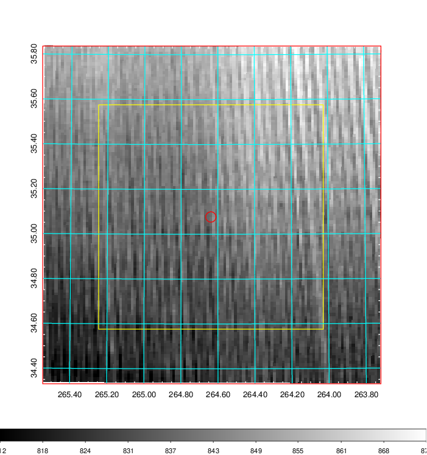   | 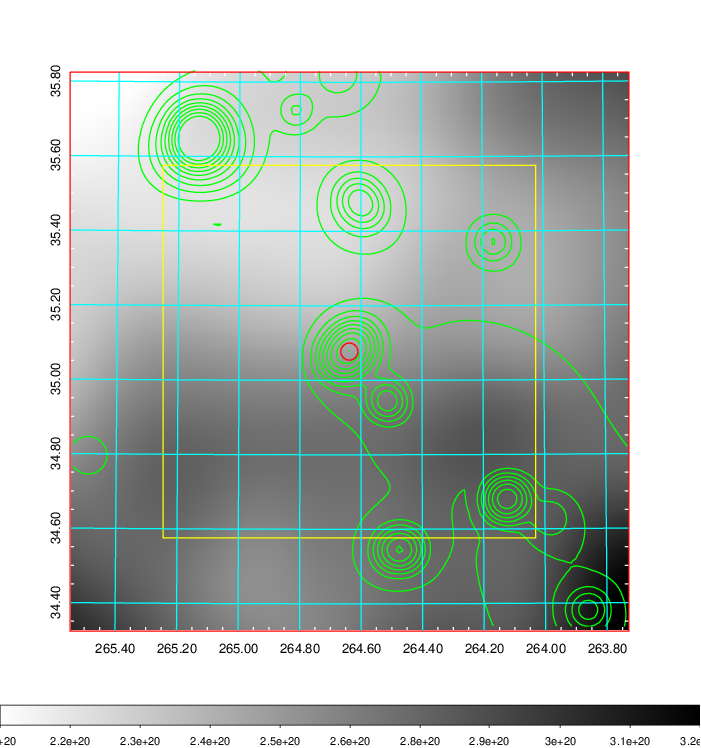    | 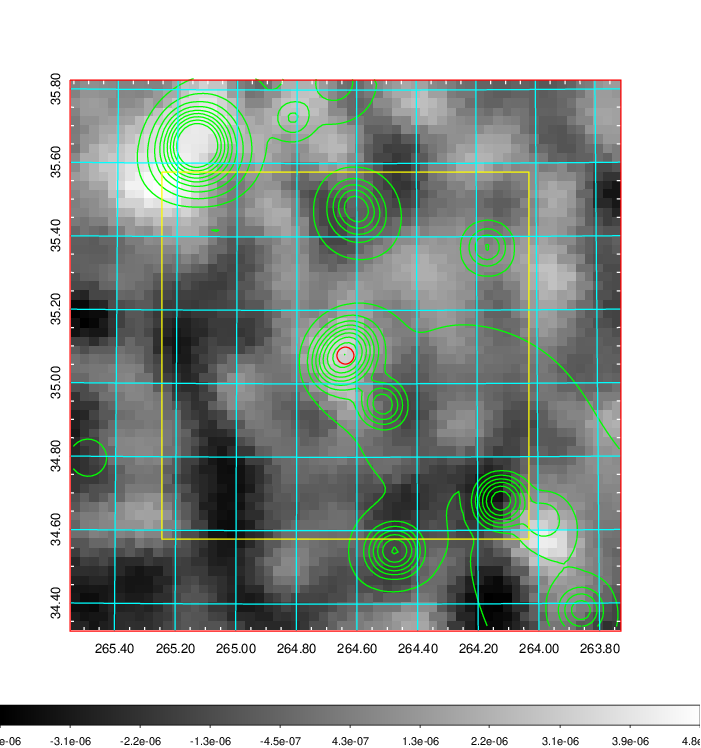 |

|[Redshift Histogram](../image/734/734_zg.pdf) | [DSS image(z1)](../image/734/734_dss_z1.pdf)      |  [DSS image(z2)](../image/734/734_dss_z2.pdf)    |
|-------------------|--------------------|-------------------|
|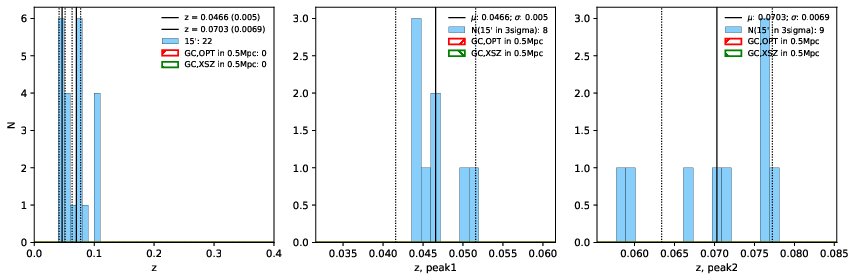 |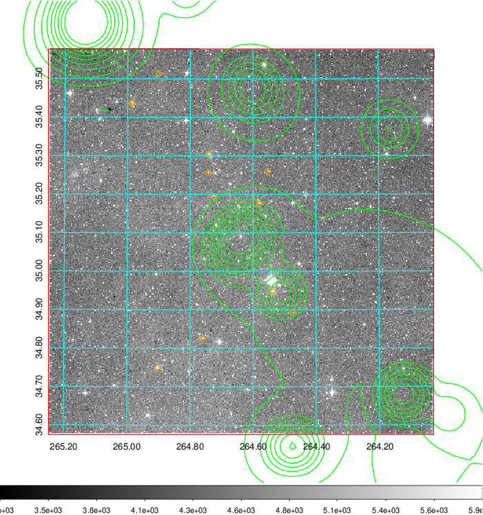  Blue circle for optical clusters;  Magenta circle for XSZ clusters;  all with r=1Mpc;  Only GC with Delta_z<0.01 are shown. | 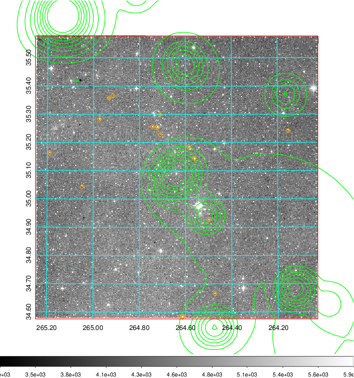 Blue circle for optical clusters;  Magenta circle for XSZ clusters;  all with r=1Mpc;  Only GC with Delta_z<0.01 are shown.  |

|[Previous-identified clusters](../image/734/734_gc.pdf) | [2MASS image](../image/734/734_2mass.pdf)      |
|-------------------|-------------------|
|  Green, magenta, and blue circles  for optical, X-ray and SZ clusters  respectively, with redshift of clusters  labelled. The radius of circles  are 1Mpc.|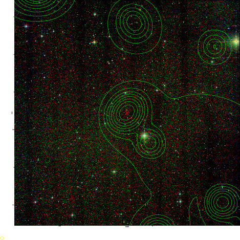  |

|[PS1 image](../image/734/734_ps1.pdf)            |
|-------------------|
| 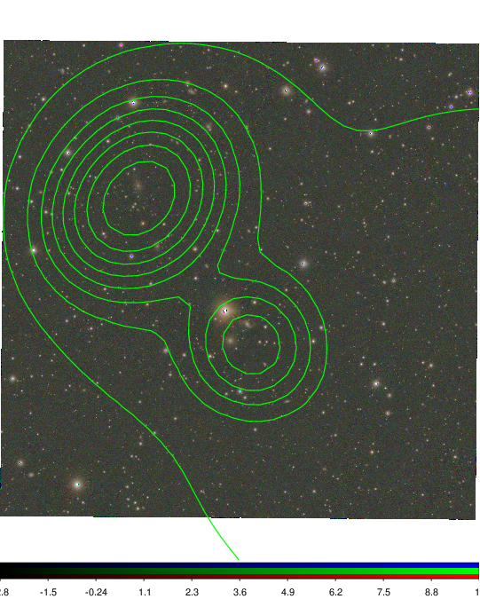  |
