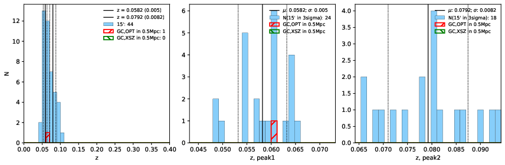

### 736

|Name|RAJ2000[deg]|DEJ2000[deg] |Ext[arcmin]| Ext,ml | z | z_src| C|GC(XSZ,Delta_z<0.01)| GC(OPT,Delta_z<0.01)|GC| R_sig[arcmin] | R500[arcmin] | R500[Mpc]| CRsig[c/s] | CR500[c/s] |L500[1E44 erg/s]|F500[1E-12 erg/s/cm^2]| M500[1E14 Msun]|Tx[keV]|Cnt_sig|Beta|Rc[arcmin]|Comment|Alias|
|---|---|---|---|---|---|------|---|--------|---------|----------|---|---|---|---|---|---|---|---|---|---|---|---|---|---|
|736| 265.453| 17.343| 7.41| 97.24| 0.0582(0.005)| z1, z_opt| S| -| N| C, N, Tar, W| 18.775| 11.561| 0.782| 0.294(0.055)| 0.276(0.052)| 0.387(0.042)| 4.775(0.518)| 1.44(0.08)| 2.72(0.09)| 216.2| 0.963(-0.051+0.027)| 10.854(-0.666+0.518)| An SZ cluster with no $z$ and offset = 0.24 Mpc| t372|

|[RASS image](../image/736/736_img.pdf)|[filtered image](../image/736/736_fil.pdf)|[Segment image](../image/736/736_seg.pdf)|
|-------------------|--------------------|-------------------|
|   |    |   |

|[Exposure image](../image/736/736_mex.pdf)| [nH image](../image/736/736_nh.pdf)| [Planck image](../image/736/736_p.pdf)|
|-------------------|--------------------|-------------------|
|   |     |  |

|[Redshift Histogram](../image/736/736_zg.pdf) | [DSS image(z1)](../image/736/736_dss_z1.pdf)      |  [DSS image(z2)](../image/736/736_dss_z2.pdf)    |
|-------------------|--------------------|-------------------|
| |  Blue circle for optical clusters;  Magenta circle for XSZ clusters;  all with r=1Mpc;  Only GC with Delta_z<0.01 are shown. |  Blue circle for optical clusters;  Magenta circle for XSZ clusters;  all with r=1Mpc;  Only GC with Delta_z<0.01 are shown.  |

|[known Abell/XSZ clusters](../image/736/736_gc.pdf) | [2MASS image](../image/736/736_2mass.pdf)      |[SDSS image](../image/736/736_sdss.pdf)   |
|-------------------|-------------------|-------------------|
|  Magenta, blue and green circles  for optical, X-ray and SZ clusters  respectively, with redshift of clusters  labelled. The radius of circles  are 1Mpc.|  |   |

