

### 737

|Name|RAJ2000[deg]|DEJ2000[deg] |Ext[arcmin]| Ext,ml | z | z_src| C|GC(XSZ,Delta_z<0.01)| GC(OPT,Delta_z<0.01)|GC| R_sig[arcmin] | R500[arcmin] | R500[Mpc]| CRsig[c/s] | CR500[c/s] |L500[1E44 erg/s]|F500[1E-12 erg/s/cm^2]| M500[1E14 Msun]|Tx[keV]|Cnt_sig|Beta|Rc[arcmin]|Comment|Alias|
|---|---|---|---|---|---|------|---|--------|---------|----------|---|---|---|---|---|---|---|---|---|---|---|---|---|---|
|737| 265.683| 67.575| 4.61| 273.57| 0.0412(0.006)| z1, z_xsz| B| MCXC| N| C, MCXC, N, W| 34.575| 10.192| 0.498| 0.075(0.013)| 0.067(0.012)| 0.038(0.004)| 0.961(0.111)| 0.36(0.02)| 1.16(0.04)| 2281.3| 0.949(-0.059+0.037)| 7.772(-0.558+0.374)| -| k511|

|[RASS image](../image/737/737_img.pdf)|[filtered image](../image/737/737_fil.pdf)|[Segment image](../image/737/737_seg.pdf)|
|-------------------|--------------------|-------------------|
| 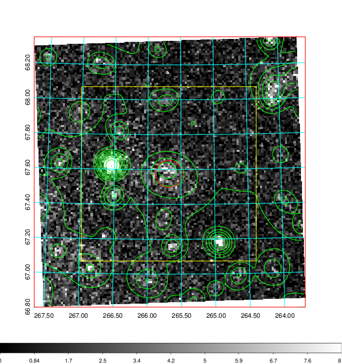  | 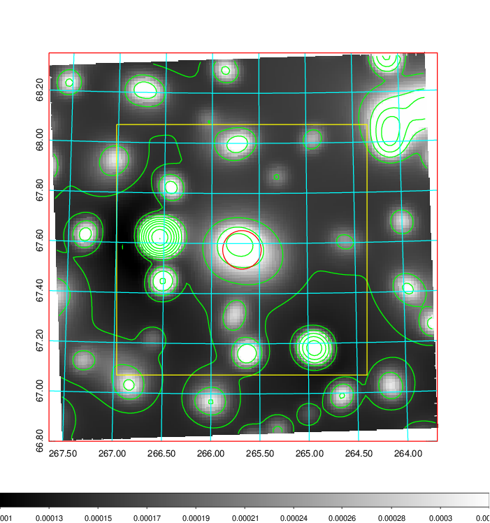   | 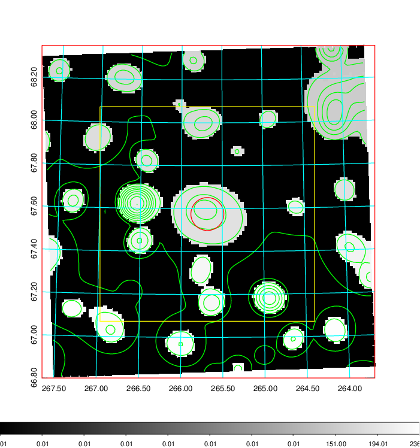  |

|[Exposure image](../image/737/737_mex.pdf)| [nH image](../image/737/737_nh.pdf)| [Planck image](../image/737/737_p.pdf)|
|-------------------|--------------------|-------------------|
|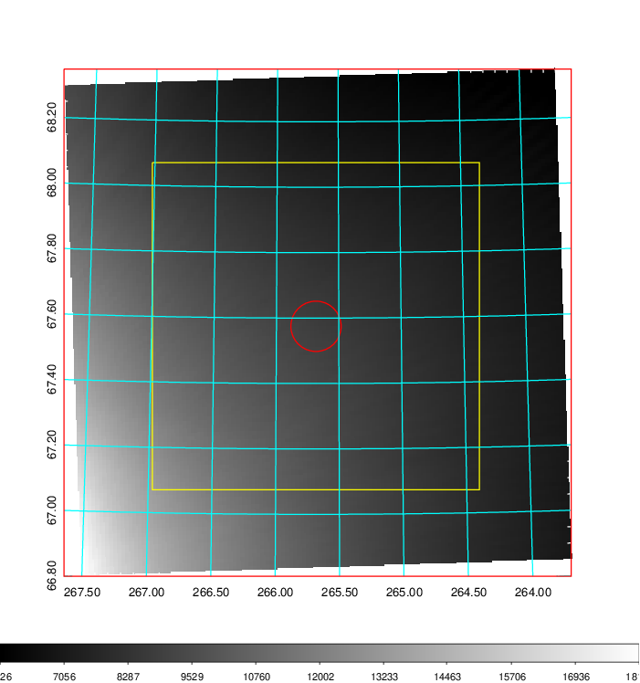   | 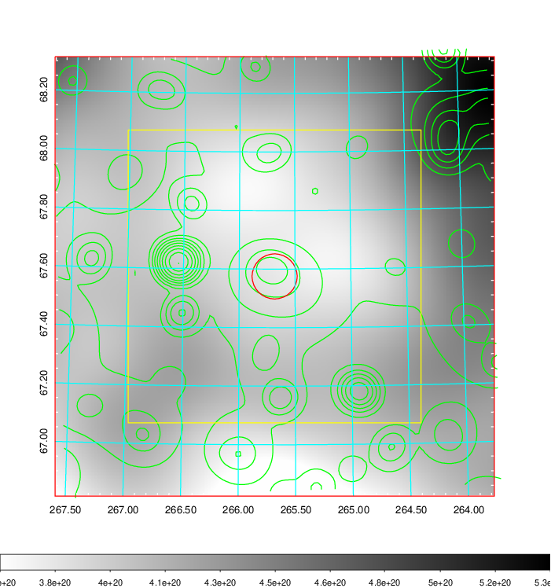    | 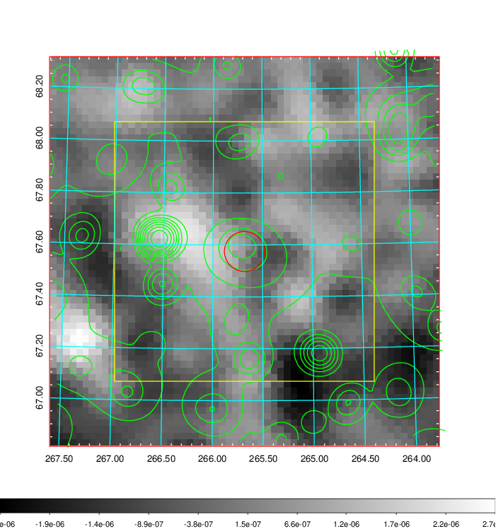 |

|[Redshift Histogram](../image/737/737_zg.pdf) | [DSS image(z1)](../image/737/737_dss_z1.pdf)      |  [DSS image(z2)](../image/737/737_dss_z2.pdf)    |
|-------------------|--------------------|-------------------|
|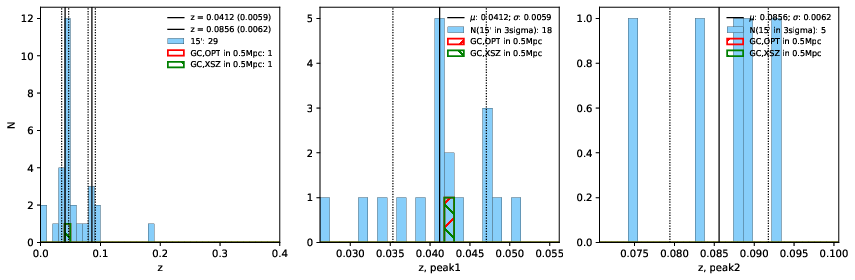 |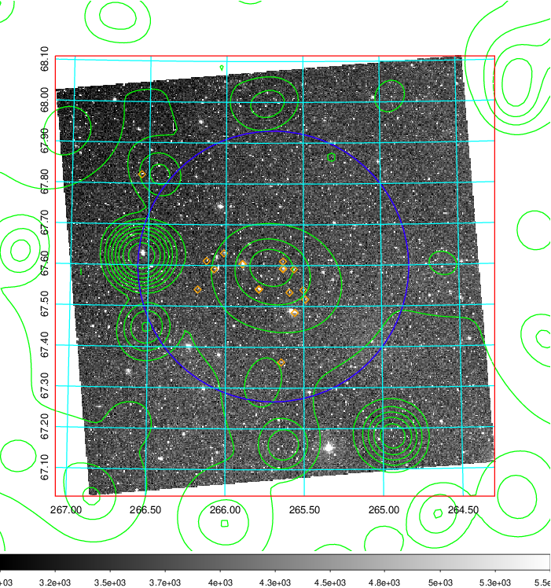  Blue circle for optical clusters;  Magenta circle for XSZ clusters;  all with r=1Mpc;  Only GC with Delta_z<0.01 are shown. | 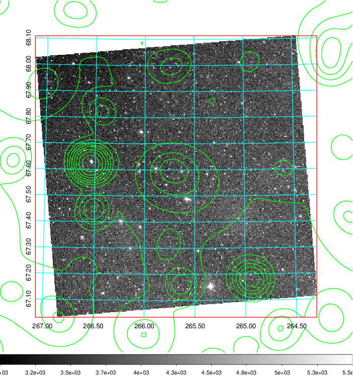 Blue circle for optical clusters;  Magenta circle for XSZ clusters;  all with r=1Mpc;  Only GC with Delta_z<0.01 are shown.  |

|[Previous-identified clusters](../image/737/737_gc.pdf) | [2MASS image](../image/737/737_2mass.pdf)      |[SDSS image](../image/737/737_sdss.pdf)   |
|-------------------|-------------------|-------------------|
|  Green, magenta, and blue circles  for optical, X-ray and SZ clusters  respectively, with redshift of clusters  labelled. The radius of circles  are 1Mpc.|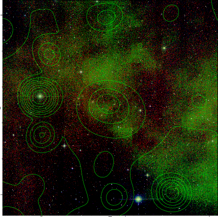  | 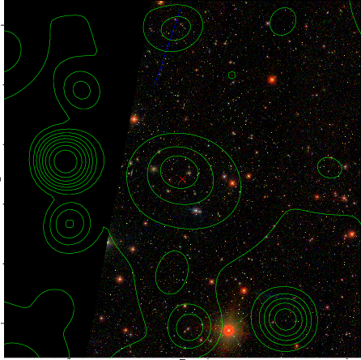  |

