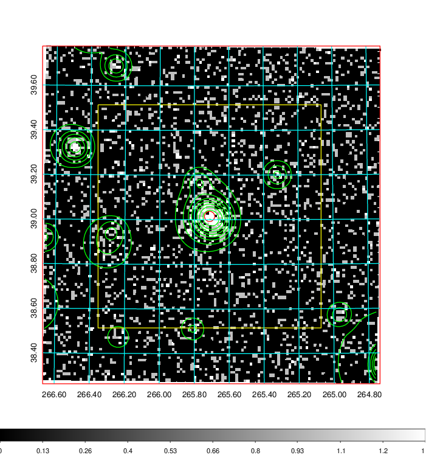
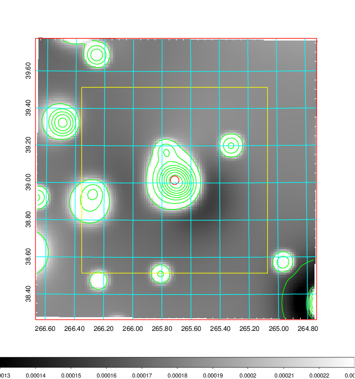
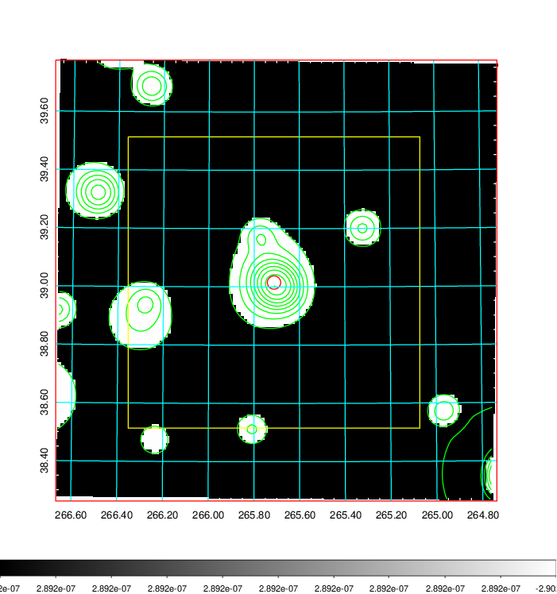
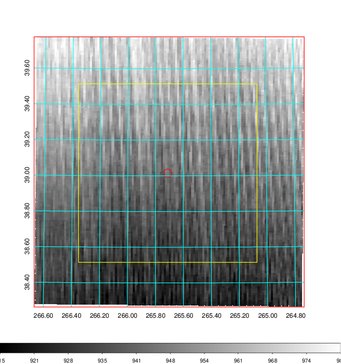
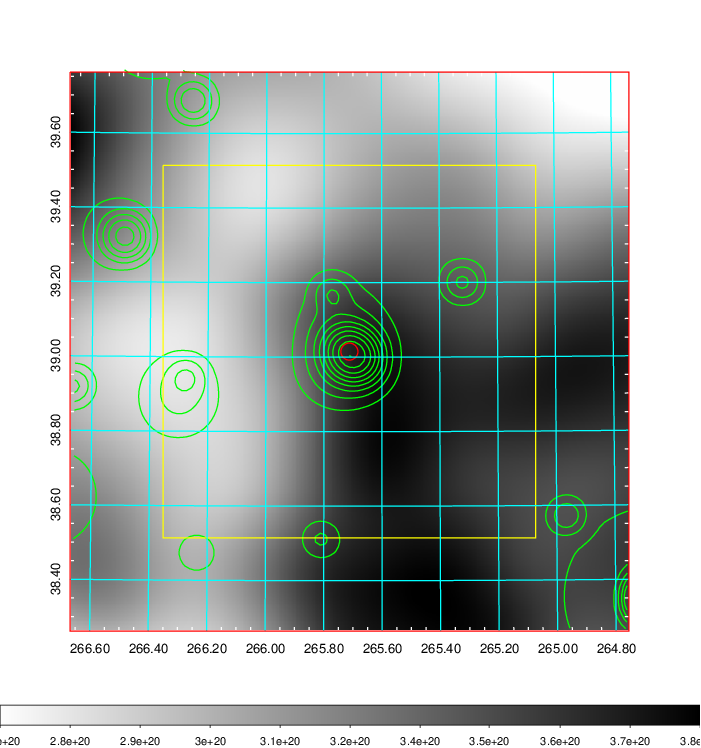
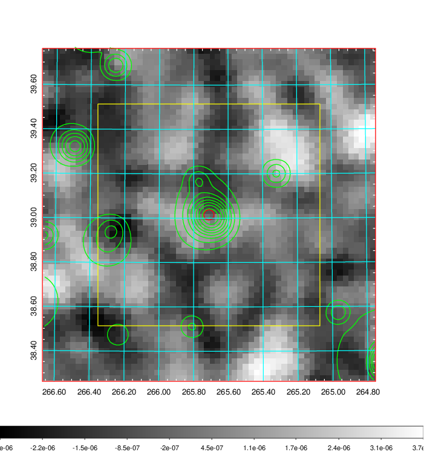
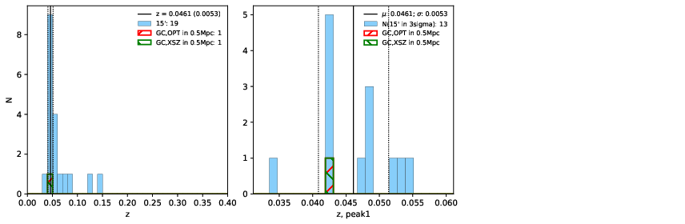
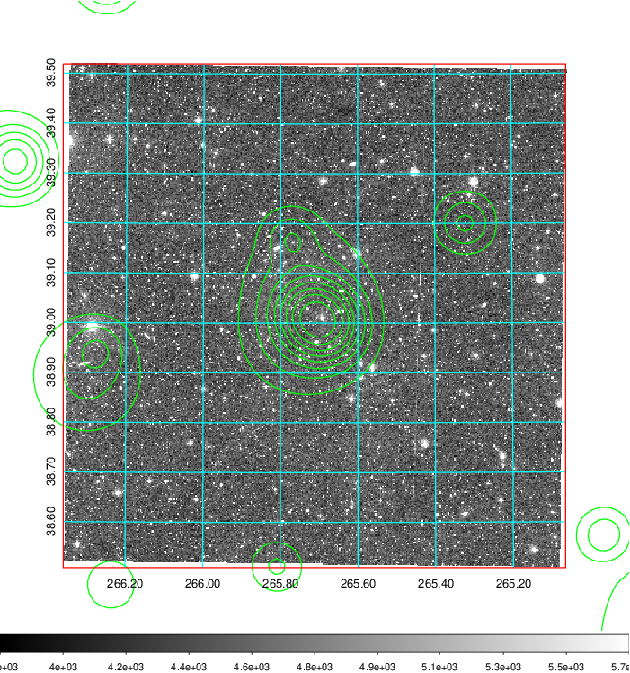
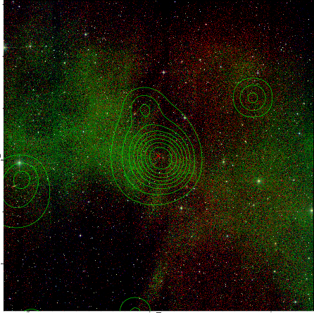
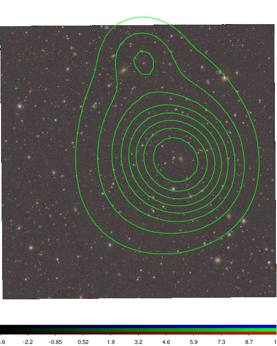

### 738

|Name|RAJ2000[deg]|DEJ2000[deg] |Ext[arcmin]| Ext,ml | z | z_src| C|GC(XSZ,Delta_z<0.01)| GC(OPT,Delta_z<0.01)|GC| R_sig[arcmin] | R500[arcmin] | R500[Mpc]| CRsig[c/s] | CR500[c/s] |L500[1E44 erg/s]|F500[1E-12 erg/s/cm^2]| M500[1E14 Msun]|Tx[keV]|Cnt_sig|Beta|Rc[arcmin]|Comment|Alias|
|---|---|---|---|---|---|------|---|--------|---------|----------|---|---|---|---|---|---|---|---|---|---|---|---|---|---|
|738| 265.712| 39.015| 1.38| 79.87| 0.0461(0.005)| z1, z_xsz| B| MCXC| N| MCXC, N| 9.775| 13.050| 0.709| 0.267(0.026)| 0.283(0.027)| 0.247(0.014)| 4.941(0.286)| 1.06(0.03)| 2.25(0.04)| 242.0| 0.891(-0.098+0.075)| 3.536(-0.542+0.397)| -| k093|

|[RASS image](../image/738/738_img.pdf)|[filtered image](../image/738/738_fil.pdf)|[Segment image](../image/738/738_seg.pdf)|
|-------------------|--------------------|-------------------|
|   |    |   |

|[Exposure image](../image/738/738_mex.pdf)| [nH image](../image/738/738_nh.pdf)| [Planck image](../image/738/738_p.pdf)|
|-------------------|--------------------|-------------------|
|   |     |  |

|[Redshift Histogram](../image/738/738_zg.pdf) | [DSS image(z1)](../image/738/738_dss_z1.pdf)      |  [DSS image(z2)](../image/738/738_dss_z2.pdf)    |
|-------------------|--------------------|-------------------|
| |  Blue circle for optical clusters;  Magenta circle for XSZ clusters;  all with r=1Mpc;  Only GC with Delta_z<0.01 are shown. |  Blue circle for optical clusters;  Magenta circle for XSZ clusters;  all with r=1Mpc;  Only GC with Delta_z<0.01 are shown.  |

|[Previous-identified clusters](../image/738/738_gc.pdf) | [2MASS image](../image/738/738_2mass.pdf)      |
|-------------------|-------------------|
|  Green, magenta, and blue circles  for optical, X-ray and SZ clusters  respectively, with redshift of clusters  labelled. The radius of circles  are 1Mpc.|  |

|[PS1 image](../image/738/738_ps1.pdf)            |
|-------------------|
|   |
