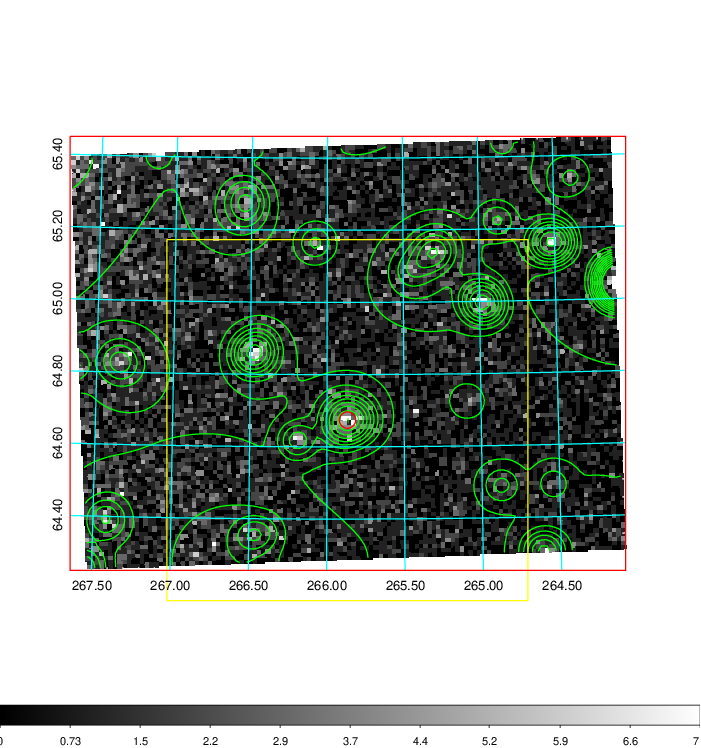
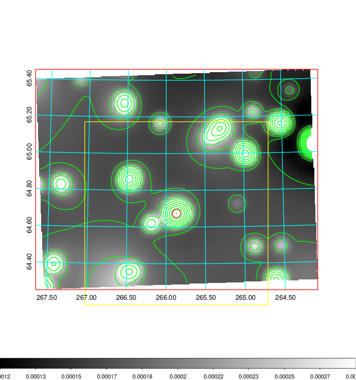
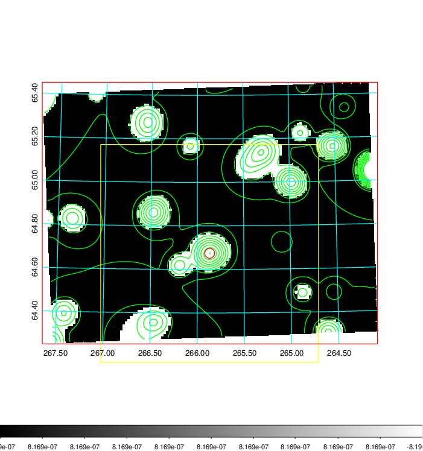
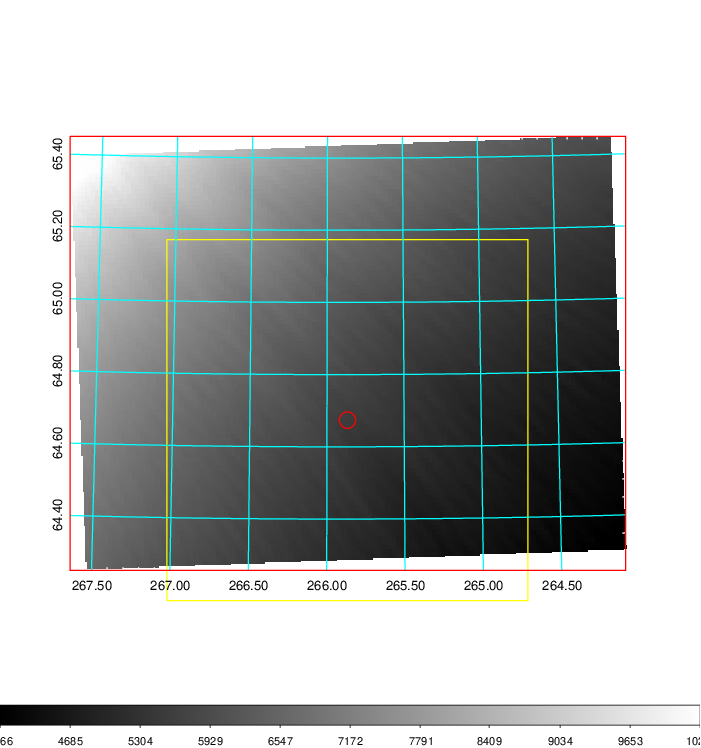
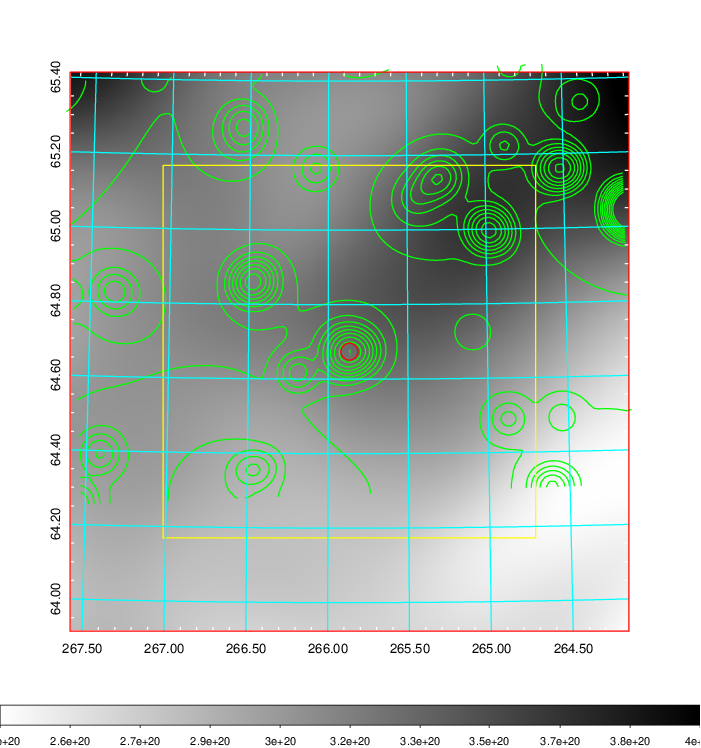
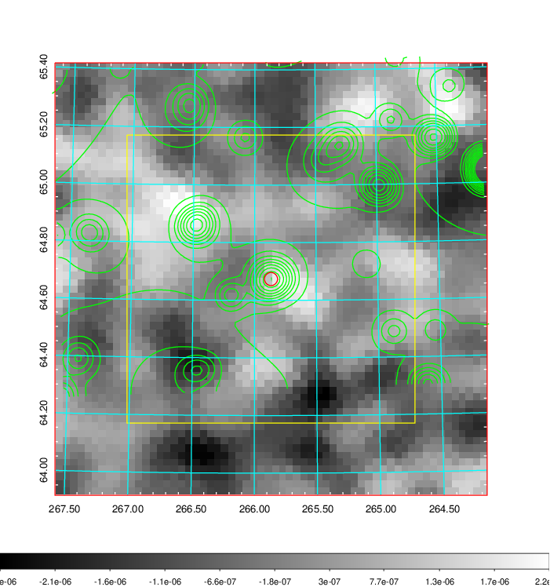
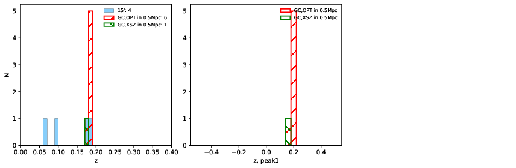
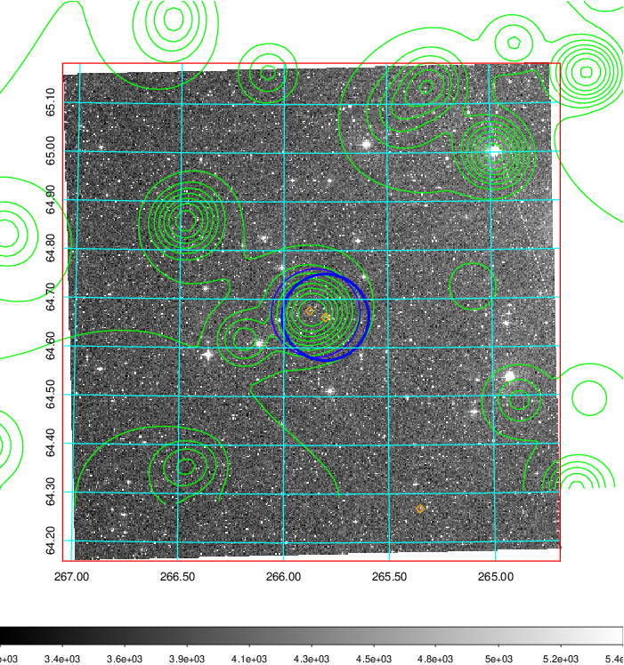
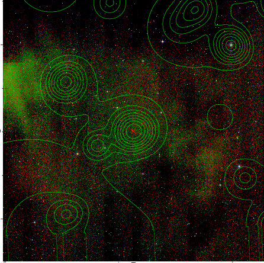
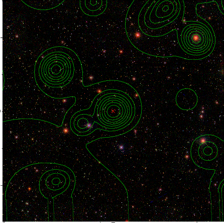

### 739

|Name|RAJ2000[deg]|DEJ2000[deg] |Ext[arcmin]| Ext,ml | z | z_src| C|GC(XSZ,Delta_z<0.01)| GC(OPT,Delta_z<0.01)|GC| R_sig[arcmin] | R500[arcmin] | R500[Mpc]| CRsig[c/s] | CR500[c/s] |L500[1E44 erg/s]|F500[1E-12 erg/s/cm^2]| M500[1E14 Msun]|Tx[keV]|Cnt_sig|Beta|Rc[arcmin]|Comment|Alias|
|---|---|---|---|---|---|------|---|--------|---------|----------|---|---|---|---|---|---|---|---|---|---|---|---|---|---|
|739| 265.867| 64.674| 1.36| 43.88| 0.1790(0.000)| z_xsz| B| MCXC| C, N, W| A, C, MCXC, N, W| 13.188| 4.207| 0.763| 0.035(0.008)| 0.031(0.007)| 0.521(0.071)| 0.580(0.079)| 1.50(0.10)| 2.92(0.13)| 285.5| 0.929(-0.089+0.051)| 2.825(-0.387+0.294)| -| k088|

|[RASS image](../image/739/739_img.pdf)|[filtered image](../image/739/739_fil.pdf)|[Segment image](../image/739/739_seg.pdf)|
|-------------------|--------------------|-------------------|
|   |    |   |

|[Exposure image](../image/739/739_mex.pdf)| [nH image](../image/739/739_nh.pdf)| [Planck image](../image/739/739_p.pdf)|
|-------------------|--------------------|-------------------|
|   |     |  |

|[Redshift Histogram](../image/739/739_zg.pdf) | [DSS image(z1)](../image/739/739_dss_z1.pdf)      |  [DSS image(z2)](../image/739/739_dss_z2.pdf)    |
|-------------------|--------------------|-------------------|
| |  Blue circle for optical clusters;  Magenta circle for XSZ clusters;  all with r=1Mpc;  Only GC with Delta_z<0.01 are shown. |  Blue circle for optical clusters;  Magenta circle for XSZ clusters;  all with r=1Mpc;  Only GC with Delta_z<0.01 are shown.  |

|[Previous-identified clusters](../image/739/739_gc.pdf) | [2MASS image](../image/739/739_2mass.pdf)      |[SDSS image](../image/739/739_sdss.pdf)   |
|-------------------|-------------------|-------------------|
|  Green, magenta, and blue circles  for optical, X-ray and SZ clusters  respectively, with redshift of clusters  labelled. The radius of circles  are 1Mpc.|  |   |

