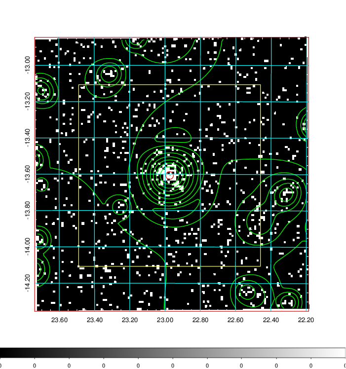
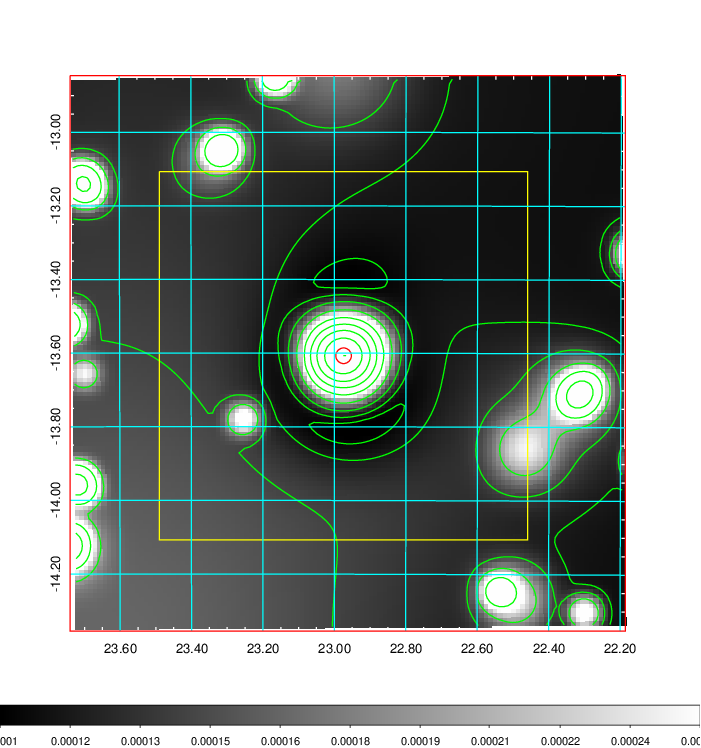
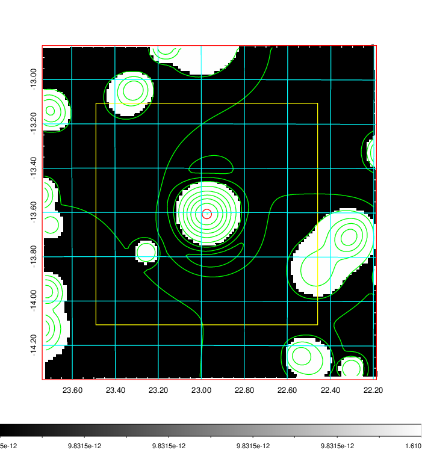
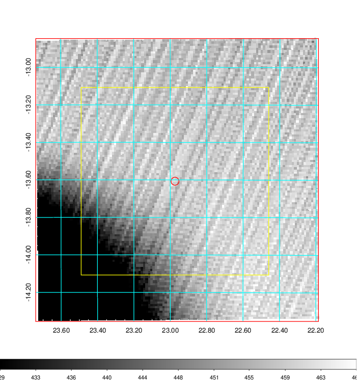
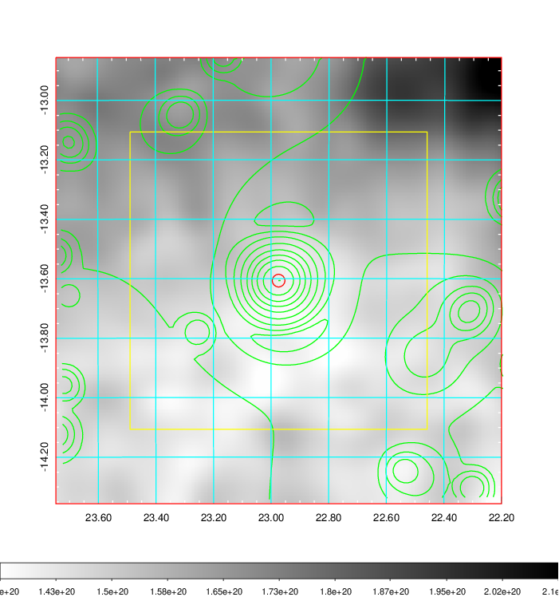
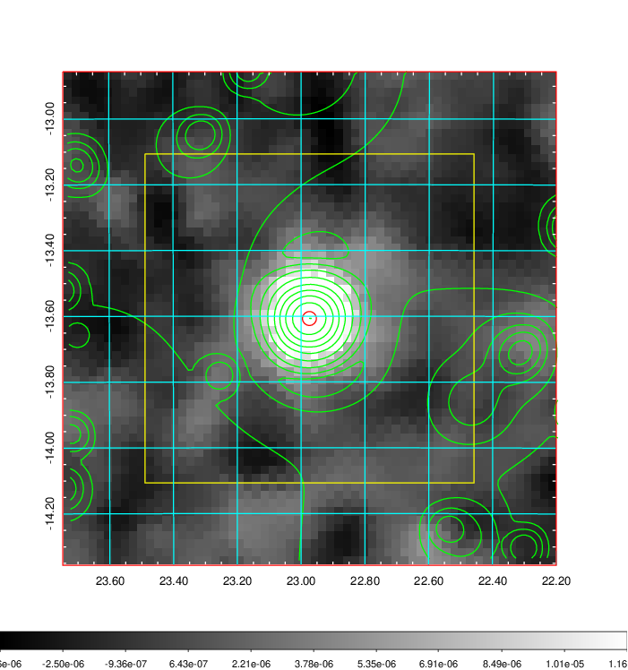
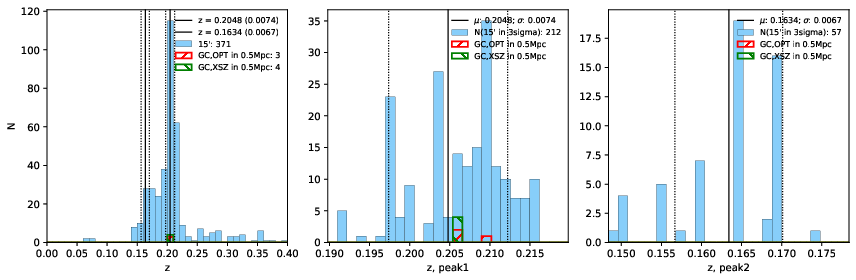
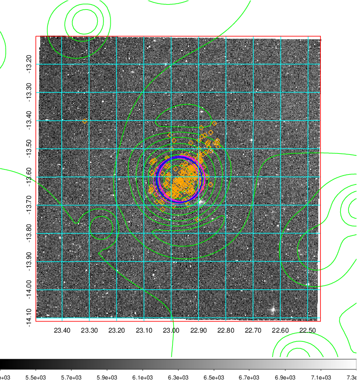
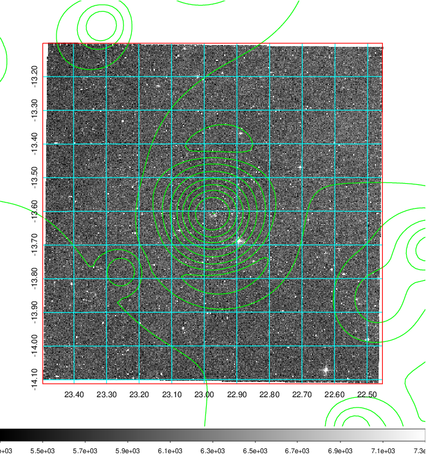

### 74

|Name|RAJ2000[deg]|DEJ2000[deg] |Ext[arcmin]| Ext,ml | z | z_src| C|GC(XSZ,Delta_z<0.01)| GC(OPT,Delta_z<0.01)|GC| R_sig[arcmin] | R500[arcmin] | R500[Mpc]| CRsig[c/s] | CR500[c/s] |L500[1E44 erg/s]|F500[1E-12 erg/s/cm^2]| M500[1E14 Msun]|Tx[keV]|Cnt_sig|Beta|Rc[arcmin]|Comment|Alias|
|---|---|---|---|---|---|------|---|--------|---------|----------|---|---|---|---|---|---|---|---|---|---|---|---|---|---|
|74| 22.974| -13.607| 1.27| 50.82| 0.2048(0.007)| z1, z_xsz| B| MCXC, PSZ2, Tar, XB| A, W| A, MCXC, PSZ2, Tar, W, XB| 8.312| 6.073| 1.225| 0.265(0.033)| 0.254(0.032)| 6.285(0.358)| 5.186(0.295)| 6.41(0.17)| 7.20(0.12)| 128.8| 0.805(-0.117+0.121)| 2.451(-0.644+0.570)| -| k072|

|[RASS image](../image/74/74_img.pdf)|[filtered image](../image/74/74_fil.pdf)|[Segment image](../image/74/74_seg.pdf)|
|-------------------|--------------------|-------------------|
|   |    |   |

|[Exposure image](../image/74/74_mex.pdf)| [nH image](../image/74/74_nh.pdf)| [Planck image](../image/74/74_p.pdf)|
|-------------------|--------------------|-------------------|
|   |     |  |

|[Redshift Histogram](../image/74/74_zg.pdf) | [DSS image(z1)](../image/74/74_dss_z1.pdf)      |  [DSS image(z2)](../image/74/74_dss_z2.pdf)    |
|-------------------|--------------------|-------------------|
| |  Blue circle for optical clusters;  Magenta circle for XSZ clusters;  all with r=1Mpc;  Only GC with Delta_z<0.01 are shown. |  Blue circle for optical clusters;  Magenta circle for XSZ clusters;  all with r=1Mpc;  Only GC with Delta_z<0.01 are shown.  |

|[known Abell/XSZ clusters](../image/74/74_gc.pdf) | [2MASS image](../image/74/74_2mass.pdf)      |
|-------------------|-------------------|
|  Magenta, blue and green circles  for optical, X-ray and SZ clusters  respectively, with redshift of clusters  labelled. The radius of circles  are 1Mpc.|  |

|[DES image](../image/74/74_des.pdf)   |[ATLAS image](../image/74/74_s.pdf)        |
|-------------------|-------------------|
|   |   |
