

### 742

|Name|RAJ2000[deg]|DEJ2000[deg] |Ext[arcmin]| Ext,ml | z | z_src| C|GC(XSZ,Delta_z<0.01)| GC(OPT,Delta_z<0.01)|GC| R_sig[arcmin] | R500[arcmin] | R500[Mpc]| CRsig[c/s] | CR500[c/s] |L500[1E44 erg/s]|F500[1E-12 erg/s/cm^2]| M500[1E14 Msun]|Tx[keV]|Cnt_sig|Beta|Rc[arcmin]|Comment|Alias|
|---|---|---|---|---|---|------|---|--------|---------|----------|---|---|---|---|---|---|---|---|---|---|---|---|---|---|
|742| 266.797| 45.213| 2.31| 115.04| 0.1565(0.000)| z_xsz| B| MCXC, PSZ2, Tar| C, N, W, Zw| C, MCXC, N, PSZ2, Tar, W| 13.188| 6.408| 1.041| 0.198(0.022)| 0.183(0.020)| 2.356(0.134)| 3.528(0.201)| 3.74(0.10)| 5.08(0.09)| 186.6| 0.942(-0.072+0.042)| 5.467(-0.479+0.346)| -| k266|

|[RASS image](../image/742/742_img.pdf)|[filtered image](../image/742/742_fil.pdf)|[Segment image](../image/742/742_seg.pdf)|
|-------------------|--------------------|-------------------|
| 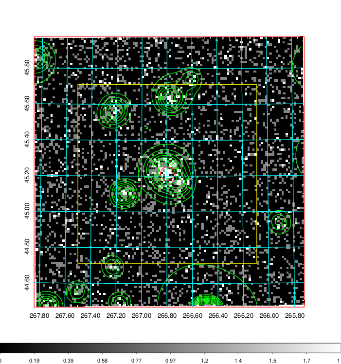  | 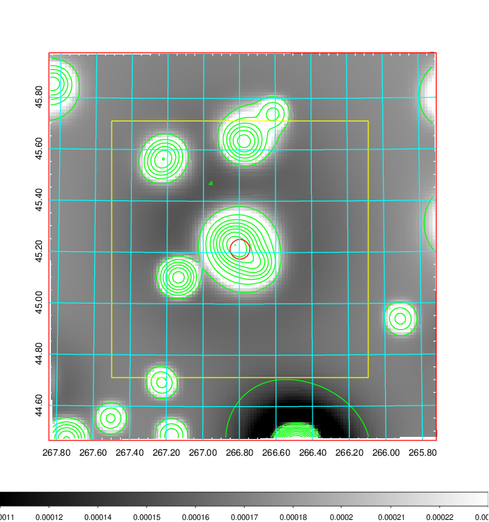   | 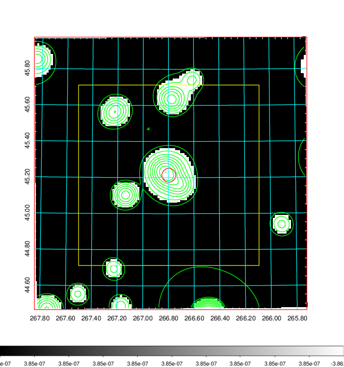  |

|[Exposure image](../image/742/742_mex.pdf)| [nH image](../image/742/742_nh.pdf)| [Planck image](../image/742/742_p.pdf)|
|-------------------|--------------------|-------------------|
|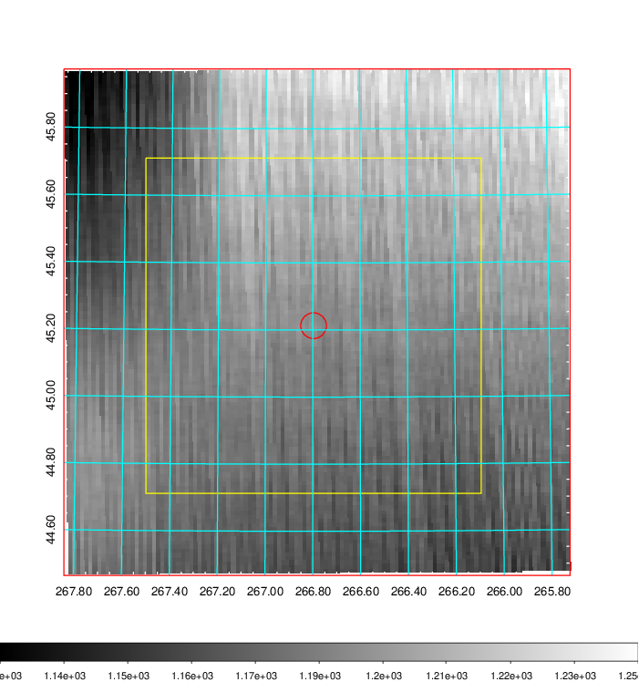   | 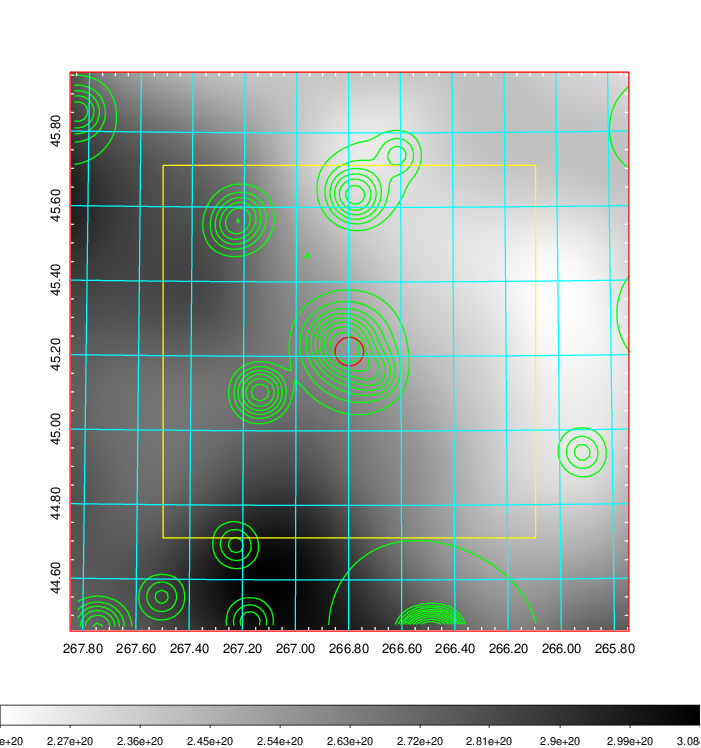    | 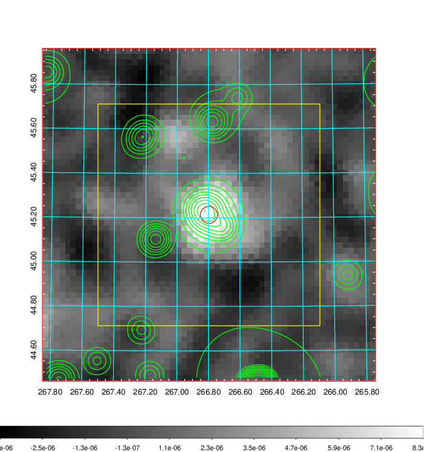 |

|[Redshift Histogram](../image/742/742_zg.pdf) | [DSS image(z1)](../image/742/742_dss_z1.pdf)      |  [DSS image(z2)](../image/742/742_dss_z2.pdf)    |
|-------------------|--------------------|-------------------|
|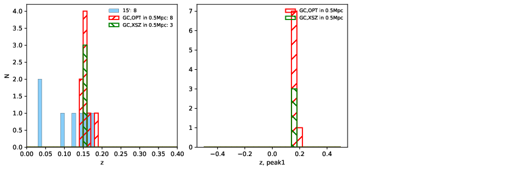 |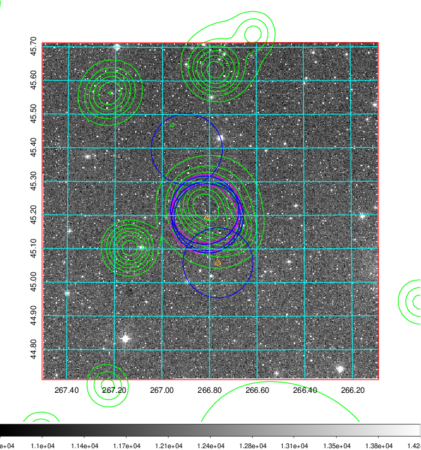  Blue circle for optical clusters;  Magenta circle for XSZ clusters;  all with r=1Mpc;  Only GC with Delta_z<0.01 are shown. | 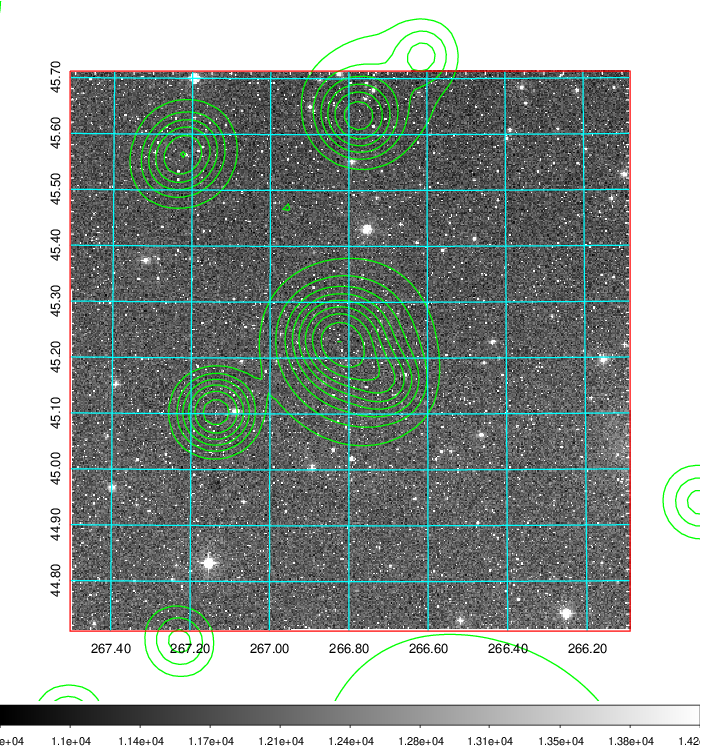 Blue circle for optical clusters;  Magenta circle for XSZ clusters;  all with r=1Mpc;  Only GC with Delta_z<0.01 are shown.  |

|[known Abell/XSZ clusters](../image/742/742_gc.pdf) | [2MASS image](../image/742/742_2mass.pdf)      |[SDSS image](../image/742/742_sdss.pdf)   |
|-------------------|-------------------|-------------------|
|  Magenta, blue and green circles  for optical, X-ray and SZ clusters  respectively, with redshift of clusters  labelled. The radius of circles  are 1Mpc.|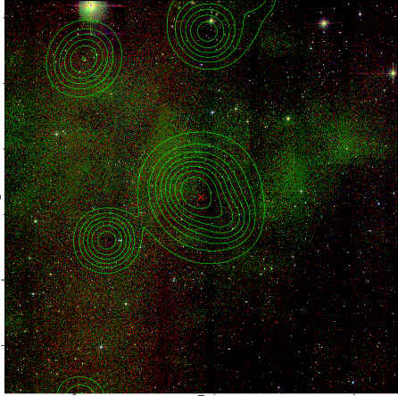  | 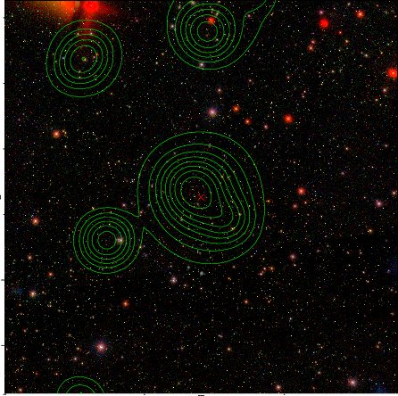  |

