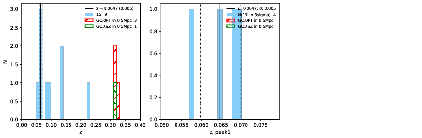

### 743

|Name|RAJ2000[deg]|DEJ2000[deg] |Ext[arcmin]| Ext,ml | z | z_src| C|GC(XSZ,Delta_z<0.01)| GC(OPT,Delta_z<0.01)|GC| R_sig[arcmin] | R500[arcmin] | R500[Mpc]| CRsig[c/s] | CR500[c/s] |L500[1E44 erg/s]|F500[1E-12 erg/s/cm^2]| M500[1E14 Msun]|Tx[keV]|Cnt_sig|Beta|Rc[arcmin]|Comment|Alias|
|---|---|---|---|---|---|------|---|--------|---------|----------|---|---|---|---|---|---|---|---|---|---|---|---|---|---|
|743| 266.848| 54.482| 2.03| 28.51| 0.3100(0.000)| z_xsz| B| Tar| N, W| C, N, Tar, W| 12.212| 3.832| 1.048| 0.067(0.016)| 0.060(0.014)| 3.709(0.666)| 1.192(0.214)| 4.50(0.38)| 6.00(0.32)| 172.2| 0.546(-0.034+0.076)| 2.221(-0.468+0.790)| -| t063|

|[RASS image](../image/743/743_img.pdf)|[filtered image](../image/743/743_fil.pdf)|[Segment image](../image/743/743_seg.pdf)|
|-------------------|--------------------|-------------------|
|   |    |   |

|[Exposure image](../image/743/743_mex.pdf)| [nH image](../image/743/743_nh.pdf)| [Planck image](../image/743/743_p.pdf)|
|-------------------|--------------------|-------------------|
|   |     |  |

|[Redshift Histogram](../image/743/743_zg.pdf) | [DSS image(z1)](../image/743/743_dss_z1.pdf)      |  [DSS image(z2)](../image/743/743_dss_z2.pdf)    |
|-------------------|--------------------|-------------------|
| |  Blue circle for optical clusters;  Magenta circle for XSZ clusters;  all with r=1Mpc;  Only GC with Delta_z<0.01 are shown. |  Blue circle for optical clusters;  Magenta circle for XSZ clusters;  all with r=1Mpc;  Only GC with Delta_z<0.01 are shown.  |

|[Previous-identified clusters](../image/743/743_gc.pdf) | [2MASS image](../image/743/743_2mass.pdf)      |[SDSS image](../image/743/743_sdss.pdf)   |
|-------------------|-------------------|-------------------|
|  Green, magenta, and blue circles  for optical, X-ray and SZ clusters  respectively, with redshift of clusters  labelled. The radius of circles  are 1Mpc.|  |   |

