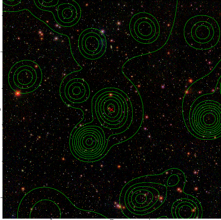

### 744

|Name|RAJ2000[deg]|DEJ2000[deg] |Ext[arcmin]| Ext,ml | z | z_src| C|GC(XSZ,Delta_z<0.01)| GC(OPT,Delta_z<0.01)|GC| R_sig[arcmin] | R500[arcmin] | R500[Mpc]| CRsig[c/s] | CR500[c/s] |L500[1E44 erg/s]|F500[1E-12 erg/s/cm^2]| M500[1E14 Msun]|Tx[keV]|Cnt_sig|Beta|Rc[arcmin]|Comment|Alias|
|---|---|---|---|---|---|------|---|--------|---------|----------|---|---|---|---|---|---|---|---|---|---|---|---|---|---|
|744| 266.884| 63.741| 1.84| 48.53| 0.3280(0.000)| z_xsz| B| MCXC| C, N| C, MCXC, N, W| 11.725| 3.567| 1.013| 0.053(0.009)| 0.048(0.008)| 3.367(0.455)| 0.949(0.128)| 4.15(0.26)| 5.75(0.23)| 362.1| 0.540(-0.029+0.054)| 1.986(-0.342+0.539)| -| k179|

|[RASS image](../image/744/744_img.pdf)|[filtered image](../image/744/744_fil.pdf)|[Segment image](../image/744/744_seg.pdf)|
|-------------------|--------------------|-------------------|
|   |    |   |

|[Exposure image](../image/744/744_mex.pdf)| [nH image](../image/744/744_nh.pdf)| [Planck image](../image/744/744_p.pdf)|
|-------------------|--------------------|-------------------|
|   |     |  |

|[Redshift Histogram](../image/744/744_zg.pdf) | [DSS image(z1)](../image/744/744_dss_z1.pdf)      |  [DSS image(z2)](../image/744/744_dss_z2.pdf)    |
|-------------------|--------------------|-------------------|
| |  Blue circle for optical clusters;  Magenta circle for XSZ clusters;  all with r=1Mpc;  Only GC with Delta_z<0.01 are shown. |  Blue circle for optical clusters;  Magenta circle for XSZ clusters;  all with r=1Mpc;  Only GC with Delta_z<0.01 are shown.  |

|[known Abell/XSZ clusters](../image/744/744_gc.pdf) | [2MASS image](../image/744/744_2mass.pdf)      |[SDSS image](../image/744/744_sdss.pdf)   |
|-------------------|-------------------|-------------------|
|  Magenta, blue and green circles  for optical, X-ray and SZ clusters  respectively, with redshift of clusters  labelled. The radius of circles  are 1Mpc.|  |   |

