

### 745

|Name|RAJ2000[deg]|DEJ2000[deg] |Ext[arcmin]| Ext,ml | z | z_src| C|GC(XSZ,Delta_z<0.01)| GC(OPT,Delta_z<0.01)|GC| R_sig[arcmin] | R500[arcmin] | R500[Mpc]| CRsig[c/s] | CR500[c/s] |L500[1E44 erg/s]|F500[1E-12 erg/s/cm^2]| M500[1E14 Msun]|Tx[keV]|Cnt_sig|Beta|Rc[arcmin]|Comment|Alias|
|---|---|---|---|---|---|------|---|--------|---------|----------|---|---|---|---|---|---|---|---|---|---|---|---|---|---|
|745| 267.423| 53.569| 3.35| 111.20| 0.0939(0.005)| z1, z_xsz| B| MCXC| N, W| C, MCXC, N, W| 13.675| 7.096| 0.742| 0.098(0.016)| 0.091(0.015)| 0.363(0.044)| 1.639(0.199)| 1.27(0.08)| 2.56(0.10)| 246.9| 0.701(-0.106+0.150)| 3.877(-0.973+1.169)| -| k412|

|[RASS image](../image/745/745_img.pdf)|[filtered image](../image/745/745_fil.pdf)|[Segment image](../image/745/745_seg.pdf)|
|-------------------|--------------------|-------------------|
| 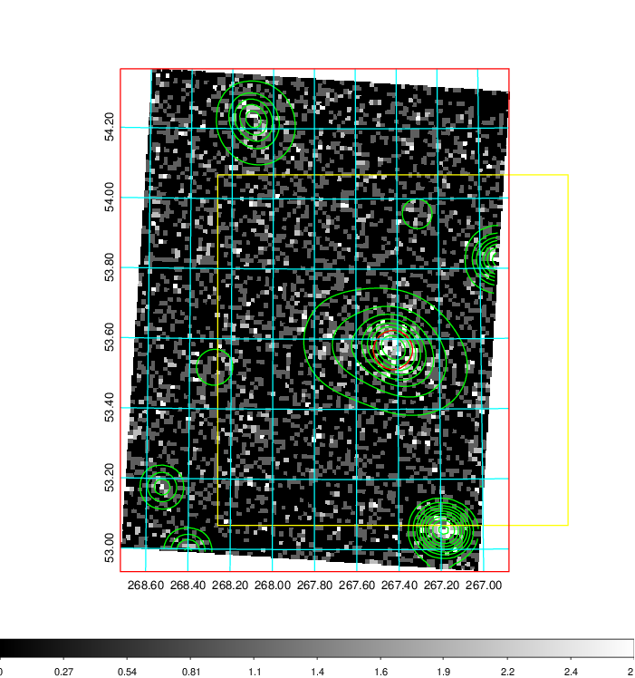  | 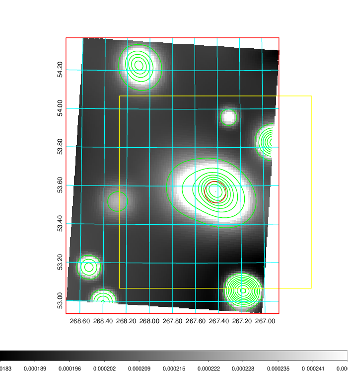   | 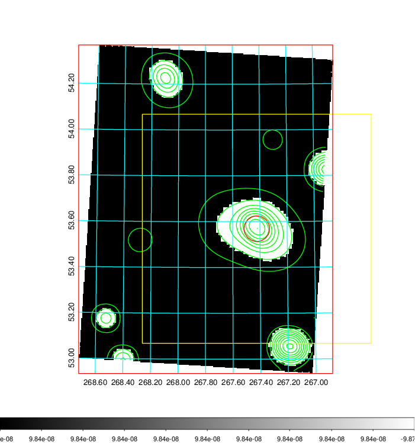  |

|[Exposure image](../image/745/745_mex.pdf)| [nH image](../image/745/745_nh.pdf)| [Planck image](../image/745/745_p.pdf)|
|-------------------|--------------------|-------------------|
|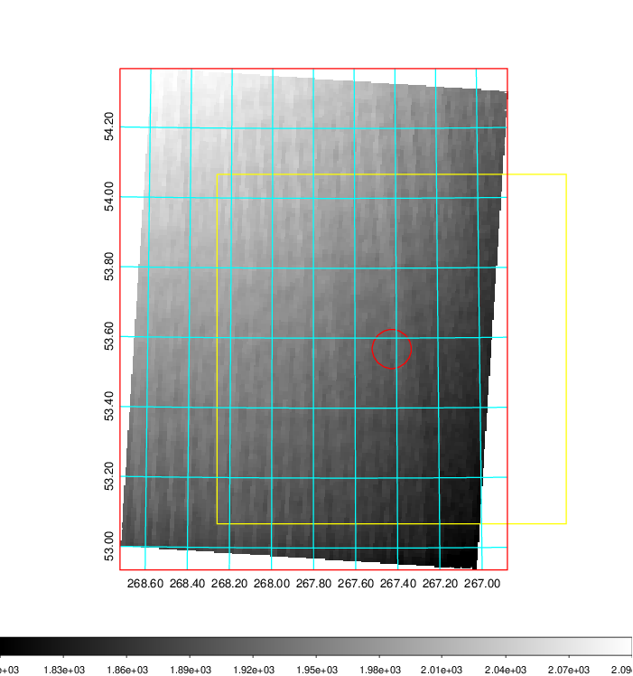   | 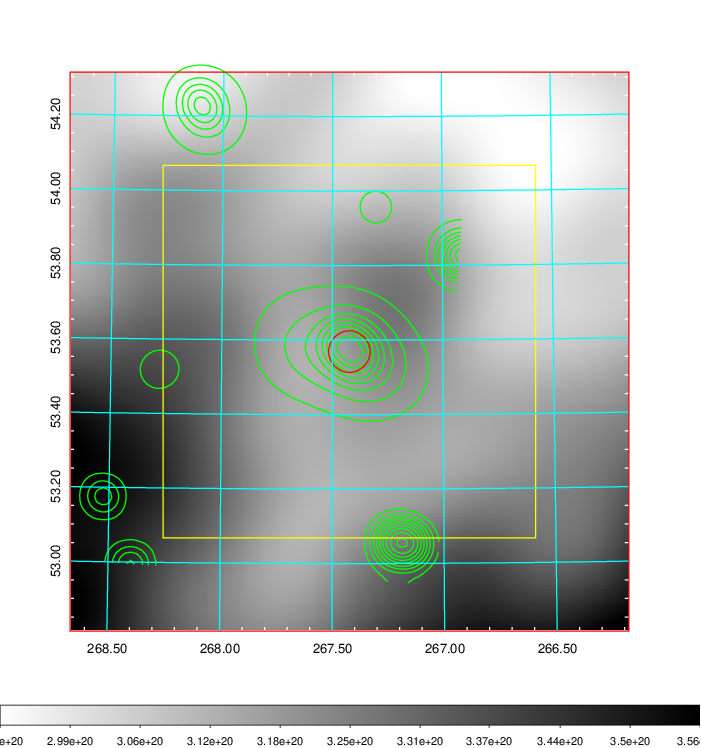    | 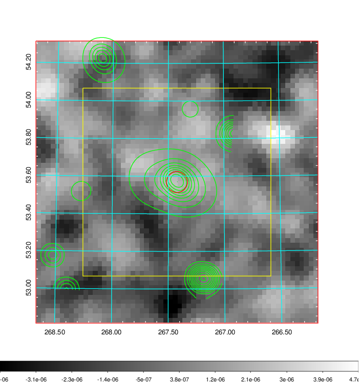 |

|[Redshift Histogram](../image/745/745_zg.pdf) | [DSS image(z1)](../image/745/745_dss_z1.pdf)      |  [DSS image(z2)](../image/745/745_dss_z2.pdf)    |
|-------------------|--------------------|-------------------|
|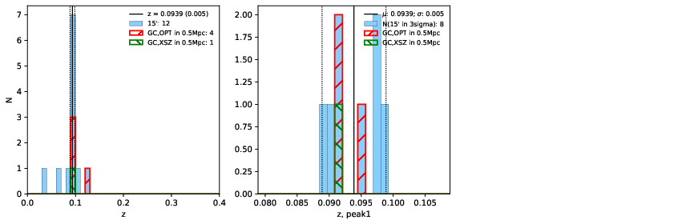 |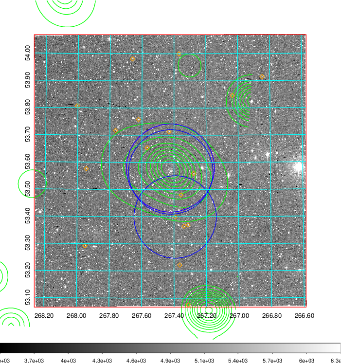  Blue circle for optical clusters;  Magenta circle for XSZ clusters;  all with r=1Mpc;  Only GC with Delta_z<0.01 are shown. | 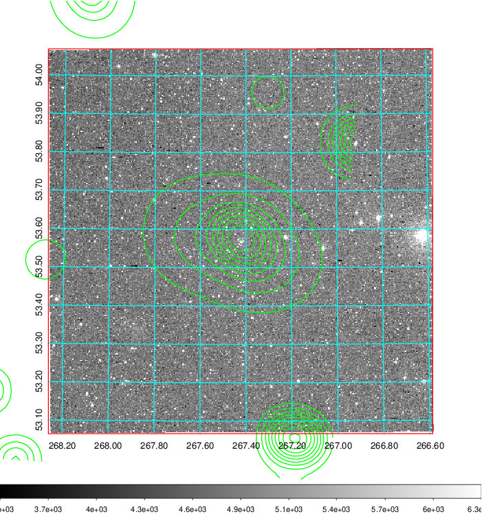 Blue circle for optical clusters;  Magenta circle for XSZ clusters;  all with r=1Mpc;  Only GC with Delta_z<0.01 are shown.  |

|[known Abell/XSZ clusters](../image/745/745_gc.pdf) | [2MASS image](../image/745/745_2mass.pdf)      |[SDSS image](../image/745/745_sdss.pdf)   |
|-------------------|-------------------|-------------------|
|  Magenta, blue and green circles  for optical, X-ray and SZ clusters  respectively, with redshift of clusters  labelled. The radius of circles  are 1Mpc.|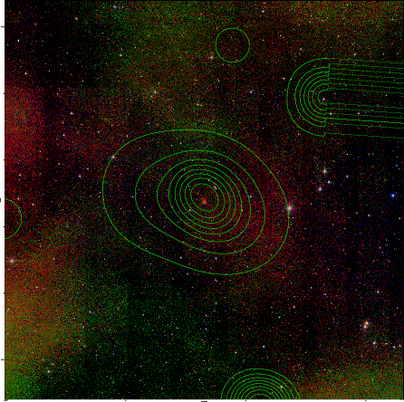  | 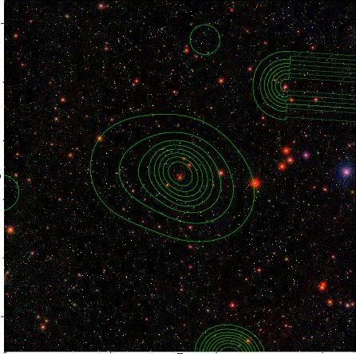  |

