

### 746

|Name|RAJ2000[deg]|DEJ2000[deg] |Ext[arcmin]| Ext,ml | z | z_src| C|GC(XSZ,Delta_z<0.01)| GC(OPT,Delta_z<0.01)|GC| R_sig[arcmin] | R500[arcmin] | R500[Mpc]| CRsig[c/s] | CR500[c/s] |L500[1E44 erg/s]|F500[1E-12 erg/s/cm^2]| M500[1E14 Msun]|Tx[keV]|Cnt_sig|Beta|Rc[arcmin]|Comment|Alias|
|---|---|---|---|---|---|------|---|--------|---------|----------|---|---|---|---|---|---|---|---|---|---|---|---|---|---|
|746| 267.780| 65.548| 3.33| 164.75| 0.0449(0.005)| z1, z_xsz| B| MCXC| N| MCXC, N, W| 14.162| 9.216| 0.488| 0.059(0.005)| 0.055(0.005)| 0.035(0.003)| 0.733(0.061)| 0.35(0.01)| 1.13(0.03)| 981.1| 0.511(-0.009+0.019)| 2.727(-0.210+0.272)| -| k407|

|[RASS image](../image/746/746_img.pdf)|[filtered image](../image/746/746_fil.pdf)|[Segment image](../image/746/746_seg.pdf)|
|-------------------|--------------------|-------------------|
| 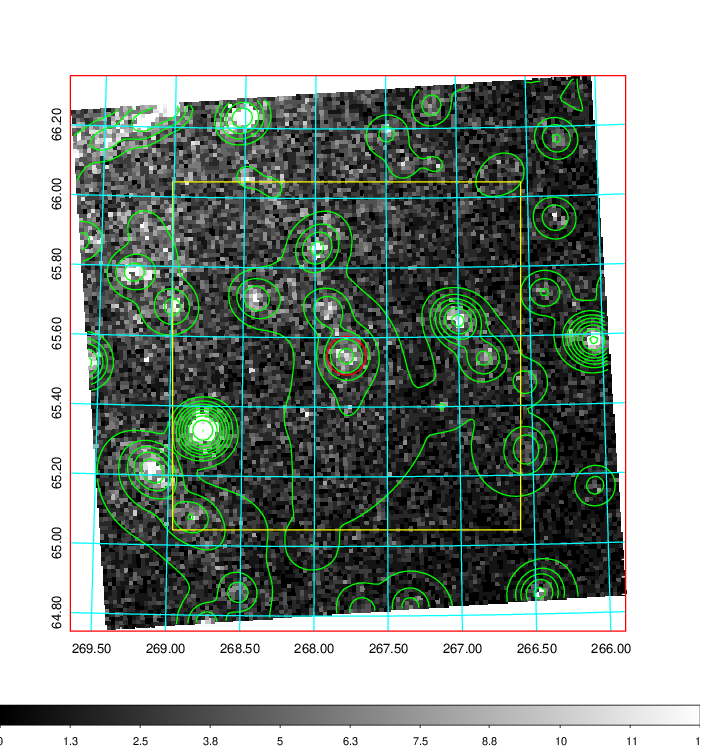  | 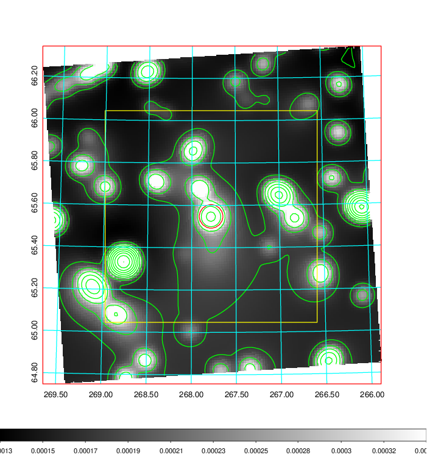   | 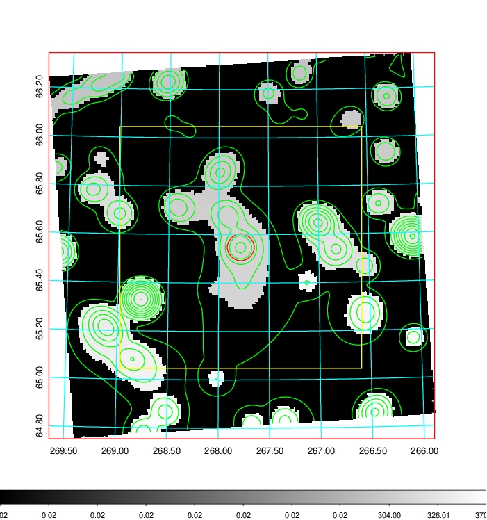  |

|[Exposure image](../image/746/746_mex.pdf)| [nH image](../image/746/746_nh.pdf)| [Planck image](../image/746/746_p.pdf)|
|-------------------|--------------------|-------------------|
|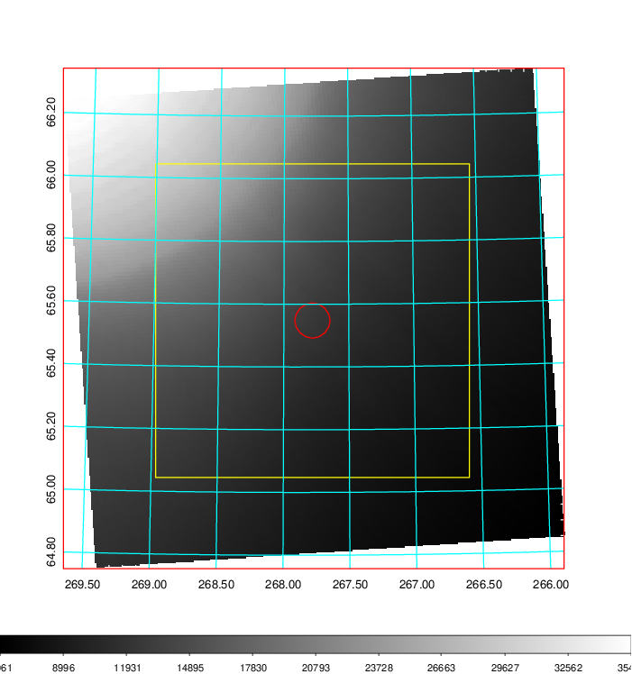   | 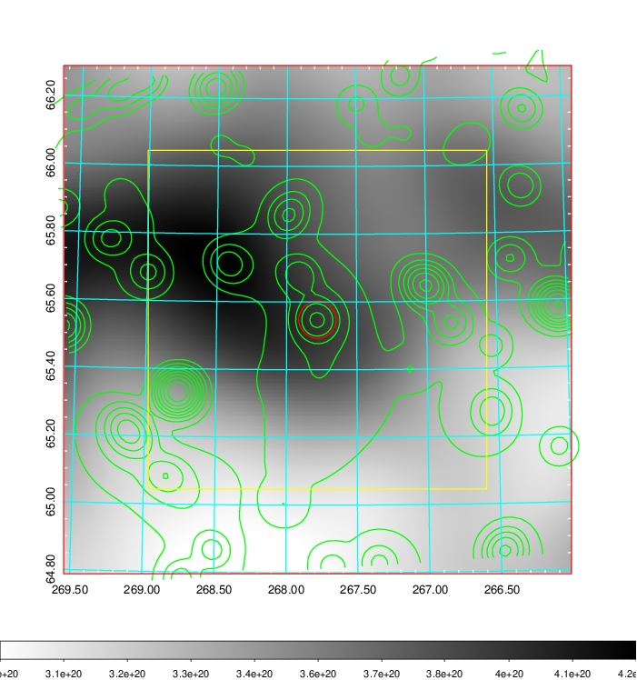    | 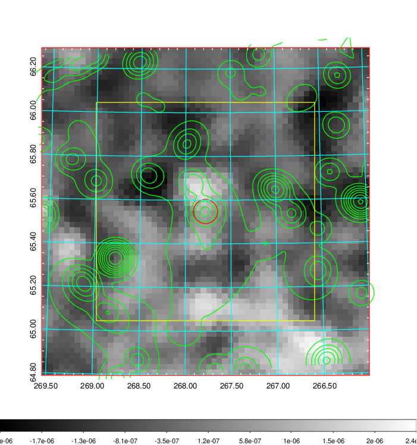 |

|[Redshift Histogram](../image/746/746_zg.pdf) | [DSS image(z1)](../image/746/746_dss_z1.pdf)      |  [DSS image(z2)](../image/746/746_dss_z2.pdf)    |
|-------------------|--------------------|-------------------|
|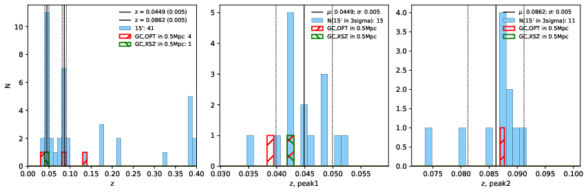 |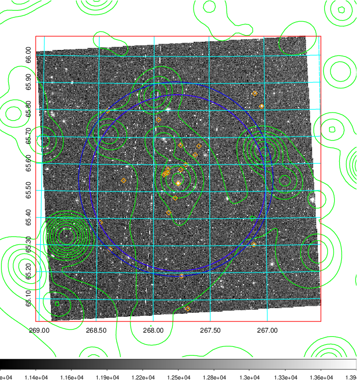  Blue circle for optical clusters;  Magenta circle for XSZ clusters;  all with r=1Mpc;  Only GC with Delta_z<0.01 are shown. | 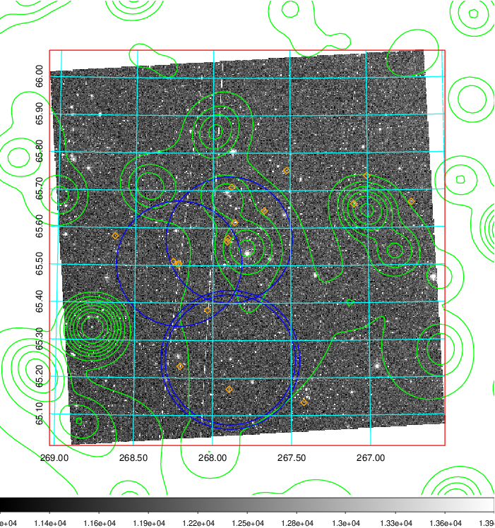 Blue circle for optical clusters;  Magenta circle for XSZ clusters;  all with r=1Mpc;  Only GC with Delta_z<0.01 are shown.  |

|[Previous-identified clusters](../image/746/746_gc.pdf) | [2MASS image](../image/746/746_2mass.pdf)      |[SDSS image](../image/746/746_sdss.pdf)   |
|-------------------|-------------------|-------------------|
|  Green, magenta, and blue circles  for optical, X-ray and SZ clusters  respectively, with redshift of clusters  labelled. The radius of circles  are 1Mpc.|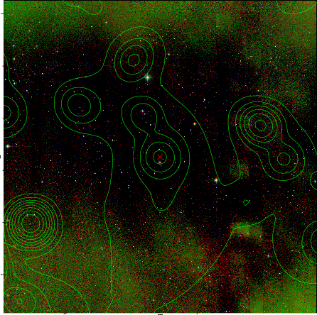  | 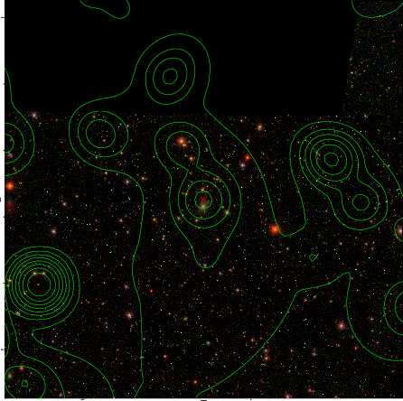  |

