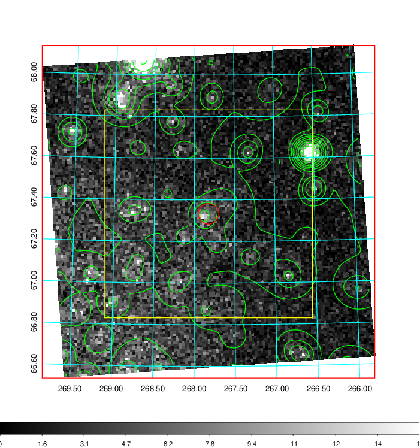
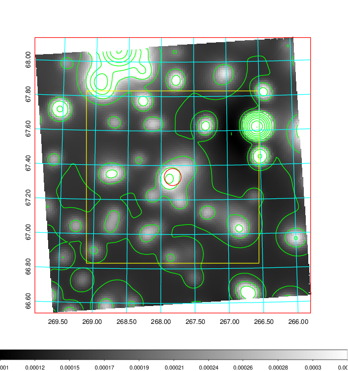
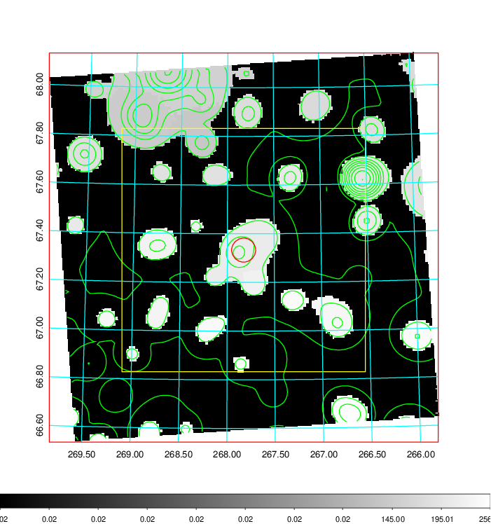
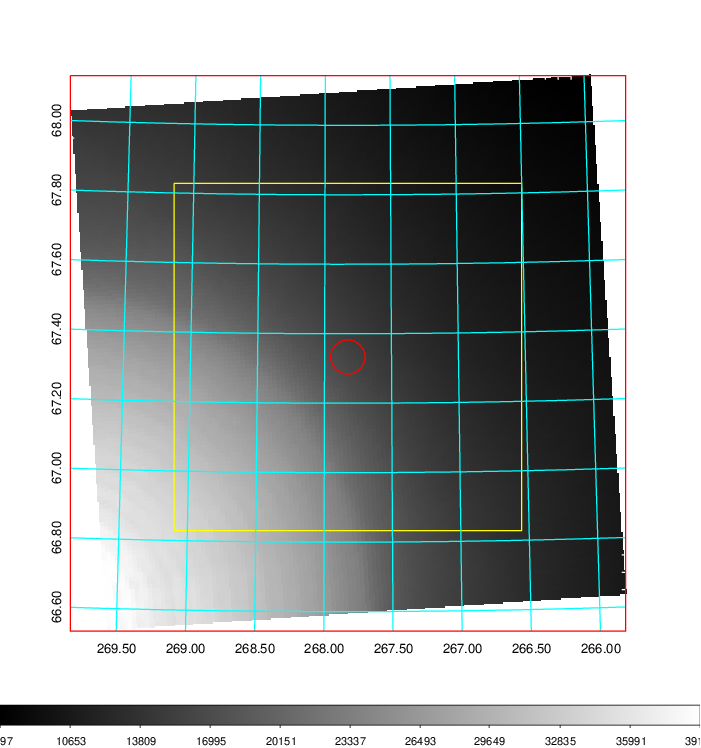
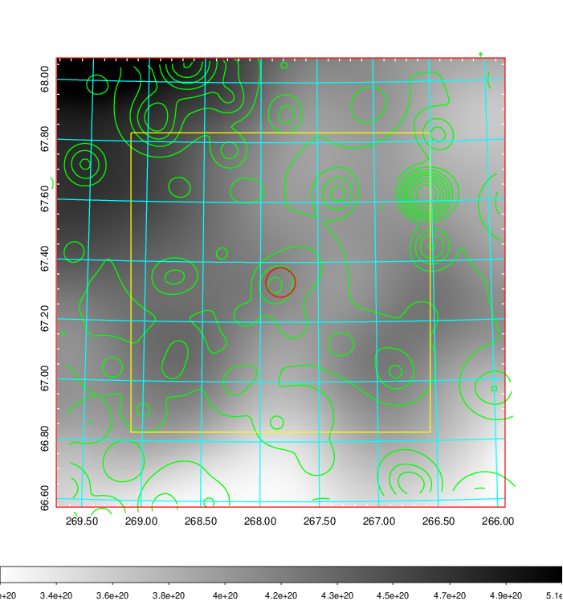
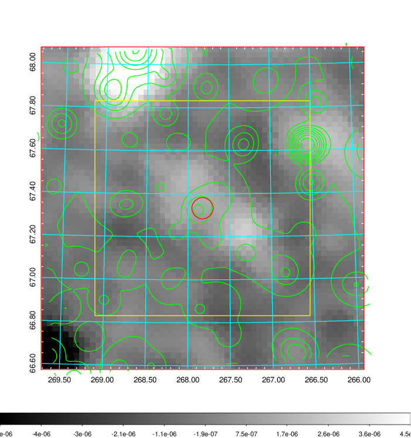
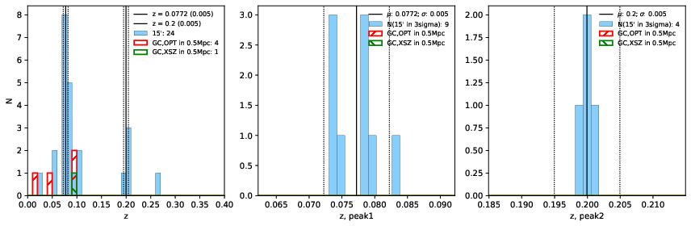
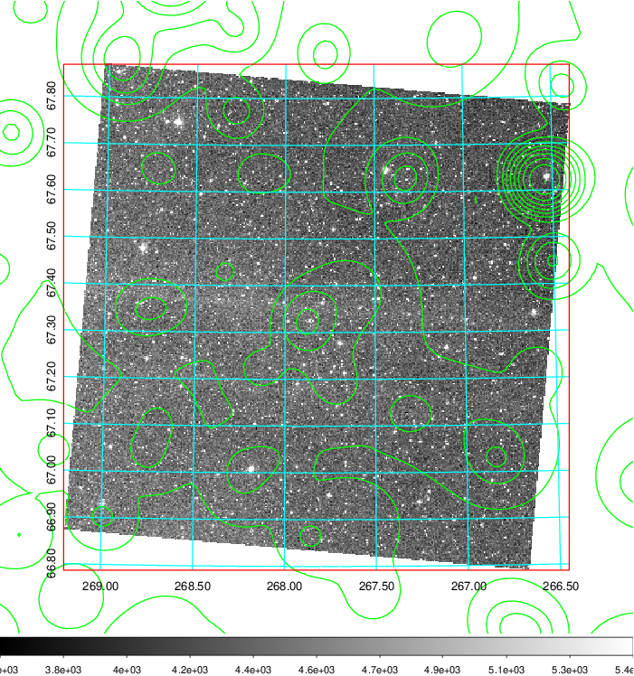
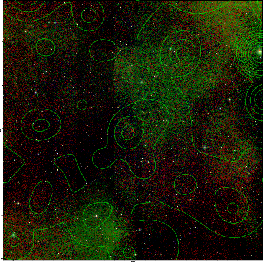

### 747

|Name|RAJ2000[deg]|DEJ2000[deg] |Ext[arcmin]| Ext,ml | z | z_src| C|GC(XSZ,Delta_z<0.01)| GC(OPT,Delta_z<0.01)|GC| R_sig[arcmin] | R500[arcmin] | R500[Mpc]| CRsig[c/s] | CR500[c/s] |L500[1E44 erg/s]|F500[1E-12 erg/s/cm^2]| M500[1E14 Msun]|Tx[keV]|Cnt_sig|Beta|Rc[arcmin]|Comment|Alias|
|---|---|---|---|---|---|------|---|--------|---------|----------|---|---|---|---|---|---|---|---|---|---|---|---|---|---|
|747| 267.826| 67.333| 2.96| 112.32| 0.0772(0.005)| z1,| G| -| -| MCXC, N| 12.700| 6.828| 0.599| 0.050(0.005)| 0.046(0.005)| 0.110(0.009)| 0.753(0.063)| 0.66(0.03)| 1.69(0.05)| 756.0| 0.691(-0.058+0.090)| 4.584(-0.459+0.652)| An X-ray cluster with $z$ = 0.0933 and offset = 0.18 Mpc| k372|

|[RASS image](../image/747/747_img.pdf)|[filtered image](../image/747/747_fil.pdf)|[Segment image](../image/747/747_seg.pdf)|
|-------------------|--------------------|-------------------|
|   |    |   |

|[Exposure image](../image/747/747_mex.pdf)| [nH image](../image/747/747_nh.pdf)| [Planck image](../image/747/747_p.pdf)|
|-------------------|--------------------|-------------------|
|   |     |  |

|[Redshift Histogram](../image/747/747_zg.pdf) | [DSS image(z1)](../image/747/747_dss_z1.pdf)      |  [DSS image(z2)](../image/747/747_dss_z2.pdf)    |
|-------------------|--------------------|-------------------|
| |  Blue circle for optical clusters;  Magenta circle for XSZ clusters;  all with r=1Mpc;  Only GC with Delta_z<0.01 are shown. |  Blue circle for optical clusters;  Magenta circle for XSZ clusters;  all with r=1Mpc;  Only GC with Delta_z<0.01 are shown.  |

|[known Abell/XSZ clusters](../image/747/747_gc.pdf) | [2MASS image](../image/747/747_2mass.pdf)      |
|-------------------|-------------------|
|  Magenta, blue and green circles  for optical, X-ray and SZ clusters  respectively, with redshift of clusters  labelled. The radius of circles  are 1Mpc.|  |

|[PS1 image](../image/747/747_ps1.pdf)            |
|-------------------|
|   |
