

### 748

|Name|RAJ2000[deg]|DEJ2000[deg] |Ext[arcmin]| Ext,ml | z | z_src| C|GC(XSZ,Delta_z<0.01)| GC(OPT,Delta_z<0.01)|GC| R_sig[arcmin] | R500[arcmin] | R500[Mpc]| CRsig[c/s] | CR500[c/s] |L500[1E44 erg/s]|F500[1E-12 erg/s/cm^2]| M500[1E14 Msun]|Tx[keV]|Cnt_sig|Beta|Rc[arcmin]|Comment|Alias|
|---|---|---|---|---|---|------|---|--------|---------|----------|---|---|---|---|---|---|---|---|---|---|---|---|---|---|
|748| 268.044| 62.416| 7.97| 49.25| 0.0276(0.005)| z1,| G| -| -| N, W| 15.138| 11.047| 0.367| 0.030(0.010)| 0.029(0.010)| 0.007(0.003)| 0.401(0.158)| 0.14(0.03)| 0.65(0.08)| 303.3| 0.526(-0.020+0.046)| 1.613(-0.218+0.261)| -| t390|

|[RASS image](../image/748/748_img.pdf)|[filtered image](../image/748/748_fil.pdf)|[Segment image](../image/748/748_seg.pdf)|
|-------------------|--------------------|-------------------|
| 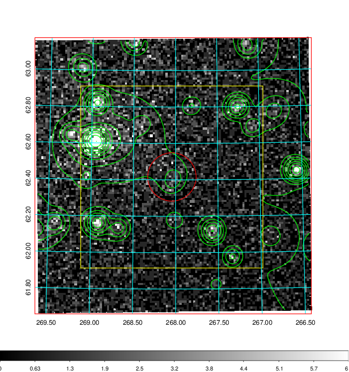  | 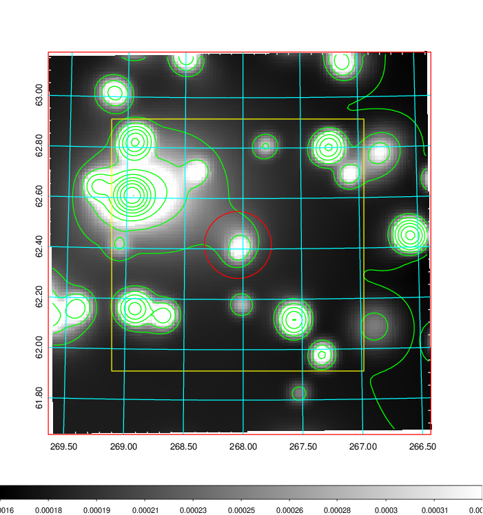   | 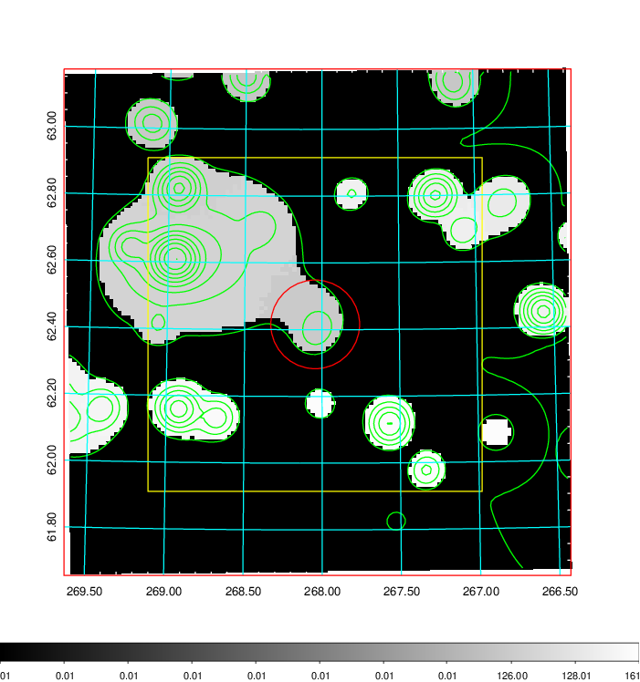  |

|[Exposure image](../image/748/748_mex.pdf)| [nH image](../image/748/748_nh.pdf)| [Planck image](../image/748/748_p.pdf)|
|-------------------|--------------------|-------------------|
|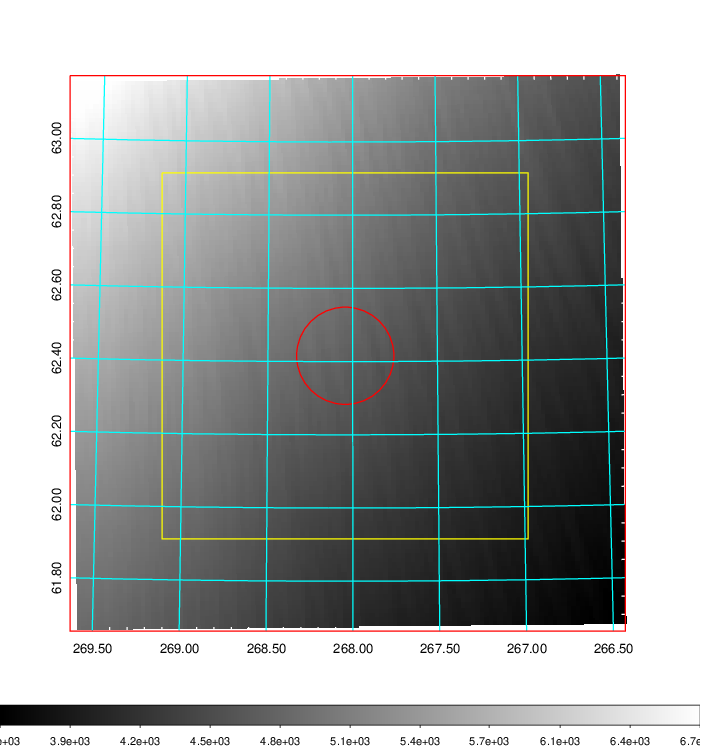   | 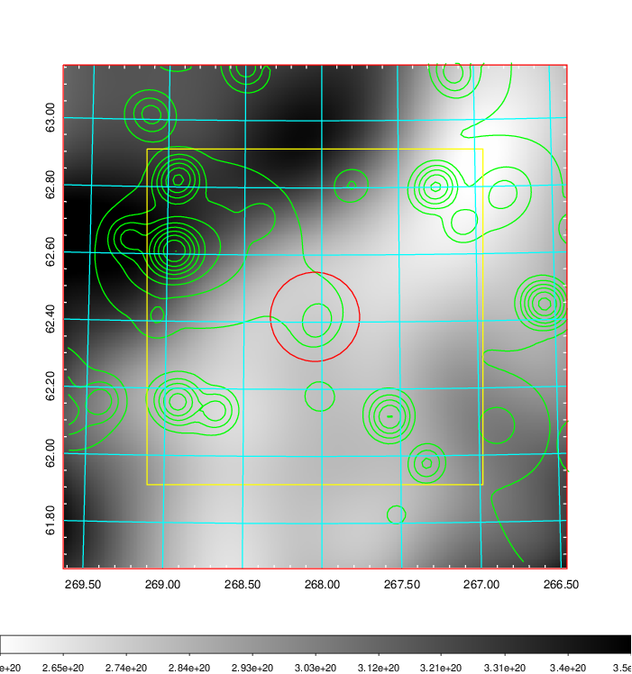    | 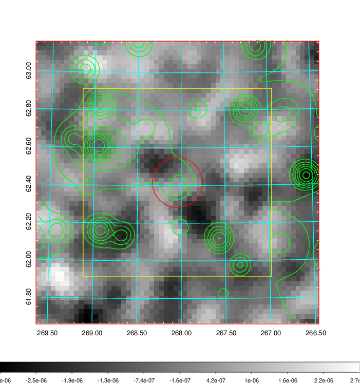 |

|[Redshift Histogram](../image/748/748_zg.pdf) | [DSS image(z1)](../image/748/748_dss_z1.pdf)      |  [DSS image(z2)](../image/748/748_dss_z2.pdf)    |
|-------------------|--------------------|-------------------|
|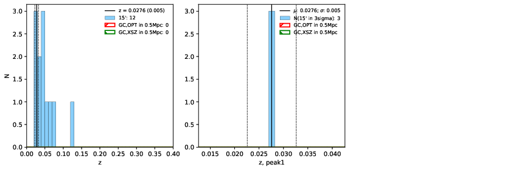 |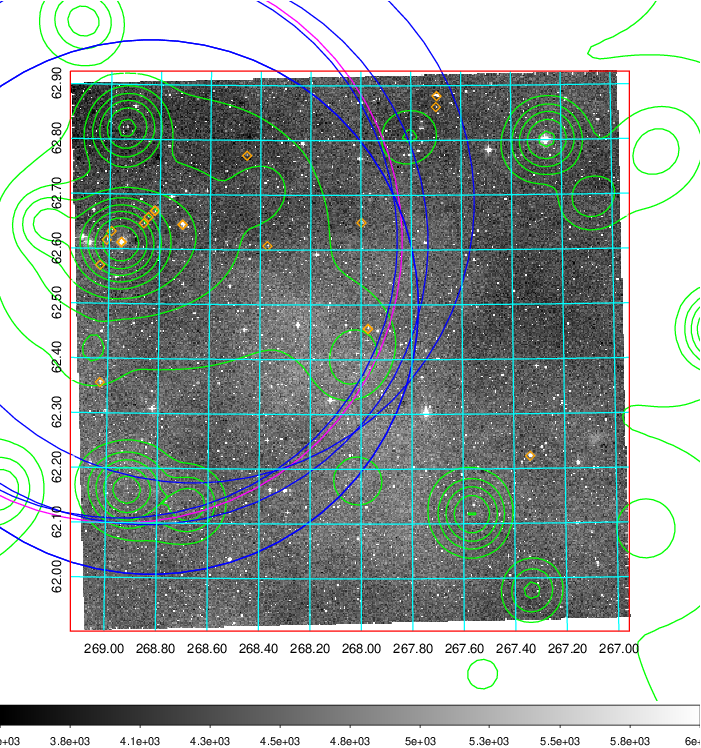  Blue circle for optical clusters;  Magenta circle for XSZ clusters;  all with r=1Mpc;  Only GC with Delta_z<0.01 are shown. | 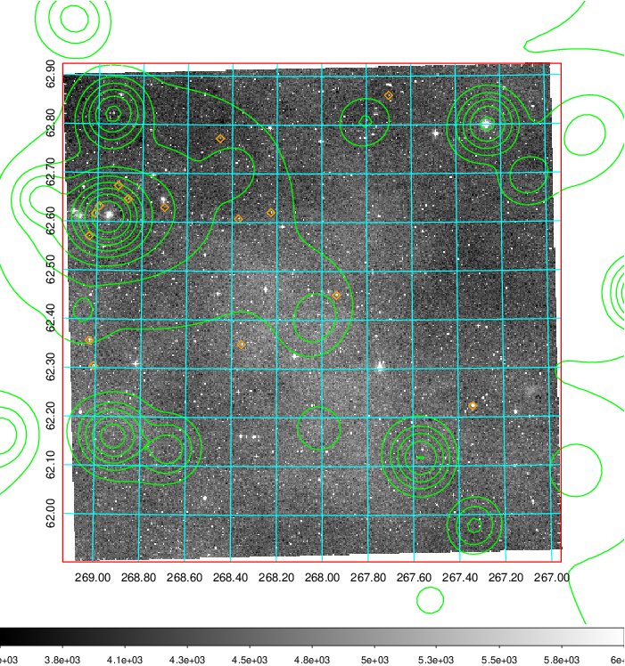 Blue circle for optical clusters;  Magenta circle for XSZ clusters;  all with r=1Mpc;  Only GC with Delta_z<0.01 are shown.  |

|[Previous-identified clusters](../image/748/748_gc.pdf) | [2MASS image](../image/748/748_2mass.pdf)      |[SDSS image](../image/748/748_sdss.pdf)   |
|-------------------|-------------------|-------------------|
|  Green, magenta, and blue circles  for optical, X-ray and SZ clusters  respectively, with redshift of clusters  labelled. The radius of circles  are 1Mpc.|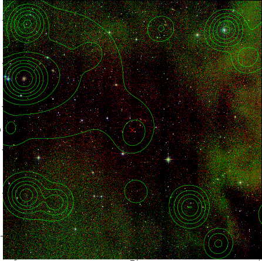  | 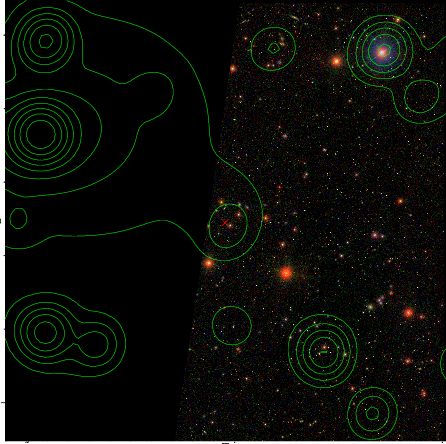  |

