

### 749

|Name|RAJ2000[deg]|DEJ2000[deg] |Ext[arcmin]| Ext,ml | z | z_src| C|GC(XSZ,Delta_z<0.01)| GC(OPT,Delta_z<0.01)|GC| R_sig[arcmin] | R500[arcmin] | R500[Mpc]| CRsig[c/s] | CR500[c/s] |L500[1E44 erg/s]|F500[1E-12 erg/s/cm^2]| M500[1E14 Msun]|Tx[keV]|Cnt_sig|Beta|Rc[arcmin]|Comment|Alias|
|---|---|---|---|---|---|------|---|--------|---------|----------|---|---|---|---|---|---|---|---|---|---|---|---|---|---|
|749| 268.360| 52.091| 1.14| 27.30| 0.0938(0.007)| z1, z_xsz| B| MCXC| A, W| A, MCXC, N, W| 13.675| 7.241| 0.757| 0.107(0.017)| 0.099(0.015)| 0.398(0.044)| 1.798(0.199)| 1.35(0.08)| 2.65(0.09)| 140.1| 0.546(-0.033+0.062)| 1.576(-0.364+0.567)| -| k051|

|[RASS image](../image/749/749_img.pdf)|[filtered image](../image/749/749_fil.pdf)|[Segment image](../image/749/749_seg.pdf)|
|-------------------|--------------------|-------------------|
| 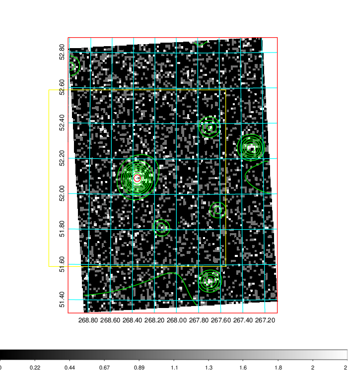  | 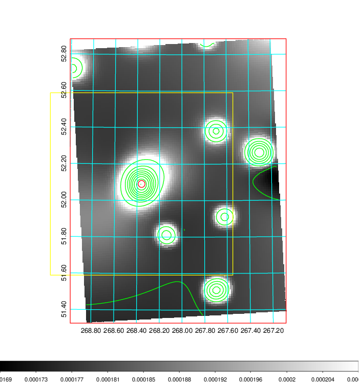   | 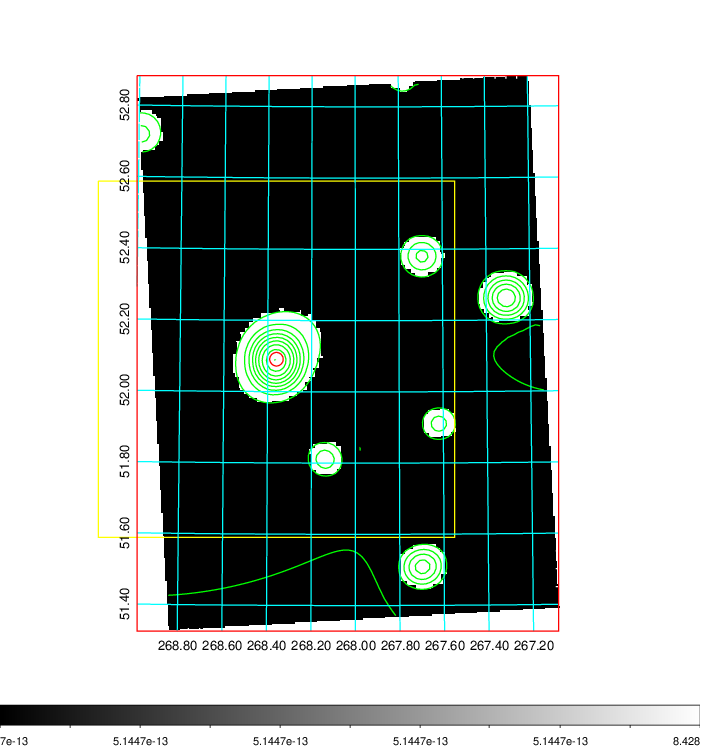  |

|[Exposure image](../image/749/749_mex.pdf)| [nH image](../image/749/749_nh.pdf)| [Planck image](../image/749/749_p.pdf)|
|-------------------|--------------------|-------------------|
|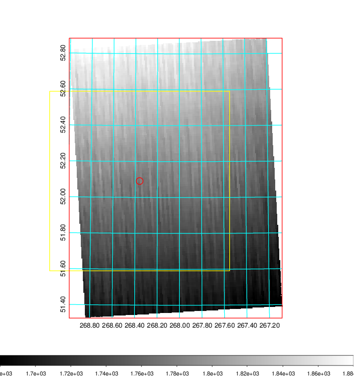   | 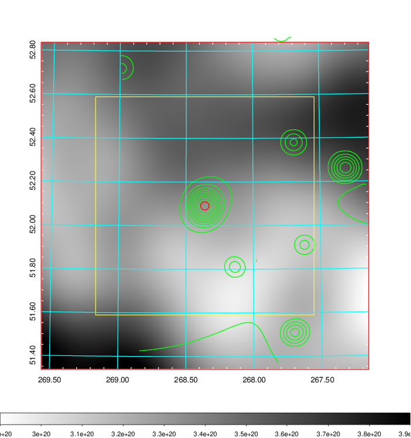    | 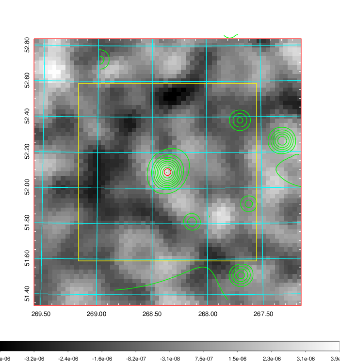 |

|[Redshift Histogram](../image/749/749_zg.pdf) | [DSS image(z1)](../image/749/749_dss_z1.pdf)      |  [DSS image(z2)](../image/749/749_dss_z2.pdf)    |
|-------------------|--------------------|-------------------|
|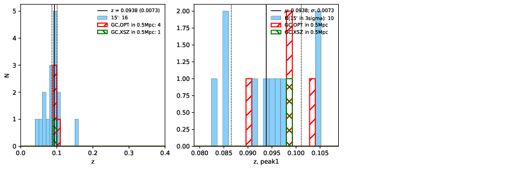 |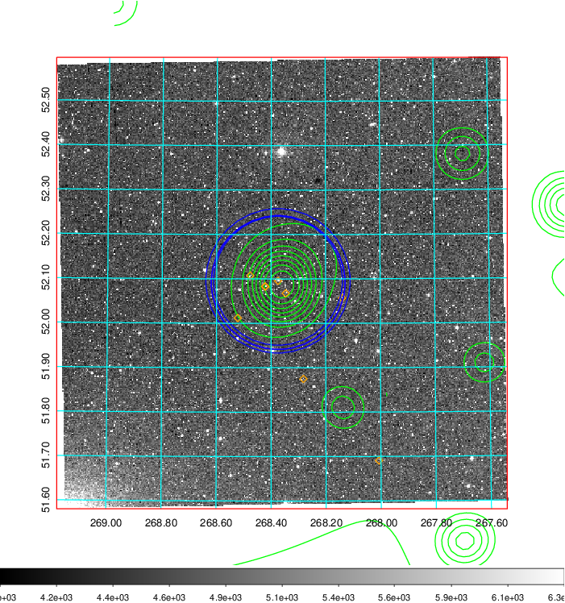  Blue circle for optical clusters;  Magenta circle for XSZ clusters;  all with r=1Mpc;  Only GC with Delta_z<0.01 are shown. | 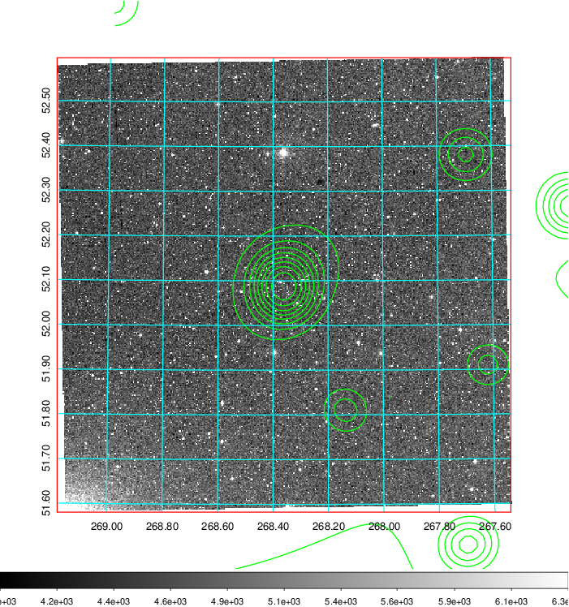 Blue circle for optical clusters;  Magenta circle for XSZ clusters;  all with r=1Mpc;  Only GC with Delta_z<0.01 are shown.  |

|[known Abell/XSZ clusters](../image/749/749_gc.pdf) | [2MASS image](../image/749/749_2mass.pdf)      |[SDSS image](../image/749/749_sdss.pdf)   |
|-------------------|-------------------|-------------------|
|  Magenta, blue and green circles  for optical, X-ray and SZ clusters  respectively, with redshift of clusters  labelled. The radius of circles  are 1Mpc.|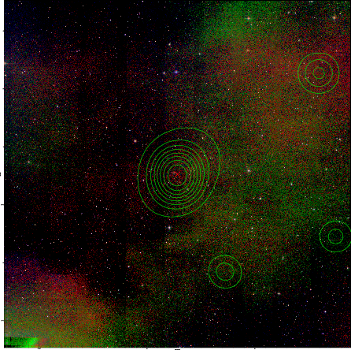  | 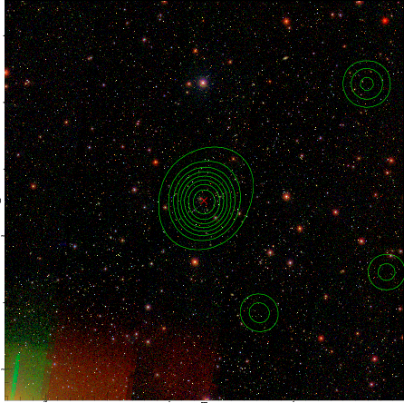  |

