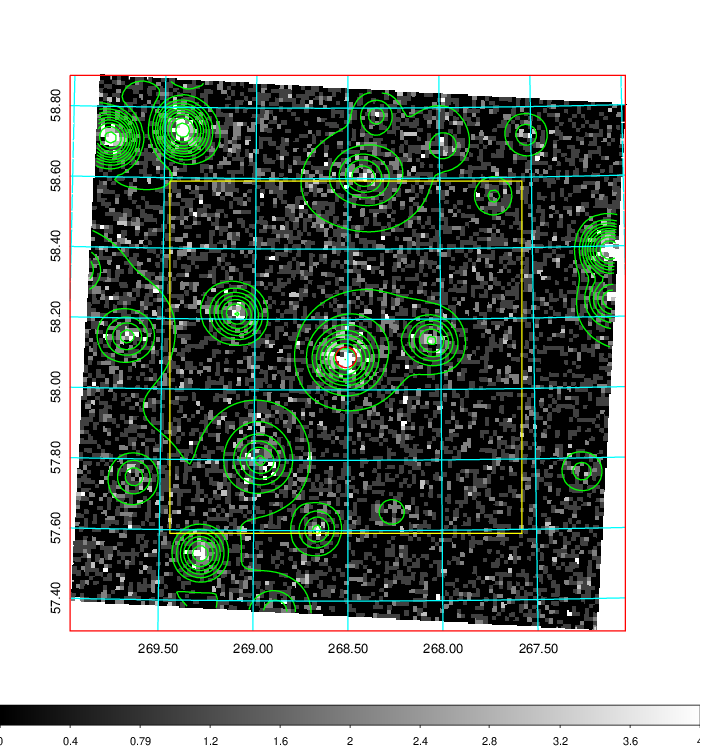
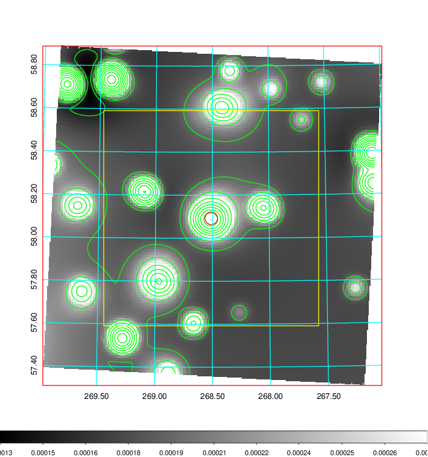
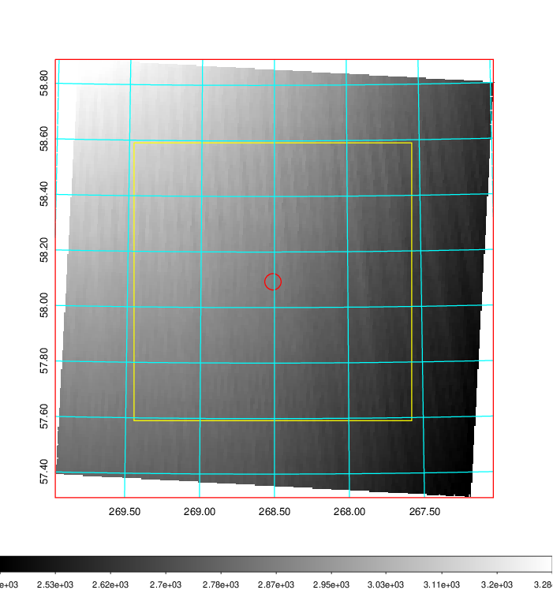
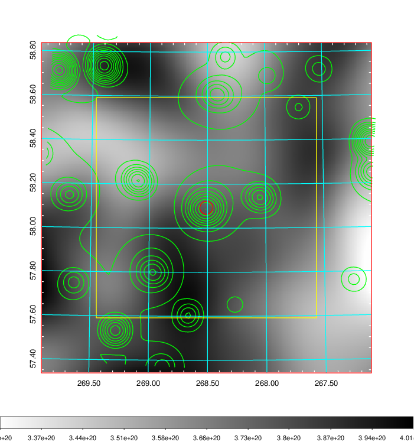
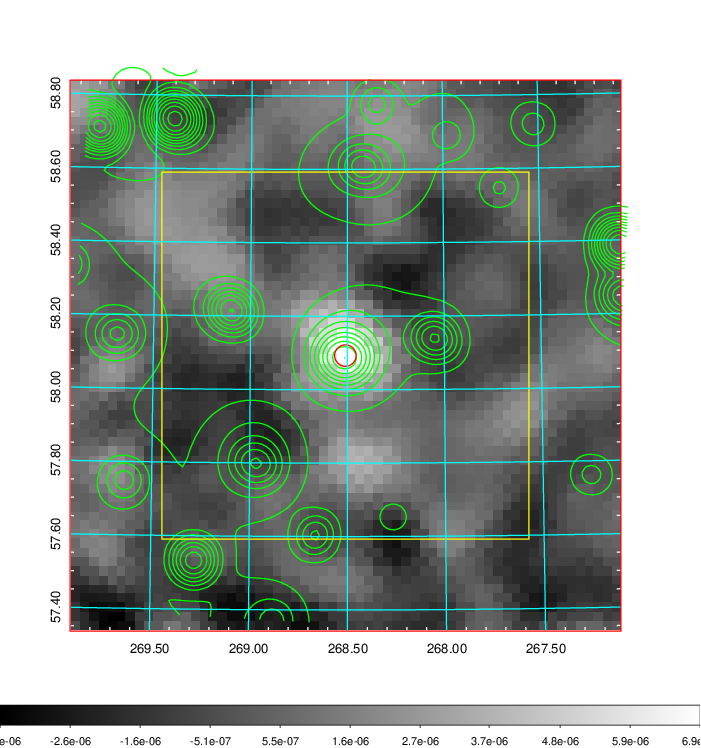
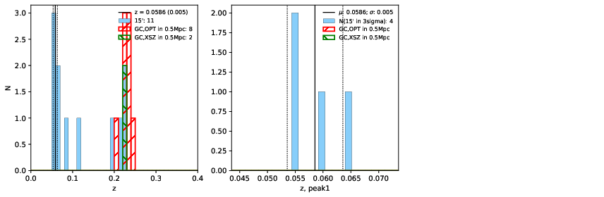
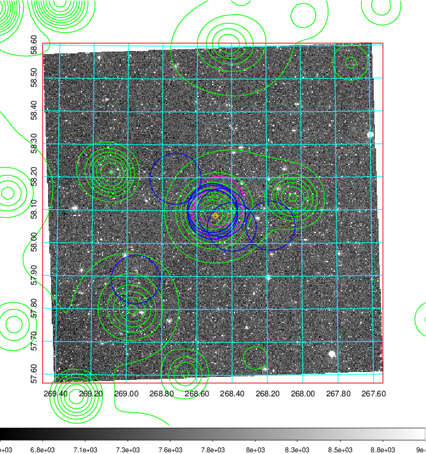
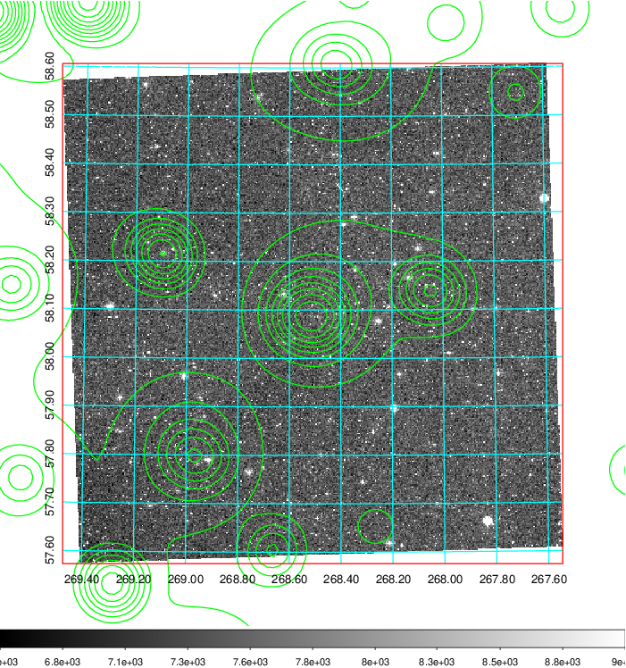
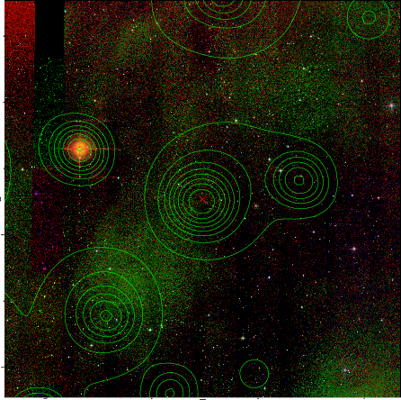
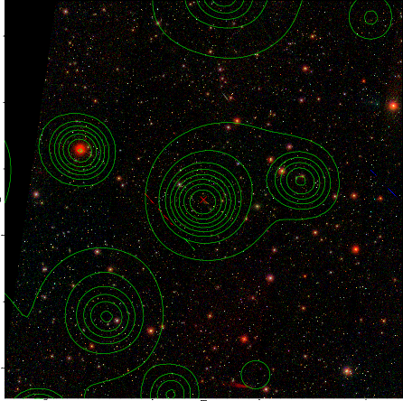

### 750

|Name|RAJ2000[deg]|DEJ2000[deg] |Ext[arcmin]| Ext,ml | z | z_src| C|GC(XSZ,Delta_z<0.01)| GC(OPT,Delta_z<0.01)|GC| R_sig[arcmin] | R500[arcmin] | R500[Mpc]| CRsig[c/s] | CR500[c/s] |L500[1E44 erg/s]|F500[1E-12 erg/s/cm^2]| M500[1E14 Msun]|Tx[keV]|Cnt_sig|Beta|Rc[arcmin]|Comment|Alias|
|---|---|---|---|---|---|------|---|--------|---------|----------|---|---|---|---|---|---|---|---|---|---|---|---|---|---|
|750| 268.510| 58.093| 1.77| 73.54| 0.2263(0.000)| z_xsz| B| MCXC, Tar| A, N, W| A, C, MCXC, N, PSZ2, Tar, W| 7.338| 4.481| 0.976| 0.073(0.012)| 0.069(0.012)| 1.988(0.176)| 1.311(0.116)| 3.32(0.14)| 4.83(0.13)| 210.3| 0.927(-0.086+0.052)| 3.736(-0.450+0.325)| -| k167|

|[RASS image](../image/750/750_img.pdf)|[filtered image](../image/750/750_fil.pdf)|[Segment image](../image/750/750_seg.pdf)|
|-------------------|--------------------|-------------------|
|   |    |   |

|[Exposure image](../image/750/750_mex.pdf)| [nH image](../image/750/750_nh.pdf)| [Planck image](../image/750/750_p.pdf)|
|-------------------|--------------------|-------------------|
|   |     |  |

|[Redshift Histogram](../image/750/750_zg.pdf) | [DSS image(z1)](../image/750/750_dss_z1.pdf)      |  [DSS image(z2)](../image/750/750_dss_z2.pdf)    |
|-------------------|--------------------|-------------------|
| |  Blue circle for optical clusters;  Magenta circle for XSZ clusters;  all with r=1Mpc;  Only GC with Delta_z<0.01 are shown. |  Blue circle for optical clusters;  Magenta circle for XSZ clusters;  all with r=1Mpc;  Only GC with Delta_z<0.01 are shown.  |

|[Previous-identified clusters](../image/750/750_gc.pdf) | [2MASS image](../image/750/750_2mass.pdf)      |[SDSS image](../image/750/750_sdss.pdf)   |
|-------------------|-------------------|-------------------|
|  Green, magenta, and blue circles  for optical, X-ray and SZ clusters  respectively, with redshift of clusters  labelled. The radius of circles  are 1Mpc.|  |   |

