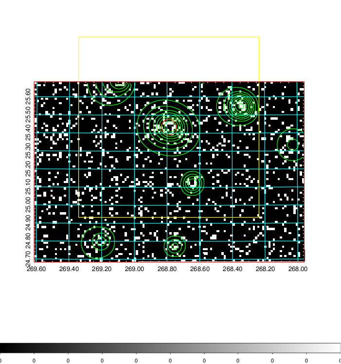
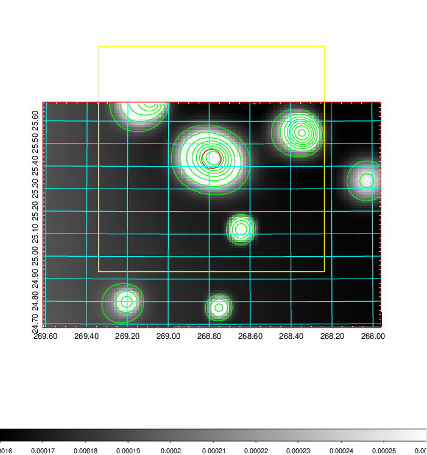
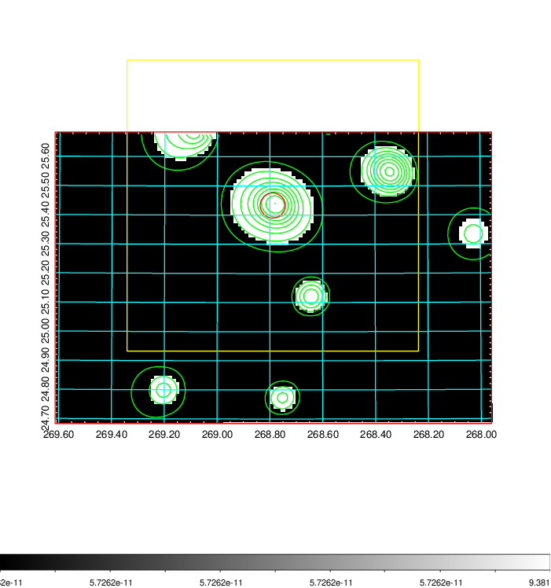
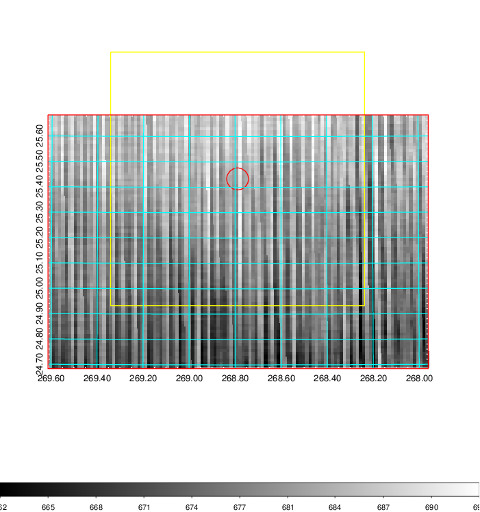
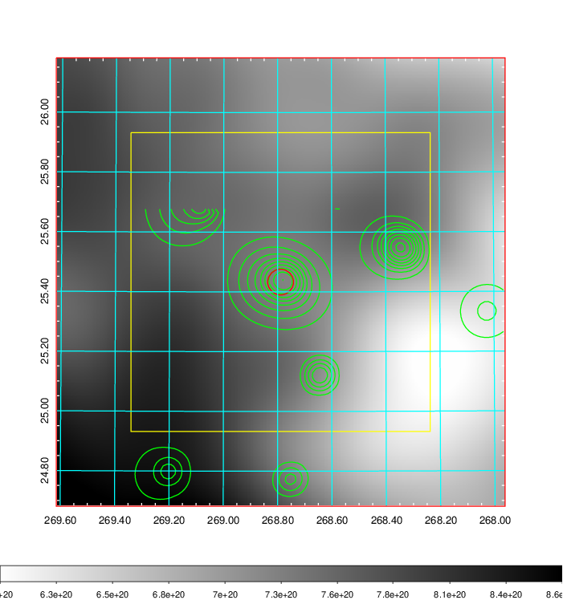
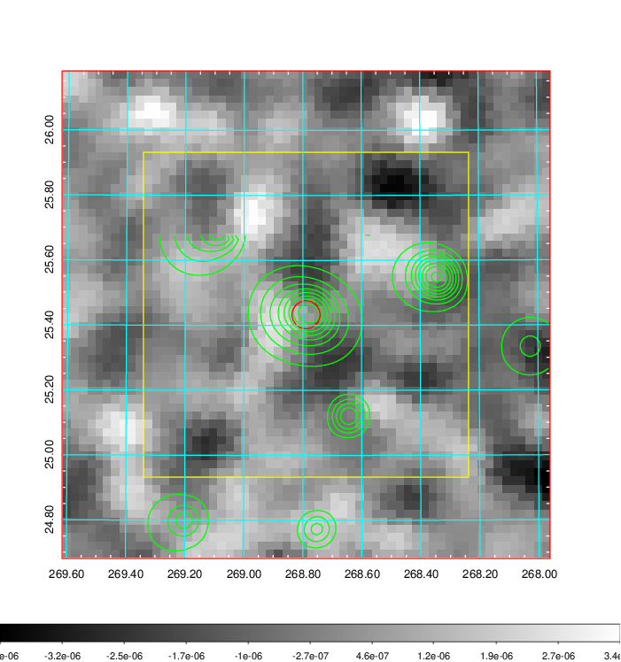
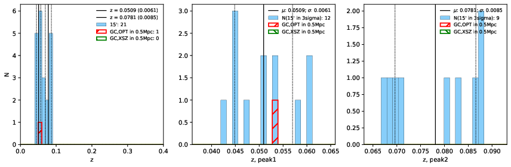
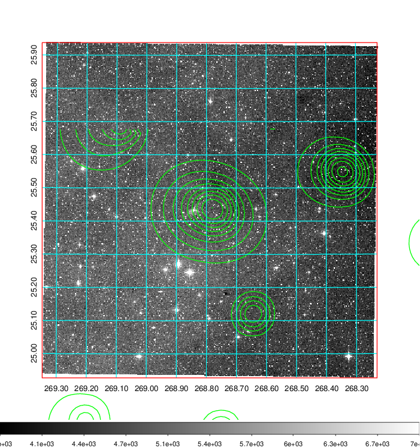
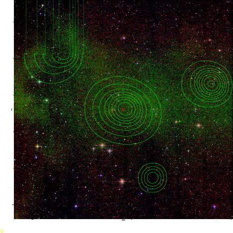
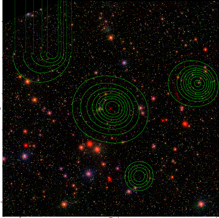

### 751

|Name|RAJ2000[deg]|DEJ2000[deg] |Ext[arcmin]| Ext,ml | z | z_src| C|GC(XSZ,Delta_z<0.01)| GC(OPT,Delta_z<0.01)|GC| R_sig[arcmin] | R500[arcmin] | R500[Mpc]| CRsig[c/s] | CR500[c/s] |L500[1E44 erg/s]|F500[1E-12 erg/s/cm^2]| M500[1E14 Msun]|Tx[keV]|Cnt_sig|Beta|Rc[arcmin]|Comment|Alias|
|---|---|---|---|---|---|------|---|--------|---------|----------|---|---|---|---|---|---|---|---|---|---|---|---|---|---|
|751| 268.789| 25.433| 2.59| 28.14| 0.0509(0.006)| z1, z_opt| S| -| N| C, N, W| 12.356| 9.758| 0.582| 0.092(0.036)| 0.089(0.035)| 0.079(0.017)| 1.284(0.271)| 0.59(0.06)| 1.57(0.11)| 68.7| 0.901(-0.106+0.071)| 4.338(-0.761+0.599)| -| t107|

|[RASS image](../image/751/751_img.pdf)|[filtered image](../image/751/751_fil.pdf)|[Segment image](../image/751/751_seg.pdf)|
|-------------------|--------------------|-------------------|
|   |    |   |

|[Exposure image](../image/751/751_mex.pdf)| [nH image](../image/751/751_nh.pdf)| [Planck image](../image/751/751_p.pdf)|
|-------------------|--------------------|-------------------|
|   |     |  |

|[Redshift Histogram](../image/751/751_zg.pdf) | [DSS image(z1)](../image/751/751_dss_z1.pdf)      |  [DSS image(z2)](../image/751/751_dss_z2.pdf)    |
|-------------------|--------------------|-------------------|
| |  Blue circle for optical clusters;  Magenta circle for XSZ clusters;  all with r=1Mpc;  Only GC with Delta_z<0.01 are shown. |  Blue circle for optical clusters;  Magenta circle for XSZ clusters;  all with r=1Mpc;  Only GC with Delta_z<0.01 are shown.  |

|[Previous-identified clusters](../image/751/751_gc.pdf) | [2MASS image](../image/751/751_2mass.pdf)      |[SDSS image](../image/751/751_sdss.pdf)   |
|-------------------|-------------------|-------------------|
|  Green, magenta, and blue circles  for optical, X-ray and SZ clusters  respectively, with redshift of clusters  labelled. The radius of circles  are 1Mpc.|  |   |

