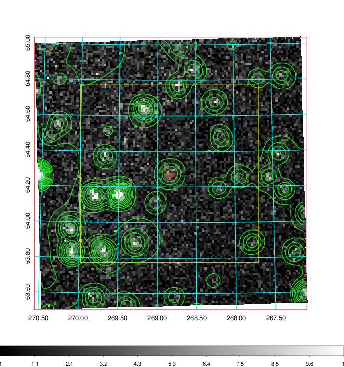
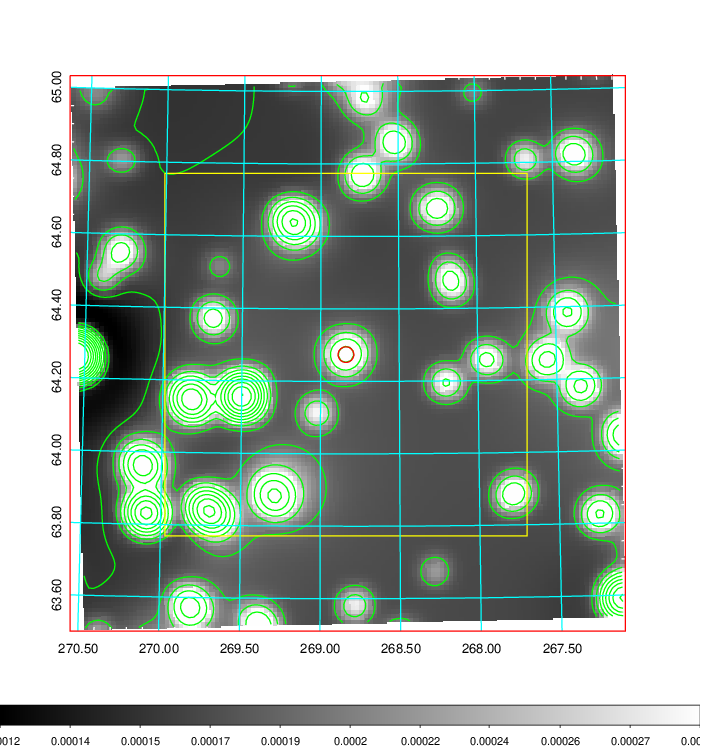
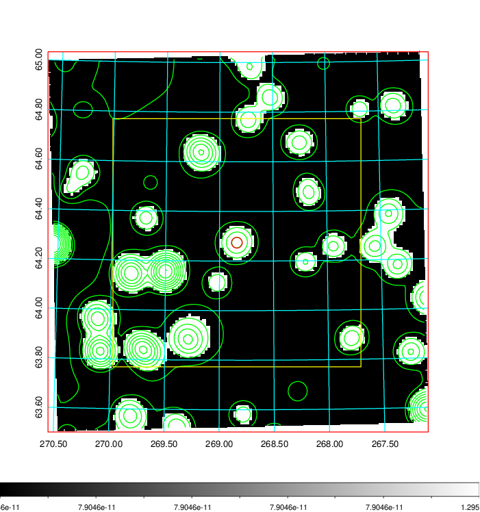
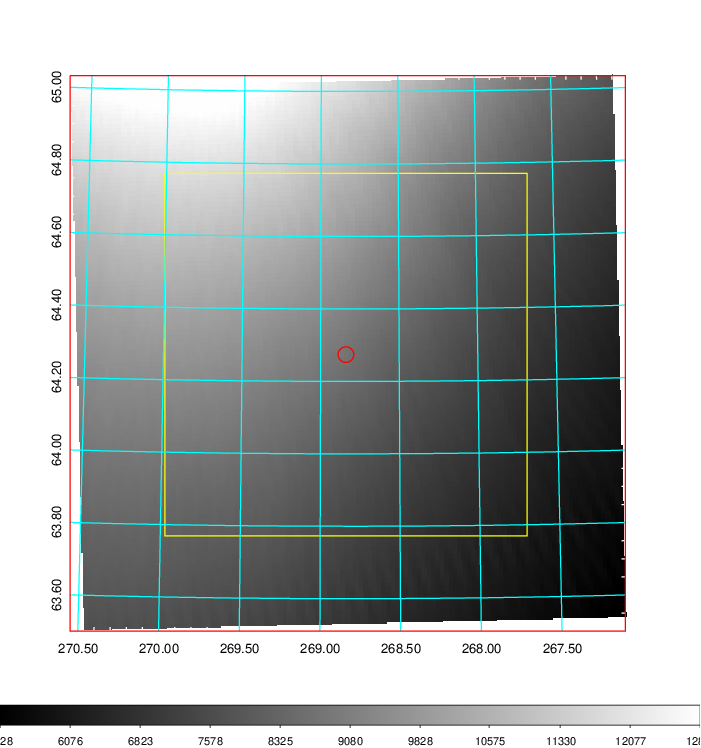
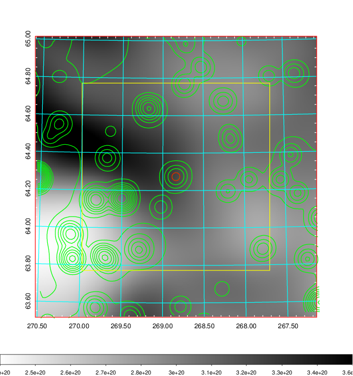
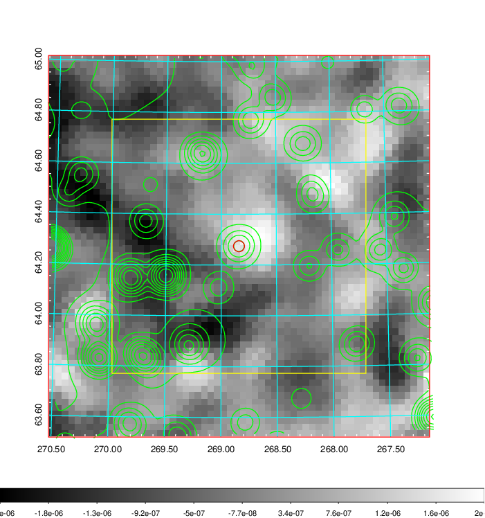
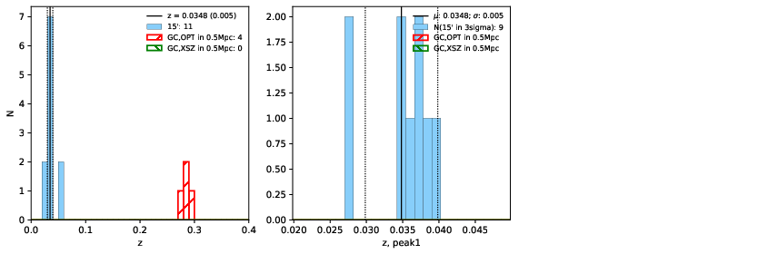
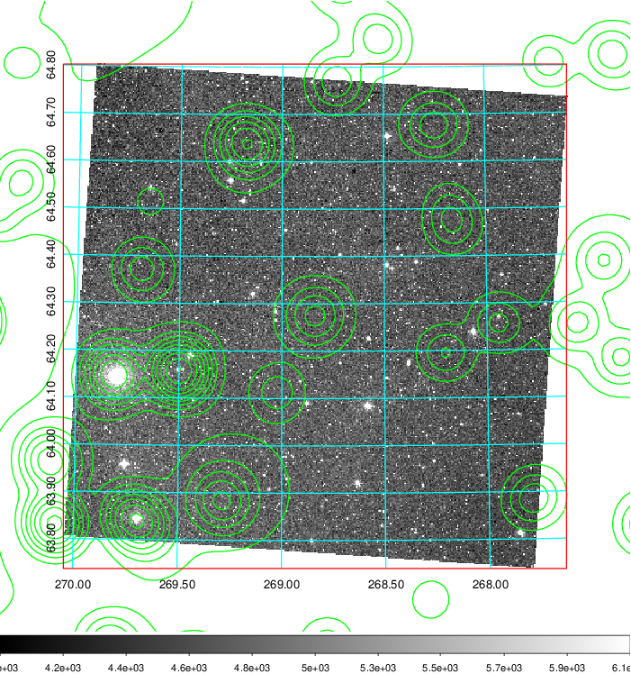
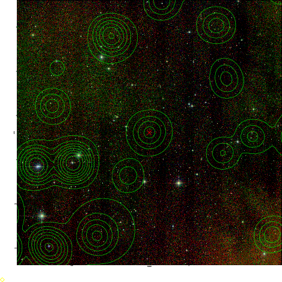
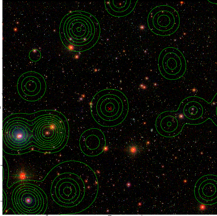

### 752

|Name|RAJ2000[deg]|DEJ2000[deg] |Ext[arcmin]| Ext,ml | z | z_src| C|GC(XSZ,Delta_z<0.01)| GC(OPT,Delta_z<0.01)|GC| R_sig[arcmin] | R500[arcmin] | R500[Mpc]| CRsig[c/s] | CR500[c/s] |L500[1E44 erg/s]|F500[1E-12 erg/s/cm^2]| M500[1E14 Msun]|Tx[keV]|Cnt_sig|Beta|Rc[arcmin]|Comment|Alias|
|---|---|---|---|---|---|------|---|--------|---------|----------|---|---|---|---|---|---|---|---|---|---|---|---|---|---|
|752| 268.839| 64.274| 1.30| 26.15| 0.0348(0.005)| z1,| G| -| -| C, N, W| 11.725| 8.189| 0.340| 0.011(0.005)| 0.010(0.005)| 0.004(0.002)| 0.158(0.067)| 0.12(0.03)| 0.57(0.08)| 137.5| 0.709(-0.151+0.205)| 1.373(-1.123+0.849)| -| t017|

|[RASS image](../image/752/752_img.pdf)|[filtered image](../image/752/752_fil.pdf)|[Segment image](../image/752/752_seg.pdf)|
|-------------------|--------------------|-------------------|
|   |    |   |

|[Exposure image](../image/752/752_mex.pdf)| [nH image](../image/752/752_nh.pdf)| [Planck image](../image/752/752_p.pdf)|
|-------------------|--------------------|-------------------|
|   |     |  |

|[Redshift Histogram](../image/752/752_zg.pdf) | [DSS image(z1)](../image/752/752_dss_z1.pdf)      |  [DSS image(z2)](../image/752/752_dss_z2.pdf)    |
|-------------------|--------------------|-------------------|
| |  Blue circle for optical clusters;  Magenta circle for XSZ clusters;  all with r=1Mpc;  Only GC with Delta_z<0.01 are shown. |  Blue circle for optical clusters;  Magenta circle for XSZ clusters;  all with r=1Mpc;  Only GC with Delta_z<0.01 are shown.  |

|[Previous-identified clusters](../image/752/752_gc.pdf) | [2MASS image](../image/752/752_2mass.pdf)      |[SDSS image](../image/752/752_sdss.pdf)   |
|-------------------|-------------------|-------------------|
|  Green, magenta, and blue circles  for optical, X-ray and SZ clusters  respectively, with redshift of clusters  labelled. The radius of circles  are 1Mpc.|  |   |

