

### 753

|Name|RAJ2000[deg]|DEJ2000[deg] |Ext[arcmin]| Ext,ml | z | z_src| C|GC(XSZ,Delta_z<0.01)| GC(OPT,Delta_z<0.01)|GC| R_sig[arcmin] | R500[arcmin] | R500[Mpc]| CRsig[c/s] | CR500[c/s] |L500[1E44 erg/s]|F500[1E-12 erg/s/cm^2]| M500[1E14 Msun]|Tx[keV]|Cnt_sig|Beta|Rc[arcmin]|Comment|Alias|
|---|---|---|---|---|---|------|---|--------|---------|----------|---|---|---|---|---|---|---|---|---|---|---|---|---|---|
|753| 268.849| 65.083| 4.23| 61.00| 0.0790(0.009)| z2, z_xsz| B| MCXC| N, W| C, MCXC, N, W| 16.600| 7.007| 0.628| 0.063(0.006)| 0.073(0.005)| 0.172(0.027)| 1.119(0.173)| 0.76(0.06)| 1.85(0.09)| 2125.1| 0.502(-0.002+0.005)| 3.068(-0.062+0.101)| -| k493|

|[RASS image](../image/753/753_img.pdf)|[filtered image](../image/753/753_fil.pdf)|[Segment image](../image/753/753_seg.pdf)|
|-------------------|--------------------|-------------------|
| 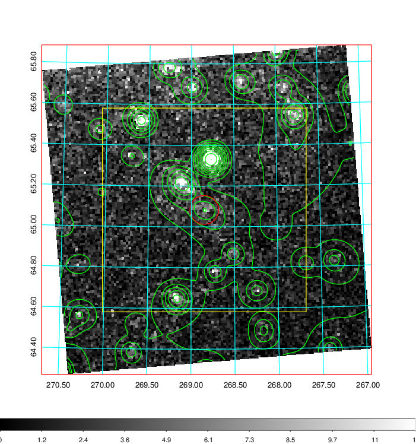  | 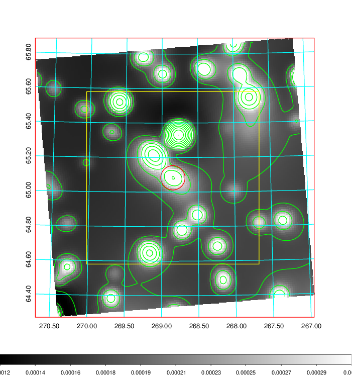   | 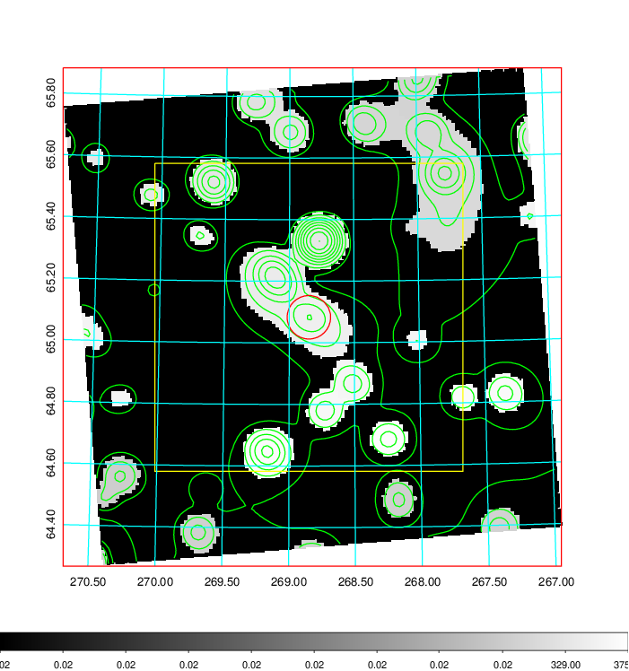  |

|[Exposure image](../image/753/753_mex.pdf)| [nH image](../image/753/753_nh.pdf)| [Planck image](../image/753/753_p.pdf)|
|-------------------|--------------------|-------------------|
|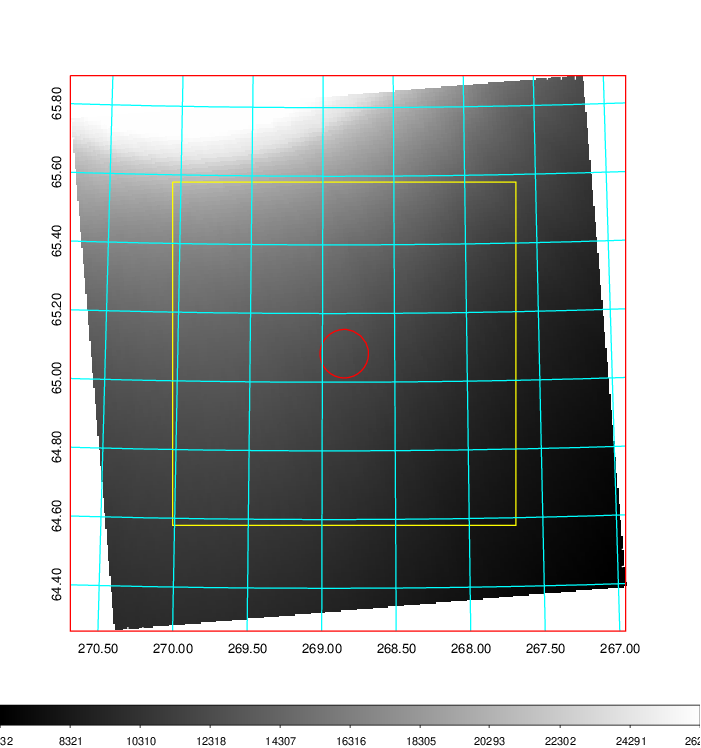   | 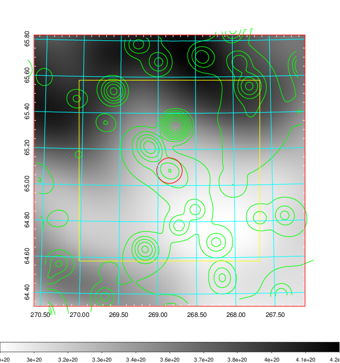    | 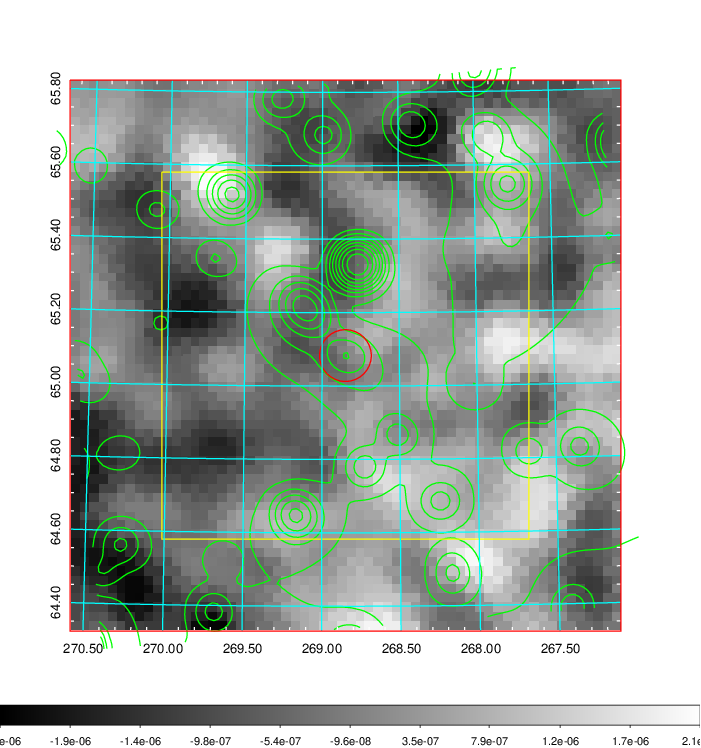 |

|[Redshift Histogram](../image/753/753_zg.pdf) | [DSS image(z1)](../image/753/753_dss_z1.pdf)      |  [DSS image(z2)](../image/753/753_dss_z2.pdf)    |
|-------------------|--------------------|-------------------|
|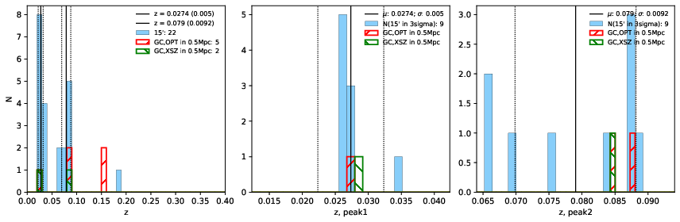 |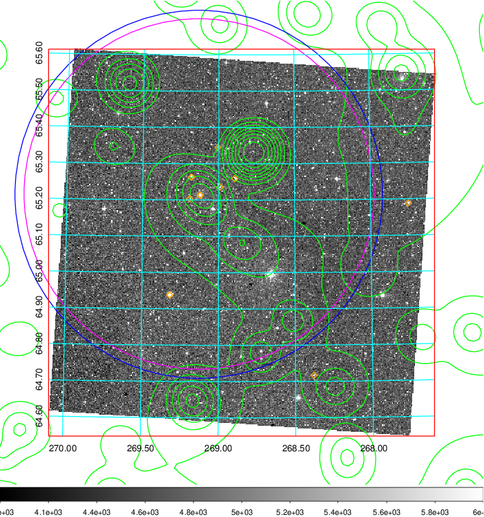  Blue circle for optical clusters;  Magenta circle for XSZ clusters;  all with r=1Mpc;  Only GC with Delta_z<0.01 are shown. | 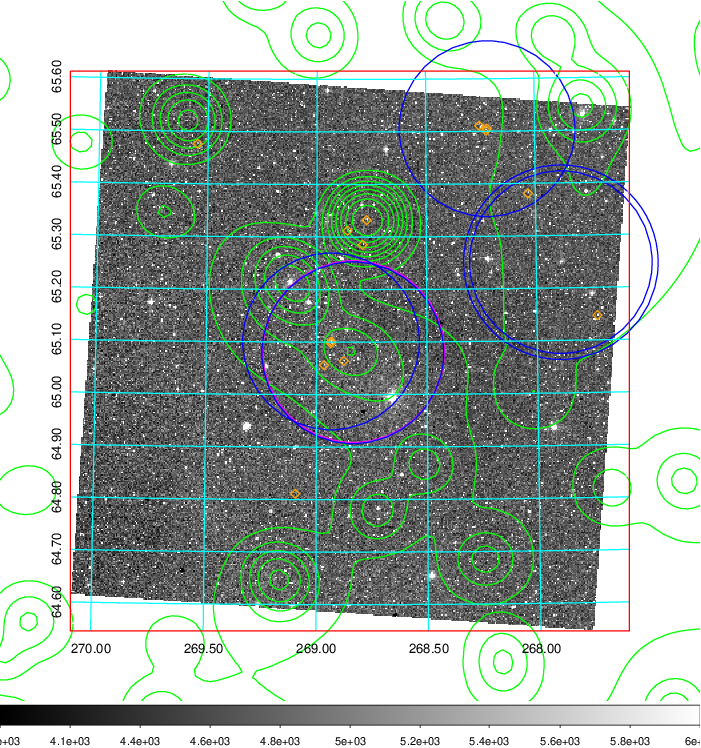 Blue circle for optical clusters;  Magenta circle for XSZ clusters;  all with r=1Mpc;  Only GC with Delta_z<0.01 are shown.  |

|[known Abell/XSZ clusters](../image/753/753_gc.pdf) | [2MASS image](../image/753/753_2mass.pdf)      |[SDSS image](../image/753/753_sdss.pdf)   |
|-------------------|-------------------|-------------------|
|  Magenta, blue and green circles  for optical, X-ray and SZ clusters  respectively, with redshift of clusters  labelled. The radius of circles  are 1Mpc.|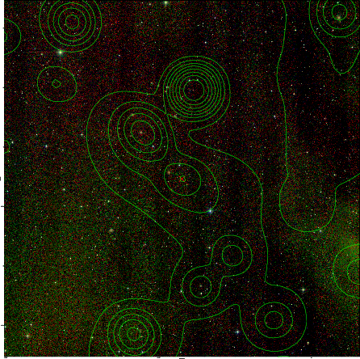  | 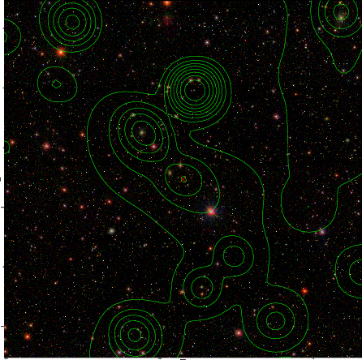  |

