

### 754

|Name|RAJ2000[deg]|DEJ2000[deg] |Ext[arcmin]| Ext,ml | z | z_src| C|GC(XSZ,Delta_z<0.01)| GC(OPT,Delta_z<0.01)|GC| R_sig[arcmin] | R500[arcmin] | R500[Mpc]| CRsig[c/s] | CR500[c/s] |L500[1E44 erg/s]|F500[1E-12 erg/s/cm^2]| M500[1E14 Msun]|Tx[keV]|Cnt_sig|Beta|Rc[arcmin]|Comment|Alias|
|---|---|---|---|---|---|------|---|--------|---------|----------|---|---|---|---|---|---|---|---|---|---|---|---|---|---|
|754| 268.923| 67.884| 3.51| 610.93| 0.0726(0.008)| z1,| G| -| -| MCXC, N, PSZ2, Tar, W| 24.206| 10.008| 0.830| 0.271(0.008)| 0.247(0.008)| 0.560(0.020)| 4.348(0.154)| 1.74(0.03)| 3.08(0.04)| 5252.4| 0.916(-0.086+0.059)| 16.029(-1.496+0.958)| -| k432|

|[RASS image](../image/754/754_img.pdf)|[filtered image](../image/754/754_fil.pdf)|[Segment image](../image/754/754_seg.pdf)|
|-------------------|--------------------|-------------------|
| 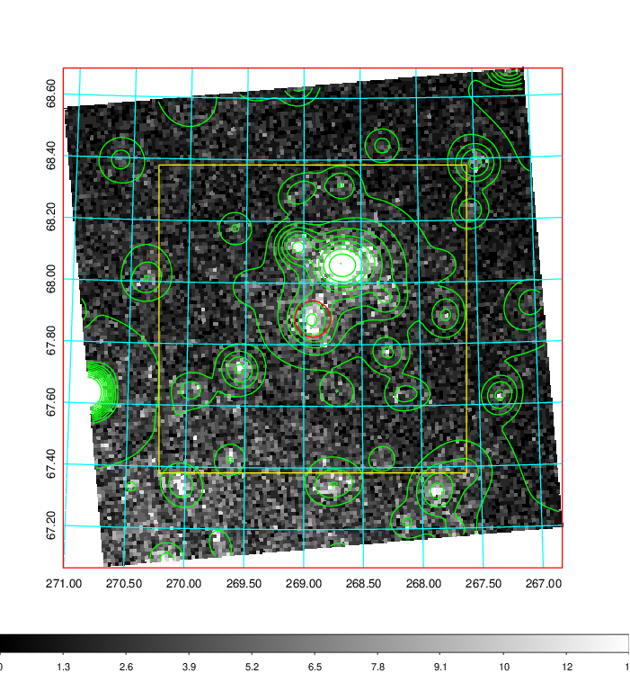  | 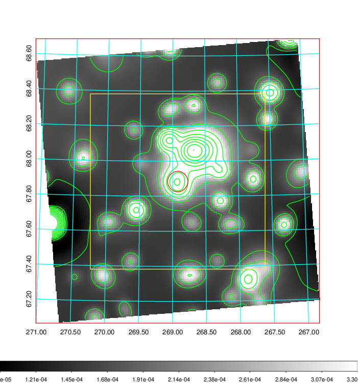   | 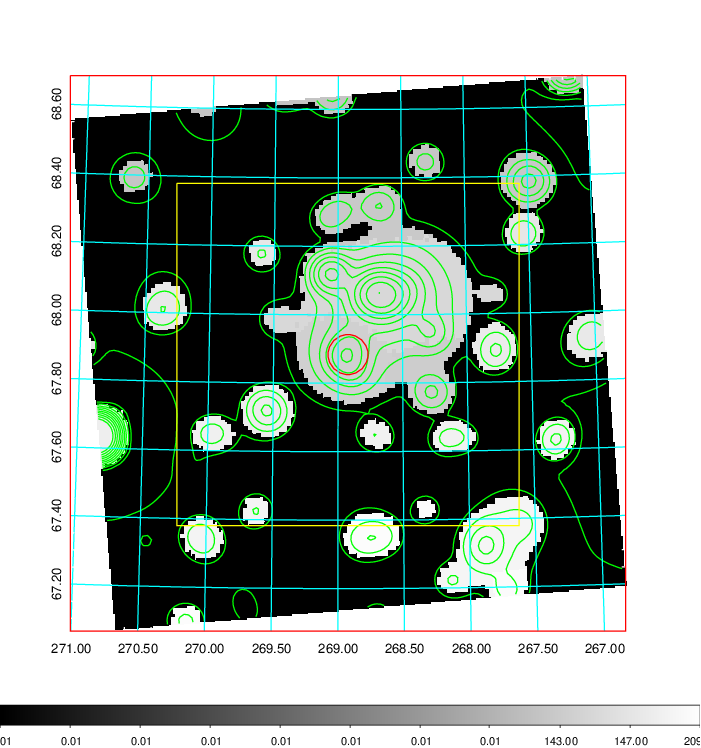  |

|[Exposure image](../image/754/754_mex.pdf)| [nH image](../image/754/754_nh.pdf)| [Planck image](../image/754/754_p.pdf)|
|-------------------|--------------------|-------------------|
|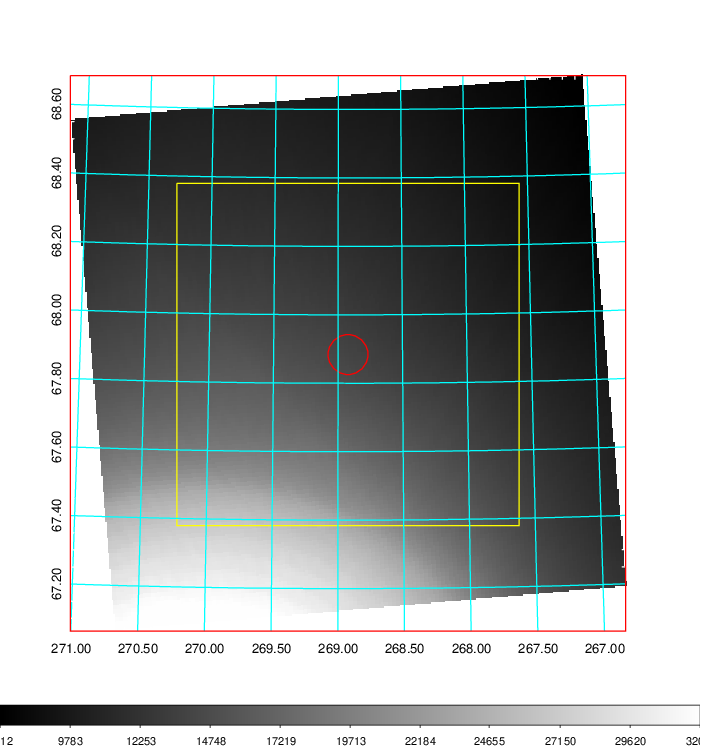   | 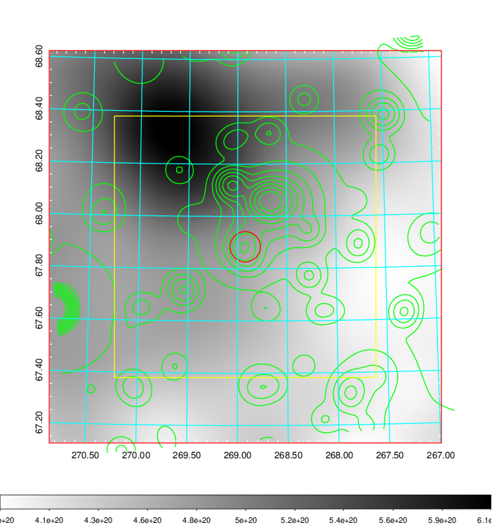    | 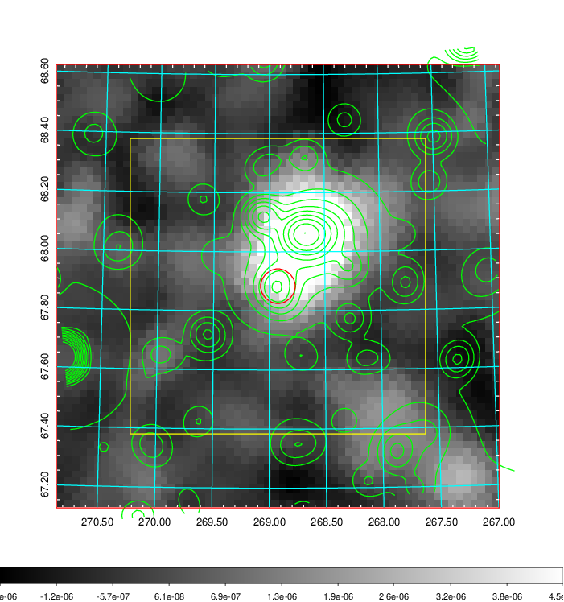 |

|[Redshift Histogram](../image/754/754_zg.pdf) | [DSS image(z1)](../image/754/754_dss_z1.pdf)      |  [DSS image(z2)](../image/754/754_dss_z2.pdf)    |
|-------------------|--------------------|-------------------|
|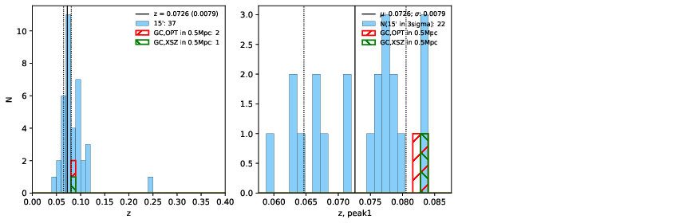 |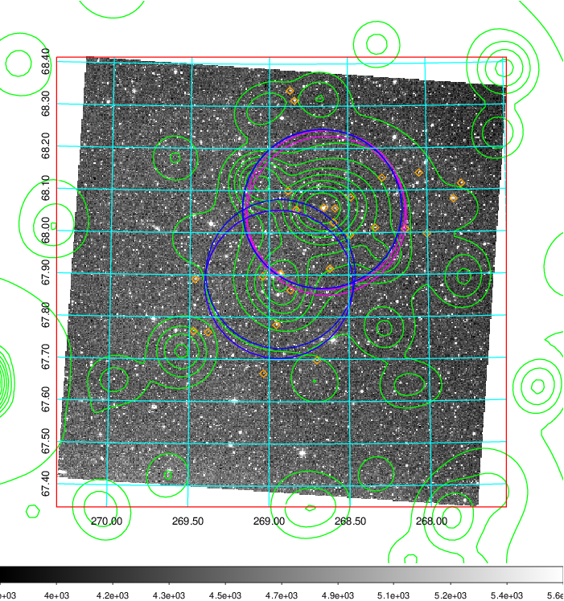  Blue circle for optical clusters;  Magenta circle for XSZ clusters;  all with r=1Mpc;  Only GC with Delta_z<0.01 are shown. | 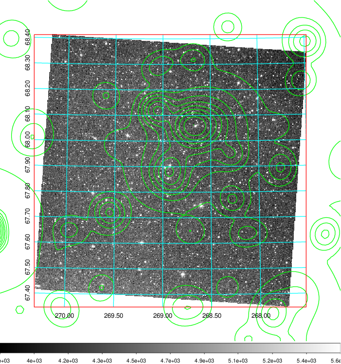 Blue circle for optical clusters;  Magenta circle for XSZ clusters;  all with r=1Mpc;  Only GC with Delta_z<0.01 are shown.  |

|[Previous-identified clusters](../image/754/754_gc.pdf) | [2MASS image](../image/754/754_2mass.pdf)      |
|-------------------|-------------------|
|  Green, magenta, and blue circles  for optical, X-ray and SZ clusters  respectively, with redshift of clusters  labelled. The radius of circles  are 1Mpc.|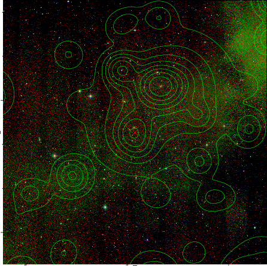  |

|[PS1 image](../image/754/754_ps1.pdf)            |
|-------------------|
| 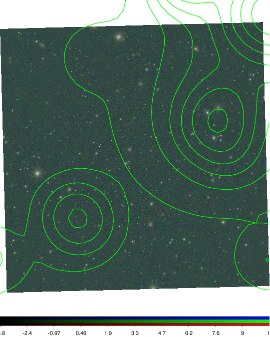  |
